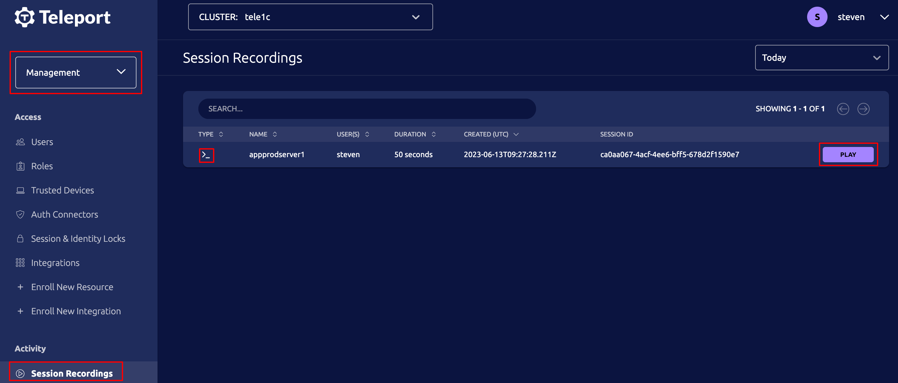

The Teleport Server Service supports recording and playback of server sessions.

(!docs/pages/includes/disable-recording-cluster.mdx!)

## Playback

Recorded sessions can be viewed in the *Session Recordings* page under
the Management section. Server recordings show a server icon in the first
column to distinguish them from other recordings.



Click the play button to open the player in a new tab. You can play, pause,
rewind and seek specific points.  While viewing you can copy and paste text.

Each session playback is recorded within the audit log for which user viewed
the session.

To play recordings for viewing from the CLI or exporting use the `tsh play` command:

```code
$ tsh play <SESSION_ID>
```

<Admonition type="tip" title="Listing recordings">
Use `tsh recordings ls` to list available recordings.
</Admonition>
