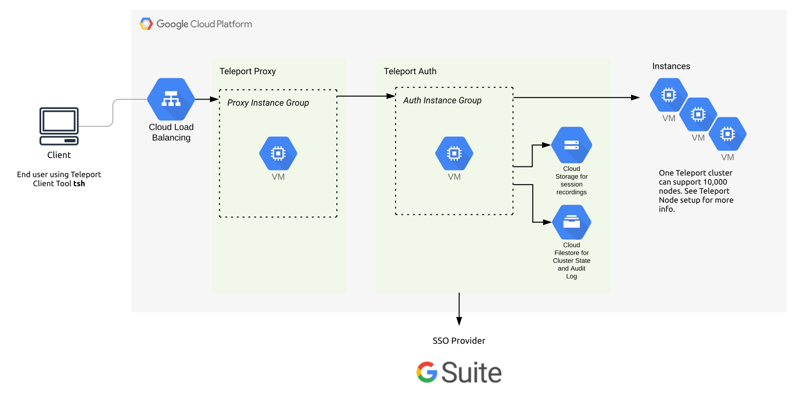
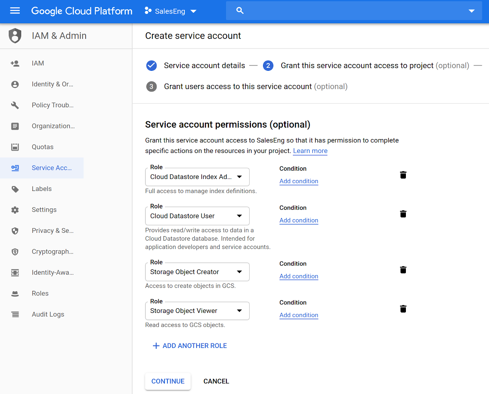
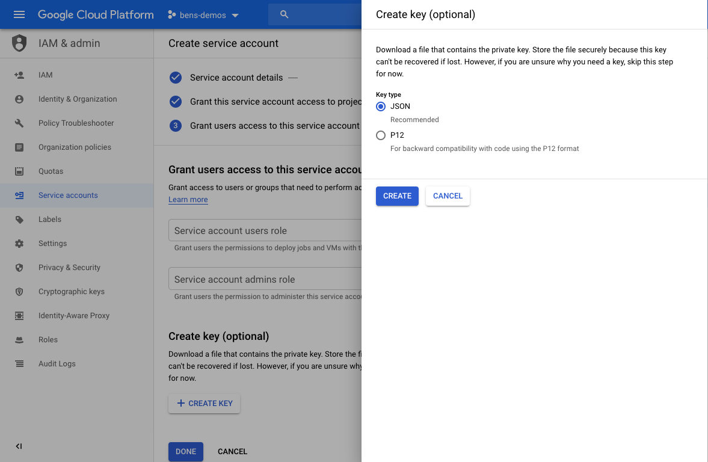

We've created this guide to give customers a high level overview of how to use Teleport
on [Google Cloud](https://cloud.google.com/gcp/) (GCP). This guide provides a high level
introduction leading to a deep dive into how to setup and run Teleport in production.

<Notice type="warning" scope={["cloud"]}>

This guide shows you how to deploy the Auth Service and Proxy Service, which
Teleport Cloud manages for you. You can read this guide if you are interested in
learning about self-hosting Teleport on Google Cloud.

</Notice>

We have split this guide into:

- [Teleport on GCP FAQ](#teleport-on-gcp-faq)
- [GCP Teleport Introduction](#gcp-teleport-introduction)
- [GCP Quickstart](#gcp-quickstart)

## Teleport on GCP FAQ

### Why would you want to use Teleport with GCP?

As leader in [BeyondCorp](https://cloud.google.com/beyondcorp/), GCP already provides
some great tools out of the box such as [Cloud Identity-Aware Proxy](https://cloud.google.com/iap/).
This is an excellent tool to quickly get setup securely with GCP but it can become
complicated to integrate into existing workflows and complicated if you want to share
tool across clouds.

### Which Services can I use Teleport with?

You can use Teleport for all the services that you would SSH into. This guide is
focused on Google Compute Engine. 

We plan on expanding our guide to eventually include using Teleport with Google Kubernetes Engine (GKE).

## GCP Teleport Introduction

This guide will cover how to setup, configure and run Teleport on GCP.

GCP Services required to run Teleport in High Availability:

- [Compute Engine: VM Instances with Instance Groups](#compute-engine-vm-instances-with-instance-groups)
- [Computer Engine: Health Checks](#computer-engine-health-checks)
- [Storage: Cloud Firestore](#storage-google-cloud-storage)
- [Storage: Google Cloud Storage](#storage-google-cloud-storage)
- [Network Services: Load Balancing](#network-services-load-balancing)
- [Network Services: Cloud DNS](#network-services-cloud-dns)

Other things needed:

- [SSL Certificate](https://cloud.google.com/load-balancing/docs/ssl-certificates)

Optional:

- Management Tools: Cloud Deployment Manager
- Stackdriver Logging

We recommend setting up Teleport in High Availability mode. In High Availability mode Firestore 
stores the state of the system and Google Cloud Storage stores the audit logs.



### Compute Engine: VM Instances with Instance Groups

To run Teleport in a High Availability configuration we recommend using `n1-standard-2` instances in
Production. It's best practice to separate the proxy and authentication server, using
Instance groups for the proxy and auth server.

### Computer Engine: Health Checks

GCP relies heavily on [Health Checks](https://cloud.google.com/load-balancing/docs/health-checks),
this is helpful when adding new instances to an instance group.

To enable health checks in Teleport start with `teleport start --diag-addr=0.0.0.0:3000`
see  [Admin Guide: Troubleshooting](../admin/troubleshooting.mdx) for more information.

### Storage: Cloud Firestore

[Cloud Firestore](https://cloud.google.com/firestore/) This storage backend uses real-time
updates to keep individual auth instances in sync and requires Firestore configured
in native mode.

Add this storage configuration in teleport section of the config file (by default it's `/etc/teleport.yaml`):

```yaml
teleport:
  storage:
    type: firestore
    collection_name: cluster-data
    project_id: EXAMPLE_gcp-proj-with-firestore-enabled
    credentials_path: /var/lib/teleport/firestore_creds.json
    audit_events_uri: ['firestore://events_table_name?projectID=example_Teleport-Project-Name&credentialsPath=/var/lib/teleport/gcs_creds.json']
```

### Storage: Google Cloud Storage

When creating the Bucket we would recommend setting it up as `Dual-region` and with
`Standard` storage class. Provide access using a `Uniform` access control with a Google-managed
key.

When setting up `audit_sessions_uri` use `gs://` session prefix.

```yaml
storage:
    ...
    audit_sessions_uri: 'gs://teleport-session-storage-2?projectID=EXAMPLE_gcp-proj-with-firestore-enabled&credentialsPath=/var/lib/teleport/gcs_creds.json'
    ...
```

### Network Services: Load Balancing

Load Balancing is required for Proxy and SSH traffic. Use `TCP Load Balancing` as
Teleport requires custom ports for SSH and Web Traffic.

### Network Services: Cloud DNS

Cloud DNS is used to setup the public URL of the Teleport Proxy. Once setup an `A`
record is sufficient.

### Access: Service accounts

The Authentication server will need to read and write to Firestore.  For this it'll need
the correct permission via Server Accounts. Learn how to [enable and create service accounts for instances](https://cloud.google.com/compute/docs/access/create-enable-service-accounts-for-instances).



**Download JSON Service Key**


## GCP Quickstart

## 1. Create Resources

We recommend starting by creating the resources. We highly recommend creating these
an infrastructure automation tool such as [Cloud Deployment Manager](https://cloud.google.com/deployment-manager/) or Terraform.

## 2. Install & Configure Teleport

Follow install instructions from our [installation page](../../installation.mdx#linux).

We recommend configuring Teleport as per the below steps:

**1. Configure Teleport Auth Server** using the below example `teleport.yaml`, and start it
using [systemd](https://raw.githubusercontent.com/gravitational/teleport/master/examples/systemd/teleport.service) or use DEB/.RPM packages available from our [Downloads Page](https://gravitational.com/teleport/download/).

```yaml
#
# Sample Teleport configuration teleport.yaml file for Auth Server
#
teleport:
  nodename: teleport-auth-server
  data_dir: /var/lib/teleport
  pid_file: /run/teleport.pid
  auth_token: EXAMPLE-CLUSTER-JOIN-TOKEN
  auth_servers:
  - 0.0.0.0:3025
  connection_limits:
    max_connections: 15000
    max_users: 250
  log:
    output: stderr
    severity: DEBUG
  storage:
    type: firestore
    collection_name: cluster-data
    # Credentials: Path to google service account file, used for Firestore and Google Storage.
    credentials_path: /var/lib/teleport/gcs_creds.json
    project_id: example_Teleport-Project-Name
    audit_events_uri: 'firestore://events?projectID=example_Teleport-Project-Name&credentialsPath=/var/lib/teleport/gcs_creds.json'
    audit_sessions_uri: 'gs://teleport-session-storage-2?projectID=example_Teleport-Project-Name&credentialsPath=/var/lib/teleport/gcs_creds.json'
auth_service:
  enabled: yes
  auth_service:
    tokens:
    - "proxy,node:EXAMPLE-CLUSTER-JOIN-TOKEN"
```

**2. Setup Proxy**

Save the following configuration file as `/etc/teleport.yaml` on the Proxy Server:

```yaml
teleport:
  auth_token: EXAMPLE-CLUSTER-JOIN-TOKEN
  # We recommend using a TCP load balancer pointed to the auth servers when
  # setting up in High Availability mode.
  auth_servers: [ "auth.example.com:3025" ]
  # enable ssh service and disable auth and proxy:
ssh_service:
  enabled: true
auth_service:
  enabled: false
proxy_service:
  enabled: false
```

**3. Setup Teleport Nodes**

Save the following configuration file as `/etc/teleport.yaml` on the node:

```yaml
teleport:
  auth_token: EXAMPLE-CLUSTER-JOIN-TOKEN
  # We recommend using a TCP load balancer pointed to the auth servers when
  # setting up in High Availability mode.
  auth_servers: [ "auth.example.com:3025" ]
  # enable ssh service and disable auth and proxy:
ssh_service:
  enabled: true
auth_service:
  enabled: false
proxy_service:
  enabled: false
```

**4. Add Users**

Follow [adding users](../../enterprise/getting-started.mdx#adding-users) or integrate with [Google Workspace](../../enterprise/sso/google-workspace.mdx) to provide SSO access.
