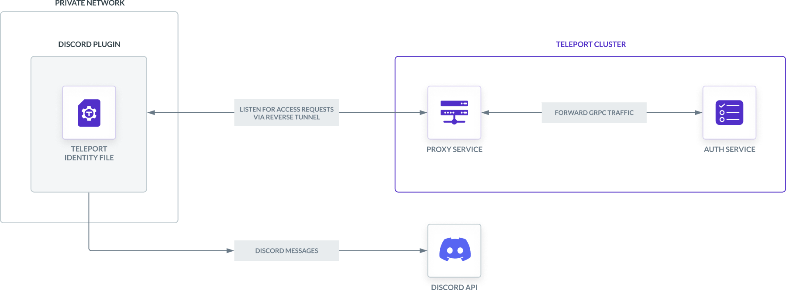
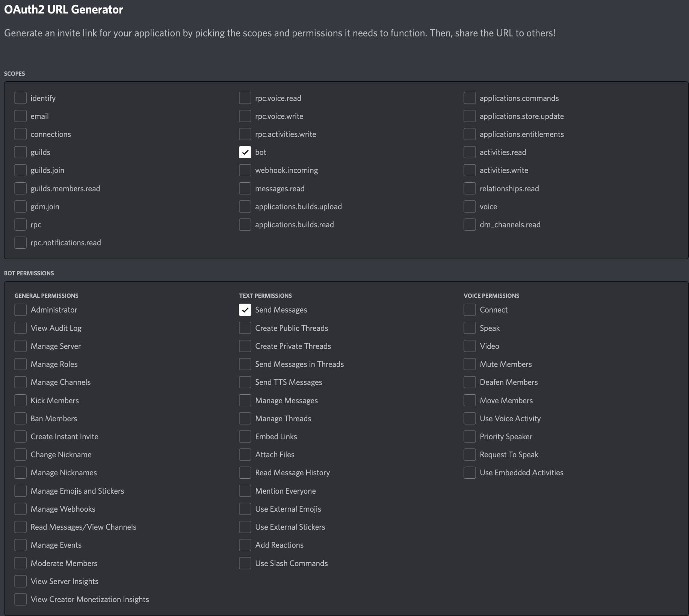

This guide will explain how to set up Discord to receive Access Request messages
from Teleport. Teleport's Discord integration notifies individuals and channels of
Access Requests. Users can then approve and deny Access Requests from within
Discord, making it easier to implement security best practices without
compromising productivity.



<Details title="This integration is hosted on Teleport Cloud" open={false}>

(!docs/pages/includes/plugins/enroll.mdx name="the Discord integration"!)

</Details>

## Prerequisites

(!docs/pages/includes/commercial-prereqs-tabs.mdx!)

(!docs/pages/includes/machine-id/plugin-prerequisites.mdx!)

- Admin account on your Discord server. Installing a bot requires at least the
  "manager server" permission.
- Either a Linux host or Kubernetes cluster where you will run the Discord plugin.
- (!docs/pages/includes/tctl.mdx!)

## Step 1/8. Define RBAC resources

Before you set up the Discord plugin, you will need to enable Role Access Requests
in your Teleport cluster.

(!/docs/pages/includes/plugins/editor-request-rbac.mdx!)

## Step 2/8. Install the Teleport Discord plugin

(!docs/pages/includes/plugins/install-access-request.mdx name="discord"!)

## Step 3/8. Create a user and role for the plugin

(!docs/pages/includes/plugins/rbac.mdx!)

(!/docs/pages/includes/plugins/rbac-impersonate.mdx!)

## Step 4/8. Export the access plugin identity

Give the plugin access to a Teleport identity file. We recommend using Machine
ID for this in order to produce short-lived identity files that are less
dangerous if exfiltrated, though in demo deployments, you can generate
longer-lived identity files with `tctl`:

<Tabs>
<TabItem label="Machine ID">
(!docs/pages/includes/plugins/tbot-identity.mdx secret="teleport-plugin-discord-identity"!)
</TabItem>
<TabItem label="Long-lived identity files">
(!docs/pages/includes/plugins/identity-export.mdx user="access-plugin" secret="teleport-plugin-discord-identity"!)
</TabItem>
</Tabs>

## Step 5/8. Register a Discord app

The Access Request plugin for Discord receives Access Request events from the
Teleport Auth Service, formats them into Discord messages, and sends them to the
Discord API to post them in your guild (Discord server). For this to work,
you must register a new app with the Discord API.

### Create your application

Visit [https://discord.com/developers/applications](https://discord.com/developers/applications)
to create a new Discord application. Click "New Application" and name the application "Teleport".

Set the application icon ([download application icon here](../../../img/sso/onelogin/teleport.png)).

### Create the application bot

Go to the "Bot" tab and choose "Add Bot". Set the bot icon ([download bot icon
here](../../../img/enterprise/plugins/teleport_bot@2x.png)). Un-check the
"Public Bot" toggle as this bot should only be used within your Discord
servers. Finally, press "Reset Token", copy and save the new token into a safe place.
This token will be used by the Teleport plugin to authenticate against the
Discord API.

### Install and authorize the application in your Discord server

Go to the "OAuth2" tab, open the "URL Generator" and check the "bot" and "Send Messages" permissions.



Copy and access the generated URL. Choose to install the application into the
desired Discord server. If the server is not available in the
dropdown list, it means you don't have sufficient rights. Ask a server
administrator to grant you a role with the "manage server" permission.

<Admonition type="note">
The same application can be installed into multiple Discord servers. To
do so, access the OAuth URL multiple times and choose different servers. You
have to be admin on a Discord server to install the app into it.
</Admonition>

## Step 6/8. Configure the Teleport Discord plugin

At this point, the Teleport Discord plugin has the credentials it needs to
communicate with your Teleport cluster and the Discord API. In this step, you will
configure the Discord plugin to use these credentials. You will also configure the
plugin to notify the right Discord channels when it receives an Access Request
update.

### Create a config file

<Tabs>
<TabItem label="Executable or Docker">
The Teleport Discord plugin uses a config file in TOML format. Generate a
boilerplate config by running the following command (the plugin will not run
unless the config file is in `/etc/teleport-discord.toml`):

```code
$ teleport-discord configure | sudo tee /etc/teleport-discord.toml > /dev/null
```

This should result in a config file like the one below:

```toml
(!examples/resources/plugins/teleport-discord.toml!)
```
</TabItem>
<TabItem label="Helm Chart">
The Discord Helm chart uses a YAML values file to configure the plugin.
On your local workstation, create a file called `teleport-discord-helm.yaml`
based on the following example:

```toml
(!examples/resources/plugins/teleport-discord-helm.yaml!)
```

</TabItem>
</Tabs>

### Edit the config file

Open the configuration file created for the Teleport Discord plugin and update the following fields:

**`[teleport]`**

The Discord plugin uses this section to connect to the Teleport Auth Service.

(!docs/pages/includes/plugins/config-toml-teleport.mdx!)

(!docs/pages/includes/plugins/refresh-plugin-identity.mdx!)

**`[discord]`**

`token`: Paste the bot token saved previously in this field.

**`[role_to_recipients]`**

The `role_to_recipients` map configures the channels that the Discord plugin will
notify when a user requests access to a specific role. When the Discord plugin
receives an Access Request from the Auth Service, it will look up the role being
requested and identify the Discord channels to notify.

Each channel is represented by a numeric ID. Channels can be public, private or
direct messages between a user and the bot.
To determine the numeric ID of a channel for the bot to notify, follow the instructions below:

<Tabs>
  <TabItem label="Public Channel">
  
    Open Discord in a web browser and navigate to the desired channel.
    
    The web browser URL should look like:
    ```
    https://discord.com/channels/<guild ID>/<channel ID>
    ```
    
    Copy the last part of the URL (everything after the last `/`), which is the channel ID.
  </TabItem>
  <TabItem label="Private Channel">
    Open Discord in a web browser and navigate to the desired channel.
    
    In the channel list choose "Create invite", type "teleport" in the search field
    and invite your Discord Teleport bot. The bot should now appear in the channel
    member list.
    
    The web browser URL should look like:
    ```
    https://discord.com/channels/<guild ID>/<channel ID>
    ```
    
    Copy the last part of the URL (everything after the last `/`), which is the channel ID.
  </TabItem>
  <TabItem label="Direct Message">
    To retrieve the channel ID of the private discussion between User A and the
    Teleport bot, have User A send a direct message to the Teleport bot. This will
    open a conversation between the user and the bot. Once the conversation is
    initiated, the user can open the discussion page.
    
    The web browser URL should look like:
    ```
    https://discord.com/channels/@me/<channel ID>
    ```
    
    Copy the last part of the URL (everything after the last `/`), which is the channel ID.
  </TabItem>
</Tabs>

In the `role_to_recipients` map, each key is the name of a Teleport role. Each
value configures the Discord channel (or channels) to notify. The value can be a
single string or an array of strings.

The `role_to_recipients` map must also include an entry for `"*"`, which the
plugin looks up if no other entry matches a given role name. In the example
above, requests for roles aside from `dev` will notify the
`security-team` channel.

Configure the Discord plugin to notify you when a user requests the `editor` role
by adding the following to your `role_to_recipients` config (replace
`YOUR-CHANNEL-ID` with a valid channel ID):

<Tabs>
<TabItem label="Executable or Docker">
```toml
[role_to_recipients]
"*" = "YOUR-CHANNEL-ID"
"editor" = "YOUR-CHANNEL-ID"
```
</TabItem>
<TabItem label="Helm Chart">
```yaml
roleToRecipients:
  "*": "YOUR-CHANNEL-ID"
  "editor": "YOUR-CHANNEL-ID"
```
</TabItem>
</Tabs>

The final configuration file should resemble the following:

<Tabs>
<TabItem label="Executable or Docker">
```toml
(!examples/resources/plugins/teleport-discord.toml!)
```
</TabItem>
<TabItem label="Helm Chart">
```yaml
(!examples/resources/plugins/teleport-discord-helm.yaml!)
```
</TabItem>
</Tabs>

## Step 7/8. Test your Discord app

Once Teleport is running, you've created the Discord app, and the plugin is
configured, you can now run the plugin and test the workflow.

<Tabs>
<TabItem label="Executable">
Start the plugin:

```code
$ teleport-discord start
```

If everything works fine, the log output should look like this:

```code
$ teleport-discord start
INFO   Starting Teleport Access Discord Plugin (=teleport.version=): discord/app.go:80
INFO   Plugin is ready discord/app.go:101
```
</TabItem>
<TabItem label="Docker">
Start the plugin:

```code
$ docker run -v <path-to-config>:/etc/teleport-discord.toml public.ecr.aws/gravitational/teleport-plugin-discord:(=teleport.version=) start
```
</TabItem>
<TabItem label="Helm Chart">
Install the plugin:

```code
$ helm upgrade --install teleport-plugin-discord teleport/teleport-plugin-discord --values teleport-discord-helm.yaml
```

To inspect the plugin's logs, use the following command:

```code
$ kubectl logs deploy/teleport-plugin-discord
```

Debug logs can be enabled by setting `log.severity` to `DEBUG` in
`teleport-discord-helm.yaml` and executing the `helm upgrade ...` command
above again. Then you can restart the plugin with the following command:

```code
$ kubectl rollout restart deployment teleport-plugin-discord
```
</TabItem>
</Tabs>

Create an Access Request and check if the plugin works as expected with the
following steps.

### Create an Access Request

(!docs/pages/includes/plugins/create-request.mdx!)

The channel you configured earlier to review the request should receive a
message from "Teleport" in Discord allowing them to visit a link in the Teleport
Web UI and either approve or deny the request.

### Resolve the request

(!docs/pages/includes/plugins/resolve-request.mdx!)

Once the request is resolved, the Discord bot will update the access request
message with ✅ or ❌, depending on whether the request was approved or denied.

<Admonition title="Auditing Access Requests">

When the Discord plugin posts an Access Request notification to a channel, anyone
with access to the channel can view the notification and follow the link. While
users must be authorized via their Teleport roles to review Access Requests, you
should still check the Teleport audit log to ensure that the right users are
reviewing the right requests.

When auditing Access Request reviews, check for events with the type `Access
Request Reviewed` in the Teleport Web UI.

</Admonition>

## Step 8/8. Set up systemd

This section is only relevant if you are running the Teleport Discord plugin on a
Linux host.

In production, we recommend starting the Teleport plugin daemon via an init
system like systemd.  Here's the recommended Teleport plugin service unit file
for systemd:

```ini
(!examples/systemd/plugins/teleport-discord.service!)
```

Save this as `teleport-discord.service` in either `/usr/lib/systemd/system/` or
another [unit file load
path](https://www.freedesktop.org/software/systemd/man/systemd.unit.html#Unit%20File%20Load%20Path)
supported by systemd.

Enable and start the plugin:

```code
$ sudo systemctl enable teleport-discord
$ sudo systemctl start teleport-discord
```

## Next steps

- Read our guides to configuring [Resource Access
    Requests](../access-requests/resource-requests.mdx) and [Role Access
    Requests](../access-requests/role-requests.mdx) so you can get the most out
    of your Access Request plugins.
