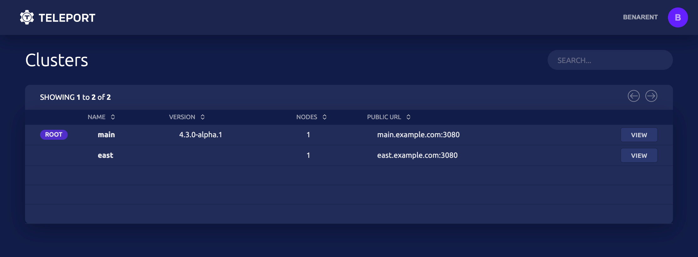
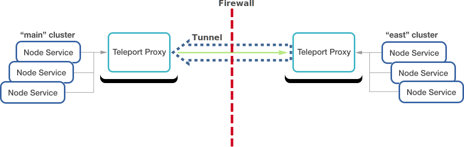
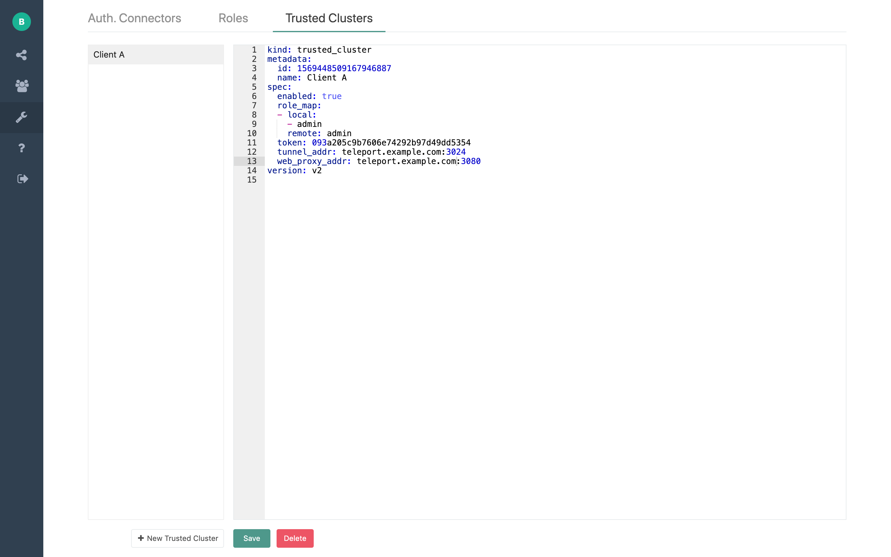

The design of trusted clusters allows Teleport users to connect to compute infrastructure
located behind firewalls without any open TCP ports. The real world usage examples of this
capability include:

- Managed service providers (MSP) remotely managing infrastructure of their clients.
- Device manufacturers remotely maintaining computing appliances deployed on premises.
- Large cloud software vendors manage multiple data centers using a common proxy.

**Example of a MSP provider using trusted cluster to obtain access to clients clusters.**


If you haven't already looked at the introduction to [Trusted Clusters](admin-guide.mdx#trusted-clusters)
in the Admin Guide we recommend you review that for an overview before continuing with this guide.

The Trusted Clusters chapter in the Admin Guide
offers an example of a simple configuration which:

- Uses a static cluster join token defined in a configuration file.
- Does not cover inter-cluster role based access control (RBAC).

This guide's focus is on more in-depth coverage of trusted clusters features and will cover the following topics:

- How to add and remove trusted clusters using CLI commands.
- Enable/disable trust between clusters.
- Establish permissions mapping between clusters using Teleport roles.

<Admonition
  type="tip"
  title="Teleport Node Tunneling"
>
  If you have a large amount of devices on different networks, such as
  managed IoT devices or a couple of nodes on a different network you can utilize
  the [Teleport Node Tunneling](admin-guide.mdx#adding-a-node-located-behind-nat).
</Admonition>

## Introduction

As explained in the [architecture document](architecture/overview.mdx#design-principles),
Teleport can partition compute infrastructure into multiple clusters.
A cluster is a group of SSH nodes connected to the cluster's *auth server*
acting as a certificate authority (CA) for all users and nodes.

To retrieve an SSH certificate, users must authenticate with a cluster through a
*proxy server*. So, if users want to connect to nodes belonging to different
clusters, they would normally have to use different `--proxy` flags for each
cluster. This is not always convenient.

The concept of *leaf clusters* allows Teleport administrators to connect
multiple clusters together and establish trust between them. Trusted clusters
allow users of one cluster, the root cluster to seamlessly SSH into the nodes of
another cluster without having to "hop" between proxy servers. Moreover, users don't
even need to have a direct connection to other clusters' proxy servers. The user
experience looks like this:

```bsh
# login using the root "root" cluster credentials:
$ tsh login --proxy=root.example.com

# SSH into some host inside the "root" cluster:
$ tsh ssh host

# SSH into the host located in another cluster called "leaf"
# The connection is established through root.example.com:
$ tsh ssh --cluster=leaf host

# See what other clusters are available
$ tsh clusters
```

Leaf clusters also have their own restrictions on user access, i.e.
*permissions mapping* takes place.

**Once connection has been established it's easy to switch from the "root" root cluster**


Let's take a look at how a connection is established between the "root" cluster
and the "leaf" cluster:



This setup works as follows:

1. The "leaf" creates an outbound reverse SSH tunnel to "root" and keeps the
   tunnel open.
2. **Accessibility only works in one direction.** The "leaf" cluster allows
   users from "root" to access its nodes but users in the "leaf" cluster can not
   access the "root" cluster.
3. When a user tries to connect to a node inside "leaf" using root's proxy, the
   reverse tunnel from step 1 is used to establish this connection shown as the
   green line above.

<Admonition
  type="tip"
  title="Load Balancers"
>
  The scheme above also works even if the "root" cluster uses multiple
  proxies behind a load balancer (LB) or a DNS entry with multiple values.
  This works by "leaf" establishing a tunnel to *every* proxy in "root". This
  requires that an LB uses round-robin or a similar balancing algorithm. Do
  not use sticky load balancing algorithms (a.k.a. "session affinity" or "sticky sessions") with
  Teleport proxies.
</Admonition>

## Join Tokens

Lets start with the diagram of how connection between two clusters is established:


The first step in establishing a secure tunnel between two clusters is for the
*leaf* cluster "leaf" to connect to the *root* cluster "root". When this
happens for *the first time*, clusters know nothing about each other, thus a
shared secret needs to exist in order for "root" to accept the connection from
"leaf".

This shared secret is called a "join token". There are two ways to create join
tokens: to statically define them in a configuration file, or to create them on
the fly using `tctl` tool.

<Admonition
  type="tip"
  title="Important"
>
  It's important to note that join tokens are only used to establish the connection for the first time. The clusters will exchange certificates and won't use tokens to re-establish their connection afterwards.
</Admonition>

### Static Join Tokens

To create a static join token, update the configuration file on "root" cluster
to look like this:

```yaml
# fragment of /etc/teleport.yaml:
auth_service:
  enabled: true
  tokens:
  # If using static tokens we recommend using tools like `pwgen -s 32`
  # to generate sufficiently random tokens of 32+ byte length
  - trusted_cluster:mk9JgEVqsgz6pSsHf4kJPAHdVDVtpuE0
```

This token can be used an unlimited number of times.

### Security Implications

Consider the security implications when deciding which token method to use.
Short lived tokens decrease the window for attack, but will require any automation
which uses these tokens to refresh them on a regular basis.

### Dynamic Join Tokens

Creating a token dynamically with a CLI tool offers the advantage of applying a
time to live (TTL) interval on it, i.e. it will be impossible to re-use such
token after a specified period of time.

To create a token using the CLI tool, execute this command on the *auth server*
of cluster "root":

```bsh
# generates a trusted cluster token to allow an inbound connection from a leaf cluster:
$ tctl tokens add --type=trusted_cluster --ttl=5m
# Example output
# The cluster invite token: ba4825847f0378bcdfe18113c4998498
# This token will expire in 5 minutes

# generates a trusted cluster token with labels:
# every cluster joined using this token will inherit env:prod labels.
$ tctl tokens add --type=trusted_cluster --labels=env=prod

# you can also list the outstanding non-expired tokens:
$ tctl tokens ls

# ... or delete/revoke an invitation:
$ tctl tokens rm ba4825847f0378bcdfe18113c4998498
```

Users of Teleport will recognize that this is the same way you would add any
node to a cluster.  The token created above can be used multiple times and has
an expiration time of 5 minutes.

Now, the administrator of "leaf" must create the following resource file:

```yaml
# cluster.yaml
kind: trusted_cluster
version: v2
metadata:
  # the trusted cluster name MUST match the 'cluster_name' setting of the
  # root cluster
  name: root
spec:
  # this field allows to create tunnels that are disabled, but can be enabled later.
  enabled: true
  # the token expected by the "root" cluster:
  token: ba4825847f0378bcdfe18113c4998498
  # the address in 'host:port' form of the reverse tunnel listening port on the
  # "root" proxy server:
  tunnel_addr: root.example.com:3024
  # the address in 'host:port' form of the web listening port on the
  # "root" proxy server:
  web_proxy_addr: root.example.com:3080
  # the role mapping allows to map user roles from one cluster to another
  # (enterprise editions of Teleport only)
  role_map:
    - remote: "admin"    # users who have "admin" role on "root"
      local: ["auditor"] # will be assigned "auditor" role when logging into "leaf"
```

Then, use `tctl create` to add the file:

```bash
$ tctl create cluster.yaml
```

At this point the users of the "root" cluster should be able to see "leaf" in the list of available clusters.

<Admonition
  type="warning"
  title="HTTPS configuration"
>
  If the `web_proxy_addr` endpoint of the root
  cluster uses a self-signed or invalid HTTPS certificate, you will get an
  error: *"the trusted cluster uses misconfigured HTTP/TLS certificate"*. For
  ease of testing, the Teleport daemon on "leaf" can be started with the
  `--insecure` CLI flag to accept self-signed certificates. Make sure to configure
  HTTPS properly and remove the insecure flag for production use.
</Admonition>

## RBAC

<Admonition
  type="warning"
  title="Version Warning"
>
  The RBAC section is applicable only to Teleport Enterprise. The open source
  version does not support SSH roles.
</Admonition>

When a *leaf* cluster "leaf" from the diagram above establishes trust with
the *root* cluster "root", it needs a way to configure which users from
"root" should be allowed in and what permissions should they have. Teleport offers
two methods of limiting access, by using role mapping or cluster labels.

Consider the following:

- Both clusters "root" and "leaf" have their own locally defined roles.
- Every user in Teleport Enterprise is assigned a role.
- When creating a *trusted cluster* resource, the administrator of "leaf" must
  define how roles from "root" map to roles on "leaf".
- To update role map for an existing *trusted cluster* delete and re-create the *trusted cluster* with the updated role map

### Example

Lets make a few assumptions for this example:

- The cluster "root" has two roles: *user* for regular users and *admin* for
  local administrators.
- We want administrators from "root" (but not regular users!) to have
  restricted access to "leaf". We want to deny them access to machines
  with "environment=production" and any Government cluster labeled "customer=gov"

First, we need to create a special role for root users on "leaf":

```yaml
# save this into root-user-role.yaml on the leaf cluster and execute:
# tctl create root-user-role.yaml
kind: role
version: v3
metadata:
  name: local-admin
spec:
  allow:
    node_labels:
      '*': '*'
    # Cluster labels control what clusters user can connect to. The wildcard ('*') means
    # any cluster. If no role in the role set is using labels and the cluster is not labeled,
    # the cluster labels check is not applied. Otherwise, cluster labels are always enforced.
    # This makes the feature backwards-compatible.
    cluster_labels:
      'env': 'staging'
  deny:
    # cluster labels control what clusters user can connect to. The wildcard ('*') means
    # any cluster. By default none is set in deny rules to preserve backwards compatibility
    cluster_labels:
      'customer': 'gov'
    node_labels:
      'environment': 'production'
```

Now, we need to establish trust between roles "root:admin" and "leaf:admin". This is
done by creating a trusted cluster [resource](admin-guide.mdx#resources) on "leaf"
which looks like this:

```yaml
# save this as root-cluster.yaml on the auth server of "leaf" and then execute:
# tctl create root-cluster.yaml
kind: trusted_cluster
version: v1
metadata:
  name: "name-of-root-cluster"
spec:
  enabled: true
  role_map:
    - remote: admin
      # admin <-> admin works for the Open Source Edition. Enterprise users
      # have great control over RBAC.
      local: [admin]
  token: "join-token-from-root"
  tunnel_addr: root.example.com:3024
  web_proxy_addr: root.example.com:3080
```

What if we wanted to let *any* user from "root" to be allowed to connect to
nodes on "leaf"? In this case we can use a wildcard `*` in the `role_map` like this:

```yaml
role_map:
  - remote: "*"
    local: [admin]
```

```yaml
role_map:
   - remote: 'cluster-*'
     local: [clusteradmin]
```

You can even use [regular expressions](https://github.com/google/re2/wiki/Syntax) to
map user roles from one cluster to another, you can even capture parts of the remote
role name and use reference it to name the local role:

```yaml
  # in this example, remote users with remote role called 'remote-one' will be
  # mapped to a local role called 'local-one', and `remote-two` becomes `local-two`, etc:
  - remote: "^remote-(.*)$"
    local: [local-$1]
```

**NOTE:** The regexp matching is activated only when the expression starts
with `^` and ends with `$`

### Trusted Cluster UI

For customers using Teleport Enterprise, they can easily configure *leaf* nodes using the
Teleport Proxy UI.

**Creating Trust from the Leaf node to the root node.**


## Updating Trusted Cluster Role Map

In order to update the role map for a trusted cluster, first we will need to remove the cluster by executing:

```bsh
$ tctl rm tc/root-cluster
```

Then following updating the role map, we can re-create the cluster by executing:

```bsh
$ tctl create root-user-updated-role.yaml
```

### Updating Cluster Labels

Teleport gives administrators of root clusters the ability to control cluster labels.
Allowing leaf clusters to propagate their own labels could create a problem with
rogue clusters updating their labels to bad values.

An administrator of a root cluster can control a remote/leaf cluster's
labels using the remote cluster API without any fear of override:

```bash
$ tctl get rc

kind: remote_cluster
metadata:
  name: two
status:
  connection: online
  last_heartbeat: "2020-09-14T03:13:59.35518164Z"
version: v3
```

Using `tctl` to update the labels on the remote/leaf cluster:

```
$ tctl update rc/two --set-labels=env=prod

cluster two has been updated
```

Using `tctl` to confirm that the updated labels have been set:

```bash
$ tctl get rc
kind: remote_cluster
metadata:
   labels:
    env: prod
  name: two
 status:
  connection: online
  last_heartbeat: "2020-09-14T03:13:59.35518164Z"
```

## Using Trusted Clusters

Now an admin from the "root" cluster can see and access the "leaf" cluster:

```bsh
# log into the root cluster:
$ tsh --proxy=root.example.com login admin
```

```bsh
# see the list of available clusters
$ tsh clusters

Cluster Name   Status
------------   ------
root           online
leaf           online
```

```bsh
# see the list of machines (nodes) behind the leaf cluster:
$ tsh ls --cluster=leaf

Node Name Node ID            Address        Labels
--------- ------------------ -------------- -----------
db1.leaf  cf7cc5cd-935e-46f1 10.0.5.2:3022  role=db-leader
db2.leaf  3879d133-fe81-3212 10.0.5.3:3022  role=db-follower
```

```bsh
# SSH into any node in "leaf":
$ tsh ssh --cluster=leaf user@db1.leaf
```

<Admonition
  type="tip"
  title="Note"
>
  Trusted clusters work only one way. So, in the example above users from "leaf"
  cannot see or connect to the nodes in "root".
</Admonition>

### Disabling Trust

To temporarily disable trust between clusters, i.e. to disconnect the "leaf"
cluster from "root", edit the YAML definition of the trusted cluster resource
and set `enabled` to "false", then update it:

```bsh
$ tctl create --force cluster.yaml
```

### Remove Leaf Cluster relationship from both sides

Once established, to fully remove a trust relationship between two clusters, do
the following:

- Remove the relationship from the leaf cluster: `tctl rm tc/root.example.com` (`tc` = trusted cluster)
- Remove the relationship from the root cluster: `tctl rm lc/leaf.example.com`.

### Remove Leaf Cluster relationship from the root

Remove the relationship from the root cluster: `tctl rm rc/leaf.example.com`.

<Admonition type="note">
  The `leaf.example.com` cluster will continue to try and ping the root cluster,
  but will not be able to connect. To re-establish the trusted cluster relationship,
  the trusted cluster has to be created again from the leaf cluster.
</Admonition>

### Remove Leaf Cluster relationship from the leaf

Remove the relationship from the leaf cluster: `tctl rm tc/root.example.com`.

## Sharing user traits between Trusted Clusters

You can share user SSH logins, Kubernetes users/groups and database users/names
between Trusted Clusters.

Suppose you have a root cluster with a role named `root` and the following
allow rules:

```yaml
logins: ["root"]
kubernetes_groups: ["system:masters"]
kubernetes_users: ["alice"]
db_users: ["postgres"]
db_names: ["dev", "metrics"]
```

When setting up the Trusted Cluster relationship, the leaf cluster can choose
to map this `root` cluster role to its own `admin` role:

```yaml
role_map:
- remote: "root"
  local: ["admin"]
```

The role `admin` of the leaf cluster can now be set up to use the root cluster's
role logins, Kubernetes groups and other traits using the following variables:

```yaml
logins: ["{{internal.logins}}"]
kubernetes_groups: ["{{internal.kubernetes_groups}}"]
kubernetes_users: ["{{internal.kubernetes_users}}"]
db_users: ["{{internal.db_users}}"]
db_names: ["{{internal.db_names}}"]
```

User traits that come from the identity provider (such as OIDC claims or SAML
attributes) are also passed to the leaf clusters and can be access in the role
templates using `external` variable prefix:

```yaml
logins: ["{{internal.logins}}", "{{external.logins_from_okta}}"]
node_labels:
  env: "{{external.env_from_okta}}"
```

## How does it work?

At a first glance, Trusted Clusters in combination with RBAC may seem
complicated. However, it is based on certificate-based SSH authentication
which is fairly easy to reason about:

One can think of an SSH certificate as a "permit" issued and time-stamped by a
certificate authority. A certificate contains four important pieces of data:

- List of allowed UNIX logins a user can use. They are called "principals" in
  the certificate.
- Signature of the certificate authority who issued it (the *auth* server)
- Metadata (certificate extensions): additional data protected by the signature
  above. Teleport uses the metadata to store the list of user roles and SSH
  options like "permit-agent-forwarding".
- The expiration date.

Try executing `tsh status` right after `tsh login` to see all these fields in the
client certificate.

When a user from "root" tries to connect to a node inside "leaf", her
certificate is presented to the auth server of "leaf" and it performs the
following checks:

- Checks that the certificate signature matches one of the trusted clusters.
- Tries to find a local role which maps to the list of principals found in the certificate.
- Checks if the local role allows the requested identity (UNIX login) to have access.
- Checks that the certificate has not expired.

## Troubleshooting

There are three common types of problems Teleport administrators can run into when configuring
trust between two clusters:

- **HTTPS configuration**: when the root cluster uses a self-signed or invalid HTTPS certificate.
- **Connectivity problems**: when a leaf cluster "leaf" does not show up in
  `tsh clusters` output on "root".
- **Access problems**: when users from "root" get "access denied" error messages
  trying to connect to nodes on "leaf".

### HTTPS configuration

If the `web_proxy_addr` endpoint of the root cluster uses a self-signed or invalid HTTPS certificate,
you will get an error: "the trusted cluster uses misconfigured HTTP/TLS certificate". For ease of
testing, the teleport daemon on "leaf" can be started with the `--insecure` CLI flag to accept
self-signed certificates. Make sure to configure HTTPS properly and remove the insecure flag for production use.

### Connectivity Problems

To troubleshoot connectivity problems, enable verbose output for the auth
servers on both clusters. Usually this can be done by adding `--debug` flag to
`teleport start --debug`. You can also do this by updating the configuration
file for both auth servers:

```yaml
# snippet from /etc/teleport.yaml
teleport:
  log:
    output: stderr
    severity: DEBUG
```

On systemd-based distributions you can watch the log output via:

```bsh
$ sudo journalctl -fu teleport
```

Most of the time you will find out that either a join token is
mismatched/expired, or the network addresses for `tunnel_addr` or
`web_proxy_addr` cannot be reached due to pre-existing firewall rules or
how your network security groups are configured on AWS.

### Access Problems

Troubleshooting access denied messages can be challenging. A Teleport administrator
should check to see the following:

- Which roles a user is assigned on "root" when they retrieve their SSH
  certificate via `tsh login`. You can inspect the retrieved certificate with
  `tsh status` command on the client side.
- Which roles a user is assigned on "leaf" when the role mapping takes place.
  The role mapping result is reflected in the Teleport audit log. By default,
  it is stored in `/var/lib/teleport/log` on a *auth* server of a cluster.
  Check the audit log messages on both clusters to get answers for the
  questions above.
