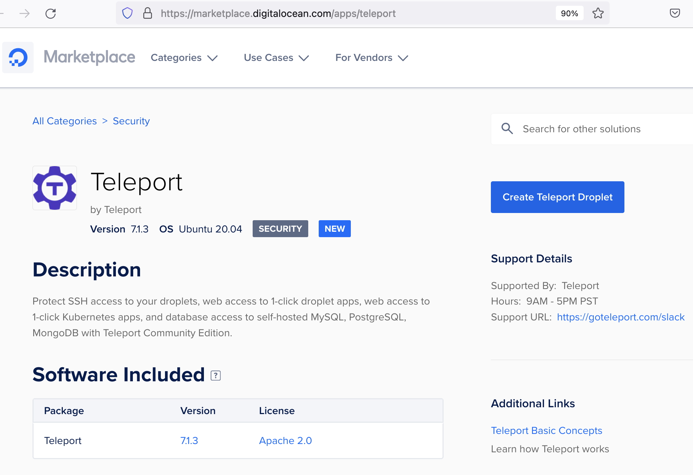
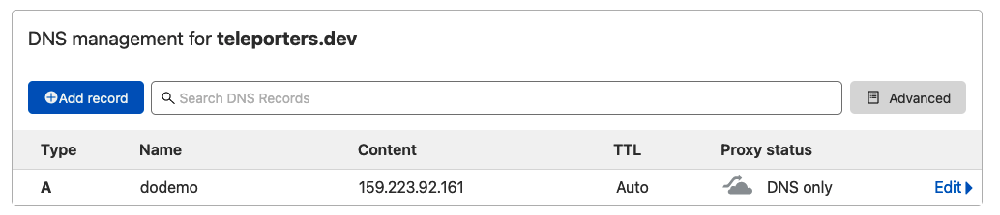
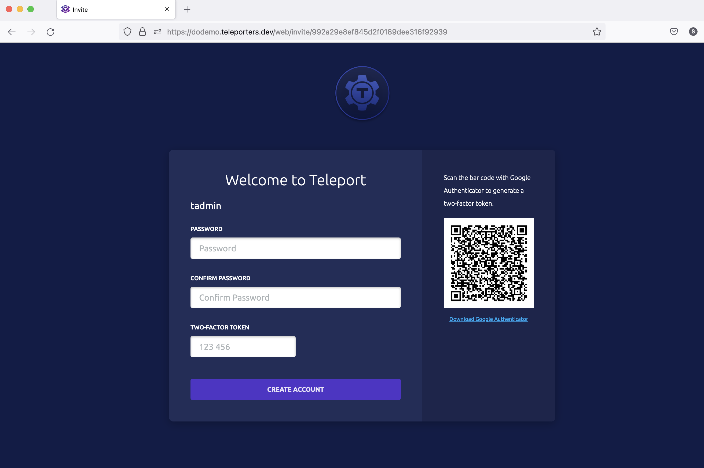
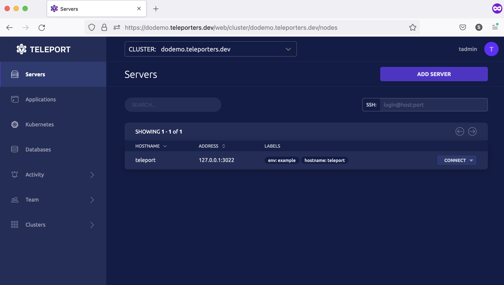

This tutorial will guide you through quickly getting started with Teleport on
DigitalOcean with the Teleport 1-Click Droplet app.

<Notice type="tip">

If you are looking for a manual installation, refer to our [Linux installation
guide](./linux-server.mdx). 

</Notice>

(!docs/pages/includes/cloud/call-to-action.mdx!)

## Prerequisites
- A Fully Qualified Domain Name (FQDN).
- A two-factor authenticator app (e.g., [Google Authenticator](https://www.google.com/landing/2step/)).
- An SSH client like OpenSSH.

## Step 1/3. Install Teleport with 1-Click

Head over to the Teleport page on [DigitalOcean Marketplace](https://marketplace.digitalocean.com/apps/teleport) and click the “Create a Droplet” button:

<Figure align="left" bordered caption="Teleport 1-Click droplet page">
  
</Figure>


Once you click the button, DigitalOcean redirects you to the control panel to configure resources for the Teleport droplet. This step is similar to how you create a regular [droplet in DigitalOcean](https://docs.digitalocean.com/products/droplets/how-to/create/). Teleport is very lightweight, and if you are just trying out Teleport, you can select the $5 droplet. Make sure you select "SSH keys" as the SSH authentication method as it is more secure than a password.
<Figure align="left" bordered caption="Create a droplet">
  
</Figure>

It will take a few minutes before our newly created Teleport droplet is ready. Once the droplet is ready, configure your FQDN with the public IP address of the droplet as an IP address for the `A` record of your domain name. 
For example, refer to the image below; we use the domain name `example.com`. The resulting domain we are using as an FQDN is `tele.example.com`, pointing to our Teleport droplet's public IP `192.168.200.200`.
<Figure align="left" bordered caption="Configure DNS">
  
</Figure>

## Step 2/3. Configure Teleport
When you are ready with your FQDN, SSH to your droplet. In your first login, a wizard will guide you through the initial Teleport setup.

```
$ ssh root@teleport_host
*********************************************************
**              Configuring Teleport                   **
*********************************************************
___
• Enter Teleport cluster name (FQDN): dodemo.teleporters.dev (replace with your FQDN)
• Enter your email address to retrieve TLS certificate from Lets Encrypt: dodemo@teleporters.dev (replace with your email address)
• Enter a username for the initial Teleport user: tadmin

Initializing...
[+] Generating new host UUID...
[+] Updating cluster networking configuration...
[+] Generating user and host certificate authority...
[+] Enabling RBAC in OSS Teleport. Migrating users, roles and trusted clusters...
[+] Starting Auth and Proxy services...
[+] Final Checks...

***************************************************************************
**                             ---
**    Teleport is configured and user tadmin has been created
**    but requires a password. Open the URL link below to complete the
**    setup. The link is valid for 1h:
**
**    https://tele.example.com:443/web/invite/<invite-token>
**
**                             ---
**                     HAPPY TELEPORTING :)
***************************************************************************
```

Copy the URL link printed in this step:
`https://tele.example.com:443/web/invite/<invite-token>`

This link opens up Teleport Web UI, where you will need to set a password and configure two-factor authentication to complete the user setup process.

## Step 3/3. Complete user setup and log in to Teleport UI
Open the link copied in the previous step in the browser to complete the setup process. When the web page is ready:
1. Scan the QR code with your two-factor authentication app (e.g., Google Authenticator)
1. Set a password and enter the TOTP code generated from the two-factor authentication app.
<Figure align="left" bordered caption="Set up user">
  
</Figure>


Once you set up a password and provide a valid TOTP code, the user setup process will be complete, and you will be redirected to Teleport Web UI:

<Figure align="left" bordered caption="Teleport Web UI">
  
</Figure>


Congrats! You've completed setting up Teleport.

## Next steps
Finally, you are a step closer to managing secure access to your infrastructure hosted in DigitalOcean.
Teleport lets you enable [certificate-based authentication for SSH](../server-access/getting-started.mdx) access. If you want to protect public access to internal applications such as GitLab or Grafana, check out our getting started guide on [Application Access](../application-access/getting-started.mdx).  

You can also secure access to databases, DigitalOcean Marketplace apps, and Kubernetes clusters using Teleport. Below are the links to get started further:
- [Server Access](../server-access/getting-started.mdx): Single Sign-On, short-lived certificates, and audit for SSH servers.
- [Application Access](../application-access/getting-started.mdx): Secure access to internal dashboards and web applications.
- [Kubernetes Access](../kubernetes-access/getting-started.mdx): Single Sign-On, audit and unified access for Kubernetes clusters.
- [Database Access](../database-access/getting-started.mdx): Secure access to PostgreSQL, MySQL and MongoDB databases.
- [Desktop Access](../desktop-access/getting-started.mdx): Secure access to Windows Server.
