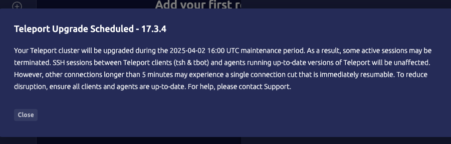

On Teleport Enterprise (Cloud) clusters, the Auth Service and Proxy Service are automatically
kept up to date with patches and minor releases following the release schedule
described in [Teleport Upcoming Releases](../upcoming-releases.mdx).

- Major version updates for the cluster typically occur one month after the
release of a new major version. Minor version updates and patches occur more regularly.
- Major version updates will not occur if any connected Teleport Agents are more than one major version behind.
- Updates only occur during your scheduled maintenance window.
- Teleport Agents are only updated automatically if you enroll them in [managed updates](agent-managed-updates.mdx).

## Notifications

Teleport Enterprise (Cloud) users will receive notification in the Web UI when
a cluster update is scheduled. The notification will include the version
and maintenance window during which the update will take place.

After the update has been completed, users will receive a new notification
indicating that the update has finished.

## Expected impact

When an update occurs, some active sessions through Teleport Cloud may be terminated.
SSH sessions between Teleport clients (tsh & tbot) and agents running up-to-date
versions of Teleport will be unaffected. However, other connections longer than
5 minutes may experience a single connection cut that is immediately resumable.
To minimize potential disruption, please keep your Teleport clients and agents up-to-date.

## Maintenance windows

The scheduled maintenance window lets you define a preferred start time for
updates that best fits your organization’s needs. This window applies to all
update types, including patches and agent upgrades. Updates will not begin before the start time you specify.

Customers can change their maintenance window by navigating to the `Help & Support`
section in the Teleport Web UI and clicking the edit button for `Window Start Time`
in the `Scheduled Upgrades` section.
