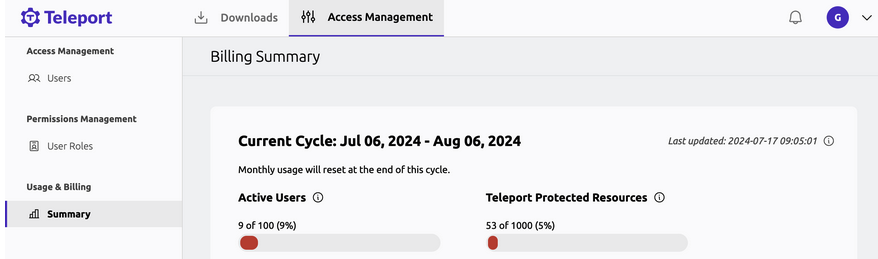

Commercial editions of Teleport send anonymized usage data to Teleport so we can
calculate billing metrics. This guide describes the anonymized usage data and
the billing metrics we calculate.

## Anonymized usage data

The commercial editions of Teleport send anonymized information to Teleport's
cloud infrastructure at `reporting-teleport.teleportinfra.sh:443`. This section
describes the usage reporting system.

### Usage reports

Teleport usage reports contain the following information:

- Teleport license identifier.
- Anonymized cluster name and Teleport Auth Service host ID.
- For each Teleport user, the anonymized user name and a count of interactions
  with infrastructure resources enrolled in your Teleport cluster.

Self-hosted Teleport deployments aggregate interaction data before it reaches
Teleport Cloud. Teleport Cloud accounts provide this information as an
anonymized log, which Teleport aggregates over the billing period.

The count of interactions includes the following:

- Teleport logins
- SSH and Kubernetes exec sessions
- Desktop and database sessions
- Web sessions with registered HTTP applications
- Connections with registered TCP applications
- SSH port forwards
- Kubernetes API requests
- SFTP actions

### Anonymization

The anonymization is done by passing names and IDs through HMAC-SHA-256.
Teleport Cloud clusters use an HMAC key that's randomly generated when
the cluster is initialized. Self-hosted Teleport deployments use an
anonymization key that's generated and embedded in the license file at
download time and never shared with us. This makes it infeasible for anyone
without access to the cluster to deanonymize the data we store.

### How reporting takes place

Each cluster in a [Trusted Clusters](reference/architecture/trustedclusters.mdx) setup
is responsible for reporting about the interactions with its own resources;
therefore, all clusters will periodically reach out to Teleport Cloud to report
usage, and should all be using the same license file for correct aggregate
measurement.

The code that aggregates and anonymizes this data can be found in our [GitHub
repository](https://github.com/gravitational/teleport/tree/master/lib/usagereporter/teleport/aggregating).

For a restricted network environment you can configure Teleport Auth Service instances
to send usage data through a proxy for version 16.0.4/15.4.7/14.3.21 or later.
Set the `TELEPORT_REPORTING_HTTPS_PROXY` and `TELEPORT_REPORTING_HTTP_PROXY`
environment variables to your proxy address. That will apply as the HTTP connect
proxy setting overriding `HTTPS_PROXY` and `HTTP_PROXY` just for outbound usage reporting.

## Billing metrics

Teleport uses the anonymized usage data described in the previous section to
calculate two types of billing metrics:

- Monthly Active Users
- Teleport Protected Resources

### Usage metrics in the Web UI

<Admonition type="note">

This will be displayed only for those on usage-based plans. Users will need permission to read the billing resource.

</Admonition>

1. Go to https://teleport.sh/ and enter your tenant name.
1. Sign in using your administrator credentials.
1. Click on your username at the top right to expand the dropdown menu.
1. Click on "Billing Summary".
1. Usage data for the current billing cycle will be displayed. Example:

### Monthly Active Users

Monthly Active Users (MAU) is the aggregate number of unique active users
accessing Teleport.

We aggregate MAU over each monthly period starting on the subscription start
date and ending on each monthly anniversary thereafter.

"Active" means a user having performed any activity that would appear in a
Teleport audit log, for example, connecting to a resource via the Web UI or via
`tsh login`, submitting an Access Request, and so on.

We do not count automated actions, such as the modification of a user's role by
an administrator or the automatic creation of a user through an identity
provider, as user activity.

Note: when configured to perform single-sign-on against an external identity
provider, Teleport creates temporary user records that are valid for the
duration of the SSO session. As a result, the _Users_ page in Teleport's web UI
will only show users who have recently logged in and is not a true
representation of all active users over the last month.

### Teleport Protected Resources

The Teleport Protected Resources (TPR) metric is the aggregate number of unique
resources connected to Teleport.

A "resource" is any unique bot, such as a CI/CD Jenkins or GitHub Actions job,
or a distinct computing resource, including a Kubernetes cluster, SSH server,
database instance, or serverless endpoint, that registers with the Teleport
cluster at least once a month.

We aggregate TPRs during each day on an hourly basis, and take an hourly average
to compute a daily TPR. Then we average the daily TPR over a monthly period,
which starts on the subscription start date and ends on each monthly anniversary
thereafter.

If you recreate a single resource more than once an hour, this will affect the
hourly average. For example, if you were to create then delete 10 servers three
times in one hour, Teleport would display 10 servers at any given time. However,
for the entire hour, Teleport would report 30 protected servers.

### Machine and Workload Identities

The Machine and Workload Identity (MWI) metric is an aggregate of
* [Bots](reference/architecture/machine-id-architecture.mdx#what-is-a-bot)
* [Bot Instances](reference/architecture/machine-id-architecture.mdx#what-is-a-bot)
* [SPIFFE IDs](enroll-resources/workload-identity/spiffe.mdx#spiffe-ids-and-trust-domains)

We aggregate Bots, Bot Instances and unique SPIFFE IDs during each day on an hourly basis, and take
an hourly average to compute a daily Bot, Bot Instance and SPIFFE ID count. Then we average the daily
counts over a monthly period, which starts on the subscription start date and ends on each monthly
anniversary thereafter.

If you recreate a single Bot or Bot Instance more than once an hour, this will affect the
hourly average. For example, if you were to create then delete 10 Bots three
times in one hour, Teleport would display 10 Bots at any given time. However,
for the entire hour, Teleport would report 30 Bots.

For SPIFFE IDs, unique means that we only count a SPIFFE ID once during the calculation period,
even if it is used for multiple services. For example, if ten services running 24 hours per day
share the ID `spiffe://mydomain.cloud.gravitational.io/web-service`, Teleport would report that 
as one SPIFFE ID for billing.

The sum of your calculated Bots, Bot Instances, and unique SPIFFE IDs is your
total MWI for the billing period.

## Usage measurement for billing

We aggregate all counts of the billing metrics on a monthly basis starting on
the subscription start date and ending on each monthly anniversary thereafter.

The amount of usage purchased by a Teleport customer is based on the maximum
aggregate amount of a billing metric in a given month during the term of the
Subscription, also known as a high water mark calculation.

Reach out to sales@goteleport.com if you have questions about the
commercial editions of Teleport.

## Troubleshooting usage and billing

Teleport aggregates usage reports on a submission service that runs either on
self-hosted Teleport infrastructure or Teleport Cloud, depending on the user's
plan. The submission service persists usage reports in the case of a submission
failure, and deletes the reports after a successful submission. It is not
possible to set up a third-party destination for usage events to independently
verify usage event data.

If you are using Teleport Enterprise (Cloud), your usage data is accurate as
long as Teleport-managed reporting infrastructure works as expected (check the
[status page](https://status.teleport.sh/) for any incidents). On self-hosted
Teleport Enterprise clusters, some conditions can interfere with data reporting.
This section describes some scenarios that can lead to inaccurate data on
self-hosted clusters.

If you suspect that any of these scenarios describe your Teleport cluster, or
your usage data appears inaccurate, reach out to support@goteleport.com.

### Multiple Teleport clusters

In versions older than v14.3.1, Teleport does not de-duplicate users as expected
across multiple Teleport clusters that belong to the same account. If you are
running multiple Teleport clusters with affected versions, the count of active
users may be higher than expected.

### Unexpected license differences

When distributing copies of your Teleport Enterprise (Self-Hosted) license
across Auth Service instances, you must not download a license multiple times
from your Teleport account. Instead, you must download a license once and copy
that license across Auth Service instances. Otherwise, the Teleport usage
reporting infrastructure will identify multiple licenses and misrepresent your
usage numbers.

### SSO users

In Teleport, single sign-on (SSO) users are
[ephemeral](reference/user-types.mdx#temporary-users). Teleport deletes an SSO user
when its session expires. To count the number of SSO users in your cluster, you
can examine Teleport audit events for unique SSO users that have authenticated
to Teleport during a given time period. The Teleport documentation includes
[how-to guides](./admin-guides/management/export-audit-events/export-audit-events.mdx) for
exporting audit events to common log management solutions so you can identify
users that have authenticated using an SSO provider.
