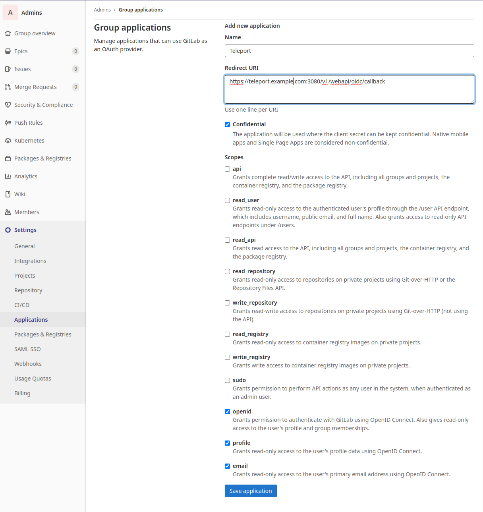
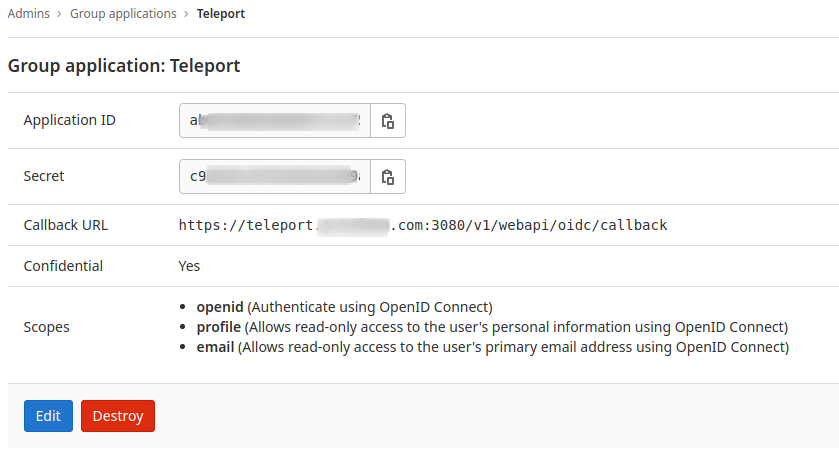

This guide will cover how to configure [GitLab](https://www.gitlab.com/) to issue
credentials to specific groups of users. When used in combination with role
based access control (RBAC), it allows administrators to define policies
like:

- Only members of the "DBA" group can access PostgreSQL databases.
- Only members of "ProductionKubernetes" can access production Kubernetes clusters
- Developers must never SSH into production servers.

## Prerequisites

- At least two groups in GitLab with users assigned. In our examples below,
  we'll assume a group named `company` with two subgroups, `admin` and `dev`.
- Teleport role with access to maintaining `oidc` resources.  This is available
  in the default `editor` role.

(!docs/pages/includes/commercial-prereqs-tabs.mdx!)

- (!docs/pages/includes/tctl.mdx!)

## Step 1/4. Configure GitLab

You should have at least one group configured in GitLab to map to Teleport roles.
In this example we use the names `gitlab-dev` and `gitlab-admin`.  Assign users
to each of these groups.

1. Create an application in one of your groups (**Group overview** ->
   **Settings** -> **Applications**) that will allow using GitLab as an OAuth
   provider to Teleport.

   Settings:

   - Redirect URL: `https://<proxy url>/v1/webapi/oidc/callback`.
   - Check `Confidential`, `openid`, `profile`, and `email`.

   

1. Collect the `Application ID` and `Secret` in the Application. These will be
   used in the Teleport OIDC auth connector:

   

1. Confirm the GitLab issuer address.

   For GitLab.com, the issuer address is `https://gitlab.com`. This allows
   Teleport to access the Open-ID configuration at
   `https://gitlab.com/.well-known/openid-configuration`. If you are self
   hosting the issuer address is the path to your GitLab instance.

## Step 2/4. Configure Teleport

### Create a OIDC Connector

Create an OIDC connector resource using `tctl`.

On your workstation, create a file called `client-secret.txt` consisting only of
your client secret.

<Tabs>
<TabItem label="GitLab.com">
Replace the application ID and secret with the values from GitLab:

```code
$ tctl sso configure oidc --preset gitlab \
--id <APPLICATION-ID> \
--secret $( cat client-secret.txt) \
--claims-to-roles groups,company/admin,admin \
--claims-to-roles groups,company/dev,dev > oidc.yaml
```

</TabItem>
<TabItem label="Self-hosted">
Replace the application ID and secret with the values from GitLab, and replace
`https://gitlab.company.com` with the path to your self-hosted GitLab instance:

```code
$ tctl sso configure oidc --preset gitlab \
--id <APPLICATION-ID> \
--issuer-url https://gitlab.company.com \
--secret $( cat client-secret.txt) \
--claims-to-roles groups,company/admin,admin \
--claims-to-roles groups,company/dev,dev > oidc.yaml
```

</TabItem>
</Tabs>

This example maps the two subgroups `admin` and `dev` of the parent group
`company` to the `admin` and `dev` roles in Teleport, and creates the `oidc.yaml` file:

```yaml
kind: oidc
metadata:
  name: gitlab
spec:
  claims_to_roles:
  - claim: groups
    roles:
    - admin
    value: company/admin
  - claim: groups
    roles:
    - dev
    value: company/gitlab-dev
  client_id: <APPLICATION-ID>
  client_secret: <APPLICATION-SECRET>
  display: GitLab
  issuer_url: https://gitlab.com
  prompt: none
  redirect_url: https://teleport.example.com:443/v1/webapi/oidc/callback
version: v3

```

Test the connector resource by piping the file to `tctl sso test`:

```code
$ cat oidc.yaml | tctl sso test
```

After authorizing the application in GitLab you should get a
**Login Successful** message in your web browser. Otherwise, consult the output
of the command to diagnose.

Create the connector using `tctl` tool:

```code
$ tctl create -f oidc.yaml
```

## Step 3/4. Create Teleport Roles

We are going to create 2 roles, privileged role admin who is able to login as
root and is capable of administrating the cluster and non-privileged dev.

```yaml
kind: role
version: v5
metadata:
  name: admin
spec:
  options:
    max_session_ttl: 24h
  allow:
    logins: [root]
    node_labels:
      "*": "*"
    rules:
      - resources: ["*"]
        verbs: ["*"]
```

The developer role:

```yaml
kind: role
version: v5
metadata:
  name: dev
spec:
  options:
    max_session_ttl: 24h
  allow:
    logins: [ "{{email.local(external.email)}}", ubuntu ]
    node_labels:
      access: relaxed
```

- Devs are only allowed to login to nodes labelled with `access: relaxed` label.
- Developers can log in as `ubuntu` user
- Notice the `{{external.email}}` login. It configures Teleport to look at the
  *"email"* GitLab claim and use that field as an allowed login for each user.
  The `email.local(external.trait)` function removes the `@domain` and preserves
  the username prefix. For full details on how variable expansion works in
  Teleport roles, see the [Access Controls
  Reference](../../../reference/access-controls/roles.mdx).
- Developers also do not have any "allow rules" i.e. they will not be able to
  see/replay past sessions or re-configure the Teleport cluster.

Create both roles on the Auth Service:

```code
$ tctl create -f admin.yaml
$ tctl create -f dev.yaml
```

(!docs/pages/includes/create-role-using-web.mdx!)

## Step 4/4. Enable default OIDC authentication

(!docs/pages/includes/enterprise/oidcauthentication.mdx!)

The Web UI will now contain a new button: "Login with GitLab". The CLI is
the same as before:

```code
$ tsh --proxy=teleport.example.com login
```

This command will print the SSO login URL (and will try to open it
automatically in a browser).

<Admonition
  type="tip"
  title="Tip"
>
  Teleport can use multiple OIDC/SAML connectors. In this case a connector name
  can be passed via `tsh login --auth=connector_name`
</Admonition>

<Admonition
  type="note"
  title="IMPORTANT"
>
  Teleport only supports sending party initiated flows for OIDC Connect. This
  means you can not initiate login from your identity provider, you have to
  initiate login from either the Teleport Web UI or CLI.
</Admonition>

## Troubleshooting

(!docs/pages/includes/sso/loginerrortroubleshooting.mdx!)

