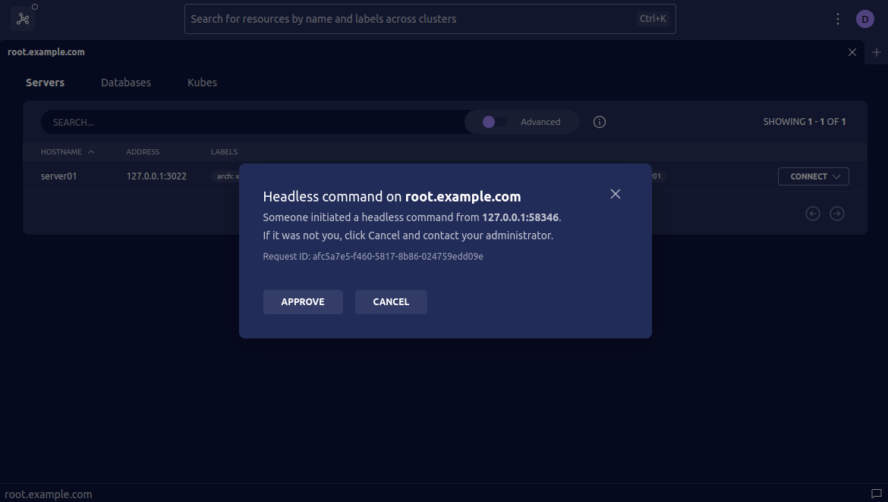
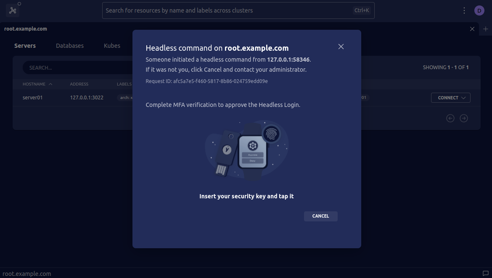

Headless Authentication provides a secure way to authenticate with Teleport on
a machine that does not have the ability to authenticate directly with the
required mechanisms.

For example:

- Authenticating with [WebAuthn](./webauthn.mdx#set-up-cluster-wide-webauthn) or [SSO MFA](../sso/sso.mdx#allowing-sso-as-an-mfa-method-in-your-cluster) from a remote dev box
- Authenticating with WebAuthn on a machine without a WebAuthn-compatible browser
- Authenticating with SSO MFA from a browser that is not supported by your SSO provider

<Admonition type="note" title="Headless Authentication Support">
  Headless Authentication only supports the following `tsh` commands:

  - `tsh ls`
  - `tsh ssh`
  - `tsh scp`

  In the future, Headless Authentication will be extended to other `tsh` commands.
</Admonition>

## How it works

In the Headless Authentication flow, a user on a remote machine requests headless
authentication when running `tsh` commands. `tsh` sends a request to an API path
on the Teleport Proxy Service, `/webapi/login/headless`, and the Teleport Proxy
Service sends a request to the Teleport Auth Service to store a headless
authentication request on its backend. `tsh` then obtains the ID of the request
and prints a URL containing the ID in the user's terminal. The user accesses the
URL on their browser and completes an MFA flow with the Teleport Auth Service.

Once the Teleport Auth Service authenticates the user, `tsh` generates a new
private key in memory, and shares its public key only to obtain user
certificates. `tsh` then holds user certificates in memory with a one-minute TTL
to reduce the impact of exfiltration.

## Prerequisites

- A Teleport cluster with [WebAuthn](./webauthn.mdx#set-up-cluster-wide-webauthn) or [SSO MFA](../sso/sso.mdx#allowing-sso-as-an-mfa-method-in-your-cluster) configured.
- Machines for Headless Authentication activities have [Linux](../../installation/installation.mdx), [macOS](../../installation/installation.mdx) or [Windows](../../installation/installation.mdx) `tsh` binary installed.
- Machines used to approve Headless Authentication requests have a Web browser with [WebAuthn support](
  https://developers.yubico.com/WebAuthn/WebAuthn_Browser_Support/) or `tsh` binary installed.
- Optional: Teleport Connect for [seamless Headless Authentication approval](#optional-teleport-connect).

## Step 1/3. Configuration

A Teleport cluster capable of WebAuthn or SSO MFA is automatically capable of
Headless Authentication without any additional configuration.

<details>
<summary>Optional: make Headless Authentication the default auth connector</summary>

To make Headless Authentication the default authentication method for your Teleport
Cluster, add `connector_name: headless` to your cluster configuration.

Create a `cap.yaml` file or get the existing configuration using
`tctl get cluster_auth_preference`:

```yaml
kind: cluster_auth_preference
version: v2
metadata:
  name: cluster-auth-preference
spec:
  type: local
  second_factors: ["webauthn"]
  webauthn:
    rp_id: example.com
  connector_name: headless # headless by default
```

Update the configuration:

```code
$ tctl create -f cap.yaml
# cluster auth preference has been updated
```
</details>

<details>
<summary>Alternative: disable Headless Authentication</summary>

Headless Authentication is enabled automatically when WebAuthn or SSO MFA is configured.
If you want to forbid Headless Authentication in your cluster, add `headless: false` to your
configuration.

Create a `cap.yaml` file or get the existing configuration using
`tctl get cluster_auth_preference`:

```yaml
kind: cluster_auth_preference
version: v2
metadata:
  name: cluster-auth-preference
spec:
  type: local
  second_factors: ["webauthn"]
  webauthn:
    rp_id: example.com
  headless: false # disable Headless Authentication
```

Update the configuration:

```code
$ tctl create -f cap.yaml
# cluster auth preference has been updated
```

</details>

## Step 2/3. Initiate Headless Authentication

Run a headless `tsh` command with the `--headless` flag. This will initiate
headless authentication, printing a URL and `tsh` command.

```code
$ tsh ls --headless --proxy=proxy.example.com --user=alice
# Complete headless authentication in your local web browser:
#
# https://proxy.example.com:3080/web/headless/86172f78-af7c-5935-a7c1-ed06b94f17dc
#
# or execute this command in your local terminal:
#
# tsh headless approve --user=alice --proxy=proxy.example.com 86172f78-af7c-5935-a7c1-ed06b94f17dc
```

## Step 3/3. Approve Headless Authentication

To approve the headless authentication, click or copy+paste the URL printed by
`tsh` in your local web browser. You will be prompted to approve the log in with
MFA verification. Once approved, your initial `tsh --headless <command>`
should continue as if you had logged in locally.

Unlike a standard login session, headless sessions are only available for the
lifetime of a single `tsh` request. This means that for each `tsh --headless`
command, you will need to go through the Headless Authentication flow:

### Example: Listing SSH servers
```code
$ tsh ls --headless --proxy=proxy.example.com --user=alice
# Complete headless authentication in your local web browser:
#
# https://proxy.example.com:3080/web/headless/86172f78-af7c-5935-a7c1-ed06b94f17dc
#
# or execute this command in your local terminal:
#
# tsh headless approve --user=alice --proxy=proxy.example.com 86172f78-af7c-5935-a7c1-ed06b94f17dc
# # User approves through link
# Node Name Address        Labels
# --------- -------------- -----------
# server01  127.0.0.1:3022 arch=x86_64
```

### Example: Initiating an SSH session
```code
$ tsh ssh --headless --proxy=proxy.example.com --user=alice alice@server01
# Complete headless authentication in your local web browser:
#
# https://proxy.example.com:3080/web/headless/864cccd9-2425-46d9-a9f2-636387e66ebf
#
# or execute this command in your local terminal:
#
# tsh headless approve --user=alice --proxy=proxy.example.com 864cccd9-2425-46d9-a9f2-636387e66ebf
# # User approves through link and a ssh terminal starts
alice@server01 $
```

<Admonition type="note">
  The Teleport user, `--user` parameter, is the Teleport user requesting Headless Authentication activity.
  If no `--user` parameter or environment variables set the OS user in the machine terminal is used.

  The login username, `--login` parameter or login@hostname, for `tsh ssh` commands is the user
  to open a SSH session as. If no login username for the SSH session is set the OS terminal username is used.
  A Teleport user must have access to that login user for that server or they will receive
  an access denied message. The user could receive an access denied message after being approved
  for their Headless Authentication activity since the same access rights are granted or denied as if running from
  your local terminal.
</Admonition>

## Optional: Teleport Connect

Teleport Connect can also be used to approve Headless Authentication logins.  Teleport
Connect will automatically detect the Headless Authentication login attempt and allow
you to approve or cancel the request.



You will be prompted to tap your MFA key to complete the approval process.



## Troubleshooting

### "WARN: Failed to lock system memory for headless login: ..."

When using Headless Authentication, `tsh` does not write private key and certificate data
to disk(`~/.tsh`). Instead, `tsh` holds these secrets in memory for the duration of
the request. Additionally, it will try to lock the process memory to further protect
the secrets from being stolen by other users on a shared machine.

Below are some of the specific warning messages you may run into and how to fix them:

#### "operation not permitted" OR "cannot allocate memory"

In order to lock the process memory, your OS user must have permission to lock
the amount of memory needed. Use `ulimit -l` to check your OS user's current limit.
The exact amount of memory needed may vary from system to system, so we recommend
updating your ulimit to unlimited, with either `ulimit -l unlimited` or by adding
the line `<os_username> hard memlock unlimited` to your `/etc/security/limits.conf`.

#### "memory locking is not supported on non-linux operating systems"

The `mlockall` syscall is only supported on Linux operating systems. This means
that on other operating systems, the memory lock attempt will always fail and
output the warning. We recommend only using Headless Authentication on Linux machines
for the best level of security on shared machines.

#### Disable mlock

If the above solutions are not feasible in your environment, you can also disable
the memory locking requirement by setting the `--mlock` flag or `TELEPORT_MLOCK_MODE`
environment variable to `off` or `best_effort`. This is not recommended in production
environments on shared systems where a memory swap attack is possible.
