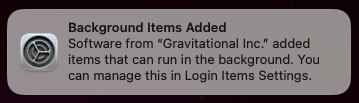

This guide explains how to configure Teleport to run as a persistent launchd service on macOS. It is intended for administrators who are running a macOS machine as a Teleport node and want the Teleport daemon to start automatically at boot and remain continuously connected to the cluster. This page focuses specifically on macOS service management and assumes that node enrollment is complete and a valid `/etc/teleport.yaml` configuration file is already in place. See the [configuration reference page](../../reference/deployment/config.mdx) for more information.

# Run Teleport as a persistent service on macOS

After confirming that Teleport runs successfully with:

```code
sudo teleport start --config=/etc/teleport.yaml
```

you can configure Teleport to run automatically at system startup using `launchd`.

This ensures that:

- Teleport starts at boot
- Teleport restarts automatically if it exits
- The node remains continuously connected to the cluster

<Admonition
 type="note"
 title="Note">
This section assumes <code>/etc/teleport.yaml</code> is already configured and the node has successfully joined the cluster.
</Admonition>

{/* lint ignore page-structure remark-lint */}

## Step 1/4. Confirm the Teleport binary path

Confirm the location of the Teleport binary installed using an official Teleport distribution (for example, the macOS `.pkg` installer or official tarball).

Run:

```code
which teleport
```

<Admonition
 type="important"
 title="Important">
Use the exact path returned by <code>which teleport</code> in the LaunchDaemon configuration below. An incorrect path will prevent the service from loading.
</Admonition>

## Step 2/4. Create a LaunchDaemon

Teleport runs as root and should be configured as a **LaunchDaemon**, not a LaunchAgent.

Create the file:

```
/Library/LaunchDaemons/com.teleport.node.plist
```

Example configuration (replace the binary path if needed):

```xml
<?xml version="1.0" encoding="UTF-8"?>
<!DOCTYPE plist PUBLIC "-//Apple//DTD PLIST 1.0//EN"
 "http://www.apple.com/DTDs/PropertyList-1.0.dtd">
<plist version="1.0">
  <dict>
    <key>Label</key>
    <string>com.teleport.node</string>

    <key>ProgramArguments</key>
    <array>
      <string>/usr/local/bin/teleport</string>
      <string>start</string>
      <string>--config=/etc/teleport.yaml</string>
    </array>

    <key>RunAtLoad</key>
    <true/>

    <key>KeepAlive</key>
    <true/>

    <key>StandardOutPath</key>
    <string>/var/log/teleport.out.log</string>

    <key>StandardErrorPath</key>
    <string>/var/log/teleport.err.log</string>
  </dict>
</plist>
```

## Step 3/4. Set required permissions

LaunchDaemons must:

- Be owned by `root:wheel`
- Have mode `644`

Set permissions:

```code
sudo chown root:wheel /Library/LaunchDaemons/com.teleport.node.plist
sudo chmod 644 /Library/LaunchDaemons/com.teleport.node.plist
```

Validate the plist:

```code
sudo plutil -lint /Library/LaunchDaemons/com.teleport.node.plist
```

## Step 4/4. Load the service

### Newer macOS (Catalina, Big Sur, Monterey, Ventura, Sonoma)

Use `bootstrap`:

```code
sudo launchctl bootstrap system /Library/LaunchDaemons/com.teleport.node.plist
sudo launchctl enable system/com.teleport.node
sudo launchctl kickstart -k system/com.teleport.node
```

To reload after changes:

```code
sudo launchctl bootout system /Library/LaunchDaemons/com.teleport.node.plist
sudo launchctl bootstrap system /Library/LaunchDaemons/com.teleport.node.plist
```

### Older macOS

Use:

```code
sudo launchctl load /Library/LaunchDaemons/com.teleport.node.plist
```

To unload:

```code
sudo launchctl unload /Library/LaunchDaemons/com.teleport.node.plist
```

When you load the service, a pop up notification will occur: "Background Items Added":



## Verify the service

Check launchd status:

```code
sudo launchctl print system/com.teleport.node
```

Look for:

```
state = running
```

Confirm the Teleport process:

```code
pgrep -fl 'teleport start'
```

Confirm the node remains connected:

```code
tsh ls
```

### Optional: Configure logging in teleport.yaml

Teleport logs to `stderr` by default. To consolidate logs into a single file, add:

```yaml
teleport:
  log:
    output: /var/log/teleport.log
    severity: INFO
```

Restart the service:

```code
sudo launchctl kickstart -k system/com.teleport.node
```

## Troubleshooting

<Checkpoint
  title="Service fails to load"
  description="Verify the service is loading."
>

1. Check the logs for errors.
```code
sudo log show --last 5m --predicate 'process == "launchd"' --info
```

2. If Teleport fails after starting:

```code
sudo tail -f /var/log/teleport.err.log
```
</Checkpoint>

## Notes

- After the first successful join, Teleport stores its identity in the configured `data_dir`. A join token is no longer required.
- Use **LaunchDaemons**, not LaunchAgents, so Teleport runs as root.
- If the Teleport binary path changes after reinstalling from an official distribution, update the plist accordingly.
