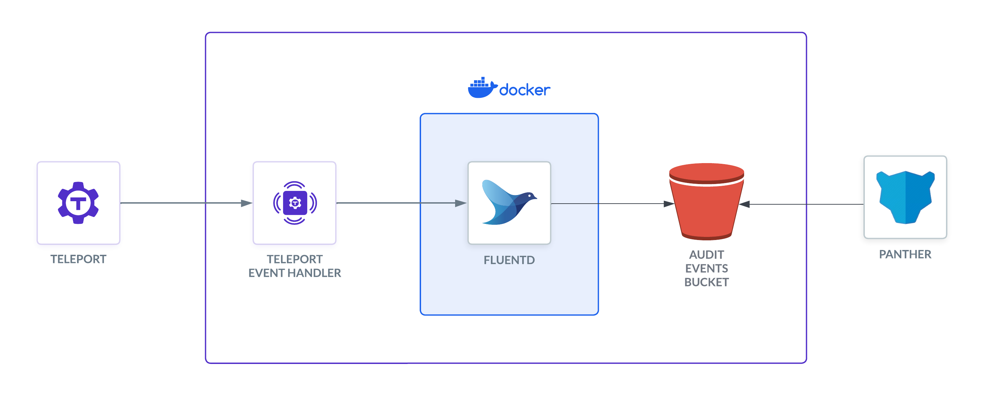
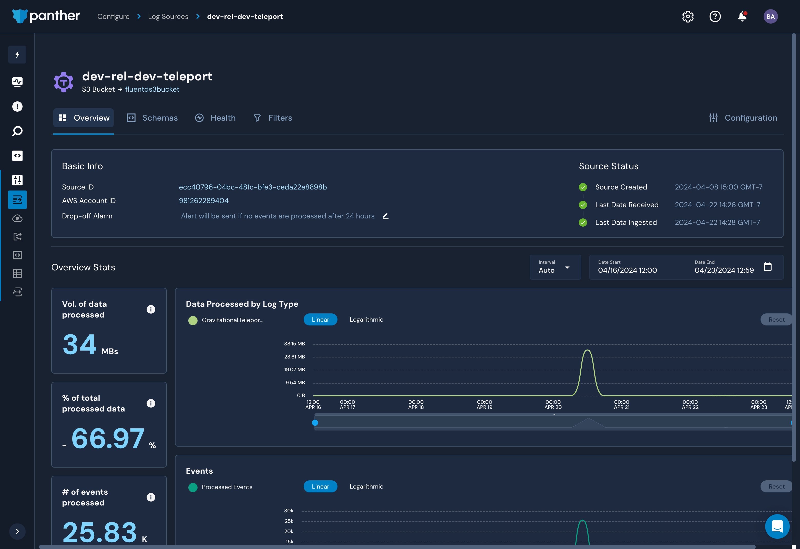

Teleport's Event Handler plugin receives audit events from the Teleport Auth
Service and forwards them to your log management solution, letting you perform
historical analysis, detect unusual behavior, and form a better understanding of
how users interact with your Teleport cluster.

Panther is a cloud-native security analytics platform. In this guide, we'll explain
how to forward Teleport audit events to Panther using Fluentd.

## How it works

The Teleport Event Handler is designed to communicate with Fluentd using mTLS
to establish a secure channel. In this setup, the Event Handler sends events to Fluentd, which forwards them to S3 to be ingested by Panther.



## Prerequisites

- A [Panther](https://panther.com/product/request-a-demo/) account.
- Fluentd version v(=fluentd.version=) or greater. The Teleport Event Handler
  will create a new `fluent.conf` file you can integrate into an existing Fluentd
  system, or use with a fresh setup.
- An S3 bucket to store the logs. Panther will ingest the logs from this bucket.
- A server, virtual machine, Kubernetes cluster, or Docker environment to run the
  Teleport Event Handler plugin.

This guide requires you to have completed one of the Event Handler setup guides:

- [Set up the Event Handler with tctl](event-handler-setup.mdx)
- [Set up the Event Handler with the Teleport Kubernetes Operator](event-handler-setup-operator.mdx)

The instructions below demonstrate a local test of the Event Handler plugin on
VM. You will need to adjust paths, ports, and domains for other environments.

## Step 1/3. Create a Dockerfile with Fluentd and the S3 plugin

To send logs to Panther, you need to use the Fluentd output plugin for S3. Create
a `Dockerfile` with the following content:

```text
FROM fluent/fluentd:edge
USER root
RUN fluent-gem install fluent-plugin-s3
USER fluent
```

Build the Docker image:

```code
$ docker build -t fluentd-s3 .
```

<Admonition type="tip" title="Testing Locally?">

If you're running Fluentd in a local Docker container for testing, you can adjust
the entrypoint to an interactive shell as the root user, so you can test the setup.

```code
$ docker run -u $(id -u root):$(id -g root) -p 8888:8888 -v $(pwd):/keys -v \
$(pwd)/fluent.conf:/fluentd/etc/fluent.conf --entrypoint=/bin/sh -i --tty  fluentd-s3
```

</Admonition>

### Configure Fluentd for Panther

We will modify the `fluent.conf` file generated in the prerequisite setup guide. This file needs to be updated
to send logs to Panther. This means adding a `<filter>` and `<match>` section to the file. These sections
will filter and format the logs before sending them to S3, The record_transformer is important to send the 
right date and time format for Panther. 

```xml
<!--
# Below code is commented out as it's autogenerated in step 4 by teleport-event-handler
fluent.conf 
This is a sample configuration file for Fluentd to send logs to S3. 
Created by the Teleport Event Handler plugin. 
Add the <filter> and <match> sections to the file.
 <source>
     @type http
     port 8888

     <transport tls>
         client_cert_auth true
         ca_path "/keys/ca.crt"
         cert_path "/keys/server.crt"
         private_key_path "/keys/server.key"
         private_key_passphrase "AUTOGENERATED"
     </transport>

     <parse>
       @type json
       json_parser oj

       # This time format is used by Teleport Event Handler.
       time_type string
       time_format %Y-%m-%dT%H:%M:%S
     </parse>

     # If the number of events is high, fluentd will start failing the ingestion
     # with the following error message: buffer space has too many data errors.
     # The following configuration prevents data loss in case of a restart and
     # overcomes the limitations of the default fluentd buffer configuration.
     # This configuration is optional.
     # See https://docs.fluentd.org/configuration/buffer-section for more details.
     <buffer>
       @type file
       flush_thread_count 8
       flush_interval 1s
       chunk_limit_size 10M
       queue_limit_length 16
       retry_max_interval 30
       retry_forever true
  </buffer>
</source>
-->
<filter test.log>
  @type record_transformer
  enable_ruby true
  <record>
    time ${time.utc.strftime("%Y-%m-%dT%H:%M:%SZ")}
  </record>
</filter>
<match test.log>
  @type s3
  aws_key_id  REPLACE_aws_access_key
  aws_sec_key  REPLACE_aws_secret_access_key
  s3_bucket  REPLACE_s3_bucket
  s3_region us-west-2
  path teleport/logs
  <buffer>
    @type file
    path /var/log/fluent/buffer/s3-events
    timekey 60
    timekey_wait 0
    timekey_use_utc true
    chunk_limit_size 256m
  </buffer>
  time_slice_format %Y%m%d%H%M%S
  <format>
    @type json
    </format>
</match>
<match session.*>
  @type stdout
</match>
```

Start the Fluentd container:

```code
$ docker run -p 8888:8888 -v $(pwd):/keys -v $(pwd)/fluent.conf:/fluentd/etc/fluent.conf fluentd-s3
```
This will start the Fluentd container and expose port 8888 for the Teleport Event Handler to send logs to. 

## Step 2/3. Run the Event Handler plugin

In this section, you will modify the Event Handler configuration you generated
and run the Event Handler to test your configuration.

### Configure the Event Handler

Edit the configuration for the Event Handler, depending on your installation method.

(!docs/pages/includes/plugins/finish-event-handler-config.mdx!)

Update the following fields.

(!docs/pages/includes/plugins/finish-event-handler-fields.mdx!)

### Start the Event Handler

(!docs/pages/includes/plugins/start-event-handler.mdx!)

The Logs view in Panther should now report your Teleport cluster events. 

## Step 3/3. Configure Panther to ingest logs from S3

Once logs are being sent to S3, you can configure Panther to ingest them. Follow
the [Panther documentation](https://docs.panther.com/data-onboarding/supported-logs/teleport) to set
up the S3 bucket as a data source.



## Troubleshooting connection issues

If the Teleport Event Handler is displaying error logs while connecting to your
Teleport Cluster, ensure that:

- The certificate the Teleport Event Handler is using to connect to your
  Teleport cluster is not past its expiration date. This is the value of the
  `--ttl` flag in the `tctl auth sign` command, which is 12 hours by default.
- In your Teleport Event Handler configuration file, you have provided
  the correct host *and* port for the Teleport Proxy Service.
- Start the Fluentd container prior to starting the Teleport Event Handler. The 
  Event Handler will attempt to connect to Fluentd immediately upon startup.

## Next steps

- Learn more about the [Panther Detections, Alerts and Notifications](https://panther.com/integrations/logs/teleport/).
- To see all of the options you can set in the values file for the
`teleport-plugin-event-handler` Helm chart, consult our [reference
guide](../../reference/helm-reference/teleport-plugin-event-handler.mdx).
