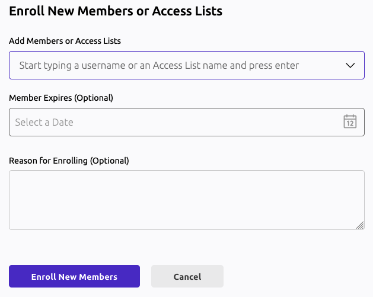

Access Lists allow Teleport users to be granted long-term access to resources
managed within Teleport. With Access Lists, administrators can regularly audit and control membership to specific roles and
traits, which then tie easily back into Teleport's existing RBAC system.

In this guide, we'll follow up
on [the IaC users and roles guide](./user-and-role.mdx) by allowing users with
the `manager` role to grant the `support-engineer` role to users meeting
specific criteria.

Please note that Access Lists can be managed via IaC but Access List memberships
cannot. The goal of Access Lists is to decentralize granting and reviewing
access. By allowing managers to grant access within specific guidelines and
automatically enforcing review, users can request common access rights without
having to go through the centralized team managing the Teleport IaC.
This reduces the load on the centralized IaC/security team, ensures the access
reviewer is aware of the context, reduces the request resolution time, and
ensures access grants are periodically reviewed.

## Prerequisites

To follow this guide, you must follow
first [the basic users and roles IaC guide](./user-and-role.mdx). We will reuse
its users and roles for our Access List.

## Step 1/3 - Write manifests

### Write the privileged role manifest

We will create a new role `support-engineer` that grants access to production
servers. The `engineer` role from the previous guide was only granting access to
`dev` and `staging` servers.


<Tabs>
<TabItem label="tctl">

Create the following `privileged-role.yaml` file:

```yaml
kind: role
version: v7
metadata:
  name: support-engineer
spec:
  allow:
    logins: ['root', 'ubuntu', '{{internal.logins}}']
    node_labels:
      'env': ['production']
```

</TabItem>
<TabItem label="Kubernetes Operator">

Create the following `privileged-role.yaml` file:

```yaml
apiVersion: resources.teleport.dev/v1
kind: TeleportRoleV7
metadata:
  name: support-engineer
spec:
  allow:
    logins: [ 'root', 'ubuntu', '{{internal.logins}}' ]
    node_labels:
      'env': [ 'production' ]
```

</TabItem>
<TabItem label="Terraform">

Create the following `privileged-role.tf` file:

```hcl
resource "teleport_role" "support-engineer" {
  version = "v7"
  metadata = {
    name = "support-engineer"
  }

  spec = {
    allow = {
      logins = ["root", "ubuntu", "{{internal.logins}}"]
      node_labels = {
        env = ["production"]
      }
    }
  }
}
```

</TabItem>
</Tabs>

### Write the Access List manifest

In this step we'll create an Access List that allows users with the `manager`
role such as  `alice` to grant access to production to users with the `engineer`
role.

<Tabs>
<TabItem label="tctl">

Create the following `accesslist.yaml` file:

```yaml
version: v1
kind: access_list
metadata:
  name: support-engineers
spec:
  title: "Production access for support engineers"
  audit:
    recurrence:
      frequency: 6months
  description: "Use this Access List to grant access to production to your engineers enrolled in the support rotation."
  owners:
    - description: "manager of NA support team"
      name: alice
  ownership_requires:
    roles:
      - manager
  grants:
    roles:
      - support-engineer
  membership_requires:
    roles:
      - engineer
```

</TabItem>
<TabItem label="Kubernetes Operator">

Create the following `accesslist.yaml` file:

```yaml
apiVersion: resources.teleport.dev/v1
kind: TeleportAccessList
metadata:
  name: support-engineers
spec:
  title: "Production access for support engineers"
  description: "Use this Access List to grant access to production to your engineers enrolled in the support rotation."
  audit:
    recurrence:
      frequency: 6months
  owners:
    - description: "manager of NA support team"
      name: alice
  ownership_requires:
    roles:
      - manager
  grants:
    roles:
      - support-engineer
  membership_requires:
    roles:
      - engineer
```

</TabItem>
<TabItem label="Terraform">

Create the following `accesslist.tf` file:

```hcl
resource "teleport_access_list" "support-engineers" {
  header =  {
    version = "v1"
    metadata = {
      name = "support-engineers"
    }
  }

  spec = {
    title = "Production access for support engineers"
    description = "Use this Access List to grant access to production to your engineers enrolled in the support rotation."
    audit = {
      recurrence = {
        frequency = 6
      }
    }
    owners = [
      {
        description = "manager of NA support team"
        name = "alice"
      }
    ]
    ownership_requires = {
      roles = ["manager"]
    }
    grants = {
      roles = ["support-engineer"]
    }
    membership_requires = {
      roles = ["engineer"]
    }
  }
}
```

</TabItem>
</Tabs>

## Step 2/3 - Apply the manifests

<Tabs>
<TabItem label="tctl">

```code
$ tctl create -f privileged-role.yaml
role 'support-engineer' has been created

$ tctl create -f accesslist.yaml
Access list "support-engineers" has been created
```

<Admonition type="note">
The user resource depends on roles. You must create roles before users as a user
with a non-existing role is invalid and will be rejected by Teleport.
</Admonition>

</TabItem>
<TabItem label="Kubernetes Operator">

Create the Kubernetes CRs with the following commands:

```code
$ kubectl apply -n "$OPERATOR_NAMESPACE" -f privileged-role.yaml
teleportrolev7.resources.teleport.dev/support-engineer created

$ kubectl apply -n "$OPERATOR_NAMESPACE" -f accesslist.yaml
teleportaccesslist.resources.teleport.dev/support-engineers
```

</TabItem>
<TabItem label="Terraform">

```code
$ terraform plan
[...]
Plan: 2 to add, 0 to change, 0 to destroy.

$ terraform apply
teleport_access_list.support-engineers: Creating...
teleport_role.support-engineer: Creating...
teleport_role.support-engineer: Creation complete after 0s [id=support-engineer]
teleport_access_list.support-engineers: Creation complete after 0s [id=support-engineers]
```

</TabItem>
</Tabs>

## Step 3/3 - Log in as `alice` and grant access to `bob`

Now, you created an Access List allowing `alice` to grant the `support-engineer`
role to its engineers.

You can log in as alice and add `bob` to the `support-engineers` Access List.

<Tabs>
<TabItem label="Web UI">

Login as `alice` in the web UI, open the management panel and select the
"Access Lists" tab. Your Access List should be displayed, open it, choose "Enroll
members" and add `bob`.



</TabItem>
<TabItem label="CLI">

Login as `alice` with `tsh`, then add bob to the Access List:

```code
# login as alice
$ tsh login --proxy <your-cluster-domain>:<port> --user alice

# tctl acl users add <access-list-name> <user> [<expires>] [<reason>]
$ tctl acl users add support-engineers bob "" "Bob is now part of the on-call support rotation"
```

Finally, list the Access List members:
```code
$ tctl acl users ls support-engineers
Members of support-engineers:
- bob
```

</TabItem>
</Tabs>

## Next steps

You can see all supported Access List fields
[in the Access List reference](../../../reference/access-controls/access-lists.mdx).
