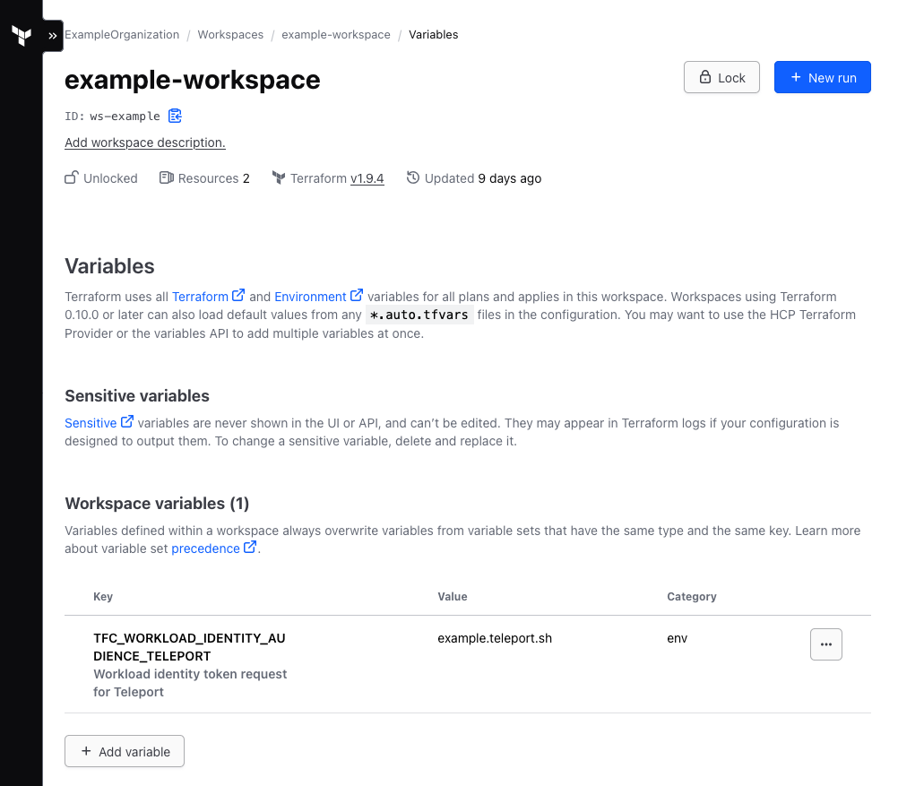

This guide demonstrates how to use the Terraform provider for Teleport using
HCP Terraform or Terraform Enterprise.

This guide does not cover running the Terraform provider locally, in other CI/CD
environments, or in short-lived cloud VMs. In any of these cases, refer to a
dedicated guide:

- [Run the Terraform Provider in CI or cloud VMs](./ci-or-cloud.mdx)
- [Run the Terraform Provider locally](./local.mdx)

## How it works

<Admonition type="warning" title="Enterprise">
  Terraform Cloud joining with self-hosted Terraform Enterprise requires
  Teleport Enterprise. Terraform Cloud joining with public HCP Terraform
  (https://app.terraform.io) is supported in Teleport Community Edition.
</Admonition>

When running the Teleport Terraform provider on Terraform Cloud, you can use its
built-in Machine ID support to dynamically authenticate to your Teleport cluster
without any shared secrets. When run in this configuration, the Terraform
provider proves its identity to the Teleport Auth Service using Terraform
Cloud's [Workload Identity][tf-workload-id] tokens.

While following this guide, you'll configure your Teleport cluster to accept
join requests from Terraform Cloud runs and configure the provider to
authenticate using the Terraform Cloud join method.

Note that this guide applies to both the public HCP Terraform a.k.a. Terraform
Cloud, as well as self-hosted Terraform Enterprise. This does **not** apply
to Terraform or OpenTofu when run on other CI/CD platforms like Spacelift, so
refer to our generic [CI and Cloud guide](./ci-or-cloud.mdx) to configure the
provider in these environments.

## Prerequisites

(!docs/pages/includes/edition-prereqs-tabs.mdx edition="Teleport Enterprise"!)

- (!docs/pages/includes/tctl.mdx!)

- [Terraform >= (=terraform.version=)+](https://learn.hashicorp.com/tutorials/terraform/install-cli)

  ```code
  $ terraform version
  # Terraform v(=terraform.version=)
  ```

  To import existing Teleport resources as Terraform resources, you must have
  Terraform version `v1.5.0` or above.

- An account and project on either the public Terraform Cloud SaaS or a
  Terraform Enterprise instance

- The Teleport Terraform provider, v16.4.0 or later

## Step 1/4: Configure Terraform Cloud joining in Teleport

To start, the Teleport Auth Service needs to be configured to accept join
requests from Terraform Cloud runs. We'll do this by creating a bot named
`terraform` which the Teleport Terraform provider will use in a later step.

```yaml
kind: bot
version: v1
metadata:
  name: terraform
spec:
  # The terraform-provider role is a built-in role granting access to every
  # resource supported by the terraform provider.
  roles: ["terraform-provider"]
```

Create the bot from the new YAML manifest:

```code
$ tctl create -f terraform_bot.yaml
bot 'terraform' has been created
```

Next, the new bot needs to be allowed to authenticate with Terraform Cloud
Workload Identity credentials. Create a file named `terraform_token.yaml`
with this content, depending on whether you are using Terraform Cloud or
self-hosted Terraform Enterprise:

<Tabs>
<TabItem label="HCP Terraform">
  ```yaml
  kind: token
  version: v2
  metadata:
    name: terraform
  spec:
    roles: [Bot]
    join_method: terraform_cloud
    bot_name: terraform
    terraform_cloud:
      allow:
        - organization_name: ExampleOrganization
          project_name: example-project
          workspace_name: example-workspace
  ```
</TabItem>
<TabItem label="Terraform Enterprise">
  <Admonition type="warning" title="Enterprise">
    Teleport Enterprise is required to use Terraform Enterprise joining.
  </Admonition>

  Self-hosted Terraform Enterprise installations will need to additionally
  configure the `hostname` parameter:

  ```yaml
  kind: token
  version: v2
  metadata:
    name: terraform
  spec:
    roles: [Bot]
    join_method: terraform_cloud
    bot_name: terraform
    terraform_cloud:
      hostname: terraform.example.com
      allow:
        - organization_name: ExampleOrganization
          project_name: example-project
          workspace_name: example-workspace
  ```

  This `hostname` value should match the `iss` parameter of the JWTs issued
  to your Terraform Enterprise runs, without the `https://` prefix. For more
  information, refer to the [Terraform Enterprise documentation][tf-workload-id].
  Note that if `hostname` is not configured, it will default to the Terraform
  Cloud issuer and join attempts will fail.
</TabItem>
</Tabs>

This token, named `terraform`, allows Terraform Cloud runs to authenticate
with Teleport when all 3 of the values allowed in the token match those
of the job run by Terraform Cloud.

Make sure to replace the organization, project, and workspace names to match
your Terraform Cloud project or projects. If desired, the fields
`organization_id`, `project_id`, and `workspace_id` can be used as well to
specify exact resource IDs. The values must exactly match those shown in the
Terraform Cloud dashboard.

Note that each `allow` rule must specify at least an `organization_name` or
`organization_id`, and at least one other option (workspace and/or project).
If desired, all workspaces under a project can be allowed by leaving
`workspace_name` (or `workspace_id`) unset. You can specify as many `allow`
rules as you want, and at least one must match for a run to be able to join.

Once finished, create the token:

```code
$ tctl create -f terraform_token.yaml
token 'terraform' has been created
```

## Step 2/4: Configure Terraform Cloud to issue Workload Identity tokens

Terraform Cloud needs to be configured to issue JWTs during runs. This only
requires that an environment variable is set in the Terraform Cloud dashboard.
To do so:

1. Navigate to https://app.terraform.io/
1. Navigate to your desired organization, project, and workspace
1. From the workspace sidebar, select "Variables"
1. Under "Workspace Variables", click the "Add variable" button
1. Select the "Environment variable" ("env") category
1. For the key, enter: `TFC_WORKLOAD_IDENTITY_AUDIENCE_TELEPORT`
1. For the value, enter your Teleport cluster name. If using Teleport Enterprise
   (Cloud), this would look like `example.teleport.sh`.
1. If desired, enter a description. For example, "Workload identity token
   request for Teleport"

The end result should look like this:



Once this variable is set, all subsequent runs in this workspace will be issued
JWTs with the audience configured in the variable value, i.e.
`example.teleport.sh` as shown here.

## Step 3/4: Configure the Terraform Provider

In your `provider.tf` or similar, configure the `teleport` provider:

```hcl
provider "teleport" {
  addr = "example.teleport.sh:443"
  join_method = "terraform_cloud"
  join_token = "terraform"
  audience_tag = "teleport"
}
```

These parameters must be set:
- `addr` should match the public hostname and port of your Teleport cluster
- `join_method` should be `terraform_cloud`. Note that Terraform Enterprise also
  uses the same join method, with a hostname as configured in Step 1.
- `join_token` should match the name of the `token` resource created in Step #2
- `audience_tag` should match the suffix on the key of the variable created in
  the Terraform Cloud dashboard. For example, given the variable key
  `TFC_WORKLOAD_IDENTITY_AUDIENCE_TELEPORT`, the audience tag should be
  `teleport`.

Be sure to remove any preexisting `identity_file_path`; it is replaced by
`join_method` and `join_token`.

For a complete example, consider this minimal `provider.tf`:

```hcl
terraform {
  cloud {
    organization = "ExampleOrganization"

    workspaces {
      name = "example-workspace"
    }
  }

  required_providers {
    teleport = {
      source  = "terraform.releases.teleport.dev/gravitational/teleport"
      version = "(=teleport.plugin.version=)"
    }
  }
}

provider "teleport" {
  addr = "example.teleport.sh:443"
  join_method = "terraform_cloud"
  join_token = "terraform"
  audience_tag = "teleport"
}

resource "teleport_role" "test" {
  version = "v7"
  metadata = {
    name        = "test"
    description = "Dummy role to validate Terraform Provider setup"
    labels = {
      test = "yes"
    }
  }
}
```

## Step 4/4: Run Terraform

You should now be able to perform a Terraform `plan` or `apply`. All types of
triggers should work, including CLI, API, and Git, so long as the run is
coordinated by Terraform Cloud.

Assuming your local `terraform` is authenticated to Terraform Cloud, try:
```code
$ terraform plan
```

The workflow should successfully execute, depending on your Terraform
configuration.

## Troubleshooting

### Extracting a JWT for debugging purposes

If you need to view a JWT sample for debugging purposes, you can create a
`null_resource` that prints the JWT for the run:

```hcl
resource "null_resource" "print_token" {
  provisioner "local-exec" {
    command = "echo TFC_WORKLOAD_IDENTITY_TOKEN_TELEPORT: $TFC_WORKLOAD_IDENTITY_TOKEN_TELEPORT"
  }
}
```

Once applied, you should see the encoded JWT printed in your Terraform log.
These values can be decoded either by hand or with any number of tools, for
example [`jwt-cli`].

Note that these JWTs are generally valid for 2 hours and can potentially be used
to authenticate to your Teleport cluster, so this value should be treated with
care. The full encoded token should not be shared.

This may be useful for determining the exact issuer (`iss`) value needed to
configure Terraform Enterprise join tokens, or if you need to request support.

[tf-workload-id]: https://developer.hashicorp.com/terraform/cloud-docs/workspaces/dynamic-provider-credentials/workload-identity-tokens
[`jwt-cli`]: https://github.com/mike-engel/jwt-cli
