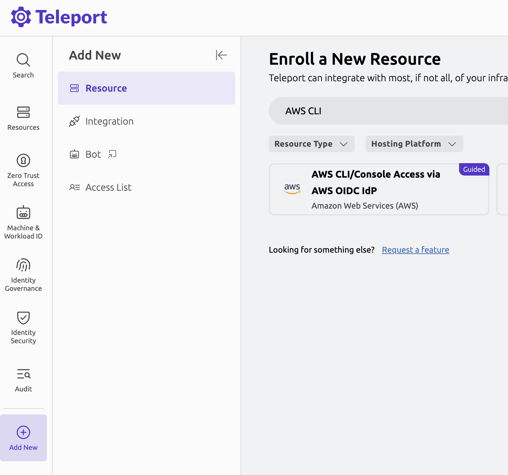

Teleport integrates with AWS IAM Identity Provider to provide AWS CLI and Console access.
This allows you to take advantage of Teleport role-based access controls, just-in-time Access Requests and other Teleport Zero Trust Access and Identity Governance capabilities to manage access to your AWS infrastructure.

<Admonition type="tip">
If you're using AWS IAM Roles Anywhere, see the [corresponding guide](../../../enroll-resources/application-access/cloud-apis/aws-console-roles-anywhere.mdx) that provides
the recommended way to manage access to AWS Console and CLI-based tooling.

If you're looking to provide AWS CLI access to your users with audit capture by going through Teleport but you don't have a public cluster, or Roles Anywhere is not adopted at your organization, take a look at the guide for [agent-based AWS access](../../../enroll-resources/application-access/cloud-apis/aws-console.mdx) instead.
</Admonition>

You can set up access using the "AWS CLI/Console Access via AWS OIDC IdP" enrollment wizard from the Teleport Web UI or you can follow this guide to set it up manually.

## How it works

Setting up access to AWS CLI and Console requires an [AWS OIDC integration](./awsoidc-integration.mdx).
The AWS OIDC integration creates and configures an AWS IAM OpenID Connect Identity Provider (OIDC IdP) and an AWS IAM role that your Teleport cluster can assume.

The enrollment wizard adds permissions to the AWS OIDC integration IAM role, so that users can assume other existing IAM Roles.

## Prerequisites

- A running Teleport cluster
- A Teleport user with the preset `editor` role.
- An AWS account and permissions to create IAM Identity Providers and roles

## Step 1/6. Create an AWS OIDC Integration

The enrollment wizard is available in the "Add New Resource" panel of the Teleport Web UI:



The Teleport Web UI walks you through the steps to set up an AWS OIDC integration (if you don't have one already), configure IAM permissions and set up access to AWS IAM Roles.

Set the <Var name="integration-iam-role"/> field to the IAM Role name created by the AWS OIDC integration.

## Step 2/6. Allow the Integration to assume other IAM Roles

The wizard instructs you to run a script, which will configure the necessary permissions for the AWS OIDC integration IAM role to assume other IAM Roles.

The script adds the following Inline Policy to the integration's IAM Role:
```json
{
    "Version": "2012-10-17",
    "Statement": [
        {
            "Effect": "Allow",
            "Action": "sts:AssumeRole",
            "Resource": "*",
            "Condition": {
                "StringEquals": {
                    "iam:ResourceTag/teleport.dev/integration": "true"
                }
            }
        }
    ]
}
```

## Step 3/6. Add the Trust Relationship to all IAM Roles

Only AWS IAM Roles with the tag `teleport.dev/integration=true` and whose Trust Relationship allows the integration role to assume them, can be used by Teleport users to access AWS Console and CLI.

The Trust Relationship of all the target IAM Roles must include the following statement:

```json
{
    "Version": "2012-10-17",
    "Statement": [
        {
            "Effect": "Allow",
            "Principal": {
                "AWS": "arn:aws:iam::<Var name="aws-account-id"/>:role/<Var name="integration-iam-role"/>"
            },
            "Action": "sts:AssumeRole"
        }
    ]
}
```

## Step 4/6. Create AWS CLI/Console App in Teleport

The enrollment wizard creates an AWS App resource in Teleport which allows users to access the AWS Console and CLI.
You can do it manually by creating the resource using `tctl`:

  1. Set the <Var name="teleport-url"/> to the public address of your Teleport cluster (eg, `teleport.example.com`).
  1. Set the <Var name="random-uuid"/> with a randomly generated UUID.
  1. Write the following contents to a file called `<Var name="integration-name"/>_app_access.yaml`:
    ```yaml
    kind: app_server
    metadata:
      name: <Var name="integration-name"/>
    spec:
      app:
        kind: app
        metadata:
          labels:
            aws_account_id: "<Var name="aws-account-id"/>"
          name: <Var name="integration-name"/>
        spec:
          cloud: AWS
          uri: https://console.aws.amazon.com/
          integration: <Var name="integration-name"/>
          public_addr: <Var name="integration-name"/>.<Var name="teleport-url"/>
        version: v3
      host_id: <Var name="random-uuid"/>
    version: v3
    ```

  1. Create the AWS App with the following command:
    ```code
    $ tctl create -f <Var name="integration-name"/>_app_access.yaml
    ```

You can add other labels in `spec.app.metadata.labels` in order to further customize access controls.

## Step 5/6. Set up access

The next step will ask you to enter any AWS Role ARNs you would like to access using Teleport.

This will add the AWS Role ARNs to your Teleport user profile, allowing you to assume them when accessing the AWS App.

<Admonition type="tip" title="SSO users">
  This step is not applicable for SSO Users.
  In this case you should map the AWS Role ARNs through your Identity Provider, using [role templates](../../rbac-get-started/role-templates.mdx#sso-users).
</Admonition>

In order to provide access to other users, you must create a Teleport Role that:
- includes the list of AWS Role ARNs in the `aws_role_arns` field
- includes the appropriate `app_labels` matcher to allow access to the AWS App created in the previous step (ie, `aws_account_id: <Var name="aws-account-id"/>`)

As an example, if you want to provide access to the AWS Role `<Var name="aws-iam-target-role"/>`:

  1. Write the following contents to a file called `aws_access_<Var name="aws-iam-target-role"/>.yaml`:
    ```yaml
    kind: role
    metadata:
      name: aws_access_<Var name="aws-iam-target-role"/>
    spec:
      allow:
        app_labels:
          aws_account_id: "<Var name="aws-account-id"/>"
        aws_role_arns:
        - arn:aws:iam::<Var name="aws-account-id"/>:role/<Var name="aws-iam-target-role"/>
    version: v8
    ```

  1. Create the AWS App with the following command:
    ```code
    $ tctl create -f aws_access_<Var name="aws-iam-target-role"/>.yaml
    ```

Assign this role to users and they will be able to assume the <Var name="aws-iam-target-role"/> AWS IAM Role using the CLI or the Management Console.

## Step 6/6. Access AWS Console and CLI

You can now access the AWS Console using the Teleport Web UI by clicking on the AWS App created in the previous step.

## Troubleshooting

### AWS App is not listed or IAM Roles list is empty

Your user must have both RBAC permissions to access the AWS Console:
- App Labels (`app_labels`) must match the labels defined in the AWS App
- AWS Role ARNs (`aws_role_arns`) must include at least one of the allowed IAM Roles

### Failure when trying to access a specific IAM Role

This can happen when the target IAM Role (the role that you chose when accessing the AWS App) does not meet the requirements mentioned above:
- it must have the tag `teleport.dev/integration=true`
- its Trust Relationship must allow the AWS OIDC integration IAM Role to assume it

See step 3 for more details.

## Next steps

Now that you know how to set up Teleport to protect access to the AWS Management Console and APIs, you can tailor your setup to the needs of your organization.

### Refine your AWS IAM role mapping

The `aws_role_arns` field supports template variables so they can be populated dynamically when a user authenticates to Teleport.

For example, you can configure your identity provider to define a SAML attribute or OIDC claim called `aws_role_arns`, then use this field to list each user's permitted AWS role ARNs on your IdP.
If you define a Teleport role to mention the `{{external.aws_role_arns}}` variable, the Auth Service will fill in the user's permitted ARNs based on data from the IdP:

```yaml
    aws_role_arns:
    - {{external.aws_role_arns}}
```

### Create Teleport Roles to grant access to a specific profile and IAM roles

You can create multiple Teleport roles to grant access to the profiles and IAM roles for each Profile.

See [Role Access Requests](../../../identity-governance/access-requests/role-requests.mdx) to learn more about creating Roles and how to access them using Access Requests.
