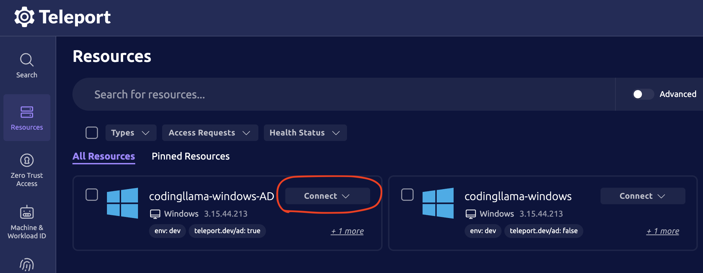
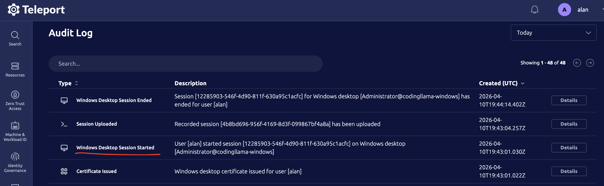
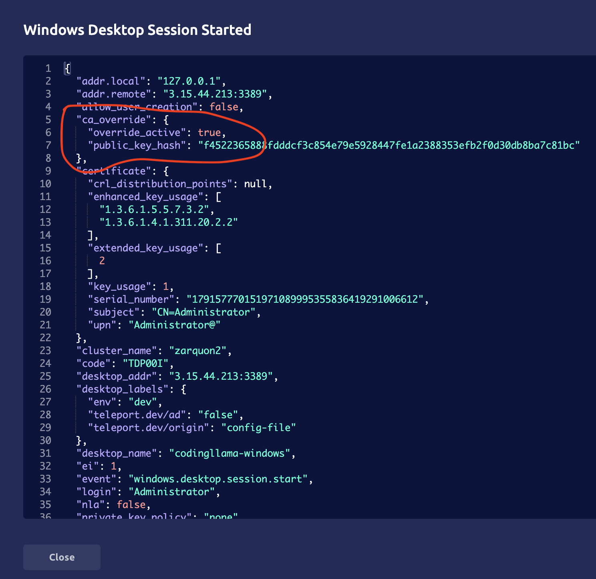

Certificate Authority Overrides allow a cluster admin to override a Teleport
CA's certificate with a distinct certificate, signed by an external authority.
In practice that Teleport CA becomes a Sub CA of an external trust chain.

CA private key management remains within Teleport. Overridden certificates must
target existing CA public keys, therefore CSRs for the overrides are generated
by Teleport.

The resource used to managed CA overrides is the `cert_authority_override`.

## Dev build limitations

<Admonition type="danger">
The CA override dev build must only be used in test environments. Do not use in
production.

It's strongly recommended that any overrides created by the dev build are
deleted before upgrading to the next release.
</Admonition>

CA overrides are currently implemented only in a dev build based on v18.7.4 -
`v18.8.0-dev.codingllama.1`.

As such, the build has certain limitations compared to what is planned for the
full release. Namely:

* Only `windows` overrides are functional.
  * You _may_ create `db_client` overrides, but they won't be used by Database
    Access.

* Commands that interact with CAs are not yet aware of overrides. For example:
  * `tctl get cas/windows` still returns the self-signed CA certificate. Use
    `tctl get ca_overrides/windows` to get override data.
  * CA rotation won't consider active overrides. The admin must be aware of
    active overrides and manually created new overrides, at the appropriate
    steps, in case of rotation.

* The build is generally more permissive with override creation and updates than
  the final release.
  * Overrides are not checked against current CA certificates. This includes the
    targeted public_key_hash and certificate timestamps.
  * Override disable protection is absent. Any override can be disabled or
    deleted, at any time.

* The following commands are not available:
  * `tctl auth create-override`
  * `tctl auth update-override`
  * `tctl auth delete-override`
  * (`tctl create/get/rm` _can_ interact with overrides, plus `tctl auth
    create-override-csr` and `tctl auth pub-key-hash` _do_ exist)

## Prerequisites

1. Make sure the cluster is fully upgraded to the dev build.

## Step 1. Prepare the override certificate CSR.

Prepare the CSR using `tctl`:

```code
$ tctl auth create-override-csr --type=windows
Wrote windows-$ABRIDGED_HASH-csr.pem
```

You may print the CSR PEM to stdout:

```code
$ tctl auth create-override-csr --type=windows --out='-'
-----BEGIN CERTIFICATE REQUEST-----
(...)
-----END CERTIFICATE REQUEST-----
```

You may also customize the certificate Subject:

```code
$ tctl auth create-override-csr --type=windows --subject='O=Foo Org,OU=Foo Org Unit,CN=Foo Windows CA'
```

If a CA has multiple active or additional_trusted_keys, then a CSR is created
for each key.

## Step 1.1. Prepare CSRs for multi-Auth, HSM-enabled clusters.

In multi-Auth, HSM-enabled clusters tctl must be locally executed against each
Auth instance, which generates CSRs for the keys that each Auth has access to.

For example:

```code
# Access the first Auth instance.
# Modify the command below as appropriate.
tsh ssh user@Auth1

# Generate the CSRs.
# Modify as desired.
tctl auth create-override-csr --type=windows

# Second Auth instance.
tsh ssh user@Auth2
tctl auth create-override-csr --type=windows

# So on.
```

When writing the override resource, make sure the final
`spec.certificate_overrides` contains one entry for each certificate generated
from those CSRs. See steps 4 and 4.1.

## Step 2. Issue override certificates using your external authority.

Using the CSRs from step 1, issue the override certificates using your external
authority.

The certificates must fulfill the following requirements:
* KeyUsage: keyCertSign and cRLSign
* BasicConstraintsValid: true
* IsCA: true
* Subject: the Teleport cluster name must be present in either the `O` field
  (first element) or in the OID `1.3.9999.4.1`.
  * CSR from step 1 will specify a valid Subject.

## Step 3. Configure downstream trust.

Using the certificates acquired in step 2, make sure to configure downstream
trust before proceeding.

For example, if overriding the `windows` CA, make sure your Windows hosts trust
the new certificates. Refer to the desktop access
[local](../../../enroll-resources/desktop-access/getting-started.mdx#step-14-prepare-windows)
or
[AD](../../../enroll-resources/desktop-access/active-directory.mdx#step-37-configure-a-gpo-to-allow-teleport-connections)
guides.

## Step 4. Create the certificate overrides.

Using the certificates from step 2 and having configured downstream trust, you
may now create the certificate overrides.

Take note of your cluster name:

```shell
$ tctl get cas/windows | yq '.spec.cluster_name'
mycluster
```

Prepare the `ca_override_windows.yaml` file. Modify it as indicated by the
snippet.

```yaml
kind: cert_authority_override
sub_kind: windows
version: v1
metadata:
  name: mycluster # REPLACE WITH YOUR ACTUAL CLUSTER NAME.
spec:
  certificate_overrides:
  - certificate: |-
      -----BEGIN CERTIFICATE-----
      REPLACE WITH THE OVERRIDE CERTIFICATE PEM
      -----END CERTIFICATE-----
```

Create the override:

```code
$ tctl create ca_override_windows.yaml
```

<Admonition type="tip">
You may create a disabled override and later enable it:

```yaml
kind: cert_authority_override
sub_kind: windows
version: v1
metadata:
  name: mycluster
spec:
  certificate_overrides:
  - certificate: |-
      -----BEGIN CERTIFICATE-----
      (...)
      -----END CERTIFICATE-----
    disabled: true # Edit and change to false to enable.
```
</Admonition>

## Step 4.1. Create certificate overrides on multi-Auth, HSM-enabled clusters.

In multi-Auth, HSM-enabled clusters each certificate_override entry must be
added by the corresponding Auth server instance (ie, the Auth that has access to
the relevant private key).

Start with an empty CA override, created by any Auth:

```yaml
kind: cert_authority_override
sub_kind: windows
version: v1
metadata:
  name: mycluster # REPLACE WITH YOUR ACTUAL CLUSTER NAME.
spec: {}
```

```code
$ tctl create ca_override_windows.yaml
```

Then, on each Auth instance, `tctl edit` the CA override and add the
corresponding certificate_override stanza:

```shell
# Modify the command below as appropriate.
tsh ssh user@Auth1

tctl edit ca_overrides/windows
```

```yaml
kind: cert_authority_override
sub_kind: windows
version: v1
metadata:
  name: mycluster
spec:
  certificate_overrides:
  - certificate: |-
      -----BEGIN CERTIFICATE-----
      ...
      -----END CERTIFICATE-----
# Add an entry for the new override, then close the edit window.
  - certificate: |-
      NEW OVERRIDE PEM HERE
```

In the release version the `tctl auth create-override` and `tctl auth
update-override` commands will streamline this process.

## Step 5. Exercise the CA override.

Assuming you created an override for the `windows` CA, exercise the override by
starting a new Desktop Access session from your Teleport Proxy.



If downstream trust is configured correctly for the override certificate, then
the session should start successfully.

To confirm override use inspect the "Windows Desktop Session Started" event for
the new session. You should see the "ca_override" stanza with "override_active:
true" and a corresponding "public_key_hash".





<details>
<summary>Windows Desktop Session Started example event</summary>
```yaml
{
  "ca_override": {
    "override_active": true,
    "public_key_hash": "f4522365888fdddcf3c854e79e5928447fe1a2388353efb2f0d30db8ba7c81bc"
  },
  "certificate": {
    "crl_distribution_points": null,
    "enhanced_key_usage": [
      "1.3.6.1.5.5.7.3.2",
      "1.3.6.1.4.1.311.20.2.2"
    ],
    "extended_key_usage": [
      2
    ],
    "key_usage": 1,
    "serial_number": "179157770151971089995355836419291006612",
    "subject": "CN=Administrator",
    "upn": "Administrator@"
  },
  "cluster_name": "mycluster",
  "code": "TDP00I",
  "desktop_name": "codingllama-windows",
  "ei": 1,
  "event": "windows.desktop.session.start",
  "login": "Administrator",
  "success": true,
  "user": "alan",
  "windows_user": "Administrator"
# etc
}
```
</details>
