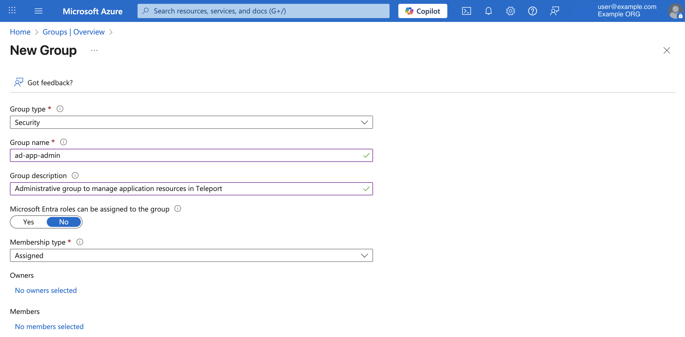
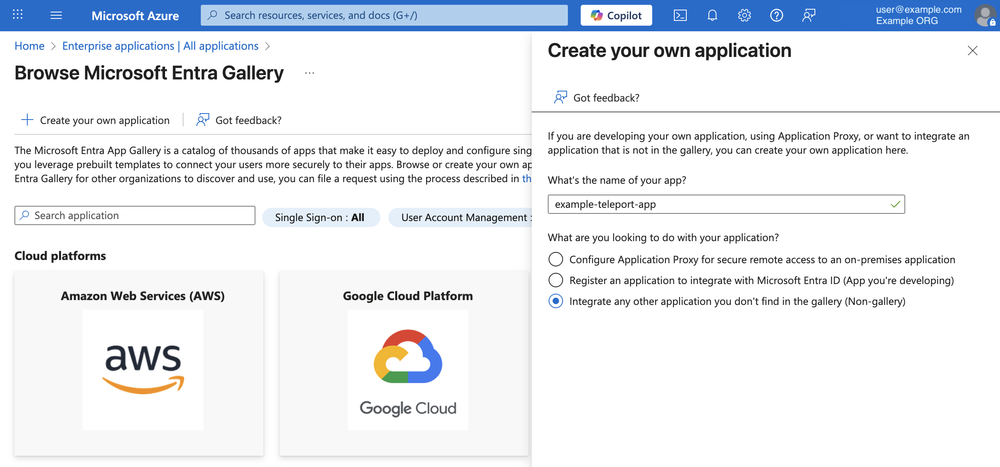
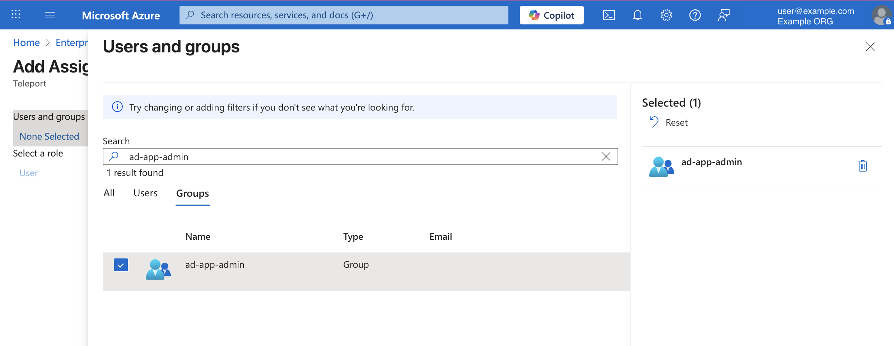
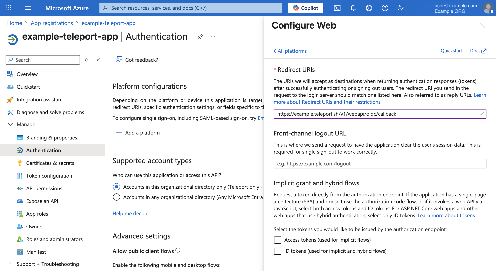
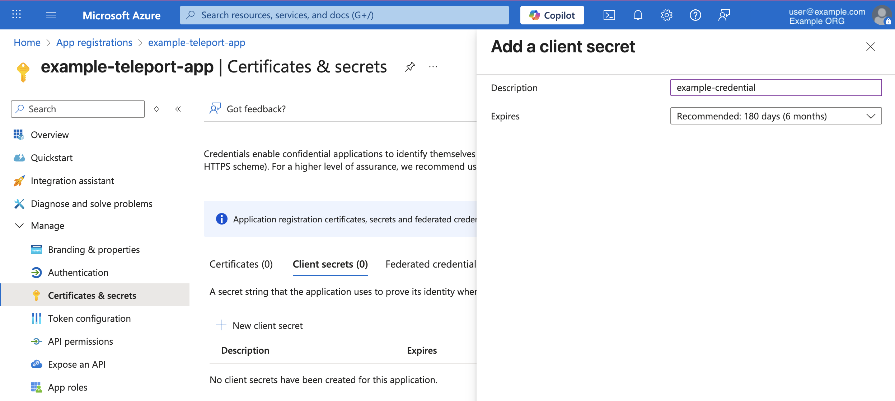
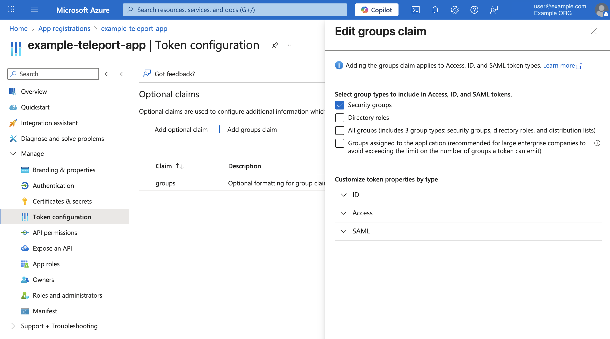
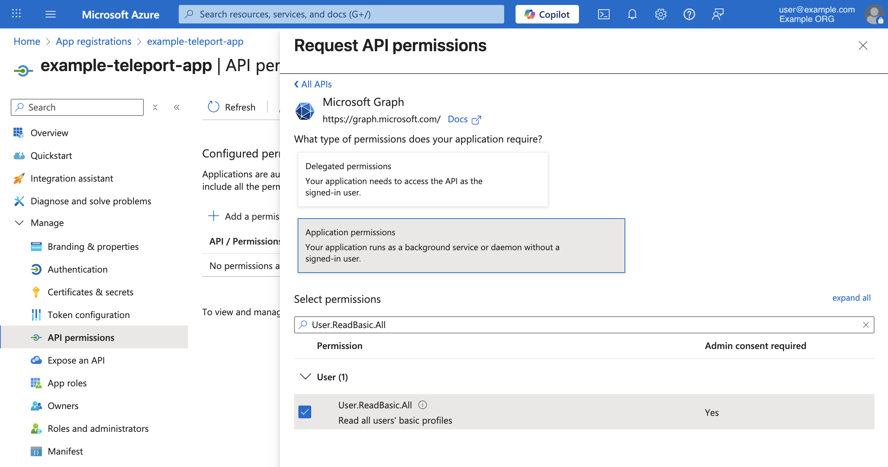

{/* vale 3rd-party-products.former-names = NO */}

This guide shows how to configure Microsoft Entra ID (formerly Azure AD) as an 
OIDC identity provider for Teleport. With this configuration, users can access 
Teleport by authenticating with Entra ID, and be granted with permissions to 
access or manage resource in Teleport based on their group membership in Entra ID.

{/* vale 3rd-party-products.former-names = YES */}

A SAML-based Entra ID IdP configuration version is available in this [guide](entra-id.mdx).

## How it works

In the Microsoft Entra ID tenant, you will create an enterprise application and
set it up as an OIDC identity provider for Teleport. You will also configure the
`groups` claim, which will be included in the user's OIDC ID Token. 

In Teleport, you will create an Auth Connector resource and set up Microsoft 
Entra ID as an OIDC identity provider. You will also map Entra ID groups to 
Teleport roles. 

When a user signs in to Teleport by authenticating with their Microsoft Entra ID
account, Teleport first creates a temporary user account with Teleport roles mapped
from `groups` claim and traits. Traits are user attributes (key-value format). 
Any claim that is present in the OIDC ID Token is preserved as user traits. 
Teleport then starts a new session for the user by issuing a pair of short-lived 
TLS and SSH certificates. These certificates encodes user's identity, 
roles and traits, which are evaluated to grant access in Teleport. 

To demonstrate Microsoft Entra ID group to Teleport role mapping, 
we will have two user groups created in the Microsoft Entra ID tenant: 
1. `ad-app-support`. We will map this group to Teleport preset `requester` role. 
    The preset `requester` role grants permission to request access to resources 
    that are enrolled in Teleport. 
2. `ad-app-admin`. We will map this group to Teleport preset `reviewer` and `editor` 
roles. The preset `editor` role grants permission to manage resource in Teleport. 
The preset `reviewer` grants permission to review access to resources in Teleport.

Instead of creating new groups, you may use an existing Microsoft Entra ID groups 
to follow this guide. 

## Prerequisites

- Permissions to create an enterprise application, configure and grant Microsoft 
  Graph API permissions and manage groups in the Microsoft Entra ID tenant.
- Teleport user with a preset `editor` role or an equivalent role that allows 
  you to read and write Auth Connectors, users and roles.
- (!docs/pages/includes/tctl.mdx!)

## Step 1/5. Create groups

<Admonition type="info" title="New Group">
  You may skip this step if you are using existing Microsoft Entra ID 
  groups to follow this guide.
</Admonition>

In the Azure portal, select the "Groups" menu which is available under the
"Azure services" menu. 

From the "Groups" UI, click the "New group" button to create a new user group 
named `ad-app-admin`.

 

You may add desired users to this group. 
Repeat this step to create another group named `ad-app-support`.

## Step 2/5. Create an enterprise application

In the Azure Portal, from the “Azure services” menu, select “Enterprise applications”.
Click on the `+ New Application` button, then click `+ Create your own application` 
button. Enter a name for your application and create the application.

 

## Step 3/5. Assign groups

In the Azure Portal, in the enterprise application UI, select the "Users and groups" 
menu, which can be located under the "Manage" menu.

In the "Users and groups" UI, click `+Add user/group` button. 

Now assign the two groups you created in Step 1. If you are following this guide 
with an existing user groups, select those groups in this step.

 

## Step 4/5. Configure OIDC

Configuring OIDC involves setting up a redirect URI for the relying party (Teleport 
in this case), setting up the OIDC claims and a client credential. 

These OIDC configurations are available in the "App registrations" service.

In the Azure Portal, from the “Azure services” menu, select "App registrations".
In the "App registrations" UI, search and select the enterprise application you 
created in Step 2.

### Configure redirect URI

In the "App registrations" UI for the enterprise application, from the “Manage” 
menu, select the “Authentication” menu. In this configuration UI, under the 
"Platform configurations" section, click `+ Add a platform` button. 

OIDC redirect URI for Teleport should point to the OIDC callback endpoint, which 
has the following URI format: `https://example.teleport.sh/v1/webapi/oidc/callback`.

Enter the Teleport Proxy Service hostname of your Teleport cluster below to 
generate the OIDC callback URI. Then copy and paste the value in the Azure Portal
to configure OIDC redirect URI. 
```code
https://<Var name="example.teleport.sh" />/v1/webapi/oidc/callback
```



Save the configuration once the redirect URI is configured.

### Set up client credentials 

Teleport uses the OIDC authorization code flow to exchange an OIDC authorization 
code for the user's ID Token. To exchange the ID Token, a client credential must 
be set up for Teleport. 

In the "App registrations" UI for the enterprise application, from the "Manage" 
menu, select "Certificates & secrets". Now select the "Client secrets" tab and 
click on the `+ New client secret` button. Create a new client secret. 



Once the secret is created, copy the value and save it in your working environment: 
```code 
$ echo 'secret value copied from entra id' > /tmp/client-secret
``` 

### Configure groups claims

You need to configure `groups` claim to configure access in Teleport.

In the "App registrations" UI for the enterprise application, from the "Manage" 
menu, select "Token configuration".

In the "Token configuration" UI, click `+ Add groups claim` button.

Select group type you wish to include in user's OIDC `groups` claim. 

The reference image below shows that a "Security groups" type is selected. 



You may configure other claims as desired. All the claims issued by Microsoft 
Entra ID are preserved as user's traits in the user resource.

### (Optional) Groups overage claim

{/* vale 3rd-party-products.former-names = NO */}

If user's group membership exceeds the 200 group limit, Microsoft Entra ID issues a
groups overage claim instead of the expected `groups` claim. The groups overage 
claim contains an Azure AD Graph API link, which indicates that the user's group 
membership is to be queried from the Microsoft Graph API. 

{/* vale 3rd-party-products.former-names = YES */}

If your user's group membership do not exceed the group limit, you can skip this
step. Otherwise, you will need to grant Teleport with a Microsoft Graph API 
permission so it can retrieve user's group membership using the Microsoft 
Graph API. 

To query user's group membership, Teleport requires `User.ReadBasic.All` permission.
To grant this permission, in the "App registrations" UI for the enterprise 
application, from the "Manage" menu, select "API permissions".

Next, click `+ Add a permission` button and then select "Microsoft APIs > Microsoft Graph >
Application permissions". In the permission filter search bar, type `User.ReadBasic.All`.

Select the permission and add it to the application by clicking on the `Add permissions` button.



Once you add the permission, you will need to grant an admin consent.

In the same "API permissions" UI, click the `Grant admin consent` button.

A consent confirmation prompt will appear, click "Yes" to grant the consent. 

The Graph API permission to fetch user's group membership is now configured.
Should the user's group membership exceed 200 groups, Teleport will follow through 
the groups overage claim issued by Entra ID and fetch user's groups detail using the 
Microsoft Graph API. 

## Step 5/5. Create an OIDC connector 

Before creating the Auth Connector resource, its useful to first generate the 
configuration spec and test the configuration.

The Auth Connector spec can be configured by using the `tctl sso configure`
command. We will show you how to run the command with the following flags:

- `--name`: Teleport resource name for the Microsoft Entra ID Auth Connector. 
- `--display`: Display name for the Microsoft Entra ID Auth Connector
- `--issuer-url`: Microsoft Entra ID OIDC issuer URL. You need your Microsoft Entra 
  ID tenant ID to configure this URL. Assign it to <Var name="Entra ID tenant ID" />.
- `--id`: The application (client) ID of the enterprise application you created in 
  Step 2. This value can be copied from the "Overview" section of the enterprise 
  application in the Azure Portal. Assign it to <Var name="Enterprise application client ID" />.
- `--secret`: The client secret we created in Step 4.
- `--claims-to-roles`: A mapping of OIDC claims/values to be associated with
  Teleport roles. Note that the Entra ID `groups` claim includes group's object
  ID. As such, you will need to map groups by using groups object ID. Assign
  <Var name="Object ID of ad-app-admin group" /> to the object ID ot
  `ad-app-admin` and <Var name="Object ID of ad-app-support group" /> to the
  object ID of `ad-app-support`:

```code
$ tctl sso configure oidc --name "entra-id" \
  --display "Entra ID" \
  --issuer-url https://login.microsoftonline.com/<Var name="Entra ID tenant ID" />/v2.0 \
  --id <Var name="Enterprise application client ID" /> \
  --secret $(cat /tmp/client-secret) \
  --claims-to-roles groups,<Var name="Object ID of ad-app-admin group" />,editor,reviewer \
  --claims-to-roles groups,<Var name="Object ID of ad-app-support group" />,requester \
  --scope openid \
  --scope email \
  --scope profile > entraid-oidc-connector.yaml
```

<details>
<summary>Example YAML Auth Connector resource file created by the `tctl sso configure` command</summary>

```yaml
kind: oidc
metadata:
  name: entra-id
spec:
  claims_to_roles:
  - claim: groups
    roles:
    - editor
    - reviewer
    value: da770259-8007-42da-a9c2-3b366a88bc1c
  - claim: groups
    roles:
    - requester
    value: ed5763df-9465-45e8-b10b-06a8979b072e
  client_id: d40666f7-3352-43e8-a8ad-b75e7a0a7be3
  client_secret: example-secret-value
  display: Entra ID
  issuer_url: https://login.microsoftonline.com/0297d2f3-62c3-4598-aaa1-2104929ba73c/v2.0
  redirect_url: https://<Var name="example.teleport.sh" />:443/v1/webapi/oidc/callback
  scope:
  - openid
  - email
  - profile
version: v3
```

</details>


Now test the connector resource by piping the file to `tctl sso test` command:

```code
$ cat entraid-oidc-connector.yaml | tctl sso test
```
If the configuration test fails, the `tctl sso test` command will print helpful 
information to debug the issue.

By default, Teleport expects an `email` claim to be present in the OIDC claim. 
The value from the `email` claim is used as a username in Teleport. If you wish 
to use another claim to configure username, you can override the 
default expected `email` claim with the `username_claim` field in the Auth 
Connector spec. 

The example below shows configuring the `username_claim` field with `preferred_username`
value. This will configure Teleport to query `preferred_username` claim instead 
of the `email` claim. 
```yaml
kind: oidc
metadata:
  name: entra-id
spec:
  ... # other fields not displayed for brevity
  username_claim: preferred_username
```

<Admonition type="warning" title="Username claim">
  Ensure that the claim value you use to configure `username_claim` is a uniquely
  identifiable value for the user. 
</Admonition>

If the configuration is working for you, proceed creating the connector resource 
by using the `tctl create` command:

```code
$ tctl create -f entraid-oidc-connector.yaml
```

The Auth Connector resource for Microsoft Entra ID is now configured.

## FAQ

### I want to customize how Teleport follows the groups overage claim

Groups overage claim setting can be customized by using the `entra_id_groups_provider`
field in the Auth Connector spec.

```yaml
kind: oidc
metadata:
  name: entra-id
spec:
  ... # other fields not displayed for brevity
  entra_id_groups_provider: 
    disabled: false # set value to "true" to turn off the groups overage claim 
    group_type: "security-groups" # can be "directory-roles", "all-groups"
    graph_endpoint: "https://graph.microsoft.com" # update this value to point to another official Graph API endpoint
```

## Troubleshooting

(!docs/pages/includes/sso/loginerrortroubleshooting.mdx!)

### Identity provider callback failed, missing parameter "Name"

Teleport uses the `email` claim as user's username. 
This error indicates that an `email` claim was not found in user's OIDC ID Token
claims.

This can happen if the user does not have a domain verified email account.

Alternatively, you can update the connector spec to use a different claim value
(must be a uniquely identifiable value) as an alternative of `email` claim.

Example:
```yaml
kind: oidc
metadata:
  name: entra-id
spec:
  ... # other fields not displayed for brevity
  username_claim: oid
```

### oid claim not found

The user may receive this error if a groups overage claim was issued for the user but 
Teleport could not find the `oid` claim.

To resolve this, ensure that the `profile` scope is configured in the Auth Connector.
```yaml
kind: oidc
metadata:
  name: entra-id
spec:
  ... # other fields not displayed for brevity
  scope:
  - openid
  - email
  - profile
```

## Next steps

- Learn more about other [OIDC](oidc.mdx#oidc-connector-configuration) related 
  configurations that Teleport supports.
- Learn more about [Role and Resource Access Requests](../../identity-governance/access-requests/access-requests.mdx).
- Learn more about [role templates](../rbac-get-started/role-templates.mdx).
- [Teleport Configuration Resources
  Reference](../../reference/infrastructure-as-code/resources.mdx)
