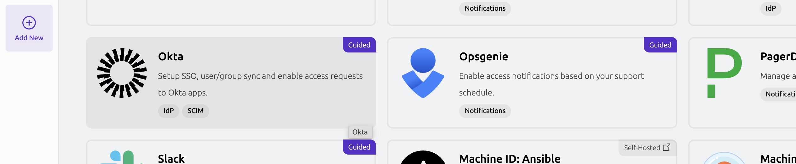
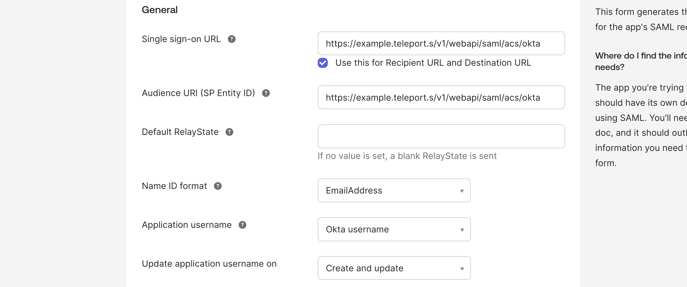
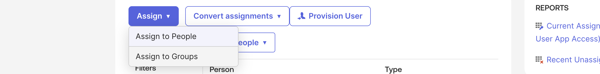

This guide covers how to configure [Okta](https://www.okta.com/) to provide
single sign on (SSO) identities to Teleport Enterprise and Teleport Enterprise
Cloud. When used in combination with role-based access control (RBAC), this allows
Teleport administrators to define policies like:

- Only members of the "DBA" group can access PostgreSQL databases.
- Developers must never SSH into production servers.
- Members of the HR group can view audit logs but not production environments.

<details>
<summary>Automated SSO connection with Okta integration</summary>

In Teleport Enterprise Cloud and Self-Hosted Teleport Enterprise, Teleport can automatically
configure an SSO connector as part of [enrolling Okta
integration](../../../identity-governance/integrations/okta/okta.mdx).

To start Okta integration enrollment, visit the Teleport Web UI, click **Add New** in the left sidebar and click **Integration**:



Then follow the instructions for the [guided Okta single sign-on integration](../../../identity-governance/integrations/okta/guided-sso.mdx).


</details>

## How it works

(!docs/pages/includes/sso/how-it-works.mdx idp="Okta"!)

## Prerequisites

- An Okta account with admin access. Your account must include users and at
  least two groups. If you don't already have Okta groups you want to assign to
  Teleport roles don't worry, we'll create example groups below.

(!docs/pages/includes/edition-prereqs-tabs.mdx edition="Teleport Enterprise"!)

- A Teleport role with access to edit and maintain `saml` resources. This is
  available in the default `auditor` and `editor` roles.

## Step 1/3. Configure Okta

Okta indicates a user's group membership as a SAML assertion in the data it
provides to Teleport. We will configure Teleport to assign the "access" role to
members of the `devs` Okta group, and the preset "auditor" and "editor" roles to members of
the `admins` group.

If you already have Okta groups you want to assign to "access", "auditor" and "editor" roles in
Teleport, you can skip to the [next step](#step-13-configure-okta).

### Create Groups

Create two groups: "devs" and "admins".

1. In Okta Console go to the go to **Directory** -> **Groups**, then click **Add group**.
2. Add groups "devs" and "admins" with optional description.


### Create and configure an Okta app

Okta Integration Network support is still in beta. If unsure please proceed with the Custom SAML 2.0 app.

<Tabs groupId="saml-app" defaultValue="legacy">
<TabItem label="Okta Integration Network" value="oin">

  Add Teleport app to Okta:

  1. In Okta Console, go to **Applications**.
  2. Click **Browse App Catalog**.
  3. Search for and select **Teleport**, and then click **Add Integration**.
  4. Complete the fields on the settings page and click **Done**.
  5. Go to the **General** tab and click **Edit** on the top-right corner of the tab.
  6. Scroll down to the `groups` attribute, then select `Match regex` and type in `.*` in the input field.

    {/* NOTE: This image is shared in multiple guides. */}
    

  7. Scroll down and click **Save**.

</TabItem>
<TabItem label="Custom SAML 2.0 app (legacy)" value="legacy">

  <Admonition type="note">
  Please note this is a legacy way of setting up the Teleport SSO app. The preferred way is to use Okta Integration Network app.
  </Admonition>

  1. In Okta Console, go to **Applications**.

  2. Click **Create App Integration**.

  3. Select "SAML 2.0" and click **Next**.

  4. Give your app a name, e.g. "Teleport" and optionally upload a logo and click **Next**.

  5. That will bring you to the "Configure SAML" step where you'll have to provide a several values:

     - Single sign on URL:

       ```
       https://<Var name="example.teleport.sh" />/v1/webapi/saml/acs/okta
       ```

     - Audience URI (SP Entity ID):

       ```
       https://<Var name="example.teleport.sh" />/v1/webapi/saml/acs/okta
       ```

     - Name ID format `EmailAddress`

     - Application username `Okta username`

     {/* NOTE: This image is shared in multiple guides. */}
     

  6. In the same "Configure SAML" setup screen, scroll down to the **Group Attribute Statements (optional)** section and setup it like so:

     - Name: `groups` | Name format: `Unspecified`
     - Filter: `Matches regex` |  `.*`

     {/* NOTE: This image is shared in multiple guides. */}
     

  7. Click **Next**. That will bring you to the "Feedback" step where you can just click **Finish**.

  Notice that we have set "NameID" to the email format and mapped the groups with
  a wildcard regex in the Group Attribute statements. We have also set the "Audience"
  and SSO URLs to the same value. This is so Teleport can read and use Okta users'
  email addresses to create their usernames in Teleport, instead of relying on additional
  name fields.

</TabItem>
</Tabs>

### Assign user groups

1. In the same Okta Teleport app, go to the **Assignments** tab and click the **Assign** dropdown.

2. Select "Assign to Groups" and search for the "devs" and "admins" Okta groups created in the previous step.

3. Click **Assign** next to each selected group and click **Done**.

   {/* NOTE: This image is shared in multiple guides. */}
   

### Save IdP metadata path

1. Go to the **Sign On** tab and scroll down to "Metadata URL".

2. Copy the Metadata URL using the **Copy** button below it.

   {/* NOTE: This is a shared image. When making changes check other guides using this image. */}
   

3. Store the URL to the metadata file for later use.

## Step 2/3. Connect Okta to Teleport

In this section, you will create an authentication connector that provides
Teleport with the information it needs to exchange SAML messages with Okta and
issue certificates to users.

### Assign a role mapping

(!docs/pages/includes/sso/role-mapping.mdx fieldType="attribute"!)

### Configure a SAML connector

Define an Okta SAML connector using `tctl`. Update this example command with
the path to your metadata file, and edit the `--attributes-to-roles` values for
custom group assignment to roles. See [tctl sso configure
saml](../../../reference/cli/tctl.mdx) for a full reference of
flags for this command:

```code
$ tctl sso configure saml --preset=okta \
--entity-descriptor "https://example.okta.com/app/000000/sso/saml/metadata" \
--attributes-to-roles=<Var name="mapping_1" /> \
--attributes-to-roles=<Var name="mapping_2" /> > okta-connector.yaml
```

The contents of `okta-connector.yaml` should resemble the following:

```yaml
kind: saml
metadata:
  name: okta
spec:
  acs: https://teleport.example.com:443/v1/webapi/saml/acs/okta
  attributes_to_roles:
  - name: groups
    roles:
    - auditor
    - editor
    value: admins
  - name: groups
    roles:
    - access
    value: dev
  audience: https://teleport.example.com:443/v1/webapi/saml/acs/okta
  cert: ''
  display: 'Okta'
  entity_descriptor: ''
  entity_descriptor_url: https://example.okta.com/app/000000/sso/saml/metadata
  issuer: ''
  service_provider_issuer: https://teleport.example.com:443/v1/webapi/saml/acs/okta
  sso: ''
version: v2
```

(!docs/pages/includes/sso/idp-initiated.mdx!)

### Test the connector

You can test the connector before applying it to your cluster. This is strongly
encouraged to avoid interruption to active clusters:

```code
$ cat okta-connector.yaml | tctl sso test
If browser window does not open automatically, open it by clicking on the link:
 http://127.0.0.1:52519/0222b1ca...
Success! Logged in as: alice@example.com
--------------------------------------------------------------------------------
Authentication details:
   roles:
   - auditor
   - editor
   - access
   traits:
     groups:
     - Everyone
     - admins
     - devs
     username:
     - alice@example.com
   username: alice@example.com
--------------------------------------------------------------------------------
[SAML] Attributes to roles:
- name: groups
  roles:
  - auditor
  - editor
  value: admins
- name: groups
  roles:
  - dev
  value: devs

--------------------------------------------------------------------------------
[SAML] Attributes statements:
groups:
- Everyone
- admins
- devs
username:
- alice@example.com

--------------------------------------------------------------------------------
For more details repeat the command with --debug flag.
```

Create the connector using `tctl`:

```code
$ tctl create okta-connector.yaml
```

## Step 3/3. Configure authentication preferences

(!docs/pages/includes/sso/cap.mdx type="saml"!)

## Testing

The Web UI now contains a new "Okta" button at the login screen. To
authenticate via the `tsh` CLI, specify the Proxy Service address and `tsh` will
automatically use the default authentication type:

```code
$ tsh login --proxy=proxy.example.com
```

This command prints the SSO login URL (and will try to open it automatically
in a browser).

<Admonition  type="tip">
Teleport can use multiple SAML connectors. In this case a connector name
can be passed via the `--auth` flag. For the connector we created above:

```code
$ tsh login --proxy=proxy.example.com --auth=okta
```

</Admonition>

## Next steps

(!docs/pages/includes/sso/next-step-traits.mdx!)

## Troubleshooting

(!docs/pages/includes/sso/loginerrortroubleshooting.mdx!)
