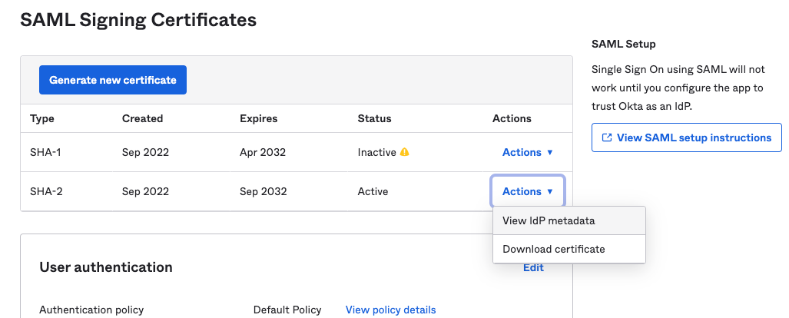

This guide covers how to configure [Okta](https://www.okta.com/) to provide
single sign on (SSO) identities to Teleport Enterprise and Teleport Enterprise
Cloud. When used in combination with role-based access control (RBAC), this allows
Teleport administrators to define policies like:

- Only members of the "DBA" group can access PostgreSQL databases.
- Developers must never SSH into production servers.
- Members of the HR group can view audit logs but not production environments.

<details>
<summary>Automated SSO connection with Okta integration</summary>

In Teleport Enterprise Cloud and Self-Hosted Teleport Enterprise, Teleport can
automatically configure an SSO connector for you when as part of [enrolling the
hosted Okta integration](../../identity-governance/integrations/okta/okta.mdx).

You can enroll the Okta integration from the Teleport Web UI.

Visit the Teleport Web UI, click **Add New** in the left sidebar and click **Integration**:


On the "Select Integration Type" menu, click the Okta tile. Teleport will then
guide you through configuring the Okta integration.

</details>

## How it works

(!docs/pages/includes/sso/how-it-works.mdx idp="Okta"!)

## Prerequisites

- An Okta account with admin access. Your account must include users and at
  least two groups. If you don't already have Okta groups you want to assign to
  Teleport roles don't worry, we'll create example groups below.

(!docs/pages/includes/edition-prereqs-tabs.mdx edition="Teleport Enterprise"!)

- A Teleport role with access to edit and maintain `saml` resources. This is
  available in the default `editor` role.

## Step 1/3. Configure Okta

Okta indicates a user's group membership as a SAML assertion in the data it
provides to Teleport. We will configure Teleport to assign the "dev" role to
members of the `okta-dev` Okta group, and the preset "editor" role to members of
the `okta-admin` group.

If you already have Okta groups you want to assign to "dev" and "editor" roles in
Teleport, you can skip to the [next step](#step-13-configure-okta).

### Create Groups

Create two groups: "okta-dev" and "okta-admin". In the Okta dashboard go to the
navigation bar and click **Directory** -> **Groups**, then **Add group**:


Repeat for the admin group:


In this section we will create an application in the Okta dashboard to allow our
Teleport cluster to access Okta as an IdP provider. We'll also locate the
address that Okta uses to provides their IdP metadata to Teleport.

### Create Okta SAML 2.0 App

From the main navigation menu, select **Applications** -> **Applications**, and click
**Create App Integration**. Select SAML 2.0, then click **Next**.


On the next screen (**General Settings**), provide a name and optional logo for
your new app, then click **Next**. This will bring you to the **Configure SAML** section.

### Configure the App

Provide the following values to their respective fields:

#### General

Replace <Var name="example.teleport.sh:443" /> with your Teleport Proxy Service
or Enterprise Cloud account domain and port (`443` by default). If you have a
self-hosted cluster with multiple public addresses for the Teleport Proxy
Service (the value of `proxy_service.public_addr` in the Teleport configuration
file), ensure that this address points to the first one listed.

- Single sign on URL:

  ```
  https://<Var name="example.teleport.sh:443" />/v1/webapi/saml/acs/okta
  ```

- Audience URI (SP Entity ID):

  ```
  https://<Var name="example.teleport.sh:443" />/v1/webapi/saml/acs/okta
  ```

- Name ID format `EmailAddress`

- Application username `Okta username`

#### Attribute Statements

- Name: `username`  | Name format: `Unspecified` | Value: `user.login`

#### Group Attribute Statements

We will map our Okta groups to SAML attribute statements (special signed metadata
exposed via a SAML XML response), so that Teleport can discover a user's group
membership and assign matching roles.

- Name: `groups` | Name format: `Unspecified`
- Filter: `Matches regex` |  `.*`

The configuration page should now look like this:


The "Matches regex" filter requires the literal string `.*` in order to match all
content from the group attribute statement.

Notice that we have set "NameID" to the email format and mapped the groups with
a wildcard regex in the Group Attribute statements. We have also set the "Audience"
and SSO URLs to the same value. This is so Teleport can read and use Okta users'
email addresses to create their usernames in Teleport, instead of relying on additional
name fields.

Once you've filled the required fields, click **Next**, then finish the app creation wizard.

### Group assignment

From the **Assignments** tab of the new application page, click **Assign**.  Assign the user groups
which can access to the app. Users being members of those groups will have the SSO access to
Teleport once the Auth Connector is configured.


### Save IdP metadata path

Okta provides an IdP metadata block, used by clients to identify and verify it
as a trusted source of user identity.

Since Okta serves this content over HTTPS we can configure Teleport to use this
path instead of a local copy, which can go stale.

From the app's **Sign On** tab, scroll down to **SAML Signing Certificates**.
Click **Actions** for the SHA-2 entry, then "View IdP metadata":



Copy the URL to the metadata file for use in our Teleport configuration.

<Admonition type="tip">
You can also right click on the "View IdP metadata" link and select
"Copy Link" or "Copy Link Address".
</Admonition>

## Step 2/3. Connect Okta to Teleport

In this section, you will create an authentication connector that provides
Teleport with the information it needs to exchange SAML messages with Okta and
issue certificates to users.

### Assign a role mapping

(!docs/pages/includes/sso/role-mapping.mdx fieldType="attribute"!)

### Configure a SAML connector

Define an Okta SAML connector using `tctl`. Update this example command with
the path to your metadata file, and edit the `--attributes-to-roles` values for
custom group assignment to roles. See [tctl sso configure
saml](../../reference/cli/tctl.mdx) for a full reference of
flags for this command:

```code
$ tctl sso configure saml --preset=okta \
--entity-descriptor "https://example.okta.com/app/000000/sso/saml/metadata" \
--attributes-to-roles=<Var name="mapping_1" /> \
--attributes-to-roles=<Var name="mapping_2" /> > okta-connector.yaml
```

The contents of `okta-connector.yaml` should resemble the following:

```yaml
kind: saml
metadata:
  name: okta
spec:
  acs: https://teleport.example.com:443/v1/webapi/saml/acs/okta
  attributes_to_roles:
  - name: groups
    roles:
    - editor
    value: okta-admin
  - name: groups
    roles:
    - dev
    value: okta-dev
  audience: https://teleport.example.com:443/v1/webapi/saml/acs/okta
  cert: ""
  display: "Okta"
  entity_descriptor: ""
  entity_descriptor_url: https://example.okta.com/app/000000/sso/saml/metadata
  issuer: ""
  service_provider_issuer: https://teleport.example.com:443/v1/webapi/saml/acs/okta
  sso: ""
version: v2
```

(!docs/pages/includes/sso/idp-initiated.mdx!)

### Test the connector

You can test the connector before applying it to your cluster. This is strongly
encouraged to avoid interruption to active clusters:

```code
$ cat okta-connector.yaml | tctl sso test
If browser window does not open automatically, open it by clicking on the link:
 http://127.0.0.1:52519/0222b1ca...
Success! Logged in as: alice@example.com
--------------------------------------------------------------------------------
Authentication details:
   roles:
   - editor
   - dev
   traits:
     groups:
     - Everyone
     - okta-admin
     - okta-dev
     username:
     - alice@example.com
   username: alice@example.com
--------------------------------------------------------------------------------
[SAML] Attributes to roles:
- name: groups
  roles:
  - editor
  value: okta-admin
- name: groups
  roles:
  - dev
  value: okta-dev

--------------------------------------------------------------------------------
[SAML] Attributes statements:
groups:
- Everyone
- okta-admin
- okta-dev
username:
- alice@example.com

--------------------------------------------------------------------------------
For more details repeat the command with --debug flag.
```

Create the connector using `tctl`:

```code
$ tctl create okta-connector.yaml
```

## Step 3/3. Configure authentication preferences

(!docs/pages/includes/sso/cap.mdx type="saml"!)

## Testing

The Web UI now contains a new "Okta" button at the login screen. To
authenticate via the `tsh` CLI, specify the Proxy Service address and `tsh` will
automatically use the default authentication type:

```code
$ tsh login --proxy=proxy.example.com
```

This command prints the SSO login URL (and will try to open it automatically
in a browser).

<Admonition  type="tip">
Teleport can use multiple SAML connectors. In this case a connector name
can be passed via the `--auth` flag. For the connector we created above:

```code
$ tsh login --proxy=proxy.example.com --auth=okta
```

</Admonition>

## Next steps

(!docs/pages/includes/sso/next-step-traits.mdx!)

## Troubleshooting

(!docs/pages/includes/sso/loginerrortroubleshooting.mdx!)
