SAML signing certificates are used by the identity provider to sign SAML assertions, 
and Teleport verifies the signature to authenticate users. Certificates have a fixed 
validity period, after which they expire, and SSO will no longer work. The default lifetime
for these certificates is set by the identity provider, for example Entra ID (3 years)
or Okta (10 years).

When a signing certificate is expiring or expired, Teleport raises a cluster alert with
details about the certificate that needs to be rotated.

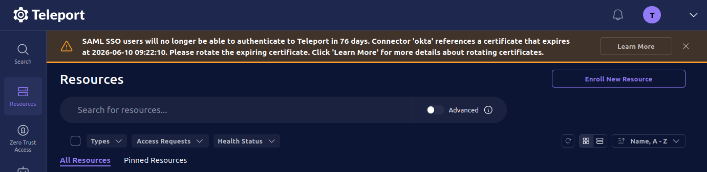

## How to update the certificate in Teleport

The `entity_descriptor` field on a SAML connector stores the metadata from the identity 
provider, including any signing certificates.

For detailed steps on generating and activating certificates in your identity provider,
including how to obtain the metadata XML or URL, see 
[How to rotate a SAML certificate](#how-to-rotate-a-saml-certificate) below.

There are two methods for updating the rotated certificate in Teleport:

### Using the `entity_descriptor_url` (recommended)

The `entity_descriptor_url` field on a SAML connector stores the metadata URL from 
the identity provider. When the SAML connector is saved with this field, the 
`entity_descriptor` field will be automatically populated with data from the identity 
provider at save time.

1. Navigate to your identity provider and find the metadata URL; save it for later
1. In the Teleport web UI, navigate to **Zero Trust Access** > **Auth Connectors**, 
find your SAML connector, and click **Edit**
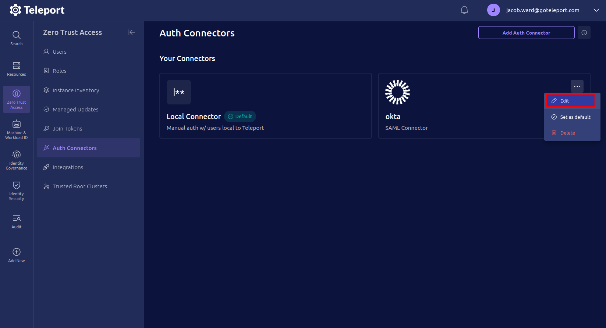
1. Observe that the connector has an `entity_descriptor_url` field and an 
`entity_descriptor` field populated with the identity provider metadata
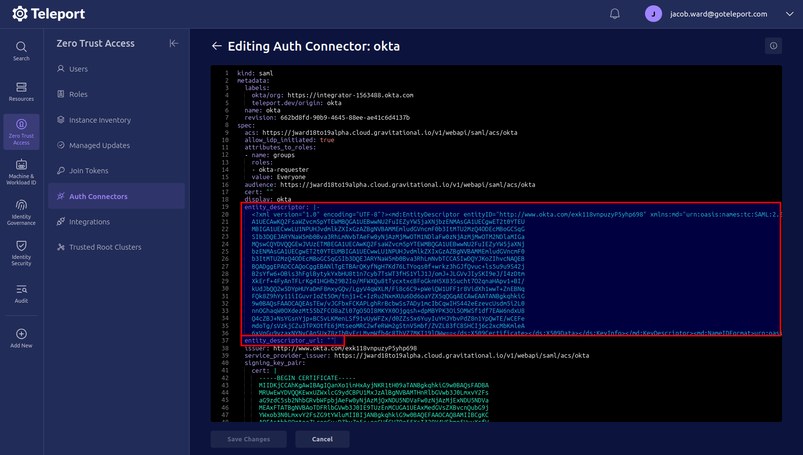
1. Populate the `entity_descriptor_url` field with the metadata URL from your identity 
provider and delete the `entity_descriptor` field and its contents, then save the connector
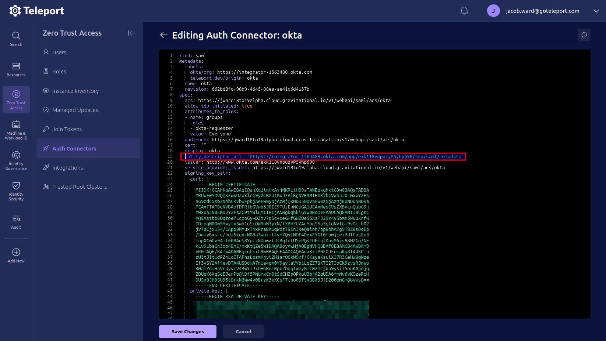
1. Observe that the `entity_descriptor` field is repopulated with fresh metadata from
the identity provider, including the rotated certificate
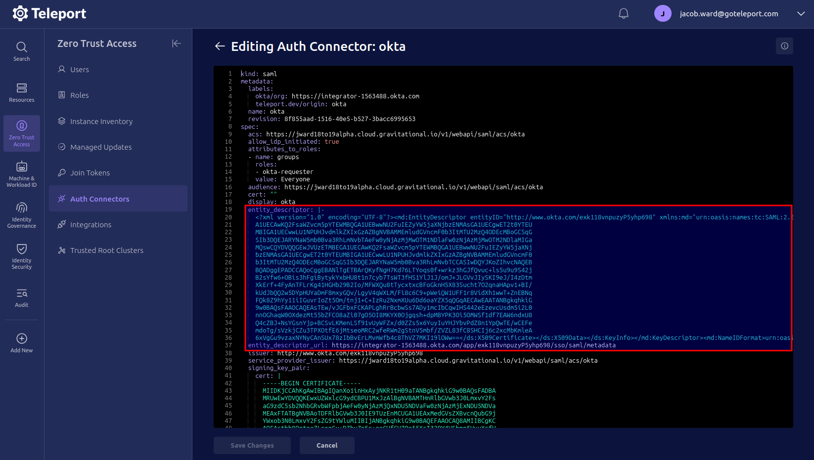
1. Return to your identity provider, activate the new certificate and remove the old one

### Manually updating the `entity_descriptor`

In the absence of a populated `entity_descriptor_url` field, the `entity_descriptor` 
field can be manually populated.

1. Navigate to your identity provider and find the metadata XML file; save it for later
1. In the Teleport web UI, navigate to **Zero Trust Access** > **Auth Connectors**,
find your SAML connector, and click **Edit**

1. Replace the contents of the `entity_descriptor` field with the contents of the 
metadata XML file saved in the first step, then save the connector
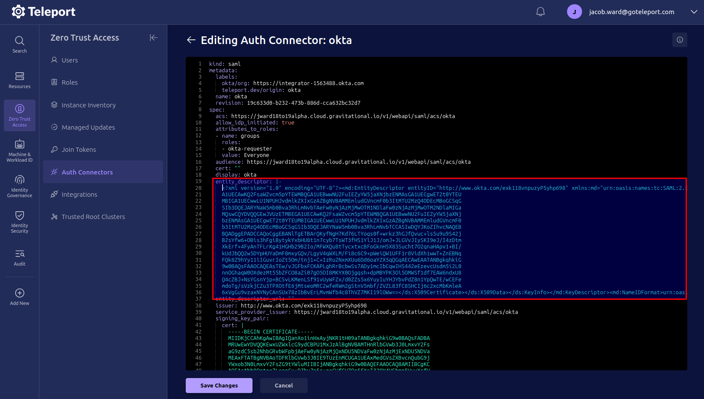
1. Return to your identity provider, activate the new certificate and remove the old one

## How to rotate a SAML certificate

Rotating a certificate involves creating a new certificate in your identity provider,
updating Teleport to trust it, then activating it in the identity provider and removing
the old one.

<Admonition type="warning" title="Update Teleport before activating">
  You must update Teleport to trust the new certificate before activating it in the
  identity provider. 
  Activating before updating Teleport will cause SSO to break.
  See [How to update the certificate in Teleport](#how-to-update-the-certificate-in-teleport).
</Admonition>

### Entra ID

In Entra ID, SAML signing certificates are managed in the Enterprise Application configuration.

#### Create the certificate

1. Log in to Microsoft Entra admin center
1. Navigate to **Enterprise apps** > **All applications**, and select the SAML app
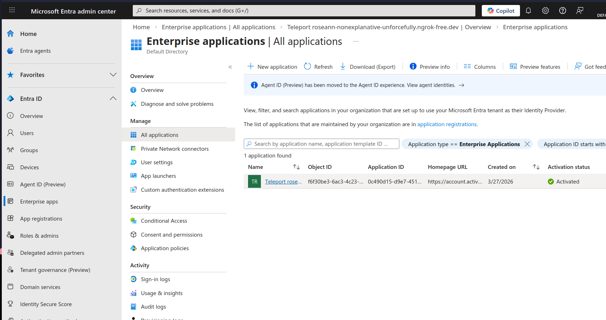
1. Go to **Single sign-on** and scroll to the **SAML Certificates** section, then click 
the **Edit** button under **Token signing certificate**
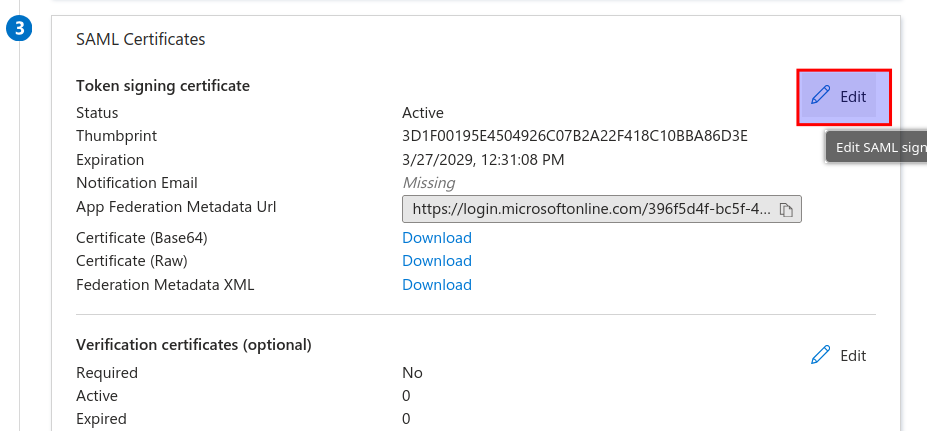
1. Click the **New Certificate** button, then click the **Save** button
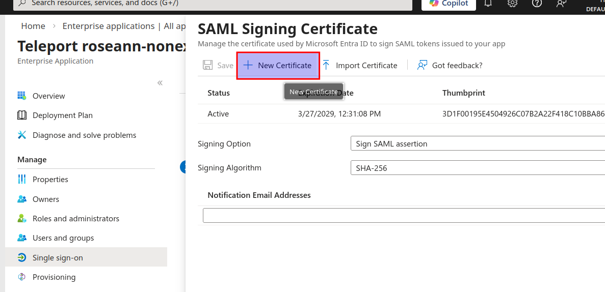
1. Either copy the metadata URL or download the metadata XML, which will be needed to update 
Teleport:
   - Scroll to the **SAML Certificates** section of the **Single sign-on** page and copy 
   the metadata URL from the **App Federation Metadata Url** field
   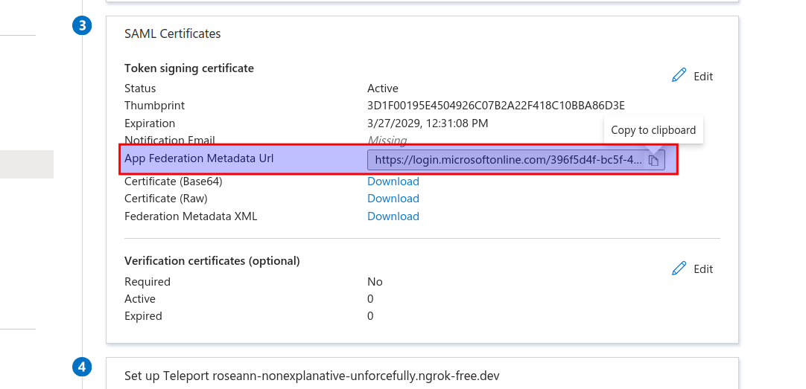
   - Select the **Download federated certificate XML** item for the new certificate entry
   to download the metadata XML
   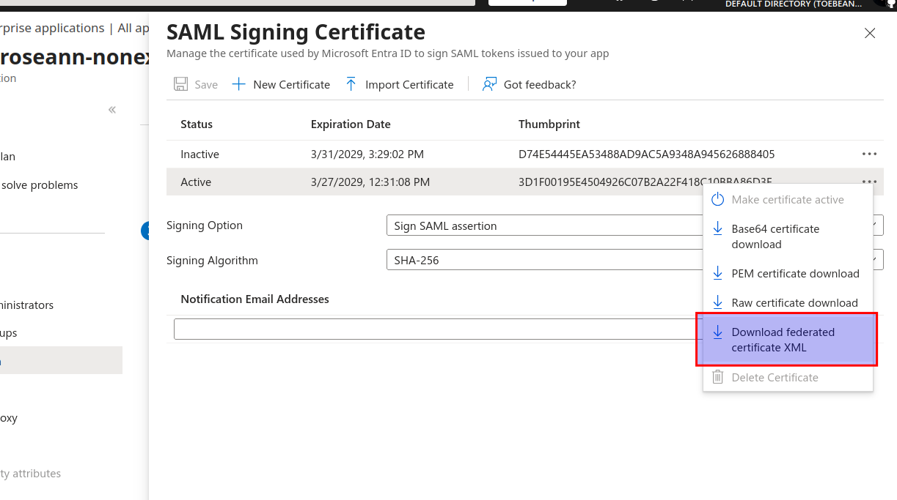

#### Activate the certificate

1. Scroll to the **SAML Certificates** section of the **Single sign-on** page and click 
the **Edit** button under **Token signing certificate**
1. Find your newly created certificate and select **Make certificate active**
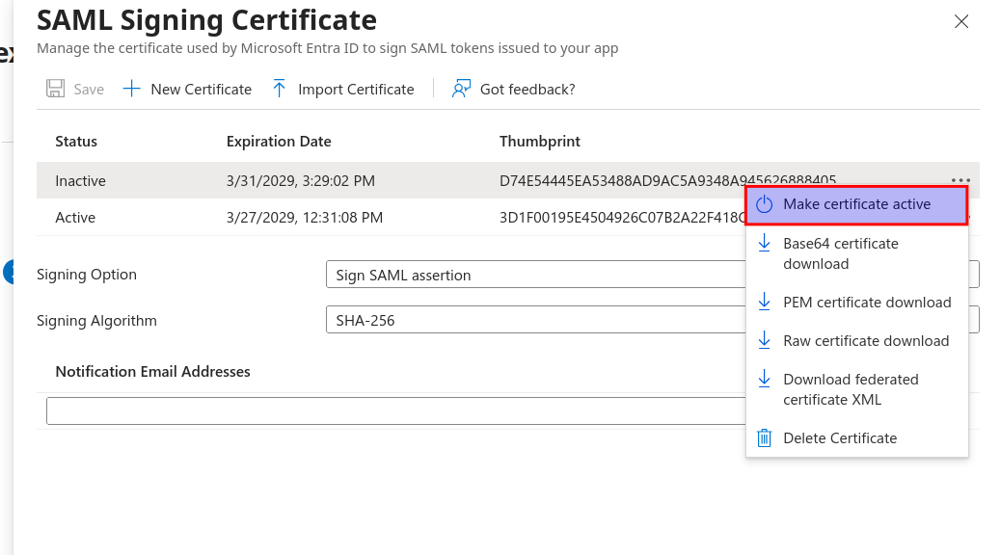
1. When you have confirmed SSO is working, remove the old certificate by selecting
**Delete Certificate**
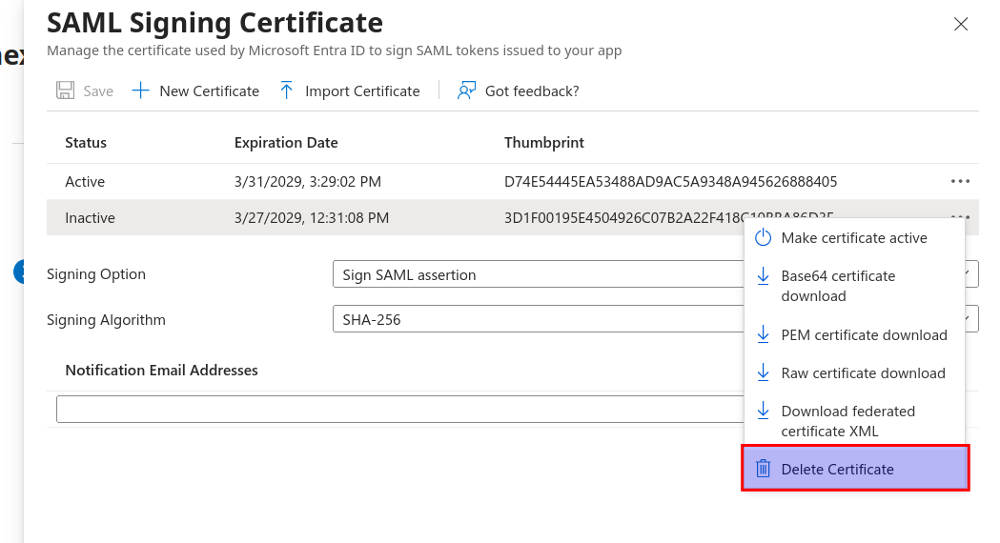

### Okta

In Okta, SAML signing certificates are managed under the **Sign On** tab for the application.

#### Create the certificate

1. Log in to the Okta Admin Console
1. Navigate to **Applications** > **Applications** and select the SAML app
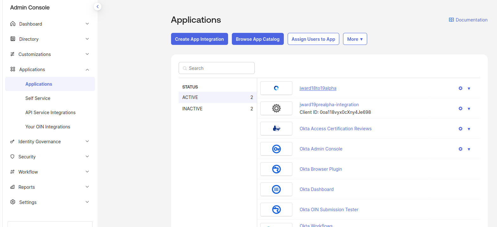
1. Go to the **Sign On** tab, scroll to the **SAML Signing Certificates** section
and click the **Generate New Certificate** button
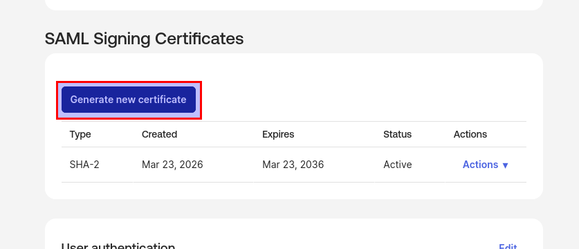
1. Either copy the metadata URL or download the metadata XML, which will be needed to update 
Teleport:
   - Scroll to the **Sign on methods** section and copy the metadata URL from the 
   **SAML 2.0** section
   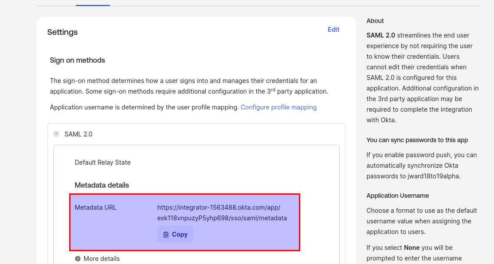
   - Scroll to the **SAML Signing Certificates** section and download the metadata 
   XML from **Actions** > **View IdP metadata**
   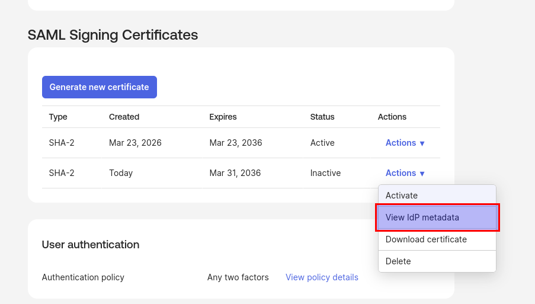
   

#### Activate the certificate

1. Scroll to the **SAML Signing Certificates** section and find your newly created 
certificate
1. Select **Actions** > **Activate** on the new certificate entry to activate the 
certificate
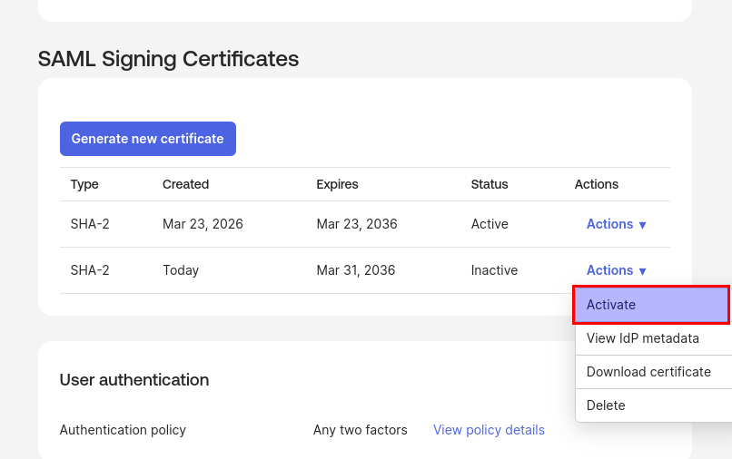
1. When you have confirmed SSO is working, remove the old certificate by selecting
**Actions** > **Delete** on the old certificate entry
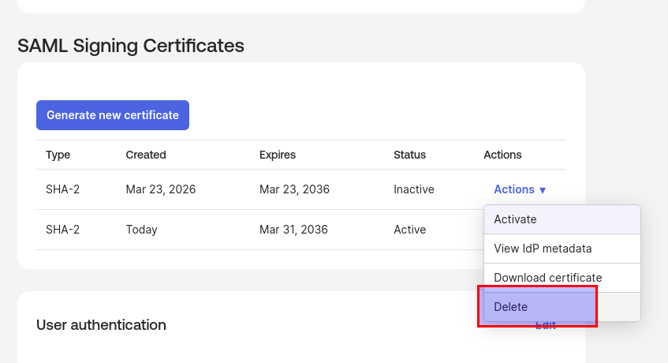

