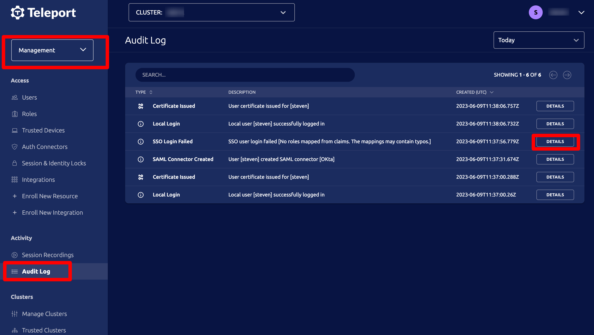

Teleport users can log in to servers, Kubernetes clusters, databases, web
applications, and Windows desktops through their organization's Single Sign-On
(SSO) provider.

<DocCardList />

## How Teleport uses SSO

You can register your Teleport cluster as an application with your SSO provider.
When a user signs in to Teleport, your SSO provider will execute its own
authentication flow, then send an HTTP request to your Teleport cluster to
indicate that authentication has completed.

Teleport authenticates users to your infrastructure by issuing short-lived
certificates. After a user completes an SSO authentication flow, Teleport issues
a short-lived certificate to the user. Teleport also creates a temporary user on
the Auth Service backend.

### Temporary `user` resources

After a user completes an SSO authentication flow, Teleport creates a temporary
`user` resource for the user.

When a user signs in to Teleport with `tsh login`, they can configure the TTL of
the `user` Teleport creates. Teleport enforces a limit of 30 hours (the default
is 12 hours).

In the Teleport audit log, you will see an event of type `user.create` with
information about the temporary user.

<details>
<summary>How can I inspect a temporary user resource?</summary>

You can inspect a temporary `user` resource created via your SSO integration
by using the `tctl` command:

```code
# Log in to your cluster with tsh so you can use tctl remotely
$ tsh login --proxy=example.teleport.sh
$ tctl get users/<username>
```

Here is an example of a temporary `user` resource created when the GitHub user
`myuser` signed in to GitHub to authenticate to Teleport. This resource
expires 12 hours after creation. The `created_by` field indicates that the
resource was created by Teleport's GitHub SSO integration:

```yaml
kind: user
metadata:
  expires: "2022-06-15T04:02:34.586688054Z"
  id: 0000000000000000000
  name: myuser
spec:
  created_by:
    connector:
      id: github
      identity: myuser
      type: github
    time: "2022-06-14T16:02:34.586688441Z"
    user:
      name: system
  expires: "0001-01-01T00:00:00Z"
  github_identities:
  - connector_id: github
    username: myuser
  roles:
  - editor
  - access
  - auditor
  status:
    is_locked: false
    lock_expires: "0001-01-01T00:00:00Z"
    locked_time: "0001-01-01T00:00:00Z"
  traits:
    github_teams:
    - my-team
    kubernetes_groups: null
    kubernetes_users: null
    logins:
    - root
version: v2
```

</details>

### Certificates for SSO users

Along with creating a temporary user, Teleport issues SSH and X.509 certificates
to a successfully authenticated SSO user's machine. This enables SSO users to
authenticate to your cluster without Teleport needing to create a permanent
record of them.

In the X.509 certificate, for example, the `Subject` field contains the same
information defined in the temporary `user` resource. This enables Teleport to
enforce RBAC rules for the authenticated user when they access resources in your
cluster.

This is a `Subject` field for a certificate that Teleport issued for the GitHub
user `myuser`, who signed in to a Teleport cluster via the GitHub SSO
integration:

```
Subject: L=myuser/street=teleport.example.com/postalCode={"github_teams":["my-team"],"kubernetes_groups":null,"kubernetes_users":null,"logins":["root"]}, O=access, O=editor, O=auditor, CN=myuser/1.3.9999.1.7=teleport.example.com
```

The user belongs to the GitHub team `my-team`, which this Teleport cluster maps
to the `access`, `editor`, and `auditor` roles in Teleport. (Read the guide for
your SSO provider to determine how to configure role mapping.)

<details>
<summary>Inspecting your certificate subject</summary>

To inspect the contents of an X.509 certificate issued for your user after you
sign in to Teleport via SSO, run the following commands:

```code
$ TELEPORT_CLUSTER=<your cluster>
$ SSO_USER=<your username within your SSO provider>
$ openssl x509 -text -in ~/.tsh/keys/${TELEPORT_CLUSTER}/${SSO_USER}-x509.pem | grep "Subject:"
```

You can inspect an SSH certificate issued for your Teleport user with the
following command:

```code
$ ssh-keygen -L -f ~/.tsh/keys/${TELEPORT_CLUSTER}/${SSO_USER}-ssh/${TELEPORT_CLUSTER}-cert.pub
```

</details>

### Multiple SSO providers

Since Teleport creates temporary users and issues short-lived certificates when
a user authenticates via SSO, it is straightforward to integrate Teleport with
multiple SSO providers. Besides the temporary `user` resource, no persistent
backend data in Teleport is tied to a user's account with the SSO provider.

This also means that if one SSO provider becomes unavailable, the end user only
needs to choose another SSO provider when signing in to Teleport. While the
user may be locked out of their account with the first SSO provider, signing in
via the second provider is sufficient for Teleport to issue a new certificate
and grant the user access to your infrastructure.

Note that if the username of an SSO user already belongs to a user registered
locally with the Auth Service (i.e., created via `tctl users add`), the SSO
login will fail.

## Logging in via SSO

Users can log in to Teleport via your SSO provider by executing a command
similar to the following, using the `--auth` flag to specify the provider:

```code
# This command will automatically open the default web browser and take a user
# through the login process with an SSO provider
$ tsh login --proxy=proxy.example.com --auth=github
```

The command opens a browser window and shows a URL the user can visit in the
terminal to complete their SSO flow:

```text
If browser window does not open automatically, open it by clicking on the link:
http://127.0.0.1:45235/055a310a-1099-43ea-8cf6-ffc41d88ad1f
```

Teleport will wait for up to 3 minutes for a user to authenticate. If
authentication succeeds, Teleport will retrieve SSH and X.509 certificates and
store them in the `~/.tsh/keys/<clustername>` directory. The tool will also will
add SSH cert to an SSH agent if there's one running.

### Changing Callback Address

The callback address can be changed if calling back to a remote machine
instead of the local machine is required:

```code
# --bind-addr sets the host and port tsh will listen on, and --callback changes
# what link is displayed to the user
$ tsh login --proxy=proxy.example.com --auth=github --bind-addr=localhost:1234 --callback https://remote.machine:1234
```

For this to work the hostname or CIDR of the remote machine that will be used for
the callback will need to be allowed via your auth connector's `client_redirect_settings`:

```code
kind: oidc
metadata:
  name: example-connector
spec:
  client_redirect_settings:
    # a list of hostnames allowed for HTTPS client redirect URLs
    # can be a regex pattern
    allowed_https_hostnames:
      - remote.machine
      - '*.app.github.dev'
      - '^\d+-[a-zA-Z0-9]+\.foo.internal$'
    # a list of CIDRs allowed for HTTP or HTTPS client redirect URLs
    insecure_allowed_cidr_ranges:
      - '192.168.1.0/24'
      - '2001:db8::/96'
```

## Configuring SSO for login

Teleport works with SSO providers by relying on the concept of an
**authentication connector**. An authentication connector is a configuration
resource that controls how SSO users log in to Teleport—and which Teleport roles
they will assume once they do.

This means that you can apply fine-grained RBAC policies to your Teleport
cluster without needing to change the solution you use for on– and offboarding
users.

### Supported connectors

The following authentication connectors are supported:

<Tabs>
<TabItem scope={["cloud", "enterprise"]} label="Commercial">

|Type|Description|
|---|---|
|None|If no authentication connector is created, Teleport will use local authentication based user information stored<br/> in the Auth Service backend. You can manage user data via the web UI Users page and the `tctl users` command. |
|`saml`| The SAML connector type uses the [SAML protocol](https://en.wikipedia.org/wiki/Security_Assertion_Markup_Language) to authenticate users and query their group membership.|
|`oidc`| The OIDC connector type uses the [OpenID Connect protocol](https://en.wikipedia.org/wiki/OpenID_Connect) to authenticate users<br/> and query their group membership.|
|`github`| The GitHub connector uses GitHub SSO to authenticate users and query their group membership.|

</TabItem>
<TabItem scope={["oss"]} label="Teleport Community Edition">

|Type|Description|
|---|---|
|None|If no authentication connector is created, Teleport will use local authentication based user information stored in the Auth Service backend. You can manage user data via the web UI Users page and the `tctl users` command. |
|`github`| The GitHub connector uses GitHub SSO to authenticate users and query their group membership.|

</TabItem>

</Tabs>

### Creating an authentication connector

Before you can create an authentication connector, you must enable
authentication via that connector's protocol.

To set the default authentication type as `saml`, `oidc`, or `github`,
create a `cluster_auth_preference` resource.

Create a file called `cap.yaml`:
  ```yaml
  kind: cluster_auth_preference
  metadata:
    name: cluster-auth-preference
  spec:
    # Set as saml, oidc, or github
    type: saml|oidc|github
  version: v2
  ```

Create the resource:

  ```code
  # Log in to your cluster with tsh so you can run tctl commands.
  $ tsh login --proxy=example.teleport.sh --user=myuser
  $ tctl create -f cap.yaml
  ```


Next, define an authentication connector. Create a file called `connector.yaml`
based on one of the following examples. Teleport Community Edition only supports
GitHub as an SSO option.

<Tabs>
<TabItem label="Okta">

```yaml
(!/examples/resources/saml-connector.yaml!)
```

(!docs/pages/includes/sso/idp-initiated.mdx!)

(!docs/pages/includes/sso/saml-slo.mdx!)

You may use `entity_descriptor_url` in lieu of `entity_descriptor` to fetch
the entity descriptor from your IDP.

We recommend "pinning" the entity descriptor by including the XML rather than
fetching from a URL.

</TabItem>
<TabItem label="OneLogin">

```yaml
(!/examples/resources/onelogin-connector.yaml!)
```

You may use `entity_descriptor_url`, in lieu of `entity_descriptor`, to fetch
the entity descriptor from your IDP.

We recommend "pinning" the entity descriptor by including the XML rather than
fetching from a URL.

</TabItem>
<TabItem label="OIDC">

```yaml
(!/examples/resources/oidc-connector.yaml!)
```

</TabItem>
<TabItem label="Google Workspace">

```yaml
(!/examples/resources/gworkspace-connector-inline.yaml!)
```

</TabItem>
<TabItem label="ADFS">

```yaml
(!/examples/resources/adfs-connector.yaml!)
```

You may use `entity_descriptor_url`, in lieu of `entity_descriptor`, to fetch
the entity descriptor from your IDP.

We recommend "pinning" the entity descriptor by including the XML rather than
fetching from a URL.

</TabItem>
<TabItem label="SAML">

```yaml
(!/examples/resources/saml-connector.yaml!)
```

(!docs/pages/includes/sso/idp-initiated.mdx!)

(!docs/pages/includes/sso/saml-slo.mdx!)

You may use `entity_descriptor_url`, in lieu of `entity_descriptor`, to fetch
the entity descriptor from your IDP.

We recommend "pinning" the entity descriptor by including the XML rather than
fetching from a URL.

</TabItem>
<TabItem label="GitHub">

```yaml
(!/examples/resources/github.yaml!)
```

</TabItem>
</Tabs>

Create the connector:

```code
$ tctl create -f connector.yaml
```

### User logins

Often it is required to restrict SSO users to their unique UNIX logins when they
connect to Teleport Nodes. To support this:

- Use the SSO provider to create a field called `unix_login` (you can use another name).
- Make sure the `unix_login` field is exposed as a claim via SAML/OIDC.
- Update a Teleport role to include the `{{external.unix_login}}` variable in the list of allowed logins:

```yaml
kind: role
version: v5
metadata:
  name: sso_user
spec:
  allow:
    logins:
    - '{{external.unix_login}}'
    node_labels:
      '*': '*'
```

### Provider-Specific Workarounds

Certain SSO providers may require or benefit from changes to Teleport's SSO
flow. These provider-specific changes can be enabled by setting the
`spec.provider` property of the connector definition to one of the following
values to match your identity provider:

- `adfs` (SAML): Required for compatibility with Active Directory (ADFS); refer
  to the full [ADFS guide](adfs.mdx) for details.
- `netiq` (OIDC): Used to enable NetIQ-specific ACR value processing; refer to
  the [OIDC guide](oidc.mdx) for details.
- `ping` (SAML and OIDC): Required for compatibility with Ping Identity (including
  PingOne and PingFederate).
- `okta` (OIDC): Required when using Okta as an OIDC provider.

At this time, the `spec.provider` field should not be set for any other identity providers.

## Configuring SSO for MFA checks

Teleport administrators can configure Teleport to delegate MFA checks to an
SSO provider as an alternative to registering MFA devices directly with the Teleport cluster.
This allows Teleport users to use MFA devices and custom flows configured in the SSO provider
to carry out privileged actions in Teleport, such as:

- [Per-session MFA](../../admin-guides/access-controls/guides/per-session-mfa.mdx)
- [Moderated sessions](../../admin-guides/access-controls/guides/joining-sessions.mdx)
- [Admin actions](../../admin-guides/access-controls/guides/mfa-for-admin-actions.mdx)

Administrators may want to consider enabling this feature in order to:

- Make all authentication (login and MFA) go through the IDP, reducing administrative overhead
- Make custom MFA flows, such as prompting for 2 distinct devices for a single MFA check
- Integrate with non-webauthn devices supported directly by your IDP

<Admonition type="note">
  SSO MFA is an enterprise feature. Only OIDC and SAML auth connectors are supported.
</Admonition>

### Configure the IDP App / Client

There is no standardized MFA flow unlike there is with SAML/OIDC
login, so each IDP may offer zero, one, or more ways to offer MFA checks.

Generally, these offerings will fall under one of the following cases:

1. Use a separate IDP app for MFA:

You can create a separate IDP app with a custom MFA flow. For example, with
Auth0 (OIDC), you can create a separate app with a custom [Auth0 Action](https://auth0.com/docs/customize/actions)
which prompts for MFA for an active OIDC session.

2. Use the same IDP app for MFA:

Some IDPs provide a way to fork to different flows using the same IDP app.
For example, with Okta (OIDC), you can provide `acr_values: ["phr"]` to
[enforce phishing resistant authentication](https://developer.okta.com/docs/guides/step-up-authentication/main/#predefined-parameter-values).

For a simpler approach, you could use the same IDP app for both login and MFA
with no adjustments. For Teleport MFA checks, the user will be required to
relogin through the IDP with username, password, and MFA if required.

<Admonition type="warning">
  While the customizability of SSO MFA presents multiple secure options previously
  unavailable to administrators, it also presents the possibility of insecure
  misconfigurations. Therefore, we strongly advice administrators to incorporate
  strict, phishing-resistant checks with WebAuthn, Device Trust, or some similar
  security features into their custom SSO MFA flow.
</Admonition>

### Updating your authentication connector to enable MFA checks

Take the authentication connector file `connector.yaml` created in [Configuring SSO for login](#configuring-sso-for-login)
and add MFA settings.

<Tabs>
<TabItem label="OIDC">

```yaml
(!examples/resources/oidc-connector-mfa.yaml!)
```

</TabItem>
<TabItem label="SAML">

```yaml
(!examples/resources/saml-connector-mfa.yaml!)
```

You may use `entity_descriptor_url` in lieu of `entity_descriptor` to fetch
the entity descriptor from your IDP.

We recommend "pinning" the entity descriptor by including the XML rather than
fetching from a URL.

</TabItem>
</Tabs>

Update the connector:

```code
$ tctl create -f connector.yaml
```

### Allowing SSO as an MFA method in your cluster

Before you can use the SSO MFA flow we created above, you need to enable SSO for
multi-factor authentication in your cluster settings. Modify the dynamic config
resource using the following command:

```code
$ tctl edit cluster_auth_preference
```

Make the following change:

```diff
kind: cluster_auth_preference
version: v2
metadata:
  name: cluster-auth-preference
spec:
  # ...
  second_factors:
   - webauthn
+  - sso
```

## Working with an external email identity

Along with sending groups, an SSO provider will also provide a user's email address.
In many organizations, the username that a person uses to log in to a system is the
same as the first part of their email address, the "local" part.

For example, `dave.smith@example.com` might log in with the username `dave.smith`.
Teleport provides an easy way to extract the first part of an email address so
it can be used as a username. This is the `{{email.local}}` function.

If the email claim from the identity provider (which can be accessed via
`{{external.email}}`) is sent and contains an email address, you can extract the
"local" part of the email address before the @ sign like this:
`{{email.local(external.email)}}`

Here's how this looks in a Teleport role:

```yaml
kind: role
version: v5
metadata:
  name: sso_user
spec:
  allow:
    logins:
    # Extracts the local part of dave.smith@acme.com, so the login will
    # now support dave.smith.
    - '{{email.local(external.email)}}'
    node_labels:
      '*': '*'
```

## Working with multiple SSO providers

Teleport can also support multiple connectors. For example, a Teleport
administrator can define and create multiple connector resources using
`tctl create` as shown above.

To see all configured connectors, execute this command on the Auth Service:

```code
$ tctl get connectors
```

To delete/update connectors, use the usual `tctl rm` and `tctl create` commands
as described in the [Resources Reference](../../reference/resources.mdx).

If multiple authentication connectors exist, the clients must supply a
connector name to `tsh login` via `--auth` argument:

```code
# use "okta" SAML connector:
$ tsh --proxy=proxy.example.com login --auth=okta

# use local Teleport user DB:
$ tsh --proxy=proxy.example.com login --auth=local --user=admin
```

Refer to the following guides to configure authentication connectors of both
SAML and OIDC types:

- [SSH Authentication with Okta](okta.mdx)
- [SSH Authentication with OneLogin](one-login.mdx)
- [SSH Authentication with ADFS](adfs.mdx)
- [SSH Authentication with OAuth2 / OpenID Connect](oidc.mdx)

## SSO customization

Use the `display` field in an authentication connector to control the appearance
of SSO buttons in the Teleport Web UI.

| Provider | YAML | Example |
| - | - | - |
| GitHub | `display: GitHub` |  |
| Microsoft | `display: Microsoft` |  |
| Google | `display: Google` |  |
| BitBucket | `display: Bitbucket` |  |
| OpenID | `display: Okta` |  |

## Troubleshooting

Troubleshooting SSO configuration can be challenging. Usually a Teleport administrator
must be able to:

<Tabs>
<TabItem scope={["oss","enterprise"]} label="Self-Hosted">
- Ensure that HTTP/TLS certificates are configured properly for both Teleport
  proxy and the SSO provider.
</TabItem>
</Tabs>

- Be able to see what SAML/OIDC claims and values are getting exported and passed
  by the SSO provider to Teleport.
- Be able to see how Teleport maps the received claims to role mappings as defined
  in the connector.

If something is not working, we recommend to:

- Double-check the host names, tokens and TCP ports in a connector definition.

### Using the Web UI

If you get "access denied" or other login errors, the number one place to check is the Audit
Log. You can access it in the **Activity** tab of the Teleport Web UI.



Example of a user being denied because the role `clusteradmin` wasn't set up:

```json
{
  "code": "T1001W",
  "error": "role clusteradmin is not found",
  "event": "user.login",
  "message": "Failed to calculate user attributes.\n\trole clusteradmin is not found",
  "method": "oidc",
  "success": false,
  "time": "2024-11-07T15:41:25.584Z",
  "uid": "71e46f17-d611-48bb-bf5e-effd90016c13"
}
```

### Teleport does not show the expected Nodes

(!docs/pages/includes/node-logins.mdx!)

When configuring SSO, ensure that the identity provider is populating each user's
traits correctly. For a user to see a Node in Teleport, the result of populating a
 template variable in a role's `allow.logins` must match at least one of a user's
 `traits.logins`.

In this example a user will have usernames `ubuntu`, `debian` and usernames from the SSO trait `logins` for Nodes that have a `env: dev` label.  If the SSO trait username is `bob` then the usernames would include `ubuntu`, `debian`, and `bob`.

```yaml
kind: role
metadata:
  name: example-role
spec:
  allow:
    logins: ['{{external.logins}}', ubuntu, debian]
    node_labels:
      'env': 'dev'
version: v5
```

## Next steps

The roles we illustrated in this guide use `external` traits,
which Teleport replaces with values from the single sign-on provider that the
user used to authenticate with Teleport. For full details on how variable
expansion works in Teleport roles, see the  [Access Controls
Reference](../../reference/access-controls/roles.mdx).
