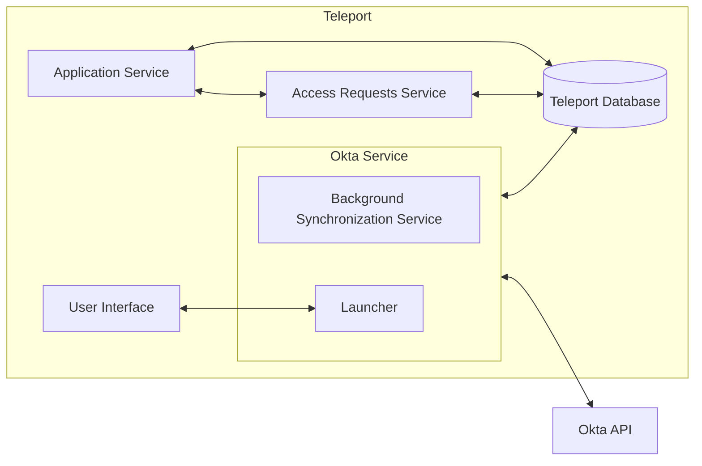
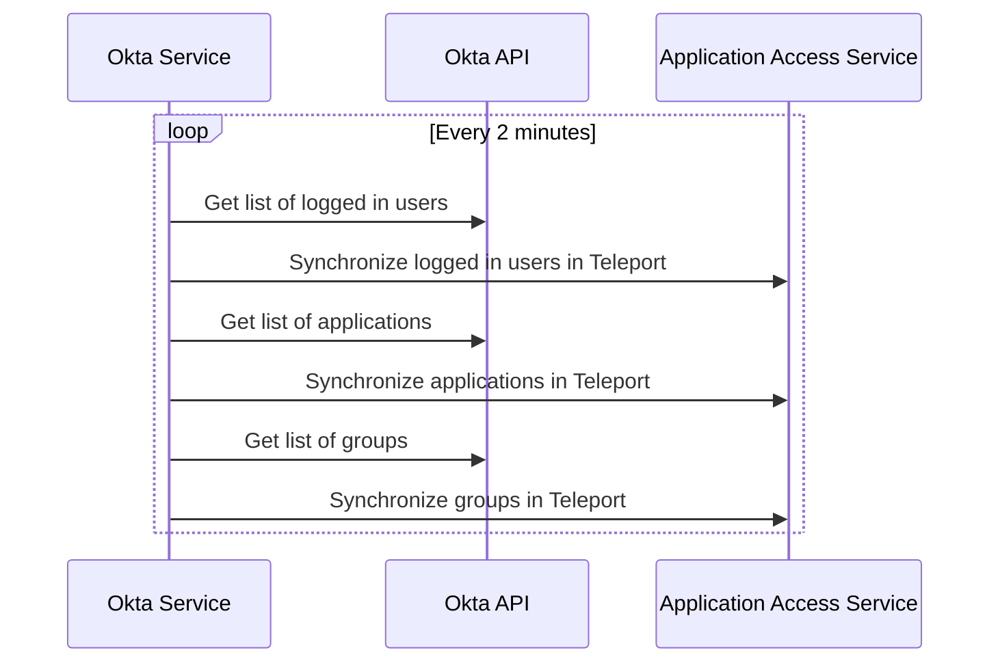

# RFD 3E - Application Access Okta Integration

### Required Approvers

* Engineering @r0mant
* Security @reed
* Product: (@xinding33 || @klizhentas)

## What

Allow Teleport users to request access to specific applications and groups and access
Okta applications from within Teleport.

Additionally, users who are logged into Teleport will have Okta access calculated and
synchronized to Okta based on user access. Access to Okta applications and Okta groups will be
calculated and, based on what a user has access to, will be assigned to these applications and
groups through the Okta API.

Note: This is an enterprise only feature.

## Why

Today, Teleport supports [single sign-on with Okta](https://goteleport.com/docs/access-controls/sso/okta/).
Okta is a popular IdP with our customers, so improving the integration between Okta and
Teleport will be useful.

Additionally, Okta permissions are often difficult to calculate and require large numbers of
groups and assignments, which become difficult for IT admins to handle. By allowing dynamic
access calculation of Okta applications and groups, the number of groups that IT administrators
need to create and maintain can be significantly reduced.

## Details

### Base assumptions

It is assumed that Okta is the source of truth with respect to which users have access to which
applications. If a user has access to an application in Okta, the user will have access to that
application in Teleport regardless of the user's permissions within Teleport.

### UX

#### Application Access UI

* After authenticating into Teleport and accessing the "Applications" item in the menu,
  a list of apps sourced from Okta will appear.
* When users click on an Okta sourced app in the UI, the application will open in a separate tab.
* If users do not have access to an application and are able to request access to it, the link will
  not be displayed in the list of applications that the user has access to, but will be displayed
  in the list of Okta applications that that the user can request under the Access Request UI.
* Groups that the users are not a member of and can request access to will be present in the
  Access Request UI as well.
* These applications will *not* be behind Teleport's proxy, and will redirect to the proper Okta
  sourced URL for the application. Users will be taken through Okta's authentication process for
  this process. If users are already logged into Okta, this will be a transparent passthrough to
  the application.

#### Teleport CLI

* Okta applications will show up when doing a `tsh apps ls` from the command line, with an origin of `okta`.
* Okta groups will be using `tctl get apps`.
* Okta groups will be using `tctl get groups`.
* Okta label rules will be using `tctl get okta_label_rules`.
* Logging in (`tsh app login <app-name>`) will **not** work for Okta apps.

#### Access requests

* When a user requests access to an application or group, the existing approval workflow
  will be used to add this access to the user.
* Changes will be reflected in Okta when this occurs.
* These requests are only for short term access. Longer term access will be investigated after
  the resolution of [RFD-6E](https://github.com/gravitational/teleport.e/pull/717).

### High level architecture

The general architecture can be seen below, which is put into more detail later in this document.



### Okta service and configuration

An Okta service should be introduced that synchronizes Okta applications, users, and groups with
Teleport equivalents and new objects.  The Okta service should have its own unique top level
configuration. The following config fields will be available in the Teleport config YAML:

| Name | Required | Description |
|------|----------|-------------|
| `api_endpoint` | :heavy_check_mark: | The API URL so that Teleport knows which Okta endpoint to hit.
| `api_token_path` | :heavy_check_mark: | A file containing the Okta API token.

Note that environment variables are not supported here.

#### YAML example

```yaml
okta_service:
  enabled: true
  api_endpoint: https://my-okta-endpoint.okta.com
  api_token_path: /path/to/token
```

#### Connection to Teleport

The Okta service will connect to Teleport proxy over a reverse tunnel. This will ensure that
users will be able to run the Okta service and connect it to a cloud instance.

### Okta object synchronization

#### Background synchronization

The background synchronization process, which synchronizes all applications from Okta, is expected
to run roughly every 2 minutes. This process wil translate Okta users, groups, and applications
into their Teleport equivalents. One thing to note here is that Okta does not support a watch API,
so this synchronization process is necessarily poll based.



#### Okta traits on login

When users login to Okta, two traits will be captured: `okta_apps` which is a list of Okta
application IDs that the user has access to, and `okta_groups` which is a list of groups that
the user belongs to.

#### Teleport to Okta user access

After a user has logged in, additional access to Okta applications and groups may be assigned
based on role access to applications and groups.

```yaml
kind: role
version: v5
metadata:
  name: okta-grant-access
spec:
  allow:
    app_labels:
      label_name: ['value1', 'value2']
    group_labels:
      label_name: ['value1', 'value2']
```

Any Okta sourced applications or groups that the user can see will be assigned to the user in
the Okta API if they are not already assigned. The algorithm for this reconciliation will look
like the following:

1. Get list of Okta originated groups visible to the user.
2. Assign groups to user in Okta.
3. Get list of Okta originated applications visible to user.
4. Assign applications to user in Okta only if the user doesn't currently have access to these
   applications. This will prevent users from being directly assigned to applications where
   they already have group access to an application.

This process will run every 2 minutes for all logged in users, and will additionally run when
a user has logged in.

#### Okta to Teleport mappings

Okta users, groups, and applications will be mapped by the background synchronization into
`Application` and `Group` objects. Additionally, `okta_label_rules` can be added to
dictate how labels are applied to these objects.

##### Groups

A new `Group` will be created for each Okta group. At present these groups don't contain
anything more than a name and metadata. These groups will have an Origin set to `okta`. The
`Group` object may be expanded later.

```yaml
kind: group
version: v1
metadata:
  name: Developers
  teleport.dev/origin: okta
```

##### Applications

When applications are synchronized with Teleport, they will be created in application access as
HTTP apps that use the `appLinks` from Okta as their URI. If there is more than one `appLink`
associated with an Okta application, it will be split into multiple applications for
each `appLink` with the unique name of each `appLink` used to disambiguate them. The
`teleport.dev/origin` field in the application metadata will be set to `okta`. Additionally, a
field called `okta/application_id` will be present in the metadata. These will be translated
directly to Teleport's existing notion of `applications`.

##### Okta label rules

Okta label rules are established through the user of `tctl create -f okta_label_rules.yaml` and
these rules will be used during the synchronization process to apply labels to Okta objects that
match the elements in the "matches" section. The matches in this section should utilize the
grammar established in the [login rules RFD](https://github.com/gravitational/teleport/blob/master/rfd/0078-login-rules.md#predicate-helper-functions).

```yaml
kind: okta_label_rule
version: v1
metadata:
  name: rules
spec:
  mappings:
    - label: label1
      value: value1
      matches:
        - match(application.id == "123456")
        - match(application.name)
    - label: label2
      value: value2
      matches:
        - group.some-name
        - group.some-other-name
```

These labels will then be applied to Okta applications and Okta groups recorded in Teleport.

### Requesting access to applications and groups

A user will be able to submit access requests to specific applications and groups through the
API or UI. These requests will submit access requests through Teleport's
[existing access request functionality](https://goteleport.com/docs/access-controls/access-requests/).
The Okta service will monitor these approval requests and take appropriate
action based on the request and the resource targeted.

There are several different methods to implement, as different applications have different
methods of elevating access.

#### Application approval

When an approval request has been accepted for an Okta based application, the Okta service will assign the user
to the application in Okta. When the approval is rescinded, the user will be removed from the application in Okta.

#### Group approval

When an approval request has been accepted for a group, the Okta service assign the user to the given
group in Okta. When the approval is rescinded, the user will be removed from the group in Okta.

#### What groups and applications can users request?

New fields in role objects will indicate which groups users in this role can request.

```yaml
kind: role
version: v5
metadata:
  name: example
spec:
  allow:
    okta_labels:
      label1: value1
```

This should be used in concert with the Okta label rules to establish roles for requestable
Okta applications and groups. These roles can be used as part the request configuration.

#### Reconciling Okta state

When fulfilling a request, the Okta service will analyze the current active requests and
calculate the current objective state. After calculating this state, the service will issue
the expected application assignment and group assignment API requests.

#### Note about Okta administration workflows

For approving temporary access, Teleport will assign users to groups and applications independently of
Okta administration. This could potentially create awkward administrator workflows where users appear
to have access to a group or application and then see it disappear later as approvals are approved and
rescinded. This is something we'll need to make sure to document well so that it doesn't catch users
unaware.

### RBAC calculation

RBAC calculation will utilize the user's Okta application assignments and group assignments as
determined on Teleport login. These will be injected into the cert as `okta_app` and
`okta_group` traits. These traits can then be interpolated into role `app_labels` and role
`group_labels`.

### APIs used by the Okta service

The Okta provider will use the following APIs:

* [List applications](https://developer.okta.com/docs/reference/api/apps/#list-applications) for
  listing all applications known to Okta. These results are paginated and may require multiple
  calls.
* [List groups](https://developer.okta.com/docs/reference/api/groups/#list-groups) for listing
all groups known to Okta. These results are paginated and may require multiple calls.
* [Get Assigned App Links](https://developer.okta.com/docs/reference/api/users/#get-assigned-app-links) for listing the app links assigned to a user in Okta. This will be 
used to determine which applications a user has access to.
* [Get User's Groups](https://developer.okta.com/docs/reference/api/users/#get-user-s-groups) for listing the groups that a user is assigned to in Okta.
* [Add User to Group](https://developer.okta.com/docs/reference/api/groups/#add-user-to-group) for adding a user to a group.
[ Remove User from Group](https://developer.okta.com/docs/reference/api/groups/#remove-user-from-group)) for removing a user from a group.
* [Assign user to application for SSO](https://developer.okta.com/docs/reference/api/apps/#assign-user-to-application-for-sso) for assigning an application to a user.
* [Remove user from application](https://developer.okta.com/docs/reference/api/apps/#remove-user-from-application) for removing a user from an application.

### Backend modifications

#### Request access service

The Okta service will need to actively monitor and take action on access requests, which is a
mechanism which does not currently exist today.

#### `Group` object

As described in the RFD, this new object will be used in the synchronization process.

### Audit events

A number of new audit events will be created as part of this effort:

| Event Name | Description |
|------------|-------------|
| `OKTA_GROUPS_UPDATE` | Emitted when groups synchronized from Okta have changed. |
| `OKTA_APPLICATIONS_UPDATE` | Emitted when applications synchronized from Okta have have changed. |
| `OKTA_USER` | Emitted when users synchronized from Okta have have changed. |
| `OKTA_ROLE_SYNC` | Emitted when roles have been synchronized from Teleport to Okta. |
| `OKTA_SYNC_FAILURE` | Emitted when an Okta synchronization attempt fails. |
| `OKTA_ACCESS_REQUEST_APPROVED` | Emitted when a user request for an Okta resource was approved. |
| `OKTA_ACCESS_REQUEST_DENIED` | Emitted when a user request for an Okta resource was denied. |
| `OKTA_ACCESS_REQUEST_PROCESSED` | Emitted when a user request for an Okta resource was processed successfully or unsuccessfully. |
| `OKTA_ACCESS_REQUEST_CLEANED_UP` | Emitted when a user request for an Okta resource was cleaned up successfully or unsuccessfully. |

### Security

* It's possible to capture sensitive data in our internal Teleport database. This could be
  undesirable for customers or other users of Teleport. We should take care that the sensitive
  identity provider data (like Okta API tokens) are never communicated to or stored outside of
  the configuration file.
* The mapping of Okta users to the appropriate Teleport user is a concern. If a user has been
  mismapped to an Okta user, it will be possible for that user to request access on behalf of
  that user. Administrators should take care with their Okta identity mappings, or even better,
  ensure that Teleport logins map directly to Okta users.

### Implementation plan

#### `Group` and `OktaLabelRules` objects

The new `Group` and `OktaLabelRules` objects should be implemented
along with any database and gRPC modifications required.

#### Okta service configuration

Implement the ability to configure the Okta service. Doing this first will make subsequent
testing and verification easier as we'll be able to pass in API URLs and API tokens.
Part of this will include implementing any stubs needed for the Okta service itself.

#### Okta service API communication

The Okta service will be able to communicate with Okta and retrieve lists of
applications and groups and synchronizing them with the Teleport backend.

#### Okta traits on login

On login, Okta traits will be inserted into the certificate in order to augment visibility of
Okta applications and groups.

#### Application access synchronization

Okta applications will be synchronized with the application access service so that users will be
able to have access to Okta applications from the Teleport UI and listed in `tsh app ls`.

#### User access synchronization

Access to Okta applications and groups will be synchronized based on user access to Okta
sourced applications and groups.

#### Application request

The application request workflow will be implemented here.

#### `Application` approval request.

The `Application` approval request workflow will be implemented for Okta based apps.

#### `Group` approval request.

The `Group` approval request workflow will be implemented for Okta based groups..