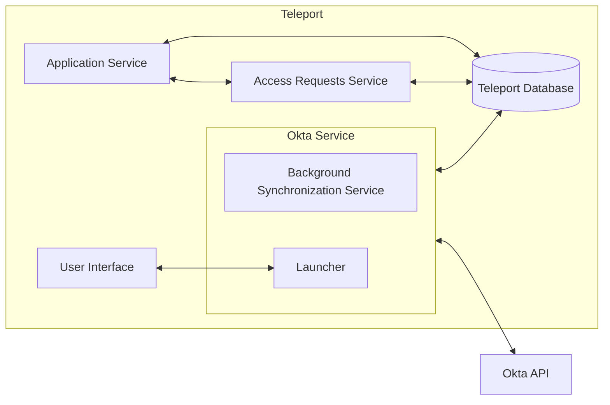
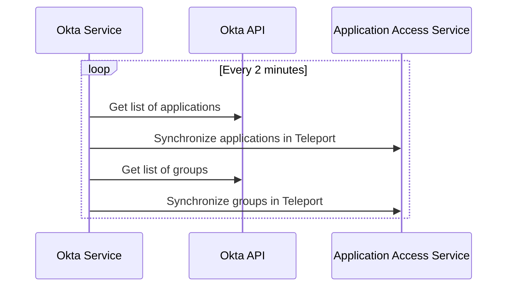
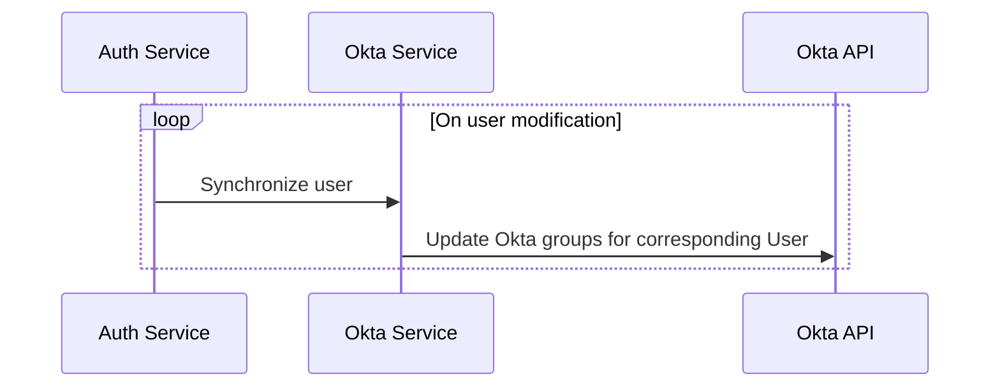

# RFD 3E - Application Access Okta Integration

### Required Approvers

* Engineering @r0mant
* Security @reed
* Product: (@xinding33 || @klizhentas)

## What

Allow Teleport users to request access to specific applications and groups and access
Okta applications from within Teleport.

Note: This is an enterprise only feature.

## Why

Today, Teleport supports [single sign-on with Okta](https://goteleport.com/docs/access-controls/sso/okta/).
Okta is a popular IdP with our customers, so improving the integration between Okta and
Teleport will be useful.

## Details

### Base assumptions

It is assumed that Okta is the source of truth with respect to which users have access to which
applications. If a user has access to an application in Okta, the user will have access to that
application in Teleport regardless of the user's permissions within Teleport.

### UX

#### Application Access UI

* After authenticating into Teleport and accessing the "Applications" item in the menu,
  a list of apps sourced from Okta will appear.
* When users click on an Okta sourced app in the UI, the application will open in a separate tab.
* If users do not have access to an application and are able to request access to it, the link will
  be greyed out and an option will be available in the drop down menu to the right that allows users
  to request access to the application. If the application is not requestable, the application will
  not appear in the list of applications belonging to the user.
* These applications will *not* be behind Teleport's proxy, and will redirect to the proper Okta
  sourced URL for the application. Users will be taken through Okta's authentication process for
  this process. If users are already logged into Okta, this will be a transparent passthrough to
  the application.

#### Teleport CLI

* Okta applications will show up when doing a `tsh apps ls` from the command line, with an origin of `okta`.
* Okta groups will be using `tctl get oktagroups`.
* Okta groups will be using `tctl get oktaapps`.
* Logging in (`tsh app login <app-name>`) will **not** work for Okta apps.

#### Access requests

* When a user requests access to an application or group, the existing approval workflow
  will be used to add this access to the user.
* Changes will be reflected in Okta when this occurs.
* These requests are only for short term access. Longer term access will be investigated after
  the resolution of [RFD-6E](https://github.com/gravitational/teleport.e/pull/717).

### High level architecture

The general architecture can be seen below, which is put into more detail later in this document.



### Okta service and configuration

An Okta service should be introduced that synchronizes Okta applications, users, and groups with
Teleport equivalents and new objects.  The Okta service should have its own unique top level
configuration. The following config fields will be available in the Teleport config YAML::

| Name | Required | Description |
|------|----------|-------------|
| `api_endpoint` | :heavy_check_mark: | The API URL so that Teleport knows which Okta endpoint to hit.
| `api_token_path` | :heavy_check_mark: | A file containing the Okta API token.

Note that environment variables are not supported here.

#### YAML example

```yaml
okta_service:
  enabled: true
  api_endpoint: https://my-okta-endpoint.okta.com
  api_token_path: /path/to/token
```

### Okta user traits

Okta will optionally use an `okta_user_id` trait to map Teleport users to Okta users if necessary.

```yaml
kind: user
version: v2
metadata:
  name: alice
spec:
  roles: ['devs']
  traits:
    logins: ['admin']
    kubernetes_groups: ['edit']
    okta_user_id: ['name@mydomain.com']
```

If Okta is used for logging into Teleport or the Teleport user's username is the same as the
e-mail used for Okta, this will be unnecessary.

### Okta object synchronization

#### Background synchronization

The background synchronization process, which synchronizes all applications from Okta, is expected
to run roughly every 2 minutes. This process wil translate Okta users, groups, and applications
into their Teleport equivalents. One thing to note here is that Okta does not support a watch API,
so this synchronization process is necessarily poll based.



#### User Okta assignment synchronization

When new users are created or users are changed, the Okta service will analyze the user's roles
and assign associated Okta groups to those roles if necessary.



#### Okta to Teleport mappings

Okta groups and applications will be mapped by the background synchronization into new
`OktaGroup` and `OktaApplication` objects. Additionally, `okta_label_rules` can be added to
dictate how labels are applied to these objects. Users will be updated only if they are
logged in.

##### Groups

A new `OktaGroup` will be created for each Okta group. `OktaGroup`s will contain a list of Okta users
that belong to this group. This will be later used for RBAC calculation.

```yaml
kind: okta_group
version: v1
metadata:
  name: Developers
  teleport.dev/origin: okta
```

##### Applications

When applications are synchronized with Teleport, they will be created in application access as
HTTP apps that use the `appLinks` from Okta as their URI. If there is more than one `appLink`
associated with an Okta application, it will be split into multiple applications for
each `appLink` with the unique name of each `appLink` used to disambiguate them. The
`teleport.dev/origin` field in the application metadata will be set to `okta`. Additionally, a
field called `okta_application_id` will be present in the metadata that will allow for mapping
the application to an internal `OktaApplication` object that will be created as part of the
synchronization process. The applications will look like the following:

```yaml
kind: app
version: v1
metadata:
  name: Slack
  teleport.dev/origin: okta
  okta/application_id: 123456789
spec:
  uri: https://my-okta-domain.okta.com/appLink
```

The `OktaApplication` that will be created will contain a list of Okta users and groups which are
explicitly assigned these applications. This will allow us to calculate RBAC for individual users
for applications.  These objects will look like the following:

```yaml
kind: okta_application
version: v1
metadata:
  name: 123456789
  teleport.dev/origin: okta
spec:
  appLinks:
    - name: link1
      uri: https://my-okta-domain.okta.com/appLink
```

##### Okta label rules

Okta label rules are established through the user of `tctl create -f okta_label_rules.yaml` and
these rules will be used during the synchronization process to apply labels to Okta objects that
match the elements in the "matches" section. The matches in this section should utilize the
grammar established in the [login rules RFD](https://github.com/gravitational/teleport/blob/master/rfd/0078-login-rules.md#predicate-helper-functions).

```yaml
kind: okta_label_rule
version: v1
metadata:
  name: rules
spec:
  mappings:
    - label: label1
      value: value1
      matches:
        - match(application.id == "123456")
        - match(application.name)
    - label: label2
      value: value2
      matches:
        - group.some-name
        - group.some-other-name
```

##### Okta users

Okta's notion of users will be synchronized if a user is logged in. This will allow for
minimizing of API calls.

```yaml
kind: okta_user
version: v1
metadata:
  name: <okta-user-id>
  okta/id: 1234567
  teleport.dev/origin: okta
spec:
  apps:
    - "app-id-1"
    - "app-id-2"
  groups:
    - "group1"
    - "group2"
```

This will then be used by RBAC calculations to determine if a user has access to a particular
application or group.

### Requesting access to applications and groups

A user will be able to submit access requests to specific applications and groups through the
API or UI. These requests will submit access requests through Teleport's
[existing access request functionality](https://goteleport.com/docs/access-controls/access-requests/).
The Okta service will monitor these approval requests and take appropriate
action based on the request and the resource targeted.

There are several different methods to implement, as different applications have different
methods of elevating access.

#### Application approval

When an approval request has been accepted for an application, the Okta service will assign the user
to the application. When the approval is rescinded, the user will be removed from the application.

#### Group approval

When an approval request has been accepted for a group, the Okta service assign the user to the given
group using the API. When the approval is rescinded, the user will be removed from the group.

#### What groups and applications can users request?

New fields in role objects will indicate which groups users in this role can request.

```yaml
kind: role
version: v5
metadata:
  name: example
spec:
  allow:
    okta_labels:
      label1: value1
```

This should be used in concert with the Okta label rules to establish roles for requestable
Okta applications and groups. These roles can be used as part the request configuration.

#### Keeping track of Okta access request state

We will need to independently keep track of Okta state in order to determine whether we need to
clean up or provision any Okta application or group access requests. A new object,
`OktaAccessRequestLifecycle` will be created with the same name as an access request object:

```yaml
kind: okta_access_request_lifecycle
version: v1
metadata:
  name: <same-as-access-request>
  teleport.dev/origin: okta
spec:
  state: PROCESSED
  okta_user: <okta-user-id>
  apps:
    - "app-id-1"
    - "app-id-2"
  groups:
    - "group1"
    - "group2"
```

This will contain a state along with the applications and groups to grant access to. The state
will move through the following states:

* **UNPROCESSED** for access requests that have been approved, but not yet assigned.
* **PROCESSED** for access requests that have been approved and successfully assigned.
* **PROCESS_FAILED** for access requests that have bene approved, but failed during assignment.
* **CLEANED_UP** for access requests that have been cleaned up.
* **CLEANUP_FAILED** for access requests that have failed during cleanup.

#### Note about Okta administration workflows

For approving temporary access, Teleport will assign users to groups and applications independently of
Okta administration. This could potentially create awkward administrator workflows where users appear
to have access to a group or application and then see it disappear later as approvals are approved and
rescinded. This is something we'll need to make sure to document well so that it doesn't catch users
unaware.

### RBAC calculation

RBAC calculation will utilize the `OktaUser` object to determine if a user has access to an
application or group. `OktaUser` will have a list of all applications and groups that a user
belongs to, which will be used by RBAC.

### APIs used by the Okta service

The Okta provider will use the following APIs:

* [List applications](https://developer.okta.com/docs/reference/api/apps/#list-applications) for
  listing all applications known to Okta. These results are paginated and may require multiple
  calls.
* [List groups](https://developer.okta.com/docs/reference/api/groups/#list-groups) for listing
all groups known to Okta. These results are paginated and may require multiple calls.
* [Get Assigned App Links](https://developer.okta.com/docs/reference/api/users/#get-assigned-app-links) for listing the app links assigned to a user in Okta. This will be 
used to determine which applications a user has access to.
* [Get User's Groups](https://developer.okta.com/docs/reference/api/users/#get-user-s-groups) for listing the groups that a user is assigned to in Okta.
* [Add User to Group](https://developer.okta.com/docs/reference/api/groups/#add-user-to-group) for adding a user to a group.
[ Remove User from Group](https://developer.okta.com/docs/reference/api/groups/#remove-user-from-group)) for removing a user from a group.
* [Assign user to application for SSO](https://developer.okta.com/docs/reference/api/apps/#assign-user-to-application-for-sso) for assigning an application to a user.
* [Remove user from application](https://developer.okta.com/docs/reference/api/apps/#remove-user-from-application) for removing a user from an application.

### Backend modifications

#### Request access service

The Okta service will need to actively monitor and take action on access requests, which is a
mechanism which does not currently exist today.

#### `OktaGroup`, `OktaApplication`, `OktaUser` objects

As described in the RFD, these three objects will be created as part of the synchronization process.

#### User/role `okta_labels` field

The user and role will now contain an `okta_labels` field that will be used to determine
visibility to `OktaApplications` and `OktaGroups`.

### Audit events

A number of new audit events will be created as part of this effort:

| Event Name | Description |
|------------|-------------|
| `OKTA_GROUPS_UPDATE` | Emitted when groups synchronized from Okta have changed. |
| `OKTA_APPLICATIONS_UPDATE` | Emitted when applications synchronized from Okta have have changed. |
| `OKTA_USER` | Emitted when users synchronized from Okta have have changed. |
| `OKTA_SYNC_FAILURE` | Emitted when an Okta synchronization attempt fails. |
| `OKTA_ACCESS_REQUEST_APPROVED` | Emitted when a user request for an Okta resource was approved. |
| `OKTA_ACCESS_REQUEST_DENIED` | Emitted when a user request for an Okta resource was denied. |

### Security

* It's possible to capture sensitive data in our internal Teleport database. This could be
  undesirable for customers or other users of Teleport. We should take care that the sensitive
  identity provider data (like Okta API tokens) are never communicated to or stored outside of
  the configuration file.
* The mapping of Okta users to the appropriate Teleport user is a concern. If a user has been
  mismapped to an Okta user, it will be possible for that user to request access on behalf of
  that user. Administrators should take care with their Okta identity mappings, or even better,
  ensure that Teleport logins map directly to Okta users.

### Implementation plan

#### `OktaGroup`, `OktaApplication`, `OktaUser` objects

The `OktaGroup`, `OktaApplication`, and `OktaUser` objects should be implemented along with any database
and gRPC modifications that are required.

#### `OktaLabelRules`, `OktaAccessRequestLifecycle` objects

The `OktaLabelRules` and `OktaAccessRequestLifecycle` objects should be implemented along with any
database and gRPC modifications that are required.

#### Okta service configuration

Implement the ability to configure the Okta service. Doing this first will make subsequent
testing and verification easier as we'll be able to pass in API URLs and API tokens.
Part of this will include implementing any stubs needed for the Okta service itself.

#### Okta service API communication

The Okta service will be able to communicate with Okta and retrieve lists of
applications and groups and synchronizing them with the Teleport backend.

#### Okta RBAC calculation

The Okta RBAC calculation will be updated to utilize `OktaUser` objects.

#### Application access synchronization

Okta applications will be synchronized with the application access service so that users will be
able to have access to Okta applications from the Teleport UI and listed in `tsh app ls`.

#### Application request

The application request workflow will be implemented here.

#### `OktaApplication` approval request.

The `OktaApplication` approval request workflow will be implemented.

#### `OktaGroup` approval request.

The `OktaGroup` approval request workflow will be implemented.
