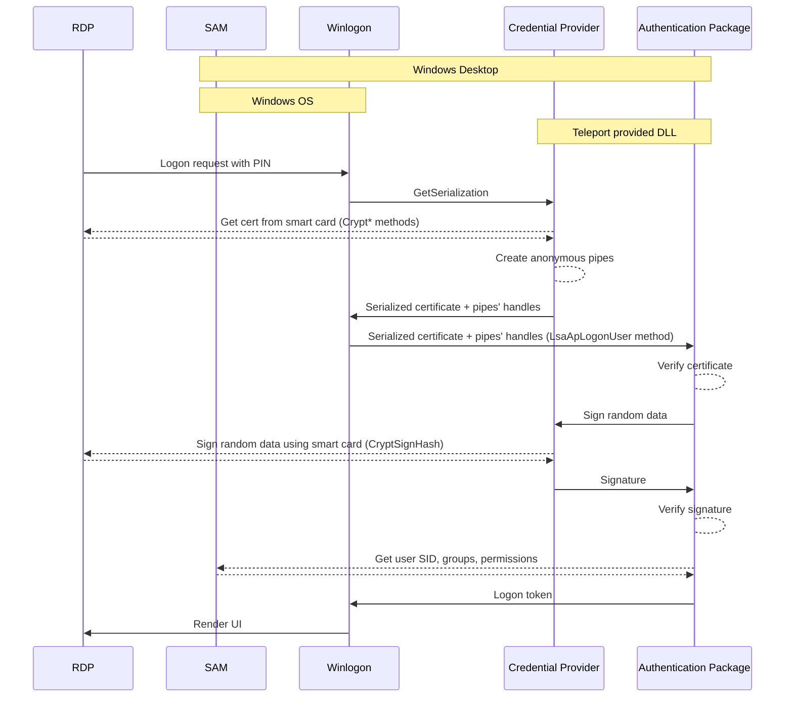

# RFD 0005e - Desktop access to hosts that are not connected to Active Directory

## Required Approvers

- Engineering: @zmb3 && (@ibeckermayer || @LKozlowski)
- Product: (@klizhentas || @xinding33)

## Overview

A common feature request of Teleport Desktop Access is for the ability to connect to hosts that are not part of any
Active Directory domain. Seeing as Teleport uses smart card login for accessing Windows hosts, and Windows only supports
smart card login for Active Directory domain-joined hosts, we need to come up with a new solution to support the non-AD
case.

The idea presented here has the user install a Teleport DLL library containing a custom authentication package and
credential provider on the Windows host. This authentication package and credential provider combination can then be
used to authenticate the user using a smart card certificate and log the user in.

## Details

### Glossary

- [Credential provider](https://learn.microsoft.com/en-us/windows/win32/secauthn/credential-providers-in-windows) - the
  service responsible for gathering credentials from the user. In the case of Teleport, they are the certificate and PIN
  of the smart card.
- [Authentication package](https://learn.microsoft.com/en-us/windows/win32/secauthn/windows-authentication-packages) -
  the service for providing a package-specific authentication method to the LSA. It's loaded by `lsass.exe` and runs as
  part of it
- [LSA](https://learn.microsoft.com/en-us/windows/win32/secauthn/lsa-authentication) - Local Security Authority - a
  protected Windows OS subsystem that authenticates and logs users onto the local system.
- [SAM](https://en.wikipedia.org/wiki/Security_Account_Manager) - Security Account Manager - part of the Windows OS, a
  database of user information like groups, permissions, and password hashes.
- [Winlogon](https://learn.microsoft.com/en-us/windows/win32/secauthn/winlogon-and-credential-providers) - a component
  of the Windows OS responsible for handling logon screens, loading profiles and locking the screen.
- [COM](https://learn.microsoft.com/en-us/windows/win32/com/component-object-model--com--portal) - Component Object
  Model - platform-independent, distributed, object-oriented system for creating binary software components

### Authentication flow



- Login request from RDP is handled by `Winlogon`
- It asks all registered credential providers for available credentials
- Teleport credential provider checks if request is for smart card login (identified by empty username and 8 character
  password)
- It creates anonymous pipes used later for signing process
- It returns a credential comprised of a certificate from a smart card and the name of the pipe that can be used to
  verify it
  (see [Certificate verification](#certificate-verification))  and instructs `Winlogon.exe` to auto-login with it
- `Winlogon` passes credential to our authentication package
- Authentication package verifies the certificate presented is correct and if so creates a login token that is used to
  start an interactive session for the user

All elements will be contained in a single DLL written in Go (with heavy use of CGO). It'll be installed using
the [regsrv32.exe](https://en.wikipedia.org/wiki/Regsvr32) mechanism - all installation steps will be contained in the
DLL itself.

Example installation script:

```shell
Invoke-WebRequest -Uri "https://cdn.teleport.dev/teleport.dll" -OutFile "C:\Windows\System32\teleport.dll"
regsvr32 /s C:\Windows\System32\teleport.dll
```

### Credential provider

Credential provider will implement multiple COM interfaces:

- [ICredentialProvider](https://learn.microsoft.com/en-us/windows/win32/api/credentialprovider/nn-credentialprovider-icredentialprovider)
  main interface used to create `ICredentialProviderCredential`
- [ICredentialProviderCredential](https://learn.microsoft.com/en-us/windows/win32/api/credentialprovider/nn-credentialprovider-icredentialprovidercredential)
  used to show UI during logon process and creates credential passed to authentication package
- [ICredentialProviderFilter](https://learn.microsoft.com/en-us/windows/win32/api/credentialprovider/nn-credentialprovider-icredentialproviderfilter)
  used to redirect credentials provided by RDP from default password credential provider to our custom provider

These interfaces will be implemented using the technique
described [here](https://www.codeproject.com/Articles/13601/COM-in-plain-C) translated to Go.

`FF285315-5335-4F69-A9A2-9CC5F8419D55` will be used as GUID for registering the Credential provider. This was randomly
generated - generally, it can be anything as long as it's higher than the system credential provider which starts
with `DD`.

The Credential provider is registered by creating the following keys in the registry (handled by `regsrv32`):

- `HKEY_LOCAL_MACHINE\SOFTWARE\Microsoft\Windows\CurrentVersion\Authentication\Credential Providers\{FF285315-5335-4F69-A9A2-9CC5F8419D55}` (
  points to the corresponding `CLSID` key below)
- `HKEY_LOCAL_MACHINE\SOFTWARE\Microsoft\Windows\CurrentVersion\Authentication\Credential Provider Filters\{FF285315-5335-4F69-A9A2-9CC5F8419D55}` (
  points to the corresponding `CLSID` key below)
- `HKEY_LOCAL_MACHINE\SOFTWARE\Classes\CLSID\{FF285315-5335-4F69-A9A2-9CC5F8419D55}` (
  see [CLSID](https://learn.microsoft.com/en-us/windows/win32/com/clsid-key-hklm)):
    - `InprocServer32`: `C:\Windows\System32\teleport.dll`
    - `ProgId`: `Teleport`

### Authentication package

Authentication package will implement a minimal set of methods required by Windows:

- `LsaApInitializePackage` used to initialize package and provides table with necessary helper functions
- `LsaApLogonUser` used for actual logon process - certificate verification and creation of tokens happens here
- `LsaApCallPackage`, `LsaApCallPackagePassthrough`, `LsaApCallPackageUntrusted`, `LsaApLogonTerminated` - empty
  implementations used in other scenarios, required in all authentication packages

`LsaApLogonUser` will verify certificate using Go's [x509 package](https://pkg.go.dev/crypto/x509) against system Root
CAs - Telport Root Certificate will have to be imported to system store. It will check that certificate has not expired
and that it has smart card logon key usage (OID 1.3.6.1.4.1.311.20.2.2). It will also verify challenge (
see [Certificate verification](#certificate-verification)).

If everything is correct it will ask the SAM database for user information
(
using [LsaGetAuthDataForUser](https://learn.microsoft.com/en-us/windows/win32/api/ntsecpkg/nc-ntsecpkg-lsa_get_auth_data_for_user)
,
[LsaConvertAuthDataToToken](https://learn.microsoft.com/en-us/windows/win32/api/ntsecpkg/nc-ntsecpkg-lsa_convert_auth_data_to_token)
,
and [GetTokenInformation](https://learn.microsoft.com/en-us/windows/win32/api/securitybaseapi/nf-securitybaseapi-gettokeninformation))
and will create logon token - similar thing is done by
OpenSSH [LSA implementation](https://github.com/PowerShell/Win32-OpenSSH/blob/master/contrib/win32/win32compat/lsa/Ssh-lsa.cpp#L657)
. It will also create profile buffer that's compatible with the
default [MSV1_0 authentication package](https://learn.microsoft.com/en-us/windows/win32/secauthn/msv1-0-authentication-package)
. Example of C implementation can be
found [here](https://github.com/Paolo-Maffei/OpenNT/blob/5c5b979ec08c17d3ca2eb70e8aad62d26515d01c/ds/lsa/msv1_0/nlp.c#L622)
.

The Authentication package is registered by adding the name of the DLL to the registry under a key (handled
by `regsrv32`):

- `HKEY_LOCAL_MACHINE\SYSTEM\CurrentControlSet\Control\Lsa\Authentication Packages`

### Certificate verification

To verify that the user has the private key of the presented smart card certificate, we will present it with a challenge
-- we will generate some random data and ask the user to sign it. To do that, we need to make use of
the [Microsoft Base Smart Card provider](https://learn.microsoft.com/en-us/previous-versions/windows/desktop/secsmart/microsoft-base-smart-card-cryptographic-service-provider)
and the [wincrypt API](https://learn.microsoft.com/en-us/windows/win32/api/wincrypt/). Unfortunately, calling Microsoft
Base Smart Card provider from the Authentication Package is impossible - the Authentication Package runs as part
of `lsass.exe` which runs in a context that doesn't have access to Microsoft Base Smart Card provider. Therefore, we
will instead access the smart card from the Credential Provider.

To do so, we will pair of anonymous pipes (as each pipe is unidirectional, and we need two-way communication) in the
Credential Provider, duplicate handles to write side of one pipe and read side of other into `lsass.exe` process and
pass them to the Authentication Package. The Authentication Package will generate the random data and send it through
the pipe to the Credential Provider, which will sign it using Microsoft Base Smart Card provider and
the [CryptSignHash](https://learn.microsoft.com/en-us/windows/win32/api/wincrypt/nf-wincrypt-cryptsignhasha) function.
It will then send the signature back to the Authentication Package using the other pipe, and the Authentication Package
will verify that the signature is correct using the public key from the certificate.

A new pair of pipes will be created for each logon request (meaning each request calls
to `ICredentialProvider::GetSerialization` followed by a call to `LsaApLogonUser`) and the pipe will be single use only,
it will close as soon as one signing request is handled.

### UX

- User downloads the Teleport DLL to `C:\Windows\System32\teleport.dll` and installs it
  using `regsrv32 \s C:\Windows\System32\teleport.dll`
- User installs the Teleport CA certificate to Windows Trusted Root CAs store
- User disables NLA for RDP
- User adds new host in `hosts` section of Desktop Service in the Teleport configuration file the same way it can be
  done currently
- the new Desktop will appear in the list of available Desktops, labels should be fully supported
- Manually enabling Smart Card service should not be required
- Some Antivirus Software might report custom Authentication Packages as malicious. This fact should be mentioned in
  documentation/deployment instruction to alleviate potential concerns

### Changes on Teleport side

We will reuse most of our current implementation. Only change will be in configuration - LDAP configuration won't be
required anymore. If it's not present we'll assume non-AD host and use default DNS for name resolution.

In first iteration we'll support on static host definition in configuration (no discovery).

Teleport's CA certificate will have to be imported on Windows host, there'll be no support for automatic CA rotation.

### Future improvements

In next iterations we can add support for discovery and automatic CA rotation. This can be achieved by making DLL
Teleport-aware - we can connect to Teleport cluster from it using joining token. This should be possible as it is
written in Go, so we can reuse our current code.
