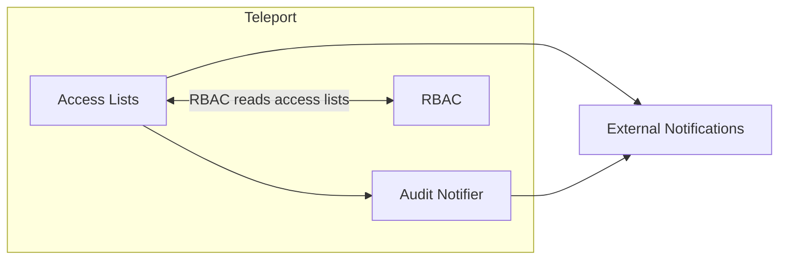

# RFD 0006e - Access Lists

## Required Approvers

- Engineering: @r0mant && @nklaassen && @fspmarshall
- Product: (@klizhentas || @xinding33)

## What

Allow Teleport users to request longer lived access to resources with
audit trails that describe access to those resources.

## Why

IT administrators frequently need answers to the following questions:

* "Who has access to production?"
  * Sometimes people just want to see a list of people, and don't want to
    have to care about which identity provider provided what traits,
    compare its config details to a mapping, etc.
* "Why does this person have access to production?"
  * Remembering why each person needed a given permission and/or if they
    still is annoying, and it gets even worse if you need to make
    multiple hops to even figure out who has each access.
* "Where do I need to go to review permissions, and how do I know I
  need to review them?"
  * Remembering to review permissions, and remembering where to go to
    review permissions is no fun whatsoever.

### Example

Travis, our IT team lead, described how they want Teleport to work with applications.

Each App registered in Okta (e.g. Salesforce) has one or several application owners.

Application owners periodically review what teams have access to the applications
because they are responsible for licenses and data in those apps.

For example, Ketanji is admin of Salesforce. She can review what teams get access to Salesforce
periodically.

Mary is a team lead of SDR team.

Alice and Bob are members of SDR team and would like to have access to Salesforce app.
Mary defines who is a member of the SDR team, periodically updating the team members.

Auditors would like to have a trail that proves that Ketanji and Mary periodically
review their team's structure and what teams have access to apps.

## Details
### The Plan

Today, the Okta service is capable of importing Okta applications and Okta user
groups into Teleport as Teleport applications and Teleport user groups. The
`okta_import_rule` resource will take care of applying labels to these imported
resources. More details on the Okta service and its implementation can be found
in the [Okta Integration RFD](./0003e-application-access-okta-integration.md).

We will introduce a new `access_list` resource that will help us to reflect
interactions between managers and application owners. This will be used to
connect the imported Okta applications and groups to our RBAC system with
minimal modifications.

### UX

#### Access List UI

* A new Access Lists item should appear in the Management navigation.
* Clicking on this will lead to a page for  managing access to access lists.
* This should only show up if the user has access to access lists, either via
  RBAC or ownership.

##### Managing Access Lists in the UI

* The access list page will have a heading for managing access to access
  lists.
* Owners can add and remove people from the access list directly, bypassing
  access requests.
* Users will also be able to audit the list of members and record a
  reason why the current level of access is justified. A notification
  will be displayed in the UI when the given audit interval for an
  access list has passed.

#### Access Request UX Modifications

Users will request resources using existing access requests flow with no changes.
Administrators will be reviewing those requests as usual via review access request
flow and will have an option to promote the access request and instead and add a user
to an access list. We call this process **promotion**.

As an example:

Alice would like to request access to app "Salesforce". She would go to the page
"Access requests", find an application and click "request access." On the access request
page, she would be able to specify a reason.

Bob is an administrator, and would receive a notification for the access request via Slack.
Bob logs in and sees the access request in the access requests tab. Bob decides that instead
of granting temporary access, he would like to grant permanent access, and select an option
"Add Alice to salesforce list for 5 months".

Alice would see her access request status changed, but instead of approved, the access request
UI would say "Your access has been granted. Re-login to get new permissions."


#### Teleport CLI

* A new `acl` subcommand will be added to `tsh` to allow interaction with
  access lists.
* `tctl acl ls` will show a list of access lists a user can request or can manage.
* `tctl acl show` will show information about an access list. For
  users who can manage the list, membership will be displayed.
* `tctl acl request-access` will allow users to request membership to an access list.
* `tctl acl review` will allow users to manage membership requests.
* `tctl acl users add` will allow users to explicitly add user
  membership to an access list.
* `tctl acl users rm` will allow users to explicitly remove user
  membership to an access list.
* `tctl acl users ls` will allow users to explicitly list membership for an access list.
* `tctl acl audit` will allow users to audit the access list and record a
  message justifying the current level of access.
* `tctl create` should allow administrators to create new access lists.

The Teleport request approval should add an option to promote the request into an access
list membership instead.

#### Notifications

We are relying on existing access request notification infrastructure completely. No
new features are being added.

#### Terraform

Terraform users should be able to define access lists and to specify
membership to those access lists through raw Terraform.

### High level architecture



Architecturally, access lists are simple. Access lists will be hooked
into Teleport's existing RBAC system.

An audit notifier will be necessary that simply inspects access lists
and sends a notification when the specified audit interval in the access
list object has elapsed without an audit message.

Additionally, when certain modifications to access lists occur, external
systems such as Slack should be notified for general awareness.

### `AccessList` Object

We will need to implement the access list object as specified below.

```yaml
kind: access_list
metadata:
  name: "prod-east-db-access"
spec:
  desc: "Access list for people working on prod-east"
  owners:
    - name: alice@example.com
      desc: "alice is in charge of db access for this region"
  # The access list must be audited with the given interval. If there
  # is no audit in this interval, a notification will be sent.
  audit:
    # This frequency is parsed by golang's time.ParseDuration.
    frequency: 4380h # 6 months
  # users cannot join without these roles traits, and membership has no
  # effect if these are revoked
  membership_requires:
    roles:
      - editor
    traits:
      team: dev
  # owners cannot be added without these roles or traits, and lose the
  # ability to administrate this list if these are revoked.
  ownership_requires:
    roles:
      - editor
    traits:
      team: admins
  grants:
    roles: [us-east-db-access]
    # membership in this access list results in a user getting those extra traits
    traits:
       app: salesforce
  members:
    - name: bob@example.com
      joined: 2023-01-01
      expires: 2023-02-01
      reason: "bob is helping us migrate all prod backends to one large excel sheet"
      added_by: alice@example.com
    - name: carol@example.com
      joined: 2022-08-19
      expires: 2024-01-01
      reason: "carol is in charge of posting customer passwords to dark web"

  requested_membership:
    - name: dave@example.com
      requested_on: 2023-01-02
      expires: 2023-01-04
      reason: "I collect ssns as a hobby"
```

#### The `ownership_requires` section

If an owner loses access to one of the requirements in the `ownership_requires` section,
they will lose the ability to manage this `AccessList`. This is primarily to avoid users
retaining a higher level of access than anticipated when removing `role` access within
Teleport. For example:

Alice owns the `SalesforceAdmins` access list which requires the Teleport role
`salesforce-it-admins`. Alice is later transferred to a different group within the company,
and she is removed from the `salesforce-it-admins` role. She will no longer be able to approve
or manage this `SalesforceAdmins` access list even if she is marked as an owner.

#### Trait recommendations

We should document that unique trait names should be used to avoid side
effects. An example of a unique trait would be something like:

```
app: `{{external[group_app_access]}}`
```

We could potentially introduce trait namespacing of some kind so that
traits can be specified specifically for target roles, for example:

```
traits: { my-role/app: salesForce }
```

However, I would recommend we go for the former for simplicity of
implementation.

### Audit notifier

A simple audit notifier service must be created that notifies when access
lists need to be audited. This service should run on the auth server and,
at the frequency specified in the access list, should be inspected to see
if an audit log has been recorded in the given time frame. If not, a
notification should be sent.

### Backend modifications

#### AccessList object

The `AccessList` object will need to be created.

#### `UserLoginState` object

A new `UserLoginState` object will need to be created that stores ephemeral data related
to a user login. This is intended to differentiate the `User` object, which has a fixed
definition, from its end state, which may have access list lists or login rules applied.

```yaml
kind: user_login_state
metadata:
  # The name of the user login state must match the associated user object.
  name: user-id
spec:
  # These roles will be used, in addition to the user's fixed roles, when doing RBAC calculations.
  roles:
  - added-role1
  - added-role2
  - added-role3
  # These traits will be used, in addition to the user's fixed roles, when doing RBAC calculations.
  traits:
    trait1: value1
    trait2: value1
```

##### `UserLoginState` reconciliation

When a user logs into Teleport, the `UserLoginState` should be regenerated each time.

#### RBAC modifications

##### `access_list` resource

There will be a new RBAC resource `access_list` that will have all the usual verbs
to control how Teleport administrators can directly create, read, list, modify, and
delete access lists. These will all be added to the preset `editor` role:

```yaml
spec:
  allow:
    rules:
    - resources:
      - access_list
      verbs:
      - list
      - create
      - read
      - update
      - delete
```

These RBAC verbs will only be necessary for Teleport administrators (or automation tools)
who need to create and delete access lists, and list all access lists in the cluster, they
will not be necessary for normal owners or members of the lists. Owners and members will have
special RBAC exceptions to be able to read and list `access_list` resources that they are
owners/members of already, or would be able to request access to. Owners will have a special RBAC
exception to be able to modify the members, audit_interval, and membership_requires fields.

##### The `UserLoginState` object

When creating certificates, `UserLoginState` objects will be used to add to the roles and
traits in the user certificate. By doing this, no modifications will be needed to RBAC itself.

### Audit Events

A number of new audit events will be created as part of this effort:

| Event Name | Description |
|------------|-------------|
| `ACCESS_LIST_CREATED` | Emitted when an access list has been created. |
| `ACCESS_LIST_MODIFIED` | Emitted when an access list has been modified (excluding list membership). |
| `ACCESS_LIST_DELETED` | Emitted when an access list has been deleted. |
| `ACCESS_LIST_MEMBERSHIP_REQUESTED` | Emitted when membership to an access list has been requested. |
| `ACCESS_LIST_MEMBERSHIP_APPROVED` | Emitted when membership to an access list has been approved. |
| `ACCESS_LIST_MEMBERSHIP_DENIED` | Emitted when membership to an access list has been denied. |
| `ACCESS_LIST_MEMBERSHIP_EXPIRED` | Emitted when membership to an access list has expired. |
| `ACCESS_LIST_MEMBERSHIP_REMOVED` | Emitted when membership to an access list has been explicitly removed. |
| `ACCESS_LIST_NEEDS_AUDIT` | Emitted when an access list needs to be audited. |
| `ACCESS_LIST_AUDITED` | Emitted when an access list has been audited. |

Access list membership events should have the following metadata:

```yaml
name: erica@example.com
joined_on: 2022-11-30
removed_on: 2022-12-30
reason: "membership expired"
```

The `ACCESS_LIST_AUDITED` event should have the following metadata:

```yaml
auditor: alice@example.com
on: 2022-12-01
msg: "all these folks still need access!"
```

### Security

* This has the potential to modify RBAC heavily, so we must take care not
  to break any existing RBAC behavior.

## Implementation plan

### `AccessList` object

The new `AccessList` object should be implemented along with its backend
service and related interfaces. The cache should be updated as part of
this as well.

### `AccessList` gRPC modifications

gRPC methods must be introduced and our existing gRPC services must be
modified to handle them.

### RBAC modifications

RBAC modifications must be made to made in order to handle the permissions
specified in the `AccessList` objects.

### CLI modifications

The new access list CLI commands should be implemented.

### UI modifications

The new access list UI functionality should be implemented.

### Audit notifier

The audit notifier must be implemented.

### Audit events

The audit events should be added and emitted properly.
