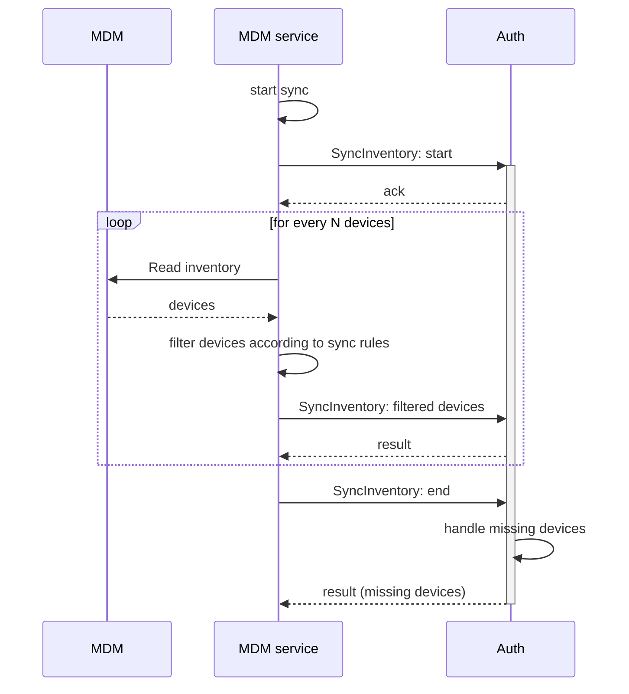
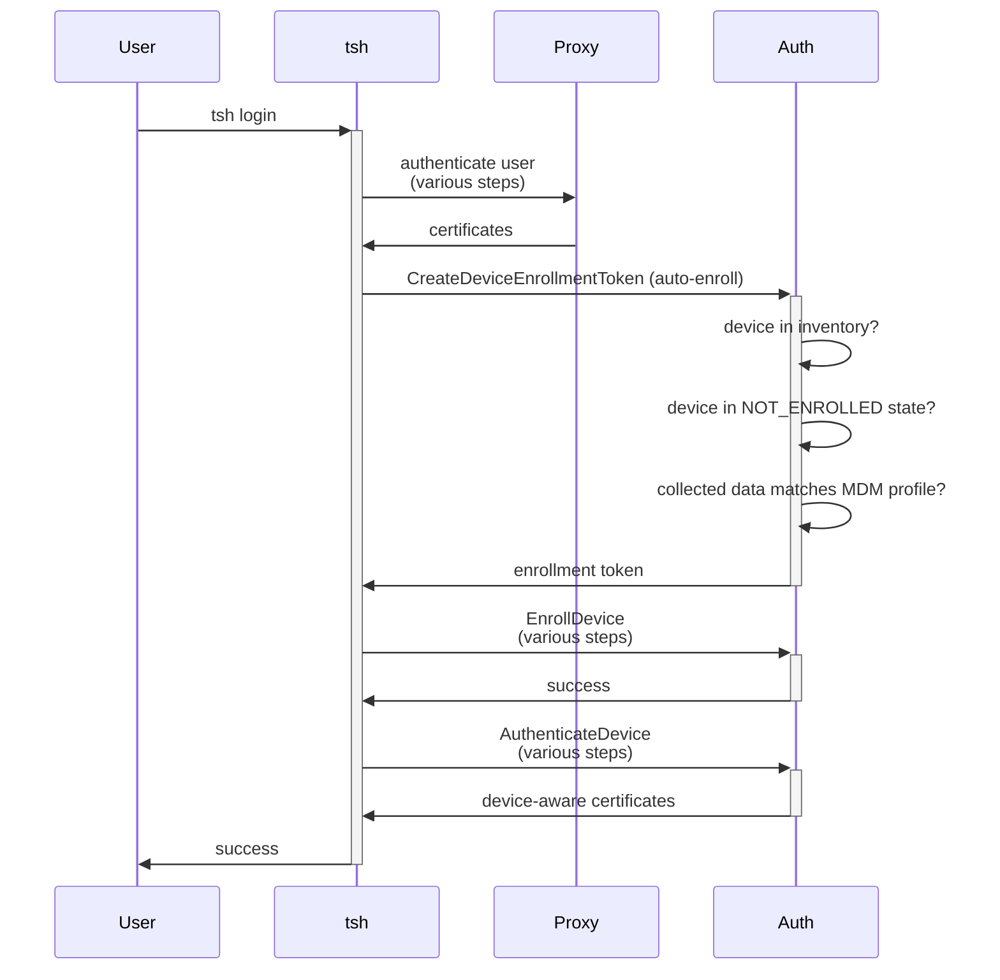
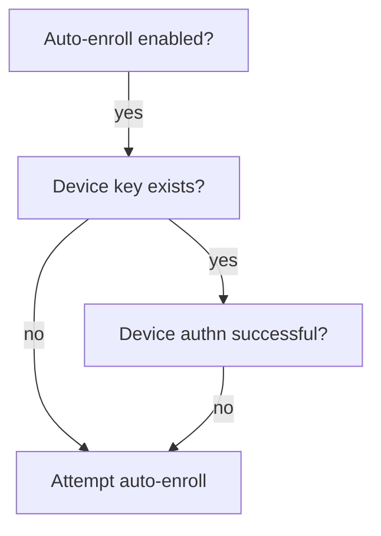

# RFD 0007e - Device Trust MDM integration

## Required approvers

* Engineering: (@zmb3 || @rosstimothy)
* Security: @reed || @jentfoo
* Product: (@xinding33 || @klizhentas)

## What

Describe how Device Trust integrates with commonly-used MDM (Mobile Device
Management) systems, like Jamf and Microsoft Intune.

MDM integration includes both inventory sync from the MDM to Teleport, as well
as a practical solution for automated device enrollment.

See the shorter [Device Trust/MDM integration
proposals](https://docs.google.com/document/d/1PR8IyxVMXxRoeoSLaNICgudciKN2FeaP8L3ViGBkZ6Y/edit)
for a quick summary of initial integration choices.

## Why

Most enterprises use one or more MDMs, such as [Jamf](https://www.jamf.com/) or
[Intune](https://www.microsoft.com/en-us/security/business/endpoint-management/microsoft-intune),
as part of their device management solution. Keeping a second source of truth
for devices in Teleport is impractical and undesirable for those customers.

MDMs do their own brand of enrollment, often configured to be automatic. Adding
a Teleport-specific ceremony that requires manual steps from various actors is
far from ideal. We must raise the bar and offer secure, practical and automated
enrollments for Device Trust, leveraging existing MDM installations.

This RFD is an expected follow-up from the original [Device Trust RFD][dt-rfd].

## Details

The design is divided between MDM-agnostic and MDM-specific parts. MDM-specific
code is kept in a per-MDM service, which syncs itself with Auth using the Device
Trust gRPC API.

Inventory sync has two parts: the first is querying the MDM API, the second is
sending the results of that sync to the Device Trust API (running in the Auth
Server).

Automatic enrollment is based in the current state of the Teleport device
inventory, thus it's MDM agnostic.

### Inventory sync



The MDM service is a separate Teleport service, configured as jamf\_service or
intune\_service, that may be run outside of Cloud (akin to
[okta_service](https://github.com/gravitational/teleport.e/blob/master/rfd/0003e-application-access-okta-integration.md#okta-service-and-configuration)).
It is defined as a separate service so Teleport doesn't have to hold sensitive
MDM credentials. It's also the component responsible for running MDM-specific
logic.

The MDM service must join Teleport using an "mdm" join token; all future
communication with Teleport is authorized by its certificate. It's responsible
for periodically reading the MDM inventory, filtering it according to its
configured sync rules, and sending the resulting devices to Teleport.

Behind the covers, all MDM services are backed by a generic implementation, in
order to reduce the boilerplate necessary to create a new service.

A new streaming RPC, `SyncInventory`, is added to the API. It allows both
partial and full inventory sync, explicit removal of devices and handling of
missing devices for full sync. (Missing devices are devices absent in the
external inventory, but present in Teleport.)

<details open><summary>Protocol buffers</summary>

Message changes:

```diff
service DeviceTrustService {
  // (...)
+
+  // Syncs device inventory from a source exterior to Teleport, for example an
+  // MDM.
+  // Allows both partial and full syncs; for the latter, devices missing from
+  // the external inventory are handled as specified.
+  // Authorized either by a valid MDM service certificate or the appropriate
+  // "device" permissions (create/update/delete).
+  rpc SyncInventory(stream SyncInventoryRequest) returns (stream SyncInventoryResponse);
}

message Device {
  // (...)
+
+  // Source of the device.
+  // An absent source means the device is managed directly via Teleport.
+  DeviceSource source = 11;
}

message DeviceOrStatus {
  // (...)
+
+  // If true, the device in question was deleted instead of created or updated.
+  bool deleted = 3;
}
```

New messages:

```proto
message DeviceSource {
  string name = 1; // Matches the MDM service name.
  DeviceOrigin origin = 2;
}

enum DeviceOrigin {
  DEVICE_ORIGIN_UNSPECIFIED = 0;

  // Devices originated from direct API usage.
  DEVICE_ORIGIN_API = 1;

  // Devices originated from Jamf.
  DEVICE_ORIGIN_JAMF = 2;

  // Source originated from Microsoft Intune.
  DEVICE_ORIGIN_INTUNE = 3;

  // Additional origins added as needed/requested.
}

enum SyncInventoryMode {
  SYNC_INVENTORY_MODE_UNSPECIFIED = 0

  // Partial inventory sync; not all devices in the external inventory are sent
  // to the stream.
  // Partial sync precludes inventory cleanup.
  SYNC_INVENTORY_MODE_PARTIAL = 1;

  // Full inventory sync; all devices in the external inventory must be sent to
  // the stream.
  // Full sync allows for handling of missing devices.
  SYNC_INVENTORY_MODE_FULL = 2;
}

enum SyncInventoryDeviceAction {
  SYNC_INVENTORY_DEVICE_ACTION_UNSPECIFIED = 0;

  // Noop is a no-action.
  SYNC_INVENTORY_DEVICE_ACTION_NOOP = 1;

  // Deletes the device if the action condition is met.
  SYNC_INVENTORY_DEVICE_ACTION_DELETE = 2;
}

// Request message for inventory sync.
//
// A typical message sequence is as follows:
// (-> means client-to-server, <- means server-to-client)
// -> SyncInventoryStart
// <- SyncInventoryAck
// (loop)
// -> SyncInventoryDevices (add/remove devices)
// <- SyncInventoryResult
// (end loop)
// -> SyncInventoryEnd
// <- SyncInventoryResult (missing devices)
message SyncInventoryRequest {
  oneof payload {
    SyncInventoryStart start = 1;
    SyncInventoryEnd end = 2;
    SyncInventoryDevices devices_to_upsert = 3;
    SyncInventoryDevices devices_to_remove = 4;
  }
}

message SyncInventoryResponse {
  oneof payload {
    SyncInventoryAck ack = 1;
    SyncInventoryResult result = 2;
  }
}

message SyncInventoryStart {
  // Source of the inventory sync.
  // Acquired from the mTLS certificate for MDM services, must be explicitly
  // supplied otherwise.
  // This source is used for all devices. The `source` field in individual
  // devices is ignored by this RPC.
  DeviceSource source = 1;

  // Mode of syncing.
  // Required.
  SyncInventoryMode mode = 2;

  // Action for devices missing from the external inventory, but present in
  // Teleport.
  // Only executed if mode is FULL.
  SyncInventoryDeviceAction on_missing_action = 3;
}

// Signifies the client-side end of a sync.
// Used as a trigger for missing cleanup on FULL syncs.
message SyncInventoryEnd {
  // True if the external sync was fully successful (for example, all reads from
  // an MDM API were successful).
  // If false the on_missing_action is skipped.
  bool external_sync_successful = 1;
}

message SyncInventoryDevices {
  // Devices to sync.
  repeated Device devices = 1;
}

// The ack message is used to confirm successful processing of messages that
// lack a more specific response.
message SyncInventoryAck {}

message SyncInventoryResult {
  // Devices modified, in the same order as the input when applicable.
  repeated DeviceOrStatus devices = 1;
}
```

</details>

#### Why is SyncInventory a stream?

A main feature of inventory sync is the ability to sync the entire external
inventory at once, allowing Teleport to remove (or otherwise handle) devices
that are present in its storage but missing from the external inventory.

Full inventory sync transfers a non-trivial amount of data, enough that large
inventories may surpass the usual message limits for unary RPCs. Additionally,
in an unary RPC solution, the MDM service itself has to do the bookkeeping for
missing devices, which includes reading the complete inventory from both the MDM
and Teleport - another significant data transfer (albeit smaller than the
MDM-side).

A stream solves both the issues of max unary RPC size and pushes the inventory
cross-check to Teleport.

Note that, without sync mode=FULL, sequences of unary RPCs become a perfectly
valid solution.

#### Sources and ownership

Inventory sync adds the concept of device sources to the Device Trust system.
Sources are necessary so missing devices can be identified.

A source takes ownership of a device any time it syncs the {os\_type,asset\_tag}
pair that represents it. If multiple sources "own" the same device, a situation
that isn't expected in practice, then ownership will "flip" according to the
most recent writes; Teleport makes no special attempt in managing such
situations.

All devices initially written via `tctl` or the Device Trust gRPC APIs are
attributed to the `null` source. Once a device is assigned to a source via sync,
that source is preserved unless explicitly overwritten.

<details open><summary>Storage definitions</summary>

```diff
type storedDevice struct {
  // (...)
+
+  Source *storedDeviceSource `json:"source,omitempty"`
}
```

```go
type storedDeviceSource struct {
  Name   string `json:"name"
  Origin int    `json:"origin" // Same as devicepb.DeviceOrigin
}
```

</details>

#### FULL syncs, memory and performance trade-offs

The implementation of FULL inventory sync has to perform a balancing act between
memory usage and storage operations; it wants neither to hold all devices in
memory (effectively duplicating storage), nor it wants to needlessly re-write
all observed devices (potentially re-writing all devices).

The algorithm described below is a baseline for the intended implementation. The
actual implementation may differ, or could be revisited in time to perform
different trade-offs. Nevertheless, it's expected to be intentional about its
choices.

The RFD baseline is to hold enough information in memory to identify all
observed devices: specifically, the OS type, asset tag and underlying storage
ID. At the end of the sync, assuming the on\_missing\_action is to be applied,
the service iterates again through all stored devices (in size-bound batches)
and issues deletions for unseen devices owned by the sync's source. The
in-memory OS type and asset tag are used to identify the device, and the storage
ID is used to avoid unmarshaling keys it's seen before.

Writes are only issued if the device was modified (this is the default update
behavior). Additionally, in scenarios where a FULL sync is not requested or the
on\_missing\_action is a NOOP, the in-memory bookkeeping doesn't have to happen.

In practice this causes:

* A read for each observed device, followed by an update if there were changes
* A full scan of all devices, in size-bound batches, skipping the unmarshal of
  already observed keys and skipping devices of unrelated sources
* A delete for every non-observed device of the sync source, issued alongside
  the reads above

For each device, we estimate the following use of memory as follows (estimated
up for a safety margin):

* OS type: 4 bytes (int32, in practice could downcast to a smaller type)
* Asset tag: 20 bytes/characters (12 for Mac serial number)
* ID: 40 bytes/characters (in practice a 36-bytes UUID)

Summing up:

* 1 device = 64 bytes
* 100\_000 devices = 64*100000/1024/1024 ~= 6.08 MB
* 1\_000\_000 devices ~= 61.03 MB

Memory consumption is linear according to the number of observed devices. This
is deemed acceptable as the memory used per-device is relatively small.
Estimated at 64*M bytes (where M is the number of observed devices).

The number of reads is the number of observed devices, plus one iteration over
the entire device key set, so M+N (M as above, N is the number of stored
devices).

The number of writes is, at most, M.

#### Sync audit and alerts

All sync operations are written to the audit log, under the event code `TV008I`
(inventory sync), including a summary of the operation.

Additionally, a history of recent sync operations is kept in storage. If certain
consecutive failure limits are reached a cluster alert is created (for example,
2 consecutive partial or full syncs failed). Entries are written to the
`devices/sync_history/{id}` key. Only a number of entries necessary to calculate
the alerts is kept.

Cluster alerts are raised with medium severity and shown on login for all users
with the `token:create` or `device:create` permissions.

<details open><summary>Proto and storage definitions</summary>

Message changes:

```diff
message DeviceEvent {
  // ...

+  MDMServiceMetadata mdm_service = 5;
+  InventorySyncMetadata sync = 6;
}
```

New messages:

```proto
message MDMServiceMetadata {
  int origin = 1; // Same as devicepb.DeviceOrigin
  string name = 2;
}

message InventorySyncMetadata {
  int sync_mode = 1; // Same as devicepb.SyncInventoryMode
  int devices_added = 2;
  int devices_removed = 3;
}
```

Storage definitions:

```go
type syncHistory struct {
	CreateTime     time.Time `json:"create_time"`
	Mode           int       `json:"mode"` // Same as devicepb.SyncInventoryMode
	DevicesAdded   int       `json:"devices_added,omitempty"`
	DevicesRemoved int       `json:"devices_removed,omitempty"`
	Successful     bool      `json:"successful"`
	Failures       []string  `json:"failures,omitempty"` // List of error messages, truncated.
}
```

</details>

#### Device updates

Device updates are now supported by Device Trust. This is partly due to new
mutable fields, and partly extended so devices may be unenrolled by admins (via
setting `enroll_status` to `NOT_ENROLLED`). Updates may only transition
`enroll_status` to `NOT_ENROLLED`, as transitions to `ENROLLED` require a
successful, client-initiated enrollment ceremony.

Device updates are allowed via `tctl` resources, but follow the same semantics
of API updates: only mutable fields may change. It's possible to `tctl create
-f` or `tctl edit` devices.

Updates are written to the audit log using code `TV007I` (device update).

<!--
Note: UpdateDevice and UpsertDevice are wanted by multiple RFDs, thus landed on
https://github.com/gravitational/teleport/pull/23544.

Kept the design below so at least one RFD tracks them.
 -->

<details open><summary>Protocol buffers</summary>

Message changes:

```diff
service DeviceTrustService {
  // (...)
+
+  // UpdateDevice is a masked device update.
+  // Follows the semantics of
+  // https://cloud.google.com/apis/design/standard_methods#update.
+  rpc UpdateDevice(UpdateDeviceRequest) returns (Device);
}
```

New messages:

```proto
message UpdateDeviceRequest {
  // Device to update.
  Device device = 1;

  // Only "enroll_status", "source" and "profile" are supported.
  google.protobuf.FieldMask update_mask = 2;
}
```

</details>

### Automatic enrollment



When automatic enrollment is enabled, users are allowed to issue device
enrollment tokens for their current device, even without the
[`device/create_enroll_token`](https://github.com/gravitational/teleport.e/blob/master/rfd/0001e-device-trust.md#configuration-and-roles)
permission.

The following conditions must be met before automatic device enrollment token
issuance is allowed:

1. Automatic enrollment is active in the cluster
2. The device is present in the Teleport inventory
3. The device is currently in the [NOT_ENROLLED][device-enroll-status] state
4. Collected data from device matches both previous data and the device profile

Manual intervention may be necessary to meet the conditions in special
situations. For example: a returned device must be unenrolled before it is
assigned to a new user (3). This trade-off is considered positive, as it stops
automatic re-assignment of devices.

If automatic enrollment is possible, then `tsh` will attempt to create an
enrollment token and enroll the device during login attempts, assuming it isn't
already capable of clearing device authn. See the example flowchart below:



Automatic enrollment is an iteration of the
[auto-enroll](https://github.com/gravitational/teleport.e/blob/master/rfd/0001e-device-trust.md#auto-enroll)
alternative in the original Device Trust RFD.

<details open><summary>Protocol buffers</summary>

Message changes:

```diff
message CreateDeviceEnrollTokenRequest {
  // (...)
+
+  // Device collected data.
+  // Used to allow issuance of device enrollment tokens for auto-enrollment.
+  DeviceCollectedData device_data = 2;
}
```

</details>

#### Configuration

Auto-enrollment must be enabled in the cluster settings, as below:

```yaml
version: v2
kind: cluster_auth_preference
metadata:
  name: cluster-auth-preference
spec:
  device_trust:
    mode: required
    auto_enroll: yes
```

#### Collected data

Auto-enrollment matches device data against previously collected data and the
device profile. Device profile information is supplied via the `SyncInventory`
RPC.

For auto-enrollment to be allowed collected data must match the device profile
exactly, within reason, meaning we expect the profile to be fresh.

The following data points are added, in reference to the Teleport 12.1 Device
Trust implementation:

* Model identifier
* OS version
* OS build
* OS username
* macOS enrollment profiles
* Jamf binary version

<details open><summary>Protocol buffers</summary>

Message changes:

```diff
message Device {
  // (...)
+
+  // Device information acquired from an external source.
+  DeviceProfile profile = 12;
}

message DeviceCollectedData {
  // (...)
+
+  // See corresponding fields in DeviceProfile.
+  string model_identifier = 5;
+  string os_version = 6;
+  string os_build = 7;
+  string os_username = 8;
+  string jamf_binary_version = 9;
+
+  // Output of `/usr/bin/profiles status -type enrollment`.
+  // Used to verify the presence of an enrollment profile.
+  string macos_enrollment_profiles = 10;
}
```

New messages:

```proto
// Device profile information acquired from an external source.
// If present, it's used to further validate collected data.
message DeviceProfile {
  // Latest profile update timestamp.
  // System managed.
  google.protobuf.Timestamp update_time = 1;

  // Non-descriptive model identifier.
  // Example: "MacBookPro9,2".
  // ("model" in `ioreg -c IOPlatformExpertDevice -d 2`)
  string model_identifier = 2;

  // OS version number, without the leading 'v'. See Device.os_type for the
  // broad OS category.
  // Example: "13.2.1".
  // (`sw_vers`)
  string os_version = 3;

  // OS build identifier. Augments the os_version.
  // Example: "22D68".
  // (`sw_vers`)
  string os_build = 4;

  // Known OS users (distinct from the Teleport user).
  // (`whoami`)
  repeated string os_usernames = 5;

  // Jamf binary version, without the leading 'v'.
  // Example: "9.27" or "10.44.1-t1677509507".
  // (`/usr/local/bin/jamf version`)
  string jamf_binary_version = 6;
}
```

<details open><summary>Storage definitions</summary>

```diff
type storedDevice struct {
  // (...)
+
+  Profile *storedDeviceProfile `json:"profile,omitempty"`
}

type storedCollectedData struct {
  // (...)
+
+  ModelIdentifier         string `json:"model_identifier,omitempty"`
+  OSVersion               string `json:"os_version,omitempty"`
+  OSBuild                 string `json:"os_build,omitempty"`
+  OSUsername              string `json:"os_username,omitempty"`
+  JamfBinaryVersion       string `json:"jamf_binary_version,omitempty"`
+  MacOSEnrollmentProfiles string `json:"macos_enrollment_profiles,omitempty"`
}
```

```go
type storedDeviceProfile struct {
  UpdateTime        time.Time `json:"update_time"`
  ModelIdentifier   string    `json:"model_identifier,omitempty"`
  OSVersion         string    `json:"os_version,omitempty"`
  OSBuild           string    `json:"os_build,omitempty"`
  OSUsernames       []string  `json:"os_usernames,omitempty"`
  JamfBinaryVersion string    `json:"jamf_binary_version,omitempty"`
}
```

</details>

### Jamf

Jamf integration is mainly done by the jamf_service, a standalone Teleport
Enterprise service.

Jamf integration requires the [Jamf Pro
API](https://developer.jamf.com/jamf-pro/docs/jamf-pro-api-overview). Only read
access is required, the MDM service never writes to the MDM itself.

teleport.yaml:

```yaml
teleport:
  # Either proxy_server or auth_server must be present.
  proxy_server: teleport-proxy.example.com:443

jamf_service:
  enabled: true
  api_endpoint: https://yourserver.jamfcloud.com
  username: yourusername
  password_file: /path/to/jamf/password

auth_service:
  enabled: false

proxy_service:
  enabled: false

ssh_service:
  enabled: false
```

Note that a license is not required to run jamf_service, but the Auth APIs it
requires to function do require a license.

#### Jamf inventory sync

Jamf Pro API authn/z is described here: [authentication and
authorization](https://developer.jamf.com/jamf-pro/docs/jamf-pro-api-overview#authentication-and-authorization).
In a few words, username and password are exchanged for a bearer token used to
authorize access to other endpoints.

Inventory sync is implemented using the
[/v1/computers-inventory][jamf-get-computers-inventory] endpoint.

Device profile data is mapped as follows:

| Device Profile      | Jamf Device                   |
| ---                 | ---                           |
| model_identifier    | hardware.modelIdentifier      |
| os_version          | operatingSystem.version       |
| os_build            | operatingSystem.build         |
| os_usernames        | localUserAccounts[n].username |
| jamf_binary_version | general.jamfBinaryVersion     |

Users may configure various inventory sync filters, each with separate missing
device triggers. Filters are applied directly by jamf_service, so filtered
devices are never seen by the `SyncInventory` RPC. In the absence of explicit
filters the service assumes a default configuration where all devices are
synced.

Filters are declared using the built-in Jamf API RSQL capabilities in
[/v1/computers-inventory][jamf-get-computers-inventory]. Since filtering is
dependent on the MDM API capabilities, not all MDMs support filtering to begin
with. See [predicate inventory filters](#predicate-inventory-filters) for an
alternative.

teleport.yaml:

```yaml
jamf_service:
  enabled: true
  api_endpoint: ...
  username: ...
  password_file: ...

  inventory:
    # Example: sync managed/macOS devices only.
  - filter_rsql: 'general.remoteManagement.managed==true and general.platform=="Mac"'

    # Partial period must be < sync_period_full, otherwise it'll never trigger.
    # Zero or negative to disable.
    sync_period_partial: 6h

    # Zero or negative to disable.
    sync_period_full: 24h

    # Missing device action, only effective for FULL syncs.
    on_missing: DELETE
```

The default filters are equivalent to:

```yaml
inventory:
- filter_rsql: 'general.remoteManagement.managed==true'
  sync_period_partial: 6h
  sync_period_full: 24h
  on_missing: DELETE
```

Partial syncs are optimized according to each MDM service. For Jamf, the latest
general.reportDate found in the last partial/full sync can be used as a filter
to avoid re-processing devices. Sync schedule is kept in-memory by the Jamf
service and kicked off as soon as the service starts, with a small random start
delay.

Config toggles are provided to control both the initial sync delay and for a
one-shot sync execution style. The latter makes it possible to run jamf_service
on demand, although it precludes future online queries. Full syncs are favored
in this mode of operation and syncs start with no delay.

```yaml
jamf_service:
  sync_delay: 20m
  exit_on_sync: true  # Ignores sync_delay, exits immediately after sync.
```

[jamf-get-computers-inventory]: https://developer.jamf.com/jamf-pro/reference/get_v1-computers-inventory

### Intune

Intune integration mirrors [Jamf](#jamf), declaring a similar service called
`intune_service`.

Intune integration uses the Microsoft Graph REST API 1.0. Authentication is done
using the [OAuth 2.0 client credentials grant
flow](https://learn.microsoft.com/en-us/graph/auth-v2-service). Admins must
create a client ID and secret for intune_service, adding the
`DeviceManagementManagedDevices.Read.All` permission. Only read access is
required, the MDM service never writes to the MDM itself. (Intune integration
requires an active Intune license.)

teleport.yaml:

```yaml
teleport:
  proxy_server: teleport-proxy.example.com:443

intune_service:
  enabled: true
  tenant: 68aa328c-436b-474f-8095-fada78fa3826
  login_endpoint: https://login.microsoftonline.com
  api_endpoint: https://graph.microsoft.com/v1.0
  client_id: b5951eeb-4f86-45d4-8eb8-328ee63cbe4e
  client_secret_file: /path/to/intune/client_secret

auth_service:
  enabled: false

proxy_service:
  enabled: false

ssh_service:
  enabled: false
```

Intune service does not require an Enterprise license to run.

#### Intune inventory sync

Intune inventory sync uses the
[managedDevice](https://learn.microsoft.com/en-us/graph/api/resources/intune-devices-manageddevice?view=graph-rest-1.0_)
resource.

Device mapping:

| Device              | managedDevice     |
| ---                 | ---               |
| os_type             | operatingSystem\* |
| asset_tag           | serialNumber\*    |

Profile mapping:

| Device Profile      | managedDevice       |
| ---                 | ---                 |
| model_identifier    | model\*             |
| os_version          | osVersion\*         |
| os_build            | not available       |
| os_usernames        | not available       |
| jamf_binary_version | not available       |

The managedDevice API offers just a couple of basic search filters (see mentions of `$filter` in
[managedDevice resource type](https://learn.microsoft.com/en-us/graph/api/resources/intune-devices-manageddevice?view=graph-rest-1.0)).
Most of the customers use the hosted plugin for Jamf where the filters are not available, therefore
the Intune integration is not going to support filters for the time being.

<!--
TODO(codingllama): Design rudimentary filtering for Intune?
 -->

Partial syncs take advantage of the latest `lastSyncDateTime` found in the last partial or full sync
to limit the number of devices fetched from Intune.

teleport.yaml:

```yaml
intune_service:
  enabled: true
  tenant: ...
  client_id: ...
  client_secret_file: ...

  inventory:
    sync_period_partial: 6h
    sync_period_full: 24h
    on_missing: DELETE
```

Similarly to Jamf, the `sync_delay` and `exit_on_sync` config toggles are
supported.

\* The managedDevice API is light on details, particularly examples, so without
further testing it's unclear whether the fields above yield the information we
expect, and in what format the information is presented.

<!--
TODO(codingllama): Confirm mappings above after practical testing with Intune.
 -->

### Security

[Inventory sync](#inventory-sync) requires two sets of credentials:

1. MDM credentials, scoped to the MDM service (jamf_service or intune_service)
2. An MDM service certificate, used to call `SyncDevices`

It's possible to call `SyncDevices` manually. In this case, the Teleport
credentials used need permissions to perform create/update/delete on devices.

[Automatic enrollment](#automatic-enrollment) allows users to issue device
enrollment tokens for their own device, provided all relevant preconditions are
met. In particular:

1. Automatic enrollment is enabled in the cluster
2. Collected data in the user device must match the stored device, including MDM
   profile data
3. The device must not be in the [`ENROLLED`][device-enroll-status] state

Those conditions ensure that enrolling a device requires knowledge of the device
inventory and prohibit re-enrollment of the same device. (The practical caveat
here is that returned devices must be manually updated to `NOT_ENROLLED` before
being assigned to a separate user.)

[Manual
enrollment](https://github.com/gravitational/teleport.e/blob/master/rfd/0001e-device-trust.md#enrollment-ceremony)
is unchanged and works the same as in the base RFD.

### UX

Automatic enrollment must be enabled in the cluster settings:

```diff
version: v2
kind: cluster_auth_preference
metadata:
  name: cluster-auth-preference
spec:
  device_trust:
    mode: required
+   auto_enroll: yes
```

Updating devices via `tctl create -f` is now viable (mutable fields only). A
standalone `tctl devices update` command is also viable, but it is not designed
in this RFD.

Two new services are added to Teleport, jamf_service and intune_service.

Jamf service configuration:

```yaml
jamf_service:
  enabled: true
  name: jamf           # default
  sync_delay: 5m       # defaults to a random delay.
  exit_on_sync: false  # default

  # Jamf API endpoints.
  api_endpoint: https://yourserver.jamfcloud.com

  # Jamf API credentials.
  username: yourusername
  password_file: /path/to/jamf/password

  inventory:
  - filter: 'general.remoteManagement.managed == true && general.supervised == true'
    sync_period_partial: 6h  # default
    sync_period_full: 24h    # default
    on_missing: DELETE       # default
```

Intune service configuration:

```yaml
intune_service:
  enabled: true
  name: intune         # default
  sync_delay: 5m       # defaults to a random delay.
  exit_on_sync: false  # default

  # Intune API endpoints.
  login_endpoint: https://login.microsoftonline.com  # default
  api_endpoint: https://graph.microsoft.com/v1.0     # default

  # Intune API tenant and credentials.
  tenant: 68aa328c-436b-474f-8095-fada78fa3826
  client_id: b5951eeb-4f86-45d4-8eb8-328ee63cbe4e
  client_secret_file: /path/to/intune/client_secret

  inventory:
    sync_period_partial: 6h  # default
    sync_period_full: 24h    # default
    on_missing: DELETE       # default
```

Both Jamf and Intune require an "mdm" join token. For example:

```shell
tctl tokens add --type=mdm
# prints token and instructions

teleport start \
  --token=58d9d151fd3096c1df5ced986aff15c9 \
  --ca-pin=sha256:eb4835fe62595c4ba8f8b63a5e6dc1df2627a558c2debdec6e1c2374b454a3d7 \
  -c teleport_jamf.yaml
```

The recommended procedure for online device removal, as opposed to waiting for
FULL sync removal, is as follows:

1. Lock the device in Teleport (`tctl lock --device=DEVICE_ID`).
   This immediately disallows using it as a trusted device.
2. Remove device from the MDM inventory (Jamf, Intune, etc)
3. Remove device from the Teleport inventory
   (`tctl devices rm --device-id=DEVICE_ID`)

### Alternatives Considered

#### File-based token delivery

File-based token delivery removes the special [auto
enrollment](#automatic-enrollment) permissions given to user, but instead focus
on configuring MDMs so that enrollment tokens are delivered to devices as a file
deployed to a fixed location. `tsh` looks for the enrollment token file and
attempts to auto-enroll the device using that token, as appropriate.

The main caveats of file-based delivery are its dependency on MDM-specific
features and the difficulties around issuing and keeping fresh device enrollment
tokens.

Because of the lack of practicality, and the fact that customers interested in a
tighter ceremony can pursue file-based enrollment themselves, this is kept as an
alternative.

#### Sync command

A one-shot sync command such as `tctl jamf sync` could be used instead of a
standalone Teleport service. The command reads the MDM inventory and uses the
`tctl` user permissions to write devices to Teleport. The main purpose of the
service, which is keeping Teleport free of MDM credentials, can still be
achieved.

A sync command is a strong alternative in the context of the current RFD:
there's no need for the service to be online and the sync schedule can be
managed by any cron-like utility.

The main downsides are keeping the sync configuration (although the command may
read a special teleport.yaml file) and the fact that we preclude ourselves from
easily adding online capabilities in the future. For the latter a service would
be required, but a counter-argument is that we can provide a service if/when
it's needed.

#### Predicate inventory filters

An alternative to using MDM-specific filter expressions, such as Jamf's RSQL /
[filter_rsql](#jamf-inventory-sync), is to filter the inventory in the MDM
service itself, using Predicate.

The main advantage of this approach is that inventory filters are immediately
available for all MDMs and somewhat uniform - somewhat because filtering likely
happens in the MDM representation of the resource, which is usually richer than
its Teleport counterpart.

<!--
TODO(codingllama): Sketch a language spec for filters?
 -->

<!-- Links -->

[device-enroll-status]: https://github.com/gravitational/teleport/blob/addb839509e13226348edecec20c5c3d592824c3/api/proto/teleport/devicetrust/v1/device.proto#L63-L65
[dt-rfd]: https://github.com/gravitational/teleport.e/blob/master/rfd/0001e-device-trust.md
