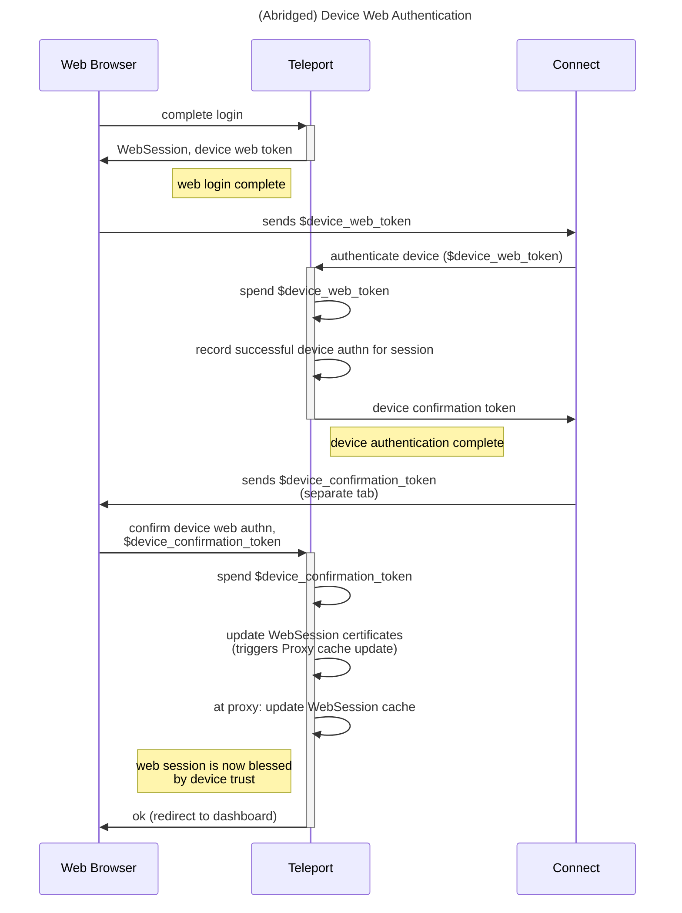
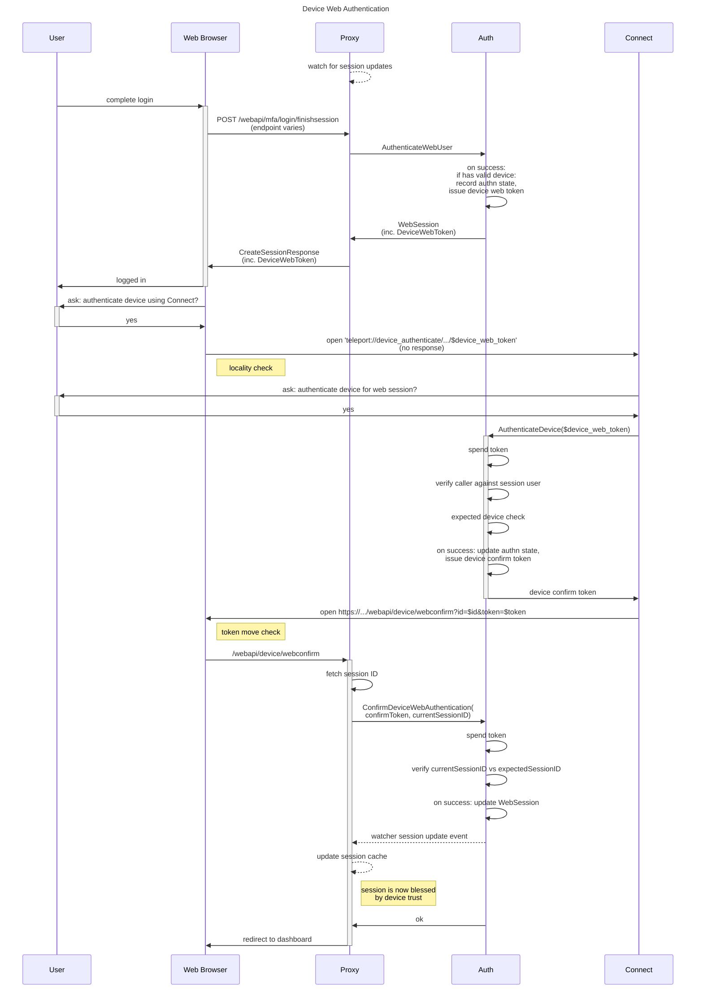
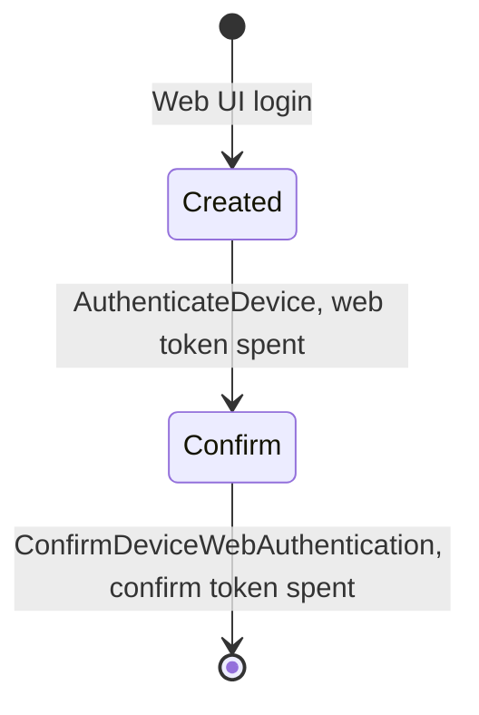
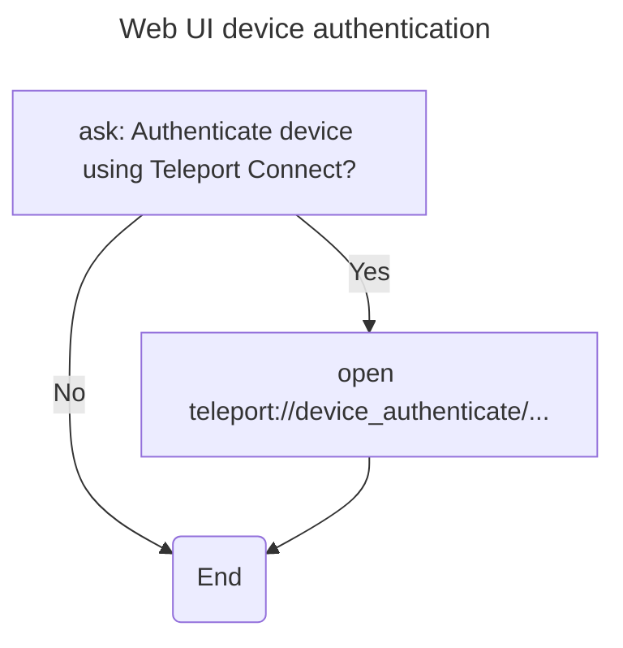
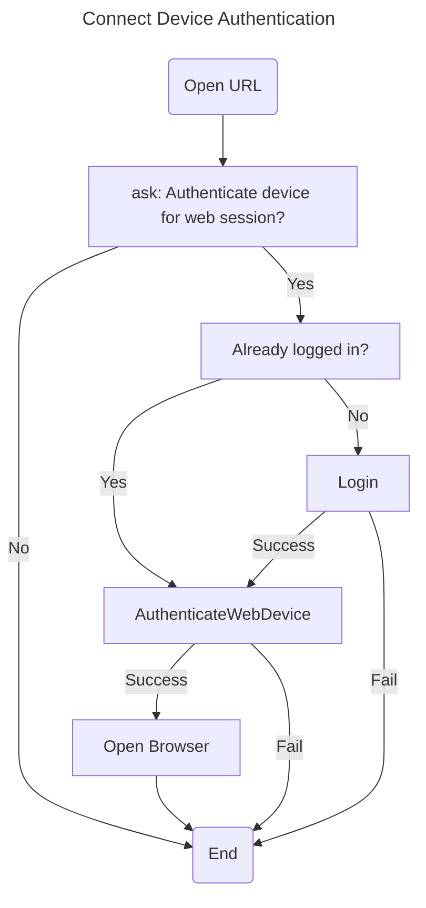

# RFD 0009e - Device Trust Web Support

## Required approvers

* Engineering: (@zmb3 || @rosstimothy)
* Security: (@reed || @jentfoo)
* Product: (@xinding33 || @klizhentas)

## What

Add Web UI support for Device Trust, including the ability to authorize devices
for App Access and Desktop Access/RDP.

Follow up from the original [Device Trust RFD][dt-rfd].

## Why

Web UI access is one of the main barriers to entry for Device Trust adoption.
This RFD addresses that.

## Details

### Background and Concepts

Direct access to the macOS Secure Enclave or TPMs is forbidden to browsers,
making it impossible to directly perform device authentication in the Web UI.

Possible solutions, including this RFD, go in a simple direction: device
authentication is performed by a capable agent on behalf of the Web UI. This
category of solutions suffers from the same problem: the process performing
device authentication is not the same process being authenticated, and those
processes can't prove to each other that they belong to the same machine.
Proving that a process belongs to a certain machine is what device
authentication is for, so we can't truly prove co-location before it.

The RFD attempts to mitigate this issue by introducing a few checks and
difficulties in the process. The intent is that an opponent positioned to
exploit those conditions would be already capable of performing far serious
exploits (for example, cloning ~/.tsh due to unlimited filesystem access). The
mitigations introduced are the Locality Check, the Expected Device Check and the
Token Move Check.

A rough sketch of device authentication is as follows:

1. The Web UI initiates device web authentication and acquires a device web
   token from Teleport. This happens as part of user login\*.
2. The Web UI hands over the device web token to the authenticator process
   (Connect). This token can only be acquired from the Web UI and is only passed
   to a local process\*\*.
3. The authenticator process performs on-behalf-of device authentication,
   spending the token. It gets a device confirmation token from Teleport.
4. The authenticator process opens the default browser, sending it to the Web
   API with the device confirmation token. The WebSession is updated as a
   result\*\*\*.



\* Technically we could start device web authentication at any point in the
session's lifetime, but login is convenient because we just verified the user's
identity and presence.

\*\* A local process as far as can be assured by the Locality Check.

\*\*\* The original session sends the device confirmation token, passing the
Token Move Check.

### The Locality Check

There are a few ways in which the Web UI can invoke Connect (or any other
process, for that matter):

1. A custom URL (teleport://device_authenticate/...)
2. A browser extension
3. A localhost-bound port (through [`fetch`][mozilla-fetch] or a similar
   mechanism)

These are largely similar in terms of process communication guarantees, as in
there are none. Despite that, they do have an interesting side-effect: all of
those methods assume a locally existing program or process is called. This makes
it harder for a remote opponent to cause or intercept the procedure.

Custom URLs (1) invoke [a loosely-coupled program][so-custom-url], unknown to
the browser, with no feedback mechanism to the browser and no caller information
to the program registered to handle said URLs.

Browser extensions (2) invoke [a binary with a given path and
arguments][chrome-native-messaging]. There is little feedback to the browser, no
guarantees about the provenance of said binary, and no caller information.

Direct port (3) connection is just that - a write to a local port. Anything
could bind to it, and unlike the previous options something _has_ to bind to it
beforehand (meaning Connect would need to be open). Providing a valid TLS
certificate to a localhost-bound program is a complicated problem; running the
connection without TLS breaks various browsers (in addition to being an insecure
channel). Those characteristics make this option far less attractive than
others.

The approach of choice is a custom URL for its simplicity and easy maintenance.

[mozilla-fetch]: https://developer.mozilla.org/en-US/docs/Web/API/fetch
[so-custom-url]: https://stackoverflow.com/a/3704396
[chrome-native-messaging]: https://developer.chrome.com/docs/extensions/develop/concepts/native-messaging#native-messaging-host

### The Expected Device Check

The expected device check is performed by Auth during the device authentication
ceremony. Based on data captured from the Web UI, during the initial creation of
the device web token, Auth guesses which device(s) it expects to perform device
authentication and forbids the on-behalf-of ceremony to any unexpected devices.

The following is captured as part of the created device web token:

* The browser operating system (via user agent)
* The user and session ID
* The user's visible IP

The OS and user are used to guess (and constrain) the future device. (Note that
this implies that a previous user-device relationship was established, which
exists roughly since https://github.com/gravitational/teleport/pull/29606.)

The IP is expected to match exactly between the browser and the device
authentication attempt, in an attempt to hinder authentication where the
processes are in distinct networks.

The expected device checks assume that the initial device web token creation by
the browser contains truthful data. This is why we are careful to only create
the device web token immediately after the user is verified.

### The Token Move Check

The token move check's purpose is to cover a gap that can't be detected by the
Locality and Expected Device checks: a token moved, in the same network, from an
attacker computer that is similar to the trusted device, to the trusted device
itself.

An example scenario is this:

1. Attacker authenticates as Victim in the Web UI, gets the device web token
2. Attacker moves device web token to the Victim's trusted device, opens Connect
   with the device web token (thwarts locality check)
3. Victim is coerced to confirm to the Connect popup, performs successful
   on-behalf-of device authentication (passes expected device check, devices are
   similar and public IP is the same as the Attacker)
4. At this stage, without the token move check, the attacker's session would be
   blessed by device trust

To avoid such a scenario an additional hop between Connect and the browser is
required. Connect automatically opens the default browser on the Web API device
confirmation URL, passing in the device confirmation token acquired from device
authentication.

Teleport checks the current web session against the expected session and the
device confirmation token, if both match then augmented certificates are issued
for the session.

The underlying assumption for the token move check is that, while the Attacker
has access to the Victim's trusted device, they lack total control over it.
Therefore, they will be unable to intercept the browser open and device
confirmation token, the check fails (the Victim's session is distinct from
the Attacker), and the attack is avoided.

### Device Web Authentication

Now that the basics are covered, here it is in full:



(Implementation note: methods that renew or extend sessions, like
[NewWebSession][] and [ExtendWebSession][], have to change so that device
extensions aren't dropped.)

[NewWebSession]: https://github.com/gravitational/teleport/blob/c4de45ad8c32cfc0e70b96fac8d9b594bde49a9f/lib/auth/auth.go#L4342
[ExtendWebSession]: https://github.com/gravitational/teleport/blob/c4de45ad8c32cfc0e70b96fac8d9b594bde49a9f/lib/auth/auth.go#L3621

### Device Authentication Attempt

A device authentication attempt is the underlying resource that holds both the
device web token and the device confirmation token. It is recorded when the
initial device web token is created and updated once that token is spent (and
the confirmation token generated). An authentication attempt completes when
augmented certificates are issued, when a token check fails, or when it expires
(5m after initial creation).

Both tokens explained here are a string of 32 bytes drawn from a secure random
generator (crypto/rand.Reader).

Authentication attempts are saved in storage under the
`/devices/web_authn_attempt/{uuid}` key.

State transitions:



Storage representation:

```go
type authnAttemptState int

const (
	autnnAttemptStateUnspecified authnAttemptState = iota
	authnAttemptStateCreated // DeviceWebToken issued
	authnAttemptStateConfirm // DeviceWebToken spent, DeviceConfirmToken issued.
)

type storedAuthnAttempt struct {
	ID    string // UUID.
	State authnAttemptState

	HashedWebToken     string // bcrypt-encoded.
	HashedConfirmToken string // bcrypt-encoded, not present initially.

	WebSessionID string
	User         string // Must match session and device owner.

	BrowserIP             string   // Verified between Created and Confirm.
	ExpectedDeviceIDs     []string // Pre-calculated on creation.
	AuthenticatedDeviceID string   // Device that performed on-behalf-of authn.
}
```

### Device Web Token

The device web token is created by a Web UI user and exchanged for an
on-behalf-of authentication attempt.

Token creation is limited to successful Web login operations, so we can ensure
that the user was presently verified. (Technically we could extend this to
ongoing sessions, although this is considered out of scope for now.)

Device Trust API representation:

```proto
package teleport.devicetrust.v1;

message DeviceWebToken {
    // Token identifier. Same as the ID of the underlying device web
    // authentication attempt.
    // Required for token usage.
    // System-generated.
    string id = 1;

    // Opaque device web token, in plaintext, encoded in base64.RawURLEncoding
    // (so it is inherently safe for URl use).
    // Required for token usage.
    // System-generated.
    string token = 2;

    // Required for creation.
    string web_session_id = 3;

    // Expected Device Check fields.
    // Required for creation.
    string browser_user_agent = 3;
    string browser_ip = 4;

    // Must match web session and device owner.
    // System-managed.
    string user = 5;

    // Calculated on creation.
    // System-generated.
    repeated string expected_device_ids = 6;
}
```

WebSessionSpecV2 gRPC / REST:

```diff
 package types; // api/proto/teleport/legacy/types

 message WebSessionSpecV2 {
     // (...)

+    // Device trust web token.
+    // Only present if on-behalf-of device authentication is possible.
+    // WebSession view of `teleport.devicetrust.v1.DeviceWebToken`.
+    DeviceWebToken DeviceWebToken = 12;
 }
+
+message DeviceWebToken {
+    // Token identifier.
+    string id = 1;
+    // Plaintext device web token.
+    // Safe to print or use in URLs.
+    string token = 2;
+}
```

Expected device data is captured and recorded during token creation. The
expected device IDs are also calculated during token creation and expected to
match the device used for the on-behalf-of authentication attempt.

Any attempt of on-behalf-of authentication attempt, regardless of its outcome,
spends the device web token.

### Device Confirmation Token

The device confirmation is required by the token move check.

It is issued during a successful on-behalf-of device authentication attempt,
after the device web token is spent and the device authenticated. The
confirmation token is spent via the ConfirmDeviceWebAuthentication RPC, which
also issues augmented device certificates for the web session.

Device Trust API representation:

```proto
message DeviceConfirmationToken {
    // Token identifier. Same as the ID of the underlying device web
    // authentication attempt.
    // System-generated.
    string id = 1;

    // Opaque device confirmation token, in plaintext, encoded in
    // base64.RawURLEncoding (so it is inherently safe for URl use).
    // System-generated.
    string token = 2;
}
```

### Auth Changes

Auth calls CreateWebToken (in)directly, against the in-memory implementation of
DeviceTrustService, in order to create a device web token for a newly logged-in
Web user:

```go
package devicetrustv1 // e/lib/devicetrust/devicetrustv1

// CreateDeviceWebToken creates a device web token for a Web user.
// Returns trace.NotFoundError if the user has no eligible devices.
// This is not an RPC, instead this is indirectly wired into the auth.Server
// itself.
func (s *Service) CreateDeviceWebToken(ctx context.Context, token *devicepb.DeviceWebToken) (*devicepb.DeviceWebToken, error) {
    // (...)
}
```

Device authentication APIs change as follows:

```diff
 package teleport.devicetrust.v1;

 service DeviceTrustService {
     // (...)

+    ConfirmDeviceWebAuthentication(ConfirmDeviceWebAuthenticationRequest) returns (ConfirmDeviceWebAuthenticationResponse);
 }

 message AuthenticateDeviceResponse {
   oneof payload {
     // (...)

+    DeviceConfirmationToken confirmation_token = 4;
   }
 }

 message AuthenticateDeviceInit {
     // (...)

+    // If present, on-behalf-of device authentication is performed.
+    // The user_certificates input field is ignored and no certificate data is
+    // returned to the caller, instead a DeviceConfirmationToken is returned on
+    // success.
+    //
+    // To complete the ceremony and bless the WebSession certificates call
+    // ConfirmDeviceWebAuthentication, through the Web API, in the same browser
+    // that acquired the DeviceWebToken.
+    // See the Teleport Proxy /webapi/device/webconfirm endpoint.
+    DeviceWebToken device_web_token = 4;
 }

+ message ConfirmDeviceWebAuthenticationRequest {
+     DeviceConfirmationToken confirmation_token = 1;
+     string current_web_session_id = 2;
+ }

+ message ConfirmDeviceWebAuthenticationResponse {}
```

### Proxy Changes

Proxy APIs change to return the DeviceWebToken along with the WebSession,
whenever necessary (see the [CreateSessionResponse][] struct).

The `/webapi/device/webconfirm` endpoint is added. Its outcome is always a
redirect to the dashboard, regardless of a successful confirmation. The input
can be represented as follows:

```go
type DeviceWebConfirmRequest struct {
	ID    string // DeviceConfirmationToken ID.
	Token string // Plaintext token.
}
```

Note that `/webapi/device/webconfirm` must work on GETs, as it is `open`-ed
directly by Connect.

The Proxy itself needs to watch for WebSession updates and either update or
invalidate the [cached session][sessionCache], otherwise it will keep using
obsolete certificates (and fail device-aware validation). As an optimization,
this watcher may be skipped on Teleport OSS.

[CreateSessionResponse]: https://github.com/gravitational/teleport/blob/c4de45ad8c32cfc0e70b96fac8d9b594bde49a9f/lib/web/apiserver.go#L2075
[sessionCache]: https://github.com/gravitational/teleport/blob/c4de45ad8c32cfc0e70b96fac8d9b594bde49a9f/lib/web/app/session.go#L139-L140

### Web UI Changes

On a successful Web login, if the CreateSessionResponse holds a DeviceWebToken,
the Web UI gives the user the option to authenticate their device using Connect.
Accepting the option opens the `teleport://device_authenticate/...` URL.



Future iterations could allow for device authentication to be performed in
existing sessions, or display a distinct icon (or some other visual marker)
showing that the session is blessed by device trust.

<!--
TODO(codingllama): Describe how the UI would known if the session is blessed.
 -->

### Connect Changes

Connect is configured to handle the following URL:

`teleport://{user}@{cluster}/device_authenticate/{token_id}/{token_plaintext}`

The `{user}` and `{cluster}` variables are necessary to make sure the correct
login is used, thus are mandatory for `/device_authenticate` URLs. They follow
the semantics of [existing deep links][deepLinks.ts].

The `{device_web_token}` is pre-encoded safely for use in URLs.

The suggested UX for opening the links is:



Connect's TerminalService is changed as follows:

```diff
 package teleport.lib.teleterm.v1;

 message TerminalService {
     // (...)

+    rpc AuthenticateWebDevice(AuthenticateWebDeviceRequest) returns (AuthenticateWebDeviceResponse);
 }
+
+message AuthenticateWebDeviceRequest {
+    string cluster_uri = 1;
+    teleport.devicetrust.v1.DeviceWebToken device_web_token = 2;
+}
+
+message AuthenticateWebDeviceResponse {
+    teleport.devicetrust.v1.DeviceConfirmationToken confirmation_token = 1;
+}
```

AuthenticateWebDevice delegates to the [lib/devicetrust/authn
package][dtauthn.Ceremony.Run] for on-behalf-of device authentication. It
returns the DeviceConfirmationToken to the Connect UI, which in turn opens the
/webapi/device/webconfirm URL.

[deepLinks.ts]: https://github.com/gravitational/teleport/blob/c4de45ad8c32cfc0e70b96fac8d9b594bde49a9f/web/packages/teleterm/src/deepLinks.ts#L54-L69
[base64.RawURLEncoding]: https://pkg.go.dev/encoding/base64@go1.22.0#pkg-variables
[dtauthn.Ceremony.Run]: https://github.com/gravitational/teleport/blob/c4de45ad8c32cfc0e70b96fac8d9b594bde49a9f/lib/devicetrust/authn/authn.go#L63

## Security

The main difficulties of on-behalf-of authentication are described in the
[background section](#background-and-concepts): namely, it is identifying
whether the web browser and Connect are actually running in the same machine. We
alleviate this problem by performing the [locality](#the-locality-check),
[expected device](#the-expected-device-check) and [token move](
#the-token-move-check) checks.

The locality check is implemented by the "local" handover of the device web
token.

The expected device check collects information from the web browser and
pre-determines which devices can be used to complete on-behalf-of
authentication.

The token move check is implemented by having Connect open the default browser,
passing the device confirmation token along to the Web API through it.

The "web" device authentication itself is only allowed if the device holds a
valid [device web token](#device-web-token). Tokens are only issued during
login, right after verifying the user's identity.

As stated in the base Device Trust RFD, [a strong enrollment process goes a long
way][strong-enroll-process] in ensuring the actual trusted device is being used
to authenticate, particularly in platforms where binary signing is necessary to
access the device key.

[strong-enroll-process]: https://github.com/gravitational/teleport.e/blob/master/rfd/0001e-device-trust.md#details

## UX

UX changes are shown in charts in both the [Web UI](#web-ui-changes) and
[Connect](#connect-changes) sections.

If the user has a valid trusted device:

1. After the user logs in, but before the dashboard, the user is given the
   option to authenticate their device using connect.
2. If accepted (eg, by clicking a button in the web), then Connect opens.
3. Connect asks the user for confirmation, if positive then device
   authentication is performed. On success this reopens the Web UI using the
   user's default browser.
4. The browser is opened and redirected to the Web UI dashboard.

<!--
TODO(codingllama): Ask UX - do we want Connect to confirm a successful device
authentication, only show failures, or neither?
 -->

Another possible, but yet undescribed UX change, is to change the cluster-wide
mode and the preset [require-trusted-device][] role to both enforce trusted
devices for App and Desktop Access. Such a change could require existing users
to install and authenticate their devices using Connect. A gentler migration
could allow only for [role-targeted device mode][role-targeted-mode] to take
effect in the initial release, and move global and preset enforcement to a
future Teleport version.

(Implementation note: we will start with the "gentler migration" route.)

[require-trusted-device]: https://github.com/gravitational/teleport/blob/c4de45ad8c32cfc0e70b96fac8d9b594bde49a9f/lib/services/presets.go#L446
[role-targeted-mode]: https://github.com/gravitational/teleport.e/issues/2121

## Proto Specification

Proto changes are described in the following sections:

* [Device Web Token](#device-web-token)
* [Device Confirmation Token](#device-confirmation-token)
* [Auth Changes](#auth-changes)
* [Connect Changes](#connect-changes)
* [Audit Events](#audit-events)

## Backward Compatibility

Backward compatibility is not a concern, this is a new feature.

## Audit Events

Creating a device web token emits a [DeviceEvent][] with type
"device.webtoken.create" and code "TV008I".

On-behalf-of device authentication is distinguished from regular authentication
by the following fields added to [DeviceMetadata][]:

```diff
 message DeviceMetadata {
     // (...)

+    bool web_authentication = 6;
+
+    // Only present for web authentication attempts.
+    string web_session_id = 7;
 }
```

Spending a device confirm token emits a [DeviceEvent][] with type
"device.authenticate.confirm" and code "TV009I".

The prehog [DeviceAuthenticateEvent][] is augmented with the
tp.web_authentication property, similarly to the event above, so that device web
logins can be tracked separately.

```diff
 message DeviceAuthenticateEvent {
     // (...)

+    // "true" if device web authentication was performed.
+    //
+    // PostHog property: tp.web_authentication.
+    string web_authentication = 4;
 }
```

As an improvement over the current implementation, device authentication audit
failures will include, whenever sensible, a hand written [Status.UserMessage][]
explaining the failure (eg: "expected device check failed"). Failures to spend a
device confirmation token are also emitted with a custom user message.

[DeviceEvent]: https://github.com/gravitational/teleport/blob/c4de45ad8c32cfc0e70b96fac8d9b594bde49a9f/api/proto/teleport/legacy/types/events/events.proto#L3797
[DeviceMetadata]: https://github.com/gravitational/teleport/blob/c4de45ad8c32cfc0e70b96fac8d9b594bde49a9f/api/proto/teleport/legacy/types/events/events.proto#L3760
[DeviceAuthenticateEvent]: https://github.com/gravitational/teleport/blob/c4de45ad8c32cfc0e70b96fac8d9b594bde49a9f/proto/prehog/v1alpha/teleport.proto#L1034
[Status.UserMessage]: https://github.com/gravitational/teleport/blob/c4de45ad8c32cfc0e70b96fac8d9b594bde49a9f/api/proto/teleport/legacy/types/events/events.proto#L927

## Observability

The following histograms are added/modified for better observability:

1. teleport.devicetrust.create_device_web_token_seconds (grpc_code string) -
   tracks CreateDeviceWebToken latency and outcome

2. teleport.devicetrust.authenticate_device_seconds -
   added "web_authentication bool" label, already tracks outcome via grpc_code

3. teleport.devicetrust.confirm_device_web_authentication_seconds
   (grpc_code string) - tracks ConfirmDeviceWebAuthentication latency and
   outcome.

Note that (1) observes events with NotFound code for cases where a token is not
created.

## Product Usage

Product usage is tracked via the existing tp.device.authenticate event, modified
as described by the [audit events](#audit-events) section.

## Test Plan

Device web authentication is added to the testplan.

## Alternatives considered

<!--
TODO(codingllama): "Open original browser" alternative.
 -->

### Fingerprinting

Fingerprinting the web browser was considered, but relegated to an alternative
due to the complexities involved.

An evolved fingerprinting strategy could be used to attempt to better identify
the browser process, making for higher precision expected device checks. The
system could also associate certain request characteristics to specific devices,
corroborated by subsequent on-behalf-of device authentication attempts, thus
keeping a stricter correlation between browser and device.

An ideal fingerprinting strategy would allow us to detect moved tokens even
between similar devices and networks.

<!-- Links -->

[dt-rfd]: https://github.com/gravitational/teleport.e/blob/master/rfd/0001e-device-trust.md
