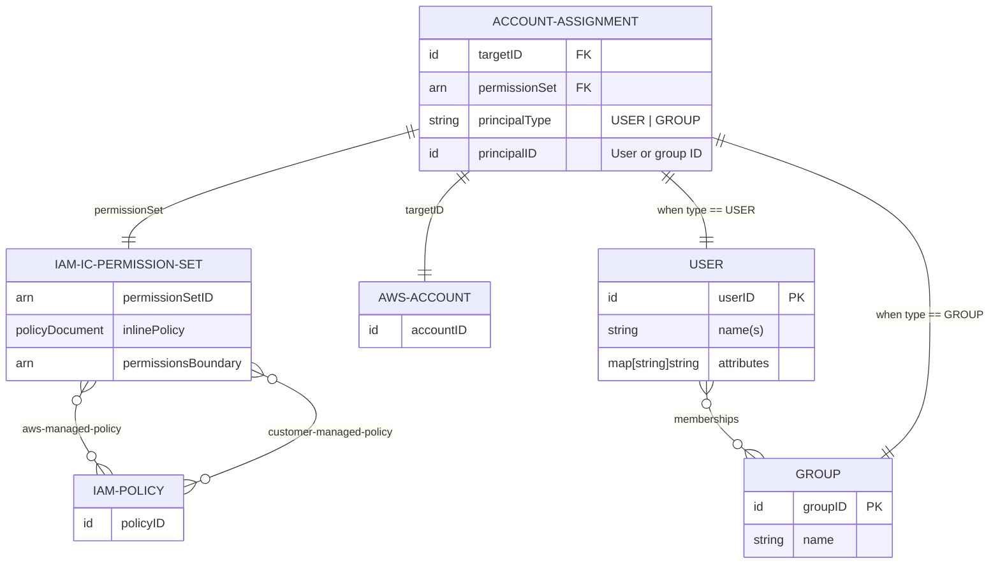
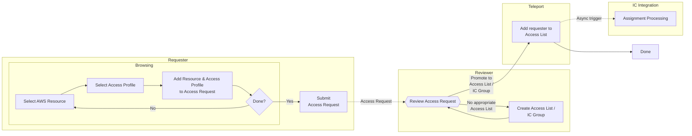
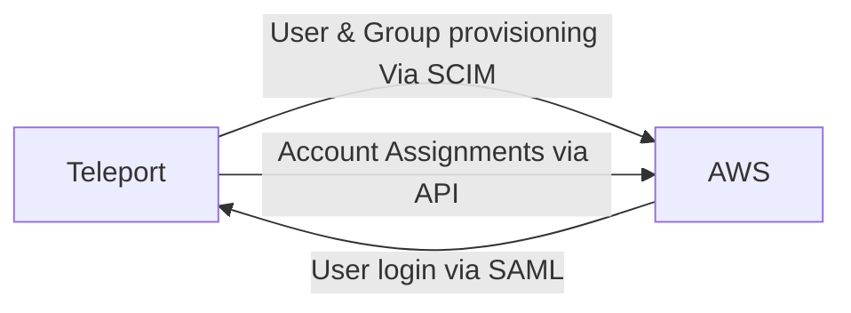
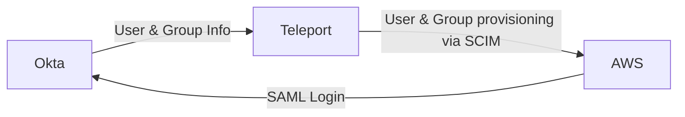
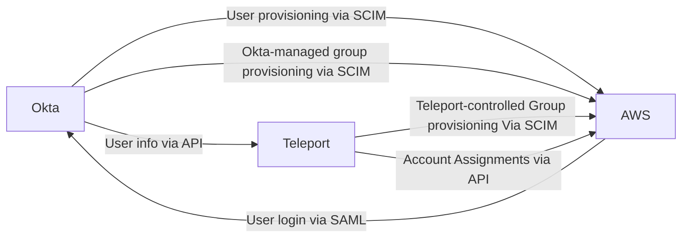
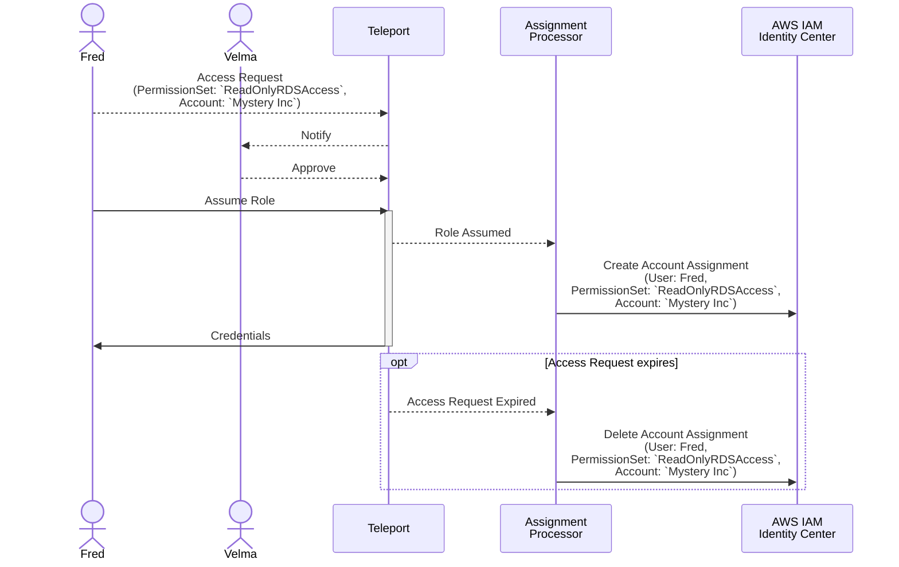
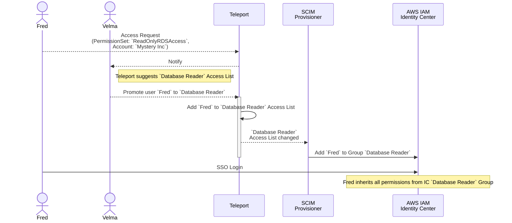
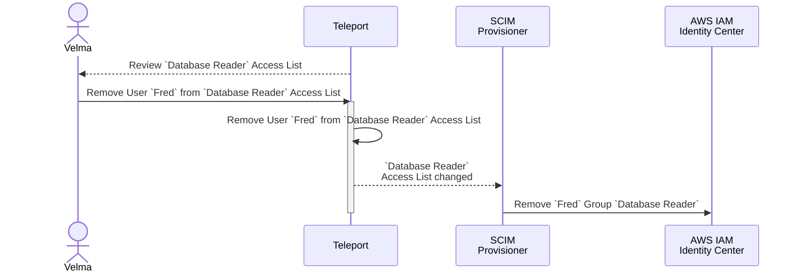

# RFD-0023e: AWS IAM Identity Center Integration

# Required approvers

- Engineering: @smallinsky
- Product: @klizhentas && @xinding33

# What

This RFD proposes a design for a Teleport integration with AWS IAM Identity
Center (hereafter referred to as *IAM IC* or *IC*), allowing IAM IC-managed users
and permissions to be managed via Teleport. This integration will allow Teleport
users to control permission assignment in AWS, across multiple AWS accounts,
using familiar Teleport tools like AccessLists and Just-In-Time Access Requests.

# Why

The Teleport Identity product aims to be the centralized place for managing
identity and access in multiple third-party services like Okta, AWS, Github and
so on.

The IAM IC integration will further this goal by allowing Teleport users to

- Manage access to AWS resources using familiar Teleport tools
- Provide self-service access automation with JIT Access Requests and Request
  Promotion
- Manage compliance requirements with Access List review
- Fulfill auditing requirements by providing a common audit trail for all AWS
  permission grants.

Teleport (the company) also has an internal need for such an integration in
order to manage our complex suite of AWS accounts and permissions, which are
currently controlled via Terraform.

## Non-Goals

### IAM IC as a Teleport Identity / SSO login Provider

For the purposes of this RFD I am assuming that:

 1. there is a common upstream Identity Provider for both IAM IC and Teleport
    (e.g. Okta), and
 2. users can be positively identified and correlated in both IAM IC and
    Teleport by username (that is, any Teleport User and IAM IC User with the
    same username are assumed to represent the same real-world person).

This RFD will not discuss using AWS IAM IC as a source of Teleport users, nor
using IAM IC for SSO login. It will, however, avoid any design that would make
doing so harder in the future.

## Example User Tasks

These are brief, high-level descriptions of actions a user might want to undertake.
See the [detailed use cases](#detailed-use-cases) section below for a worked example.

### I want to manage short-lived IAM IC Permission Set assignments in a self-service manner

AWS Accounts, IAM IC Permission Sets and Account Assignments will all be exposed as
resources in the Teleport Resource catalog. User Account Assignments can be
requested, reviewed, approved and/or rejected using the normal Teleport Access
Request workflow.

When a user assumes the role(s) granted by an Access Request, Teleport will create
an appropriate Account Assignment in IAM IC, granting the user the requested
Permission Set.

When the access grant expires Teleport will delete the Account Assignment,
revoking the user's access, and AWS will automatically expire any active sessions
created under that permission set.

### I want to manage long-lived IAM IC Permission Set assignments in a self-service manner

IAM IC Groups will be exposed as Access Lists in Teleport. A Teleport Access Request
can be promoted to long-lived access via Access List Membership at review time.

When a user is added to an IAM IC-backed Access List, Teleport will create a
corresponding IAM IC Group Membership for that user, transitively granting that
user all of the existing Account Assignments for that group.

### I want to manage short-lived access to an IC Application in a self-service manner

Out of scope for this RFD.

### I want to manage long-lived access to an IC Application in a self-service manner

Out of scope for this RFD.

### I want to know why a User has a given Permission Set assignment

Teleport records metadata for each Access Request and Access List membership.
Access List reviewers can record the reason why an Access Request was approved,
or why a user was added to an Access List.

### I want to ensure IAM IC group memberships are regularly audited

IAM IC Groups are exposed as Access Lists in Teleport. Teleport Access Lists have
optional review requirements, including a recurring review schedule. If set,
Access List owners will be required and approve Access List memberships.

### I want to manage short-term access to a specific AWS resource in a self-service manner

Out of scope for this RFD.

### I want to manage long-term access to a specific AWS resource in a self-service manner

Out of scope for this RFD.

### I want to update an IAM IC Group's Permission Assignments

IAM Identity Center Groups are represented in Teleport as Access Lists. The Account
Assignments for an AWS Identity Center Group are controlled by the roles that its
corresponding Access List grants to its members.

To change an IAM Identity Center Group's Account Assignments, a Teleport admin can
either add an existing Teleport role that grants the appropriate Account Assignment
to the Access List's member grant, or edit an already-granted role to add the
desired Account Assignment.

### I want to see which users are granted Permission Sets and on what AWS Accounts

Resources are visible in Teleport Access Graph, which can display access paths
from users to resources based on their assigned Roles and AccessLists.

### I want to create and delete IAM IC Groups

Teleport will create an Identity Center group for any Teleport Access List that
grants an Account Assignment. To create an Identity Center group, a Teleport
administrator can create an Access List and add a Account Assignment-granting
role to its member-grant list.

To delete an Identity Center Group, either delete the corresponding Access List
or remove all Account Assignment-granting roles from its member-grant list.

### I want to create an IAM IC Permission Set though Teleport

Out of scope for this RFD.

### I want to create an IAM Customer-Managed policy through Teleport and assign it to a Permission Set

Out of scope for this RFD.

IAM Identity Center does not automatically provision customer-managed policies
into the target accounts when provisioning an Account Assignment.

As such, managing Customer-managed Policies is strictly out of scope for this
RFD. Teleport will still be able to manipulate and create Assignments for
Permission Sets that reference customer-managed policies, and Teleport will
preserve any such references it finds.

## Edition and Licensing Requirements

AWS IAM Identity Center integration will only be available in Enterprise and
Cloud Enterprise editions of Teleport.

# Details

There are two major overlapping parts to managing access to AWS resources in this
integration, each of which a substantial pice of work in its own right:

1. **Provisioning Teleport Users and Groups into Identity Center**. Identity Center
   can assign Permission Sets to Groups, so in a sense we can control *individual*
   user access by controlling the membership of groups with assigned permissions.
   The primary mechanism Teleport will use to grant long-term access will be
   manipulating IC Group membership. To do this, Teleport will need to control
   User and Group provisioning into Identity Center

1. **Managing Permission Set Assignments in Identity Center**. Identity Center
   grants access by assigning Permission Sets to users and groups. Teleport will
   need to control user access by manipulating user and group Permission Set
   assignments.

Combining these functions yields an integration that offers flexible and robust
control over Identity Center permission grants, while also adding Teleport's
audit and review features to AWS IAM Identity Center.

## Prerequisites

The Integration will require an existing IAM Role set up in AWS for the integration
to assume when managing IAM Identity Center.

### Required AWS Permissions

-  iam:AttachRolePolicy
-  iam:CreateRole
-  iam:GetRole
-  iam:ListAttachedRolePolicies
-  iam:ListRolePolicies
-  iam:ListRoles
-  identitystore:ListGroupMemberships
-  identitystore:ListGroups
-  identitystore:ListUsers
-  organizations:ListAccounts
-  organizations:ListAccountsForParent
-  sso:CreateAccountAssignment
-  sso:DeleteAccountAssignment
-  sso:DescribeAccountAssignmentCreationStatus
-  sso:DescribeAccountAssignmentDeletionStatus
-  sso:DescribeInstance
-  sso:DescribePermissionSet
-  sso:ListAccountAssignments
-  sso:ListAccountAssignmentsForPrincipal
-  sso:ListPermissionSets

## AWS IAM Identity Center Data Model



### Mapping the IAM IC Data onto Teleport

#### Principals

The IAM IC concept of a Principal, that is _"a thing that can have permission
sets assigned to it"_ (basically an IAM IC User or Group) will be represented in
Teleport by Teleport Users and Access Lists. 

Each Teleport principal will have a corresponding `aws_ic_principal_assignment`
record that will track which Account Assignments a principal has, and whether they
have been provisioned into AWS.

The Principal Assignment `assignments` field holds literal set of allowed 
assignments for the principal at this time, after role-based wildcards and any 
active Access Requests have been applied.

```yaml
kind: aws_ic_principal_assignment
version: v1
metadata:
  name:  u-fred@mystery-inc.com
spec:
  principal_type: USER
  principal_id: u-fred@mystery-inc.com
  external_id: abc-123-def
status:
  provisioning_state: PROVISIONED
  assignments:
    - account_id: 1234567890
      permission_set_arn: arn:aws:sso:::permissionSet/ssoins-0123456789/ps-09876543212'
      name: ReadOnlyAccess
```

#### Users

Any Teleport User provisioned into Identity Center by Teleport will be
considered a User Principal and have a corresponding Principal Assignment record.

#### Groups

Any Access List provisioned into Identity Center by Teleport will be treated as
a Group Principal. Nested Access Lists will be recursively flattened into a
single unified list of users before provisioning.

Any Account-Assignment granting Access List will be provisioned as an AWS 
Identity Center group.

#### Accounts

Accounts are mapped into Teleport as resources of type `aws_ic_account`. These
Account resources will appear in the Teleport Unified Resource cache/Resource
catalog as an Application, which acts as a container for the possible Account
Assignments for that account.

```yaml
kind: aws_ic_account
version: v1
metadata:
  description: Production
  labels:
    teleport.dev/origin: aws-identity-center
  name: "1234567890"
spec:
  arn: "arn:aws:organizations::0987654321:0987654321"
  name: "Production" # mutable, non-unique human-readable label
  id: "1234567890"  # unique, immutable AWS-assigned ID for the account
  permissionSetInfo:    
    - arn: 'arn:aws:sso:::permissionSet/ssoins-0123456789/ps-09876543212'
      assignmentId: 1234567890--readonlyaccess # name of corresponding account assignment resource
      name: ReadOnlyAccess
```

#### Permission Sets

Permission sets are modelled as resources of `aws_is_permission_set`. PermissionSet
resources are used for drift detection during synchronization between Teleport
and AWS.

The resource key is derived from the Permission Set ARN resource name segment,
converted into a valid Teleport resource key.

```yaml
kind: aws_ic_permission_set
version: v1
metadata:
  labels:
    teleport.dev/origin: aws-identity-center
  name: permissionset_ssoins-0123456789_ps-09876543212
spec:
  arn: 'arn:aws:sso:::permissionSet/ssoins-0123456789/ps-09876543212'
  name: ReadOnlyAccess
```

#### Account Assignments

An IAM IC Account Assignment models two parts of the three-way relationship between
an AWS Account, an IC Principal and an IC Permission Set. Account assignment are
the fundamental requestable resources in search-based Access Requests.

```yaml
kind: aws_ic_account_assignment
version: v1
metadata:
  labels:
    teleport.dev/origin: aws-identity-center
  name: 0123456789--readonlyaccess
spec:
  accountId: 0123456789
  accountName: Staging
  display: '"ReadOnlyAccess" on "Staging"'
  permissionSet:
    arn: 'arn:aws:sso:::permissionSet/ssoins-0123456789/ps-09876543212'
    name: ReadOnlyAccess
```

#### Account Assignment Roles

As a convenience to the user, Teleport will optionally create roles that individually
grant a specific Account Assignment when held. For deployments with a large number
of managed AWS Accounts and/or Permission Sets the number of roles created during
this process can affect Teleport's performance, so this behavior can be disabled
via configuration. See `rolesSyncMode` in the `Configuration` section.

## Authenticating with AWS

Teleport will authenticate with AWS using either
 - **OIDC** via a configured Teleport OIDC integration. The AWS role for Teleport
   to assume will be configured in the OIDC integration.
 - **System Credentials**: Teleport will derive its AWS credentials from the
   ambient process environment. The AWS Role for Teleport to assume will be
   specified in the plugin configuration.

The user must also supply Teleport with a bearer token to use when provisioning 
users and groups into AWS via SCIM.

## Provisioning Users and Groups

Users and Groups are provisioned into Identity Center by [SCIM](https://scim.cloud/). In
order to become and Identity Source for IC, Teleport needs

- A SAML IdP Service Provider (already exists)
- A resource monitoring system that detects changes in Users and Access Lists
- A SCIM client implementation
- A provisioning system for driving the SCIM client to create and update
  resources in the downstream system
- Bookeeping for external identifiers, stale flags, etc

We envision that such a provisioning system will also be generally useful outside
of this Identity Center integration. As such, we will be discussing it mostly in
terms of provisioning into an arbitrary "downstream system". We will specifically
all out issues relating to Identity Center if the distinction is important.

### Provisioner Configuration

Configuring a SCIM provisioner outside the context of the Identity Center integration
is outside the scope of this RFD.

### Mapping Teleport Access Lists to downstream groups

A Teleport Access List will be provisioned into AWS as an Identity Center group
if it grants a member any role that grants an Account Assignment. Nested Access
Lists will be flattened into a simple  list of users.

Teleport Access Lists place extra conditions on membership in addition to being
a recorded member of the list. This means that even though a user is *nominally*
a member of an AccessList, if that user's attributes change such that they 
subsequently fail to meet the Access List's membership requirements, or the
membership expires, they will *not* be considered a list member during an RBAC
test.

This concept will follow through to the downstream Groups provisioned by
Teleport. Users whose Access Lists memberships have expired, or users who do not
meet the Access List membership requirements will be automatically ejected from
the corresponding downstream Group.

Note that this may cause some confusion when users that expect to be in a given
downstream group because Teleport shows them to be a member of the corresponding
Access List. Access List Members not meeting the Membership Requirements will be
indicated in the Access List/Membership review UI.

### Provisioning state records

The downstream provisioning state of a principal will be tracked by a new Teleport
`provisioning_state` resource. This resource acts as a join table between the
principal's Teleport resource and the corresponding resource in the downstream system.

To allow for multiple provisioning targets in a cluster, downstream systems will
be designated by a `downstream_id`. Provisioning state resources keys will be 
partitioned via `downstream_id`, for example `/provisioning_principal_state/${downstream_id}/${principal_name}`.

Example provisioning state record:

```yaml
kind: provisioning_state
version: v1
metadata:
  name: u-fred@mystery-inc.com
spec:
  downstream_id: aws_identity_center  # this is the system we are provisioning into
  principal_type: USE
  principal_id: u-fred@mystery-inc.com
status:
  # Current state of the Teleport Principal. One of
  #  STALE:       principal has changes that need provisioning
  #  PROVISIONED: principal has been provisioned downstream and needs no update
  #  DELETED:     principal has been deleted in Teleport and needs to be de-provisioned downstream
  status: PROVISIONED

  # the id of the corresponding object in the downstream system
  external_id: abc-123-def

  # Text of last error. Only present if the previous provisioning attempt failed.
  error: bad things happened

  # timestamp of the last successful provisioning
  last_provisioned: "2024-07-23T15:05:27.736771498Z"
```

# Assigning Access

AWS Access can be granted to a principal in several ways

1. Via a Role with an Allow Account Assignment role condition, 
2. Via a approved Access Request (only applicable to users), or
3. Via a promoting a short-term access request to long-term access via an Access List 

### Access by Role

Any Teleport Role may grant an Account Assignment by listing the target account
assignments in the Allow role conditions, for example

```yaml
kind: role
version: v7
metadata:
  name: Developer
spec:
  allow:
    account_assignments:
      - account: 0987654321
        permission_set: arn:aws:sso:::permissionSet/ssoins-0123456789/ps-09876543212
      - account: 0123456789
        permission_set: arn:aws:sso:::permissionSet/ssoins-0123456789/ps-09876543212
```

The Account and Permission Set fields may take wildcards, so for example a role like:

```yaml
kind: role
version: v7
metadata:
  name: Staging-Admin
spec:
  allow:
    account_assignments:
      - account: 0987654321
        permission_set: '*'
```

will grant a principal all known permission sets on the 0987654321 account.

Users may hold Account-Assignment roles as standing permissions, in which case 
Account Assignments will be created in AWS directly for the user.

Access Lists grant their members all of the Account Assignments allowed by the
roles in their member-grants role list. In this case, Teleport will create one
Account Assignment for the whole group in AWS, and members will inherit that
assignment through their membership.

### Access by Access Request

Teleport Account Assignment resources can appear directly in search-based Access
Requests. Teleport will create an individual user account assignment in AWS when
an Access Request containing such a resource is approved, and will automatically
delete it when the access request expires.

Users can also make role-base access requests for roles that grant Account
Assignments. Once approved, Teleport will create individual user assignments
for each granted Account Assignment, and delete them again when the Access
request expires.

**WARNING:** Because Teleport needs to take positive action to revoke an AWS
AccountAssignment, AWS Users *can* have their access incorrectly extended if the
controlling Teleport instance is shut down while there active Access requests.

### Access by long-term permissions

For the sake of consistency, we will treat the promotion of an Access Request
for AWS resources in much the same way that we treat a request for other
Teleport resources: by offering the Reviewer a selection of Access Lists that
will satisfy the permission request, having the reviewer choose the appropriate
Access List and adding the requester to it.

#### Promotion Workflow



## SSO login

Teleport can already be configured as an SAML identity provider. It is possible
to daisy-chain SAML login flows such that a User can authenticate against an
upstream IdP (e.g. Okta) and have that authentication propagate downstream to
the Identity Center.

## Deployment Scenarios

### Standalone

There is no hard requirement for an upstream Identity Provider when using the
Identity Center integration. In a standalone deployment, Teleport is the sole 
Identity Provider and Provisioner for AWS IAM Identity Center, provisioning
"local" Teleport users into AWS and providing SAML login. 



### With an upstream Identity Provider

There are two major deployment cases for the Identity Center integration in
conjunction with an upstream Identity Provider. In these examples we will assume
the upstream IdP is `Okta`.

#### Full handoff mode

In _full hand-off_ mode Teleport takes complete control over provisioning users &
groups into AWS IAM Identity Center _and_ managing Account Assignments. 



Teleport can be also configured as an Identity Source and SSO provider for AWS,
daisy-chaining SAML requests back to the upstream IdP if necessary.

#### Partial handoff (aka Hybrid) mode

In _hybrid_ or _partial hand-off mode_ Teleport only controls granting Account Assignments
to Users and Groups, while the existing IdP continues handling User provisioning
and SAML login. While this is a more complex deployment it can also be seen as a
more conservative one, as it allows the deployment to re-use tried & tested 
infrastructure.



## Group imports

On the plugin's first run, Teleport will import any existing Groups from AWS
Identity Center into itself - including assigning roles that mirror the Groups'
existing Account Assignments - in order to preserve any existing structure.

The group import is subject to a filter in the plugin configuration. A re-import 
may be triggered by changing the plugin's group import filters.

## Configuration

### Example Plugin Resource

The plugin resource allows a Teleport Administrator to supply basic
configuration and filtering parameters.

```yaml
kind: plugin
version: v1
metadata:
  Labels:
    teleport.dev/hosted-plugin: 'true'
  Name: aws-identity-center
  Namespace: default
spec:
  awsIc:
    # ARN of the target IAM Identity Center instance
    arn: 'arn:aws:sso:::instance/ssoins-123456789abcd'

    # AWS region the target IAM Identity Center instance is located in
    region: us-east-1

    # Access list owners used during group import
    accessListDefaultOwners:
      - admin
    
    # Should the integration create a Teleport role for each possible Account Assignment
    rolesSyncMode: ALL

    # How to authenticate with AWS
    credentials:
      system:
        assumeRoleArn: 'arn:aws:iam::637423191929:role/idc-integration'

    # User & Group Provisioning-related parameters
    provisioningSpec:
      baseUrl: https://scim.us-east-1.amazonaws.com/f3v9c6bc2ca-b104-4571-b669-f2eba522efe8/scim/v2

    # The name of the Teleport SAML Provider used to authenticate AWS users. 
    samlIdpServiceProviderName: potato

    # Filter targeted users via ID or label
    userSyncFilters:
      - labels:
          'teleport.dev/origin': 'okta' 
```

## Audit Events

The integration will emit audit events on:

- Integration installation and un-installation
- PermissionSetImportRules are added or deleted
- a User being added to, or removed from, an Access List based on IAM IC Group
  Membership
- an individual IAM IC Account Assignment is created from an approved Access Request
- an individual IAM IC Account Assignment is deleted in response to an expired Access Request

Specific event structure and codes to be determined.

## Metrics

- Integration setup funnel (e.g. how many people start enrollment vs how many complete it)
- Periodic reporting of the number of permission sets, access lists and users
  interacting with the integration
- Actions taken by the integration (see: Audit Events above)

## CLI

 * Permission Set resources will be listable via `tsh` and `tctl` like any other
   resource
 * `tctl` will support cleaning up PermissionSet (and other) resources
 * `tctl` will support installation  for advanced options not available when enrolling via the UI.

## Web UI

### Enrollment

The WebUI will require a reasonably sophisticated enrollment flow.

### Requesting Permission Sets

Account Assignments wil be grouped together under individual accounts in the
Teleport resource catalog UI. Users will select permission sets from a list in a
similar method to the user login list shown for SSH nodes.

### Identity Center Group Management UI/UX

IC groups will be managed by the standard Access List manipulation UI.

## Detailed Use Cases

### 1. Self service short term Permission Sets

Fred needs to export some data from a PostgreSQL instance hosted on RDS in the
"Mystery Inc" AWS Account. The database uses IAM Authentication and Fred
does not have RDS read access on "Mystery Inc" AWS Account.

Velma, the Mystery Inc administrator, has previously created the IAM IC Permission Set
`ReadOnlyRDSAccess` that grants the AWS-Managed `AmazonRDSReadOnlyAccess` Policy.

 1. Fred logs into Teleport
 2. Fred finds the "Mystery Inc" AWS Account in the Teleport resource catalog.
 3. Similarly to how the existing AWS Console access resource works (See [here](https://goteleport.com/docs/application-access/cloud-apis/aws-console/#access-the-aws-console)
    for an example), Fred selects the pre-configured `ReadOnlyRDSAccess`
    PermissionSet from a list of available PermissionSets.
 4. Fred selects `Request Access`, and creates an Access Request.
 5. Velma, as a Teleport `reviewer` for "Mystery Inc" is notified of the Access
    Request and approves it in Teleport.
 6. Fred sees the approval, and assumes the granted roles via Teleport. As part
    of processing the Role assumption, Teleport creates an Account Assignment in
    IAM IC granting Fred the `ReadOnlyRDSAccess` PermissionSet in the "Mystery Inc"
    AWS account.
 7. Fred obtains login credentials to the Postgres database via the `aws` CLI
    tool and does his data export task.
 8. Teleport tracks the Account Assignment, and when Fred's Access Request expires
    Teleport will automatically delete the IC Account Assignment.



### 2. Self-service long-lived access grants

Suppose that Fred's data export job from the previous use case becomes a weekly
task. After a few weeks of approving Fred's ad-hoc Access Requests, Velma
decides to grant Fred long-term access.

Velma has already created a `Database Reader` IAM IC Group that is assigned the
`ReadOnlyRDSAccess` Permission Set in the "Mystery Inc" AWS Account.

The Teleport IAM IC integration has created a `Database Reader` Teleport Access
List to act as the Teleport representation of the IAM IC group.

1. Fred requests short-term access as per the previous use case.
2. While reviewing the Access Request, Velma notices that Teleport has suggested
   assigning Fred to the the `Database Reader` Teleport Access List.
3. Velma promotes the short-term Access Request to long-lived access by adding
   Fred to the `Database Reader` list.
4. The change in the IC-derived `Database Reader` Access List triggers Teleport
   to create a corresponding IAM IC Group Membership



### 3. Revoking Access

During her monthly Teleport-triggered review of review of the `Database Reader`
Access List, Velma sees that Fred is still a member. Fred has since passed his
data extraction job onto a co-worker, and no longer requires this Permission.



## Future Work

### Individual Resource Permissions

Granting user access to specific AWS resources through AWS IAM Identity Center.

### Creating and manipulating Permission Sets

Creating and managing custom PermissionSets, deploying them into AWS accounts
and managing assignments.

### Cascading Permission Set Assignments for OU trees in an organization

AWS Accounts under the control of an Organization can be hierarchically arranged
into a tree of Organizational Units (a.k.a *OU*s). IAM IC does not natively use
these OUs for Permission Set Assignments; assignments are to individual accounts
only.

It may be possible to implement cascading permission assignments for OUs, where
multiple child AWS accounts can inherit permissions from a parent OU, using
Teleport to calculate and apply the appropriate per-account assignments.

Teleport [RFD-0164](https://github.com/gravitational/teleport/pull/38078) introduces the idea of scoped RBAC, which may be helpful here.
