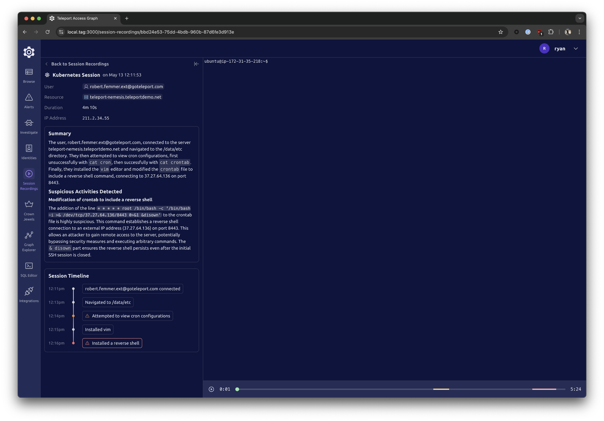
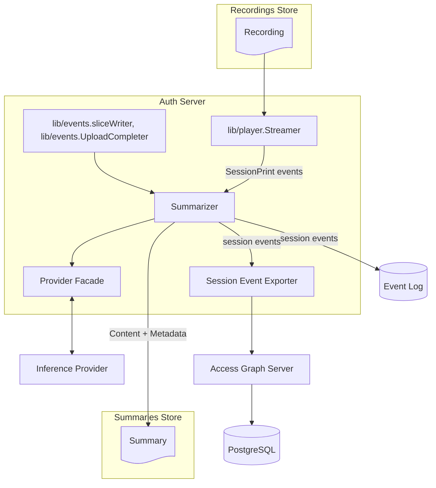
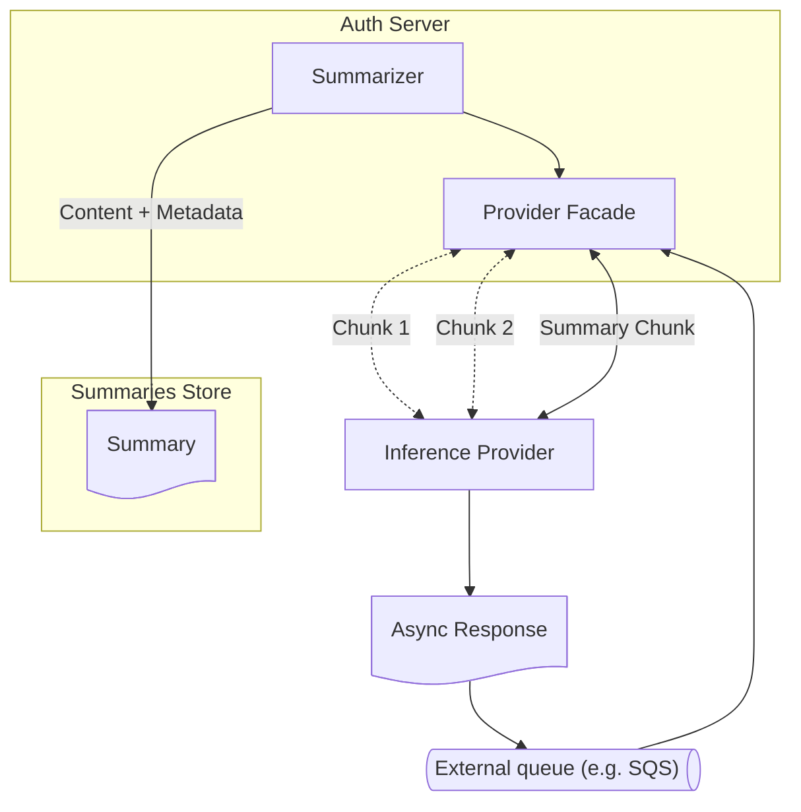
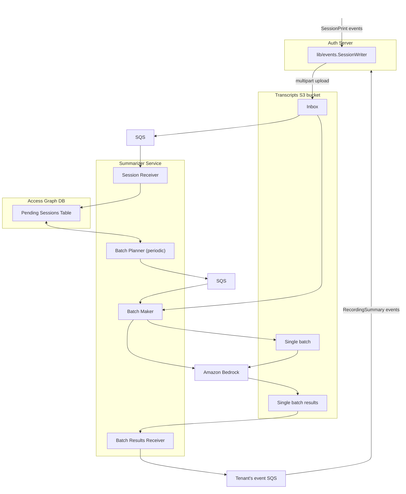

# RFD 0026e - AI-Generated Session Recording Summaries

## Required approvers

- Engineering: @zmb3, @tigrato
- Product: @benarent

## What

Summarize SSH, Kubernetes, and database sessions using a language model. Enable
users to view generated summaries. This feature will be a part of the Teleport
Identity Security product.

## Why

Some of our customers regularly audit sessions to understand what actions their
employees perform using their systems. This may involve playing session
recordings. Sometimes, the auditor is required to write down a short summary of
what happened during given session.

We can make it easier by providing our customers with AI-generated session
summaries. This will enable them to quickly assess which sessions are worth
further attention.

Outside of any audit or compliance reasons, summaries are a time saver. It's
much quicker to read 3-5 sentences than to watch a recording play.

## Details

### User Stories

#### Inspecting Summaries Using Teleport Access Graph App

1. MVP use case. Alice, an auditor user, wants to look at last week's activity in her cluster.
She opens the **Session Recordings** screen in the Access Graph web app and
opens session player screens for the most recent sessions. Before deciding
whether to dig in further and play the recordings, she reads session summaries.


*Preliminary design, subject to change. The timeline feature will not be implemented for the MVP.*

#### Inspecting Summaries Using `tsh`

Alice performs the same task using `tsh`. For each session recording that she's
interested in, she first executes `tsh sessions summarize <session-id>`.
`tsh` responds with recording summary if it's there.

### Configuration and Global State

We will support an arbitrary number of models and model selection policies.
Each model will specify a provider out of the list of supported providers (e.g.
`bedrock`, `openapi`) and necessary provider-specific configuration data. Most
commonly, this will be a model name, though parameters as temperature may also
end up there. Every time a session ends, it will be matched against a set of
policies that define which model will be used for summarizing it. If no policy
matches, the session will not be summarized. Here's an example configuration:

```yaml
# /summarization_inference_models/my-model
# This resource describes a model and specifies provider-specific parameters.
kind: summarization_inference_model
metadata:
  name: my-model
spec:
  # Provider-specific parameters (openai, bedrock, etc.). They are using oneof
  # internally, so only one is allowed. They serve both as a provider selector
  # and a container for parameters.
  #
  # Since model-specific parameters will in practice be tied to the provider
  # implementation and we don't have a case for model-specific parameters right
  # now anyway, let's put off designing this for future.
  bedrock:
    bedrock_model_id: "arn:aws:bedrock:us-east-1:123456789012:imported-model/mymodel"
  budget:  # (post-MVP)
    # Monthly budget, counted starting from the model's first request time.
    time_period: 1mo
    input_tokens: 10000000
    output_tokens: 100000

---

# /summarization_inference_models/chat-gpt
kind: summarization_inference_model
metadata:
  name: chat-gpt
spec:
  openai:
    openai_model_id: gpt-4o
    temperature: 1.5
    # References an summarization_inference_secret resource.
    api_key_secret_ref: chat-gpt-key
    base_url: "https://my.llm.server/"
  budget:  # (post-MVP)
    # Daily budget
    time_period: 1d
    input_tokens: 1000000
    output_tokens: 10000

---

# /summarization_inference_secrets/chat-gpt-key
# Inference secrets are stored as separate resources, as multiple inference
# models can use the same provider, and hence, the same API keys. When reading
# or listing, the values are not included to protect the secrets from leaking.
kind: summarization_inference_secret
metadata:
  name: chat-gpt-key
spec:
  value: 'my-openai-key'

---

# /summarization_inference_policies/prod-shell-sessions
# This resource binds sessions to summarizers. If no policy matches given
# session, no summarization is performed. If there's more than one model that
# matches, there's no guarantee which one gets picked. To prevent unnecessary
# hidden costs, we will guarantee that only one model will be ultimately executed
# for any given session.
kind: summarization_inference_policy
metadata:
  name: "prod-shell-sessions"
spec:
  # Session kinds affected by this policy.
  kinds: ['ssh', 'kube']
  # Additional filter that allows selecting sessions by user traits and
  # target labels.
  filter: 'contains(user.spec.traits["teams"], "alpha") && labels["env"] == "prod"'
  # Model used for summarizing sessions that match the above.
  model: "my-model"

---

# /summarization_inference_policies/db-sessions
kind: summarization_inference_policy
metadata:
  name: "db-sessions"
spec:
  kinds: ['db']
  model: "chat-gpt"
```

For tracking usage and resource configuration, we will introduce a
`session_recording_summarizer` resource type, whose purpose will be to track
the current usage. Each model will have its own resource,
`sessionRecordingSummarizer/<name>`.

```proto
message SessionRecordingSummarizer {
  string kind = 1;
  string sub_kind = 2; // unused
  string version = 3;
  teleport.header.v1.Metadata metadata = 4;
  SessionRecordingSummarizerStatus status = 5;
}

message SessionRecordingSummarizerStatus {
  int64 input_tokens_budget = 1;
  int64 output_tokens_budget = 2;
  google.protobuf.Timestamp last_budget_refresh = 3;
}
```

The `SessionRecordingSummarizerStatus` resource needs to be written using
atomic writes, therefore it can't be cached; that's one reason why it will be
separate from the model resources.

#### Cloud Clusters Configuration

Since we don't want our customers to override our plan's built-in limitations,
our cloud configuration resources will include a special
`teleport-cloud-default` model (but won't attach any policies by default; these
will need to be configured by the customer). This model will be visible to the
customer, but while returning data, we will scrub the model ID to protect our
AWS account ID from leaking. While it's not a secret, our preference is not to
share it.

The default model will specify model parameters and budget for our selected
inference provider (Bedrock). No other model will be allowed to use our
internal Bedrock API. The customer will be able to add other Bedrock models if
they provide their own AWS configuration.

#### Alternatives considered:

- Storing the the usage counter inside model resource's state: while possible,
  it would be undesirable. First of all, because we may need the usage counter
  before the configuration resource is required when we add cloud support.
  Second, because the counter state can't be cached, as it needs to be
  increased atomically, while we may consider caching the configuration spec.
- Using a separate `provider` field in the model resource definition:
  redundant, since we already intend to use `oneof` for the params.

### Session Recording Summary Data Model

Session metadata will be stored as records in the Access Graph database, in
each tenant's individual schema.

```sql
CREATE TABLE sessions(
  id UUID PRIMARY KEY,
  kind TEXT NOT NULL,
  started_at TIMESTAMP NOT NULL,
  finished_at TIMESTAMP,
  -- Stores an array of objects with the following fields:
  -- - user: string
  -- - login: string
  -- Will be indexed using a GIN index to support searching for sessions by
  -- user name and login.
  participants JSONB NOT NULL,
  cluster_name TEXT NOT NULL,
  -- Target resource kind (ssh/kube/db)
  resource_kind TEXT NOT NULL,
  -- Common data for all resource kinds.
  resource_labels JSONB NOT NULL,
  resource_id TEXT NOT NULL,
  resource_name TEXT,
  -- Applicable to servers only.
  server_addr TEXT,
  server_hostname TEXT,
  -- Applicable to Kubernetes only.
  kubernetes_cluster TEXT,
  kubernetes_pod_namespace TEXT,
  kubernetes_pod_name TEXT,

  -- unknown/none/pending/success/error
  summary_status TEXT NOT NULL DEFAULT 'unknown',
  summary_error TEXT,
  summary_error_user_message TEXT,

  -- Embedding vector generated for the purposes of the similarity search
  -- (post-MVP). Embedding size will be imposed by the model used for their
  -- generation. TODO: figure out if in future we should store separate
  -- embeddings of short and long summaries.
  summary_embedding vector(embedding_size),
)
```

Session recordings themselves are stored in the location specified by the
`audit_sessions_uri` configuration parameter (for example, in S3). The summary
contents will be stored in `<audit_sessions_uri>/<session_id>.summary.json`, as they may
contain sensitive data. Only summary embeddings (post-MVP) will be stored in
the access graph database. This will decrease the risk involved in storing this
data in case of cloud customers (see [Risk Analysis](#risk-analysis)).

Session recording summaries will be stored as JSON files on S3, Azure Blob
Storage, Google Cloud Storage, or local files — just like we currently store
session recordings. Each file will only contain one session, and its name will
contain the session ID. Each file will contain a single object with a single
`content` string field.

```proto
message SessionRecordingSummary {
  // ID of the session whose recording got summarized.
  string SessionID = 1 [(gogoproto.jsontag) = "sessionId"];
  // Summary content.
  string Content = 2 [(gogoproto.jsontag) = "content,omitempty"];
  // This record's creation time. We might want to know when exactly it was
  // created for debugging or other purposes; using data provided by the
  // storage system for this may be unreliable, as files can be copied.
  google.protobuf.Timestamp Timestamp = 3 [(gogoproto.jsontag) = "timestamp"];
  // Inference model name. In the cluster configuration, an inference model
  // with this name will store things like provider model name, model
  // parameters, and API keys.
  string ModelName = 4 [(gogoproto.jsontag) = "modelName"];

  // The fields below will be stored in the configuration, but will also be
  // persisted here to make it easier to tune given configuration and compare
  // results without changing the config name.

  // Inference provider name.
  string ProviderName = 5 [(gogoproto.jsontag) = "providerName"];
  // Provider-specific model ID, if the provider supports multiple models.
  string ProviderModelId = 6 [(gogoproto.jsontag) = "providerModelId,omitempty"];
  // Model- and provider-specific parameters that were using for the
  // invocation.
  google.protobuf.Struct ModelParams = 7 [(gogoproto.jsontag) = "modelParams,omitempty"];
  
  // Text embedding vector (post-MVP). TODO: need to confirm double vs float.
  repeated double Embedding = 8 [(gogoproto.jsontag) = "embedding,omitempty"]
}
```

#### Risk Analysis

In Teleport Cloud, the access graph database stores information about all of
our tenants and separate them using PostgreSQL schemas. The access graph server
acts as the single line of defense against accessing other tenants' data,
ensuring that no tenant can retrieve data from someone else's schema.

Typically, we store the cloud customers' session recordings on S3. Until
recently, all the session recordings were stored in the same bucket, but each
tenant had their own AWS IAM session name, which meant that *both* Teleport
*and* AWS were responsible for ensuring tenant separation. We also started
migrating the customers to separate buckets, although this was done for
operational, and not security reasons.

Putting session recording summaries in access graph database would mean
increasing the sensitivity level of data stored there. Processing session
transcripts through LLM lowers the level of sensitivity, but there's still a
potential for extracting valuable information.

Assuming a hypothetical RCE vulnerability in Teleport itself, each tenant would
need to be attacked separately to get access to their data; to escalate
privileges using just one tenant, the attacker would need to compromise AWS
security, too.

If we stored the summaries in the access graph database, a hypothetical RCE
vulnerability in the access server (or similar, perhaps an SQL injection) would
allow the attacker (e.g. a rogue customer) to list the schemas and access data
from all schemas.

We acknowledge and mitigate this risk by storing only text embedding vectors in
the access graph database. For storing summary contents in the cloud
environment, we will use the same strategy as for storing session recordings.

#### Alternatives Considered

- Storing session recordings as audit events is doable within the size
  constraints of audit events. However, our existing audit event backends are
  not well suited for running low-latency (and low-cost) queries by session
  IDs, and these would be required for the designed user experience. Narrowing
  down the time window would be required, and this can be done only
  heuristically. It also may increase our cost on Athena side in a hard to
  predict way. One benefit of this approach would be that we could include
  session recording in the audit queries, but as this hasn't appeared as a
  requirement, we are dropping this possibility.
- Storing session recording summary metadata in Access Graph DB (in adddition
  to session recording metadata). This data, including things like provider
  name, model name, etc., is not necessary there, and is stored only for the
  purpose of documenting model parameters for purposes of potential future
  analysis. This was viable when we were considering using solely that database
  for storing all summary data.
- Storing session recording as plain text files: using JSON instead allows for
  easier extensibility; in future, we will probably use structured data
  retrieval from LLMs to classify threat levels, provide more detailed
  timeline, etc.
- Mitigating the risks by running separate access graph pods per tenant: the
  cost is unacceptable.

### Session Recording Summary Generation

We expect different customers to use different models, different inference
providers, perhaps even allowing routing between different providers for a
single customer.

Most providers offer a batch mode, which would allow us to save money, but
unfortunately, at least one (Bedrock) requires at least 100 records per batch.
My calculations indicate that only 23% of our tenants generate a daily average
of at least 100 sessions, and only 2% never generate less than 100 per day.
Using batch mode would therefore force us to either implement a hybrid mode
that would only use batches for the busiest tenants, or implement a solution
where batches contain data from multiple tenants.

Another solution to this problem might be topping up the batch with low-cost
fake queries with a tiny (1-token?) output limit. Since our initial partner
uses their own infrastructure, batch mode is less critical; this will be
important once we start implementing this feature in our own cloud environment
or extend the offer to others who use third-party providers.

#### Model Selection (Post-MVP)

This section applies to post-MVP stage, where we extend our support to cloud
users and need to pick a model for this.

After a brief research, I decided to narrow down our focus on models with large
context windows, as the task requires summarizing a lot of data. From those, two
Claude versions looked promising: 3.5 Sonnet (v2) and 3.7 Sonnet (v1). The 3.5
Sonnet produced slightly more satisfying results and supports batch mode.

Each model has its limitations, and Claude 3.5 Sonnet has a maximum context
window of 200,000 tokens. According to experiments and calculations based on a
couple of hand-generated test cases, I estimated it to be about 0.32 tokens per
byte. This is a low-precision estimate; I observed values between 0.25 and
0.49. This puts a cap on the single prompt to support sessions of about
400-800kB in size. This is still less than 1% of observed sessions, so we
should be fine launching this. The larger sessions will be addressed using a
design outlined in the [Support for Large
Sessions](#support-for-large-sessions) section.

Since Claude 3.5 ultimately turned out to be quite expensive, the model
selection is still an open issue.

#### From Session Recording to Recording Summary

The following diagram shows the architecture and data flow of the recording
summary generation solution:



There are two places where the Auth Server completes an upload, depending on
the scenario: `lib/events.UploadCompleter.CheckUploads()` and
`lib/events.sliceWriter.completeStream()`. In both cases, after the stream is
completed and upload completion result is noted, for every successful upload,
we will publish its metadata to the access graph server, and then pass it to
the summarizer.

Since any server can upload recordings, the same holds for summarization: it
can be performed by any server, and it's performed by the one that completed
the upload.

After the upload is completed, the summarizer is going to use the already
existing session streamer component to once again ingest the session
transcript. It will then use an appropriate provider facade to run the
inference process. A provider facade is an object that gets initialized during
startup and keeps provider-specific configuration such as API keys and model
configurations (temperature, etc.). Its MVP interface will be fairly simple:

```go
type InferenceProviderFacade interface {
  Summarize(
    ctx context.Context,
    sessionKind string,
    // A session data reader backed by the SessionStreamer; using it instead of
    // passing a byte array upfront enables saving memory by chunking by LLM's
    // output token limit.
    session io.Reader,
  ) (*Summary, error)
}

type Summary struct {
  Content     string
  ModelId     string
  ModelParams any
}

type ErrorWithCode struct {
  message      string
  Code         string
  ProviderCode string
}
```

The provider will be selected based on labels applied to the nodes; the rules
for that will be defined as cluster resources (see
[Configuration and Global State](#configuration-and-global-state)).

Post-MVP, in addition to the summary content, the summarizer will use another
model for generating a text embedding vector that will be used by the access
graph server for searching.

Teleport server emits a `session.upload` event after session gets uploaded; we
will extend this event's structure by adding an additional field, indicating
whether a summary should be expected for this particular session. The decision
will be made based on target labels and/or user data, as specified in
[Configuration and Global State](#configuration-and-global-state). After
receiving the response from the inference provider, the summarizer will publish
a `session.summary.upload` event:

```proto
message SessionUpload {
  // (...existing fields...)
  
  // WillSummarize, if set to `true`, indicates that the summary is in a
  // "pending" state. If set to `false`, means that the summary is in a "none"
  // state.
  bool WillSummarize = 6;
}

message SessionSummaryUpload {
  Metadata Metadata = 1;
  SessionMetadata SessionMetadata = 2;
  // Status indicates the final state of the summary.
  Status Status = 3;
  // SessionSummaryURL is the path to the summary in the session recording
  // storage system (e.g. S3).
  string SessionSummaryURL = 4;
}
```

These events, apart from being published in the audit log, will be separately
transmitted to the Access Graph server (see [Uploading Sessions to Access Graph
Server](#uploading-sessions-to-access-graph-server)). Access Graph Server will
reconstruct session metadata based on the session events. This will mean it
will use exactly the same data that the OSS recording viewer in Teleport Web
UI.

One thing to note here is that inference is a high-latency operation;
experiments with the largest supported session sizes suggest a latency of about
30 seconds to be expected. Data on existing tenants suggests that for about 91%
of our tenants, it still means that at most one request will be typically
active at any time, but for the most busy outliers, we may reach about 1.4
sessions per second, which would mean having to support tens of active
connections. This should not be a problem, but here's what we can do about it:

1. We will run the summarizer on a separate goroutine to make sure we don't
   block the upload completer.
2. If the server is shut down while processing a request, the request is
   dropped, and an event is emitted with an error. This will be a rare
   situation and since recording summaries are not a critical feature, we can
   drop a task without major consequences.
3. To prevent runaway spikes, access to the inference provider will be gated by
   a semaphore. Requests that would cross the limit of number of concurrent
   connections would be dropped.
4. If it turns out to still be a problem, we might support an async flow using
   Bedrock's `StartAsyncInvoke` or equivalent for a given provider, if
   available (the semi-transparent block on the diagram). Note that this flow
   won't be available for all providers.

#### Support for Large Sessions

After the MVP, we should implement summarizing using a map-reduce summarization
technique, where we spawn multiple requests, one for each chunk of the session
recording, wait for their results, and then summarize the list of summaries of
partial session recordings. We need to take into consideration that, as the
number of tokens per byte is just an estimate, every such request can fail
because it's too big; in such case, we will split each chunk in two and retry.
As this means that big sessions will have quite a complicated workflow, we may
need to combine this approach with using `StartAsyncInvoke` (in case of
Bedrock) and then collecting responses from the summary storage.



#### Budget Management

Each model configuration may have separate limits of input and output tokens
(see [Configuration and Global State](#configuration-and-global-state)). Before
each inference, the summarizer will check if the current usage counters in the
relevant `session_recording_summarizer` resource and won't proceed if they
exceed the configured budget.

After the inference completes, the summarizer will add the amount of input and
output tokens consumed using `lib/backend.Backend.AtomicWrite`.

Note that this process allows us to go over budget, but only by an amount that
can be consumed by multiple concurrent requests running when the usage is very
close to the budget. In case of Bedrock, this leaves us with a roughly
30-second window during which this may occur.

Unfortunately, this effect is difficult to avoid, since the model APIs usually
only give us detailed bill of tokens after the invocation has been processed.
We will mitigate this by accounting for the overrun in the next period's
budget. The per-server semaphore mentioned in the [From Session Recording to
Recording Summary](#from-session-recording-to-recording-summary) section may
also serve as a crude mechanism to prevent these overruns to spin out of
control.

Upon the startup (as well as once per configured budget period), the auth
servers will refresh the appropriate quotas if needed. To protect from multiple
auth servers performing this task in parallel, we will use the
`last_budget_refresh` timestamp and only perform the change if the quota is
really stale.

#### Alternatives Considered

- make inference a responsibility of the
  `lib/events.MultipartUploader.CompleteUpload` implementation. This would
  couple the inference process implementation to the storage method used, which
  is not an optimal design, as inference process may be different for future
  expansions such as using customer's own models and APIs.
- Making the budget more strict by estimating cost based on historical data and
  the size of input and rejecting the inference early. This would be
  complicated and since we expect the potential overruns to be tiny (tens of
  dollars in case of very busy clusters), also superfluous.
- Using the existing audit log exporter (a part of the SIEM feature of the
  access graph). As it heavily relies on querying Athena in real time, it would
  not be scalable enough.
- Using Teleport backend to store the queue of pending sessions to export to
  account for access graph server outages. Also wouldn't scale well and it
  would require us to put a strict cap on a very short buffer of buffered
  events.

### Session Recording Summary Retrieval

#### Auth Server Interface

For `tsh` and access graph server, we will expose a
`GetSessionRecordingSummary` RPC endpoint that will simply fetch a single
summary by session ID.

```proto
service AuthService {
  rpc GetSessionRecordingSummary(GetSessionRecordingSummaryRequest)
    returns (GetSessionRecordingSummaryResponse);
}

message GetSessionRecordingSummaryRequest {
  string SessionId = 1;
}

message GetSessionRecordingSummaryResponse {
  Summary Summary = 1;
}

message Summary {
  string Content = 1;
}
```

Using a proper message instead of just a string will allow us to easily extend
this data type in future.

The `GetSessionRecordingSummary` handler will call Access Graph server to
retrieve the summary.

#### Web Interface

We will implement a new recording UI that includes summaries in the Access
Graph Web UI. The UI will fetch the session summaries along with recording
metadata. The access graph server will fetch the metadata from its own database
and include recordings downloaded from the Auth server using its
`GetSessionRecordingSummary` endpoint.

#### Uploading Sessions to Access Graph Server

Before we even think about exposing summaries through the access graph UI, we
need to upload information about the sessions in the first place.
Unfortunately, for scalability reasons, we can't afford either querying the
audit log backend too often, or storing pending items in Teleport backend.
Therefore, the session end, upload, and summary upload events will need to be
forwarded to Access Graph server by the same process that stores them in the
audit log backend. It will therefore become the responsibility of the audit log
backend to send these to the Access Graph server.

These events will be transmitted using a bidirectional gRPC stream. Each event
will need to be acknowledged by the Access Graph to be considered successfully
delivered.

To allow recovery from Access Graph outages, the following mechanism will be
used: Whenever a session event can't be delivered, we acquire a backend lock
and store an outage start timestamp — unless there is already an outage start
specified and it's older than the timestamp of the data that couldn't be
delivered. Then we release the backend lock. Upon the first subsequent
successfully transmitted event, the server will again acquire a backend lock,
remove the outage start timestamp, release the backend lock, and query the
event log for events that took place after the outage started and transmit them
to the server before it resumes sending current data.

In a multi-server environment, this algorithm ensures an invariant that the
outage start timestamp is always the oldest timestamp that any server was
unable to process. This makes sure that if one server performs a recovery
procedure, another unhealthy one that drops events will resume it from the
point where events are still being dropped.

This way we only query Athena about once per outage per server, thus reducing
impact on the infrastructure.

Note that since we can't rely on event creation timestamps, we will need to add
event *insertion* timestamps to the `AuditEvent` message. Additionally, we will
use a couple of seconds of margin when querying for events to accommodate for
potential clock skew and network delay between the auth servers.

#### Uploading Text Embeddings to Access Graph Server (Post-MVP)

To implement similarity-based search over the recording summaries, we need to
feed their embedding vectors to the access graph database. These will be
transmitted along with session summary upload events.

#### Access Graph Server Interface

```proto
service AccessGraphService {
  rpc SessionEventStream(stream SessionEventRequest)
    returns (stream SessionEventResponse);
}

message SessionEventRequest {
  AuditEvent audit_event = 1;
  // optional, for session summary upload events
  repeated double embedding = 2;
}

message SessionEventResponse {
  string confirmed_event_id = 1;
}

// Response, disguised as a request (the roles are reversed).
message SessionEmbeddingRequest {
  // ID of a session whose embedding is returned (allows out-of-order and
  // asynchronous replies).
  string session_id = 1;
  repeated double embedding = 2;
}
```

#### Alternatives Considered

- Implementing the UI in Teleport proxy: this would be a bit more
  straightforward, but there is an opportunity to create a more coherent view
  of users' activities on the access graph UI side.

## Implementation Plan

The project will be implemented in following phases:

1. MVP: supports only LiteLLM. The scope of this phase is captured by this very
   document.
2. Add budget management capability.
3. Adding capability to search for sessions using text embedding vectors.
4. Support for map-reduce summaries of large sessions. The scope includes
   sending recording data in chunks and then summarizing partial summaries. It
   may include the asynchronous operation mode.
5. Supporting cloud customers. This means implementing Bedrock integration and
   choosing a model that will allow us to reach our business goals while still
   managing a decent budget.
6. Support for hybrid (immediate + batch) mode. This will require running
   inference on a separate periodic task and tweaking the session retrieval
   method. Appendix 1 describes an early approach to this, but we shouldn't use
   it directly, as it is not good from the information isolation standpoint
   (mixes different tenants' data in one pipeline).

### Usage metrics

Teleport will generate `tp.session.summary.generate` and
`tp.session.summary.fail` usage events. The `generate` event will carry number
of input and output tokens used. It may be an alternative way of keeping track
of the budget.

The Access Graph UI will generate `tp.tag.session.ui.view` event. It will contain a
boolean field that tells whether the viewed session included a summary.

## Appendix 1: Draft Design of the Alternative Batch Mode Solution

