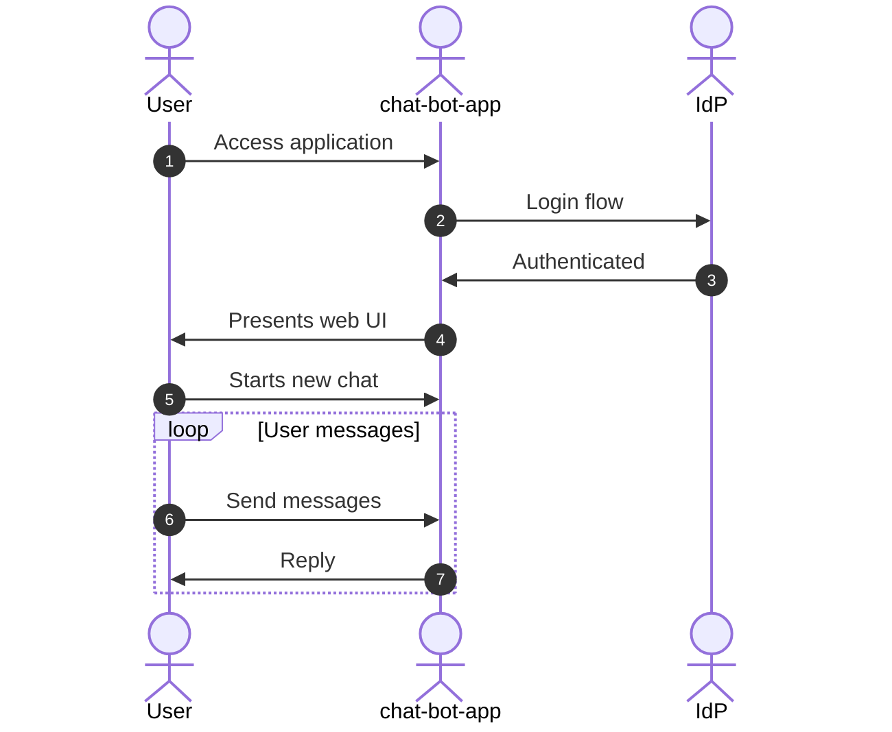
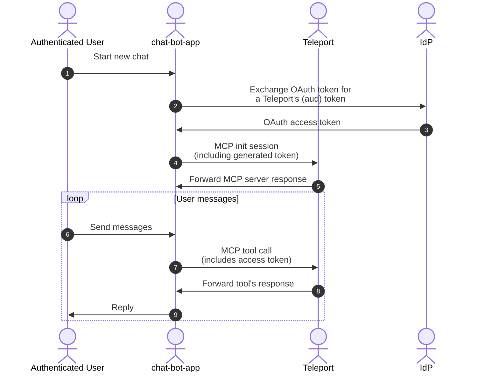
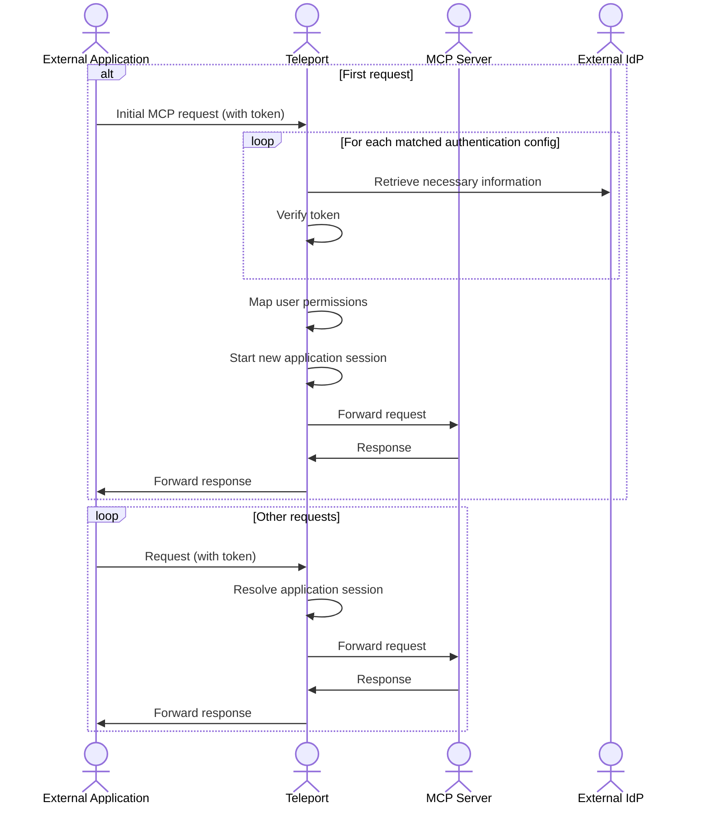
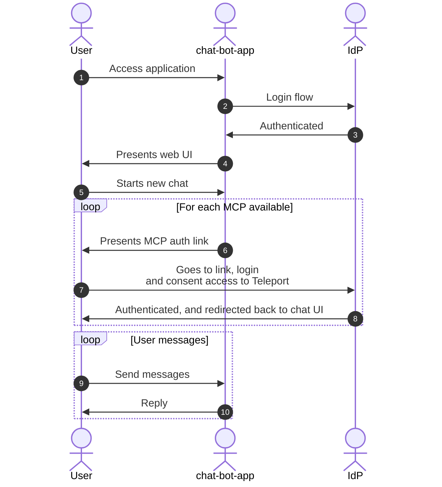

# RFD 0030e - Remote MCP

## Required Approvers

- Engineering: @r0mant && @greedy52
- Product: @klizhentas

## What

Add support for remotely accessing Teleport-managed MCP servers, also known as
remote MCPs, without needing a dedicated client like `tsh`. This includes
offering an authentication method that MCP clients can use directly.

This RFD primarily addresses the use case where Teleport is configured with an
external identity provider (Single Sign-On provider).

The following is considered out of scope for this RFD:

- MCP servers discover. This RFD assumes clients already know the available MCP
  servers and will send requests to specific MCP servers.
- MCP server gateway (single MCP server configuration). For this, refer to [RFD 0221](https://github.com/gravitational/teleport/pull/57882)
- Authenticating local users.
- Supporting multiple MCP transports and managing their details. Here, we assume
  all the remote MCP connections will use Streamable HTTP.
- Providing user identity to the the MCP server. This is already covered by
  [Teleport's application access JWTs](https://goteleport.com/docs/enroll-resources/application-access/jwt/introduction/).
- Supporting authentication configuration for other protocols. This can be
  addressed as future work, but this RFD won't cover any of its aspects.

## Why

Currently, MCPs served by Teleport are only accessible through local proxies
managed by `tsh`. While this setup is practical for local MCP clients, where
users can configure commands to run on their machines, it becomes less effective
when used with specialized applications such as internal chat systems. This is
especially true for handling user authentication processes.

In contrast, remote MCPs eliminate the need for a specialized runtime on the MCP
client and offer more options for web-based authentication methods, such as
OAuth.

## Details

This section will cover details of the first implementation option. The second
option is considered outside the scope of this RFD and might be introduced
later.

### Overview

In this implementation, the requesting application provides an OAuth access
token issued for Teleport in the `Authorization` header on MCP requests.

This token is obtained through an OAuth token exchange[^1]. In short, the
application presents a token issued for itself and exchanges it for a token
that can be used with Teleport MCP access.

On the Teleport side, this token will be verified and used to identify the user
and their permissions.

### Requirements

This sections lists what are the requirements for this option to work properly.

- The generated JWT token must originate from an existing persistent Teleport
  user. Teleport will try to locate a persistent user with the same username
  present in the `email` claim of the JWT token. For cases where this is not
  the case, the configuration provides a way to select a different JWT claim to
  be used as the username.
- The assigned user must have sufficient permission to access the target
  application. This will be accomplished using Teleport's existing permissions
  features, such as roles and access lists.
- The IdP used must support OAuth token exchange, and the application client
  MUST have sufficient permissions to perform the token exchange. This
  configuration can vary depending on the IdP. [Example for Okta configuration](https://developer.okta.com/docs/guides/set-up-token-exchange/-/main/).
- The chat application must have access to the user's OAuth token.

### UX

#### Use-case: Alice wants to use their internal chat application with Teleport MCPs

[Recorded demo](https://goteleport.zoom.us/clips/share/2UyR3MJdQRKljiHoH0LWrA) 



Alice logs into the chat application using a third-party identity provider (IdP).
After authentication, the MCP servers will already be loaded and available for
use. No additional steps are required.

#### Use-case: Bob, an application developer, wants to connect my chat app with the MCP servers provided by Teleport.

Bob needs to update the chat application to include support for the
MCP authentication. Assuming they're using the MCP official Python SDK[^2],
the new authenticator should:

1. Retrieve the current user's OAuth token, which is generated when users log in
   to your application.
2. Send a request to the issuer (identity provider) to exchange your token for
   one compatible with Teleport.
3. Include the access token in the Authorization header with each MCP
   request.

The application's flow would look like this:



See code example in [Appendix](#token-exchange-authenticator).

#### Use-case: Carol a system administrator configuring the capability on Teleport and 3rd party identity provider (IdP)

First, Carol will configure a new OIDC client called `teleport` on their IdP.
This client will be used by their Teleport cluster. Since this client won't
generate any tokens, there is no need to change its scopes.

Second, they'll update their existing OIDC client (`chatbotapp`) used by their
chatbot app so it can generate tokens for the `teleport` client audience. Note
that this step might vary depending on the IdP used.

Now, with everything set up on their IdP, Alice can create the applications
authentication config at Teleport. See more about it [here](#configuration).

#### Use-case: Carlos, a system administror is configuring app auth with Teleport's identity and governance for their Okta users.

They already have Okta integration set up to sync users and groups. The synced
users are `alice` and `bob`, both in the `dev` group.

First, they will create a new access list called "MCP access". This access list
contains the default role `mcp-user`. This role allows users to access all MCPs
without tools or any other restrictions.

```yaml
version: v1
kind: access_list
metadata:
  name: mcp-access-list
spec:
  title: "MCP access"
  audit:
    recurrence:
      frequency: 6months
      day_of_month: "1"
    notifications:
      start: 336h # two weeks
    next_audit_date: "2025-01-01T00:00:00Z"
  description: "Allows access to the organization MCP servers"
  owners:
  - description: system admin
    name: carlos
    membership_kind: MEMBERSHIP_KIND_USER
  grants:
    roles:
    - mcp-user
```

Also, in the access list, they'll add the Okta `dev` group as a member of this
access list, allowing its users to inherit the permission grants.

```code
$ tctl acl users add --kind=list mcp-access-list dev
```

Now, `alice` and `bob` (both members of the Okta `dev` group) have access to the
MCP servers and can use them through their chatbot app.

### MCP servers address

The streamable HTTP MCP servers will be accessed directly through the Teleport
proxy, eliminating the need for a local tunnel. Since it will be accessible via
the proxy's API, it won't need TLS routing and will work with L7 load balancers
out of the box.

To better support trusted clusters and future expansion (including MCP Gateway),
we will not use the application's public address. Instead, we will introduce a
new Proxy endpoint dedicated solely to streamable HTTP MCP servers, including
future support for SSE.

The `/mcp/:site/apps/:app_name` endpoint will be added with the necessary HTTP
methods to the MCP servers.

Additionally, we will include another endpoint that always resolves the `:site`
to the current cluster, acting as a shortcut for local servers:
`/mcp/apps/:app_name`.

Here are some examples of how external applications will connect to the MCP
servers.

- `https://proxy.teleport.dev/mcp/my-trusted-cluster/apps/mcp-everything`
  - Cluster: `my-trusted-cluster`
  - MCP Server name (app name): `mcp-everything`
- `https://proxy.teleport.dev/mcp/apps/mcp-everything`
  - Cluster: Current cluster
  - MCP Server name (app name): `mcp-everything`

### Requests handling



Once Teleport receives a request on the MCP endpoint, it will first try to load
the application authorization config available for the matched app. If there are
multiple matches, Teleport will attempt to resolve them one by one, stopping at
the first success.

After solving the config, Teleport will perform the following steps:

1. Token integrity verification ([token example](#jwt-token-example)). Teleport will verify that the token was issued
   by the configured app authentication config and that the audience and
   resources are correctly set. This is done by retrieving the JWKS signing keys
   from the issuer and verifying that the provided token was signed by it. After
   decoding the signed token, it checks whether the token audience matches the
   configured `audience` and the `resource` field matches the MCP application
   endpoint.

2. Teleport will use information within the provided token to locate the user.
   If it cannot find the user or if the user lacks sufficient permission to
   access the application, it will return an unauthorized error.

3. Generate the application session and certificates for use in the MCP session.

This process occurs only when Teleport receives the token for the first time.
For subsequent requests, Teleport will match the token with its application
session and forward the requests to the underlying MCP server.

On subsequent requests, the proxy must restore this application session to
retrieve session information and forward it to the application agent.

Since we cannot store the session ID in the token (as is done with
certificates), we will hash the token using SHA-256 and use it as the
application session ID. The process for resolving the application session will
remain the same.

### Configuration

As shown in the UX section, we'll introduce a new configuration type called
application configuration config (`app_auth_config`). It will always be used
with subkinds.

This allows us to expand it to support other application types and add
additional authentication configs, such as the MCP OAuth flow described as the
second implementation option.

Initially, only the `jwt` subkind will be added. This config will
enable Teleport to accept JWT tokens on app requests, eliminating the need for
a WebSession cookie or certificates. Here is an overview of this configuration.

```yaml
kind: app_auth_config
sub_kind: jwt
version: v1
spec:
  # app_labels define the labels matcher for applications that can use this authentication config.
  #
  # In this example, it will match all MCP applications.
  app_labels:
    teleport.internal/app-sub-kind: mcp
  # jwt contains the JWT spec.
  jwt:
    # issuer is the JWT token issuer name. This value is used to verify the
    # token.
    issuer: custom-realm
    # audience is expected audience from the generated token.
    # This value will usually be a client_id.
    audience: teleport
    # username_claim (optional) is the claim name used as username. Defaults to `email`.
    username_claim: preferred_username
    # authorization_header (optional) defines the header name that will contain
    # the token. Defaults to `Authorization`.
    authorization_header: JWT-Authorization
    # jwks_url is the JWKS URL address used to fetch signing keys.
    #
    # Only required, when static_jwks is not set.
    jwks_url: https://keycloak-addr/realms/custom-realm/.well-known/jwks
    # static_jwks (optional) allows the JSON Web Key Set (JWKS) used to verify the
    # token to be set, removing the necessity of Teleport to retrieve it from the
    # issuer.
    #
    # When unspecified, the JWKS will be fetched automatically.
    static_jwks: |
      {"keys":[--snip--]}
```

<details>
<summary>Resource Protobuf definition</summary>

```protobuf
import "teleport/header/v1/metadata.proto";
import "teleport/label/v1/label.proto";
import "teleport/legacy/types/types.proto";

// AppAuthConfig is the definition of apps authentication configs.
message AppAuthConfig {
  // Kind is the resource kind. Must be "app_auth_config".
  string kind = 1;
  // SubKind is the app auth config subkind.
  string sub_kind = 2;
  // Version is the app auth config resource version.
  string version = 3;
  // Metadata is the app auth config resource's metadata.
  teleport.header.v1.Metadata metadata = 4;
  // Spec is the app auth config specification.
  AppAuthConfigSpec spec = 5;
}

// AppAuthConfigSpec contains spec for all supported app auth configs.
message AppAuthConfigSpec {
  // AppLabels is used to define the app_labels matcher, which selects
  // applications that can use this authentication config. An empty value means
  // no application will use it.
  repeated teleport.label.v1.Label app_labels = 1;

  oneof sub_kind_spec {
    // Jwt is the JWT authentication config spec.
    AppAuthConfigJWTSpec jwt = 2;
  }
}

// AppAuthConfigJWTSpec contains the spec for JWT authentication config.
message AppAuthConfigJWTSpec {
  // Issuer is the JWT token issuer name. This value is used to verify the token.
  string issuer = 1;
  // Audience is the expected token audience. It will usually be a OAuth
  // client_id issued for Teleport use.
  string audience = 2;
  // UsernameClaim specifies which token claim name's value will be used as the
  // username.
  string username_claim = 3;
  // AuthorizationHeader is the HTTP header name that will contain the token.
  string authorization_header = 4;

  oneof keys_source {
    // IssuerUrl is the JWKS URL used to fetch signing keys.
    string jwks_url = 5;
    // StaticJwks is the contents of JWKS singing keys. Useful when Teleport
    // cannot reach the JWKS URL.
    string static_jwks = 6;
  }
}
```

</details>

### Audit and product events

In addition to the existing MCP events, there will be events dedicated to the
authentication config flows:

- `app_auth_config.create`, `app_auth_config.update` and `app_auth_config.delete`: Tracks configuration changes.

- `app_auth_config.verify.success`: Emitted when verification is successful.
  This will include details about the app and the config used.

- `app_auth_config.verify.failure`: Triggered when verification fails. This will
  include details about the app, the config used, and the failure reason.

To monitor this feature's usage, we'll emit product events on configuration and
success or failure.

In addition, the auth config type will also be included as `tp.mcp.ingress_auth_type`
property of the `tp.sesison.start.v2` event.

### Security considerations

Other OAuth security considerations also apply to this process.[^3]

The primary concern involves tokens issued by an external client that provide
access to Teleport resources, particularly for MCP servers. To minimize the risk
of leaked tokens, the following measures will be implemented:

#### Use of short-lived access tokens

Besides recommending the policy setup for tokens issued to the Teleport audience
and MCP application name (resource), we'll also enforce a time-to-live (TTL) for
these tokens on the Teleport side.

The app session TTL will be set as the shorter of the user role definition and
token expiration time. Additionally, the provided token must meet the following
criteria to be considered valid:

- Token issue time (`iat`) must be recent (close to the current time), which
  guarantees token “freshness.” Teleport will account for clock skew to prevent
  rejecting fresh tokens.

- Tokens must not be expired. Expired tokens won’t be processed by Teleport.

Requests with tokens that are invalid due to the rules above or any other token
verification failure ([see more here](#requests-handling)) will be rejected with
an [`invalid_token` error response](https://datatracker.ietf.org/doc/html/rfc6750#section-6.2.2).

When clients encounter this error, they must generate a new token and resend
the request.

#### Single targeted Teleport resource

Each generated token can only access one Teleport resource within this scope,
which is a single MCP server. This is managed through the `resource` field of
the token. When the token is received, Teleport will verify that it requests the
correct resource and returns an [`invalid_token` unauthorized error response](https://datatracker.ietf.org/doc/html/rfc6750#section-6.2.2)
if validation fails.

### Benefits

- The user does not need extra logins or consent redirects when accessing MCP
  servers via the chat app.

### Drawbacks

- Requires a custom authorization config for MCP servers. Most official MCP SDKs
  support custom authorization configs, but we still need to provide this or
  have customers implement their own.
- Only supports private OAuth clients, meaning users can't authenticate with
  public OAuth clients (such as VSCode or Claude Desktop).

## Future work

### Authentication configs

The scope of this RFD is limited to the `jwt` authentication config, but we
can expand it later with other configs. Here is a non-exhaustive list of what
can be built:

- Opaque OIDC token: This config requires Teleport to perform an introspection
  call to retrieve the user information. With this config, we can support most
  of the identity providers.

- MCP OAuth: [More info on the alternatives section](#mcp-authorization-flow).

- Local users: Involving using Teleport-generated JWT tokens to authenticate
  requests. We could reuse the application access JWT issuer, making it easier
  for applications hosted on Teleport to access other applications.

## Alternatives

During the conception phase of this RFD, another option was considered, and
we'll include it here as it might be used in future work.

### MCP authorization flow

This option implements the [MCP authorization flow](https://modelcontextprotocol.io/specification/2025-06-18/basic/authorization).
In short, it relies on OAuth for authenticating the user and generating access
tokens for the MCP servers.

#### Requirements

This sections lists what are the requirements for this option to work properly.

- An MCP client or SDK that handles the authentication process.

#### UX

##### Use-case: Alice wants to use their internal chat application with Teleport MCPs



Alice logs into the chat application, and before sending messages, they must
authenticate the MCP server through a link provided in the chat app's web
interface. When they click it, they are redirected to the identity provider,
log in, and gain access. After that, they are sent back to the chat app, where
the MCP server is now ready, and they can start messaging.

##### Use-case: Bob, an application developer, wants to connect my chat app with the MCP servers provided by Teleport.

Bob needs to update the chat application to include support for the
authentication config. Assuming they're using the MCP official Python SDK[^2],
they should:

1. Update the MCP configuration to include the OAuth authenticator.
2. Display the generated link to users within their web application, enabling
   them to access the authorization URL.
3. Implement a new endpoint for the authorization callback in their application.
   This is a standard OAuth callback and should validate the provided state and
   store the authorization code for later use on the MCP SDK.

[See for original diagram for reference](https://modelcontextprotocol.io/specification/2025-06-18/basic/authorization#sequence-diagram)

See code example in [Appendix](#oauth-mcp).

#### Security considerations

Other OAuth security considerations[^3] and [MCP security considerations](https://modelcontextprotocol.io/specification/2025-06-18/basic/authorization#security-considerations)
also apply to this process.

In addition to clients having secure token storage to prevent token theft,
Teleport must also use an access token that guards against session hijacking,
similar to a [previous vulnerability in application access](https://github.com/gravitational/teleport-private/issues/201).

To do this, Teleport should use an access token containing information that
isn't fully accessible to other users. For example, it should only use the
application session ID as the token, since this is accessible to others through
audit events and session recordings. A possible approach is to use the application
session's `BearerToken` value, which is opaque to users.

#### Benefits

- Requires no changes to the official MCP SDKs.
- Works with any MCP client that supports authorization, including public
  clients like VSCode and Claude Desktop.

#### Drawbacks

- Additional user redirect for authentication/consent as per MCP server configuration.

## Appendix

### JWT token example

```json
{
  "exp": 1738331391,
  "iat": 1738331091,
  "jti": "fce700df-b258-415d-98cb-f01a9b0d916a",
  "iss": "https://keycloak-addr/realms/Comfortage",
  "aud": "teleport",
  "sub": "36923d60-e3fc-490a-b530-a42af5864279",
  "typ": "Bearer",
  "acr": "1",
  "scope": "email",
  "sid": "3f64329c-1934-4697-bbd4-1b158b48abb7",
  "email_verified": false,
  "preferred_username": "User",
  "email": "user@example.com"
}
```

### Token exchange authenticator

```python
import asyncio

from mcp import ClientSession
from mcp.client.streamable_http import streamablehttp_client

import httpx
from collections.abc import AsyncGenerator
from urllib.parse import urljoin
from mcp.shared.auth import OAuthToken

class TeleportMCPAuth(httpx.Auth):
    oauth_token: str

    def __init__(self, issuer_url, client_id, client_secret, oauth_token: str):
        self.oauth_token = oauth_token
        self.issuer_url = issuer_url
        self.client_id = client_id
        self.client_secret = client_secret

    async def _exchange_token(self) -> httpx.Request:
        token_url = urljoin(self.issuer_url, "/token")
        token_data = {
            "client_id": self.client_id,
            "client_secret": self.client_secret,
            "grant_type": "urn:ietf:params:oauth:grant-type:token-exchange",
            "subject_token": self.oauth_token,
            "subject_token_type": "urn:ietf:params:oauth:token-type:access_token",
            # This needs to be adjusted per IdP to ensure the correct token is forwarded to Teleport.
            # For example, if Teleport is configured to expect an `id_token`, the requested token must be updated accordingly.
            "request_token_type": "urn:ietf:params:oauth:token-type:access_token",
            # This must match with MCP server name.
            "resource": "/mcp/mycluster/apps/mcp-everything",
            "audience": "teleport",
            "scope": "email",
        }

        return httpx.Request(
            "POST", token_url, data=token_data, headers={
                "Content-Type": "application/x-www-form-urlencoded",
                "Accept": "application/json"
            }
        )

    async def _handle_exchange_token_response(self, resp: httpx.Response) -> str:
        if resp.status_code != 200:
            raise Exception(f"Token exchange failed: {resp.status_code}")

        try:
            content = await resp.aread()
            token_response = OAuthToken.model_validate_json(content)
            # TODO: validate scopes
            return token_response.access_token
        except ValidationError as e:
            raise Exception(f"Invalid token response: {e}")

    async def async_auth_flow(self, request: httpx.Request) -> AsyncGenerator[httpx.Request, httpx.Response]:
        token_request = await self._exchange_token()
        token_response = yield token_request
        access_token = await self._handle_exchange_token_response(token_response)

        print(f"Access token for Teleport: {access_token}")
        request.headers["Authorization"] = f"Bearer {access_token}"
        yield request

async def main():
    """Run the OAuth client example."""
    auth = TeleportMCPAuth(
        issuer_url = "https://idp-issuer-address/",
        client_id = "example-app",
        client_secret = "example-secret",
        # This comes from already authenticated user.
        oauth_token = "...",
    )

    async with streamablehttp_client("https://proxy.teleport.dev/mcp/apps/mcp-everything", auth=auth) as (read, write, _):
        async with ClientSession(read, write) as session:
            await session.initialize()

            tools = await session.list_tools()
            print(f"\n\n\n==> Available tools: {[tool.name for tool in tools.tools]}")
```

### OAuth MCP

```python
async def main():
  """Run the OAuth client example."""
  oauth_auth = OAuthClientProvider(
      server_url="http://my-chat-app-addr",
      client_metadata=OAuthClientMetadata(
          client_name="Example MCP Client",
          redirect_uris=[AnyUrl("http://my-chat-app-addr/callback")],
          grant_types=["authorization_code", "refresh_token"],
          response_types=["code"],
          scope="user",
      ),
      storage=InMemoryTokenStorage(), # Example at: https://github.com/modelcontextprotocol/python-sdk/blob/47d35f0b3ca2e59ddc26ddc0f2a816ac3dc8df9b/examples/snippets/clients/oauth_client.py#L21
      redirect_handler=handle_redirect, # Presents the login URL to the user.
      callback_handler=handle_callback, # Must wait until the callback arrives at the application.
  )

  async with streamablehttp_client("http://proxy.teleport.dev/mcp/apps/mcp-everything", auth=oauth_auth) as (read, write, _):
      async with ClientSession(read, write) as session:
          await session.initialize()

          tools = await session.list_tools()
          print(f"Available tools: {[tool.name for tool in tools.tools]}")
```

[^1]: https://datatracker.ietf.org/doc/html/rfc8693
[^2]: https://github.com/modelcontextprotocol/python-sdk
[^3]: https://datatracker.ietf.org/doc/html/rfc6749#section-10
