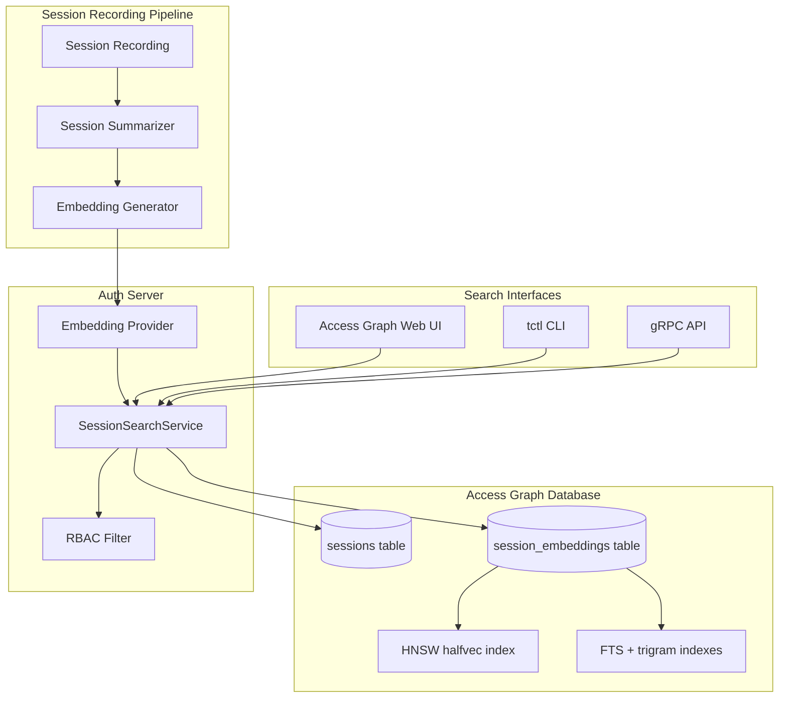

# RFD 0033e - Natural Language Session Search

## Required approvers

- Engineering: @r0mant && (@ryanclark || @bl-nero)
- Product: @benarent

## What

Implement natural language session search using vector embeddings and hybrid full-text + semantic search. Users can search session recordings with natural language queries, find similar sessions, and investigate security incidents by searching for specific patterns like commands or indicators of compromise.

## Why

Right now, searching session recordings in Teleport is limited to exact metadata matches: session ID, user, date range. There's no way to search by session content or activity patterns, no way to find sessions with similar characteristics, and security investigations require manually reviewing many sessions.

Natural language search addresses this by allowing queries like "database maintenance sessions" or "password reset attempts". Users can find what they're looking for without knowing exact metadata values. For security teams, semantic search dramatically reduces time spent reviewing unrelated sessions.

## User Interfaces

### Query Examples

The following items show the range of natural language queries supported, including permutations with users, resource labels, and time.

#### Security Investigations

- "sudo or privilege escalation attempts"
- "sudo escalation by alice on production servers"
- "privilege escalation on hosts labeled env=production"
- "ssh key generation or credential export by bob"
- "network scanning or port discovery on env=staging"
- "large file transfers or wget downloads in the last week"
- "drop table or bulk delete on databases labeled tier=data"
- "suspicious commands run by contractors on prod infrastructure"

#### Operational Queries

- "database backup or maintenance"
- "database maintenance performed by user on env=production"
- "deployments to the prod cluster by the platform team"
- "password reset or user account creation"

#### Incident Response

- "xmrig cryptominer or coin mining activity"
- "config file or sudoers modification"
- "config modifications by foo on env=production between Feb 20 and Feb 21"

#### Compliance and Auditing

- "schema changes or DDL statements on production databases"
- "sessions touching compliance=pci labeled resources in Q1 2025"

### Web UI (Access Graph)

The Access Graph web interface has a dedicated search page. Users enter natural language queries, apply optional filters (date range, session kind, resource labels), and receive ranked results with similarity scores.

### tctl CLI

```bash
# Search sessions by natural language query
tctl recordings search "database password reset"

# Search with filters
tctl recordings search "maintenance tasks" \
  --cluster=prod \
  --kind=ssh \
  --from="2025-01-01" \
  --to="2025-01-31" \
  --limit=20 \
  --min-score=0.7

# Output formats
tctl recordings search "suspicious activity" --format=text(table)|json|yaml
```

Example output:

```text
$ tctl recordings search "database password reset"

Session ID                            Score  Started            User      Resource
------------------------------------  -----  -----------------  --------  ------------------
a1b2c3d4-e5f6-7890-abcd-ef1234567890  0.92   2024-01-15 14:32  alice     postgres-prod
b2c3d4e5-f6a7-8901-bcde-fa2345678901  0.87   2024-01-14 09:15  bob       mysql-staging
c3d4e5f6-a7b8-9012-cdef-ab3456789012  0.81   2024-01-13 16:45  charlie   postgres-dev

Found 3 sessions matching "database password reset"
```

## Details

### Architecture Overview

**Important**: Search only works for sessions that have been summarized. Sessions without summaries can't be searched.

After session summary generation completes, the auth server creates embedding vectors using OpenAI or Bedrock. The embeddings are sent to the Access Graph via gRPC and stored in its PostgreSQL database using pgvector's `halfvec` type.

When a user searches, the auth server generates an embedding for their query and forwards both the text and the embedding vector to the Access Graph. The Access Graph runs a hybrid search combining full-text search (FTS) and vector similarity against stored embeddings, fusing the two signals via Relative Score Fusion (RSF). Metadata filters are applied during the search, results are ranked by fused score, and filtered by RBAC before being returned through the Web UI or tctl.



### Data Model

#### Session Table Schema

The sessions table stores session metadata in Access Graph:

```sql
CREATE TABLE sessions (
  id UUID PRIMARY KEY,
  kind TEXT NOT NULL,
  started_at TIMESTAMPTZ NOT NULL,
  finished_at TIMESTAMPTZ,
  -- session_time is an alias for started_at, used for proto compatibility
  session_time TIMESTAMPTZ GENERATED ALWAYS AS (started_at) STORED,

  "user" TEXT NOT NULL,
  user_traits JSONB NOT NULL,
  user_roles TEXT[],
  access_request_ids TEXT[],
  participants TEXT[] NOT NULL,

  -- resource metadata
  resource_kind TEXT NOT NULL,
  resource_labels JSONB NOT NULL,
  resource_id TEXT NOT NULL,
  resource_name TEXT,
  -- Store full resource properties for search and filtering
  -- {server_addr, server_hostname} for SSH sessions
  -- {kubernetes_cluster, pod_namespace, pod_name} for Kubernetes sessions
  -- {database_name, database_table} for database sessions
  resource_properties JSONB NOT NULL,

  severity INTEGER NOT NULL,
  session_end_event JSONB NOT NULL,

  -- Summary status
  summary_status TEXT NOT NULL DEFAULT 'unknown',
  summary_error TEXT,

  CONSTRAINT valid_summary_status CHECK (summary_status IN ('unknown', 'none', 'pending', 'success', 'error'))
);

-- Basic lookup indexes
CREATE INDEX idx_sessions_kind ON sessions (kind);
CREATE INDEX idx_sessions_user ON sessions ("user");
CREATE INDEX idx_sessions_started_at ON sessions (started_at DESC);
CREATE INDEX idx_sessions_finished_at ON sessions (finished_at DESC);
CREATE INDEX idx_sessions_resource_kind ON sessions (resource_kind);
CREATE INDEX idx_sessions_resource_id ON sessions (resource_id);
CREATE INDEX idx_sessions_resource_name ON sessions (resource_name);
-- Compound index for pagination (finished_at DESC, id DESC)
CREATE INDEX idx_sessions_pagination ON sessions (finished_at DESC, id DESC);

-- Array indexes
CREATE INDEX idx_sessions_user_roles_gin ON sessions USING GIN (user_roles);
CREATE INDEX idx_sessions_access_request_ids_gin ON sessions USING GIN (access_request_ids);

-- JSONB indexes
CREATE INDEX idx_sessions_resource_labels_gin ON sessions USING GIN (resource_labels);
CREATE INDEX idx_sessions_user_traits_gin ON sessions USING GIN (user_traits);
CREATE INDEX idx_sessions_participants_gin ON sessions USING GIN (participants);
CREATE INDEX idx_sessions_resource_properties_gin ON sessions USING GIN (resource_properties);
CREATE INDEX idx_sessions_session_end_event_gin ON sessions USING GIN (session_end_event);
```

#### Session Embeddings Table Schema

Embeddings are stored separately to support chunking. Large sessions are split into multiple chunks, each with its own embedding vector. This allows searching within session segments and handles sessions that exceed the embedding model token limit.

The table uses the `halfvec` type (16-bit floats) instead of `vector` (32-bit floats), halving storage requirements with negligible quality loss for 1024-dimensional embeddings.

Each chunk stores a `parent_chunk_text` -- the surrounding context window (+/-1 adjacent chunks). The small `chunk_text` is what gets embedded for precision; the richer `parent_chunk_text` is returned to callers for display context (parent-child retrieval pattern).

```sql
CREATE TABLE session_embeddings (
  id UUID PRIMARY KEY DEFAULT gen_random_uuid(),
  session_id UUID NOT NULL REFERENCES sessions(id) ON DELETE CASCADE,

  chunk_text TEXT NOT NULL,
  -- parent_chunk_text holds the surrounding context window (typically +/-1 adjacent chunks).
  -- chunk_text is what gets embedded (small/precise); parent_chunk_text is what gets
  -- returned to callers as richer answer context (parent-child retrieval pattern).
  parent_chunk_text TEXT,
  chunk_index INTEGER NOT NULL DEFAULT 0,

  embedding_vector halfvec(1024) NOT NULL,

  embedding_model TEXT NOT NULL,
  generated_at TIMESTAMPTZ NOT NULL DEFAULT now()
);

-- Foreign key index
CREATE INDEX idx_session_embeddings_session_id ON session_embeddings (session_id);

-- HNSW vector similarity index
-- m=24: more connections per layer than default (16) for better recall
-- ef_construction=200: higher = better quality index, slower build
CREATE INDEX idx_session_embeddings_vector_hnsw ON session_embeddings
  USING hnsw (embedding_vector halfvec_cosine_ops)
  WITH (m = 24, ef_construction = 200);

-- Trigram indexes for ILIKE substring matching (requires pg_trgm extension)
CREATE INDEX idx_session_embeddings_chunk_text_trgm ON session_embeddings
  USING GIN (chunk_text gin_trgm_ops);
CREATE INDEX idx_session_embeddings_parent_chunk_text_trgm ON session_embeddings
  USING GIN (parent_chunk_text gin_trgm_ops);

-- Full-text search tsvector columns (materialized, auto-updated)
-- English config: stemming + stop words for natural language queries
ALTER TABLE session_embeddings ADD COLUMN chunk_text_tsv tsvector
  GENERATED ALWAYS AS (to_tsvector('english', chunk_text)) STORED;
ALTER TABLE session_embeddings ADD COLUMN parent_chunk_text_tsv tsvector
  GENERATED ALWAYS AS (to_tsvector('english', COALESCE(parent_chunk_text, chunk_text))) STORED;
-- Simple config: no stemming, no stop words -- preserves command names like "kubectl", "su", "nc"
ALTER TABLE session_embeddings ADD COLUMN chunk_text_tsv_simple tsvector
  GENERATED ALWAYS AS (to_tsvector('pg_catalog.simple', chunk_text)) STORED;
ALTER TABLE session_embeddings ADD COLUMN parent_chunk_text_tsv_simple tsvector
  GENERATED ALWAYS AS (to_tsvector('pg_catalog.simple', COALESCE(parent_chunk_text, chunk_text))) STORED;

CREATE INDEX idx_session_embeddings_chunk_text_tsv ON session_embeddings USING GIN (chunk_text_tsv);
CREATE INDEX idx_session_embeddings_parent_chunk_text_tsv ON session_embeddings USING GIN (parent_chunk_text_tsv);
CREATE INDEX idx_session_embeddings_chunk_text_tsv_simple ON session_embeddings USING GIN (chunk_text_tsv_simple);
CREATE INDEX idx_session_embeddings_parent_chunk_text_tsv_simple ON session_embeddings USING GIN (parent_chunk_text_tsv_simple);
```

### PostgreSQL Extension Requirements

Two extensions are required:

- **pgvector**: provides the `halfvec` type and HNSW index for vector similarity search. Per-tenant migration; availability is tracked in the `tenants.pgvector_version` column.
- **pg_trgm**: provides `gin_trgm_ops` for `ILIKE '%word%'` substring matching without full table scans. Installed globally via a shared migration.

The Access Graph queries for extension availability at startup and reports it via the `IsSessionSearchEnabled` RPC so the auth server and UI can surface a clear "feature disabled" error rather than empty results.

### Embedding Generation

#### Input Data

The embedding vector is generated from a combined text representation that includes:
- Session summary (short 1-2 sentence overview and full markdown description)
- Session metadata (cluster name, resource kind, resource name, labels, participants)
- Command history for SSH and Kubernetes sessions (notable commands and output)

#### Text Composition

The input text is structured as:

```text
Resource: <resource_kind>/<resource_name>
Labels: <key1>=<value1>, <key2>=<value2>, ...
Participants: <user1>, <user2>, ...

Summary: <short_description>

<full_description>

Notable Commands:
<command1>
<command2>
...
```

#### Chunking Strategy

Sessions that exceed the embedding model token limit are split into multiple chunks. Each chunk is embedded separately and stored in `session_embeddings` with `chunk_index` tracking its position.

The chunking process:

1. Calculate token count for the full session text
2. If count exceeds 512 tokens, split into chunks
3. Each chunk is 512 tokens with 128-token overlap (~25%) to preserve context
4. For each chunk, build a `parent_chunk_text` by joining the chunk with its +/-1 neighbors (parent-child retrieval)
5. Generate embedding for each `chunk_text`
6. Store each embedding with `chunk_text`, `parent_chunk_text`, `chunk_index`, and model metadata

The position of a chunk is important: earlier chunks (index 0) contain the session summary and are scored higher via a position decay factor.

#### Embedding Model

We use OpenAI's `text-embedding-3-small` or Bedrock's `amazon.titan-embed-text-v2:0`. Both produce vectors that are stored as `halfvec(1024)`. Vectors longer than 1024 dimensions are truncated before storage; the `halfvec` type compresses each value to a 16-bit float, halving memory and index size relative to `vector`.

#### Embedding Provider Interface

The auth server implements embedding generation before forwarding search requests to the Access Graph:

```go
// EmbeddingProvider generates vector embeddings from text.
type EmbeddingProvider interface {
    GenerateEmbeddings(ctx context.Context, text string) ([]float32, int, error)
}
```

The Access Graph never calls the embedding provider directly. The auth server generates embeddings and sends both the text and the embedding vector to the Access Graph via the `EmbeddedQuery` message. This design lets the Access Graph support keyword-only search without embedding generation when pgvector is unavailable.

### Configuration

#### Embedding Model Configuration

The embedding model configuration is stored as a singleton resource in Teleport. Consistency is required because embeddings from different models aren't comparable during search.

**NOTE**: Changing the embedding model requires re-generating embeddings for all sessions. We don't plan to support model changes in the initial implementation.

```yaml
# /retrieval_models/session-embeddings
kind: retrieval_model
metadata:
  name: session-embeddings
spec:
  # Inference model for transforming search queries into structured filters
  inference_model: inference-model-name

  embeddings_provider:
    # Provider-specific configuration
    openai:
      model_id: text-embedding-3-small
      api_key_secret_ref: openai-key
      base_url: "https://api.openai.com/v1"

    # Alternative: Bedrock configuration
    # bedrock:
    #   model_id: amazon.titan-embed-text-v2
    #   region: us-west-2
    #   integration_name: my-aws-integration
```

### Search API

Access Graph exposes a gRPC API for session search. The Auth service generates embeddings for the query, calls this API, retrieves results, and enforces RBAC filtering before streaming back to the client.

#### gRPC Service Definition

```proto
service SessionRecordingService {
  // SearchSessionSummaries establishes a bidirectional streaming RPC for batched
  // searching of session summaries. The first message from the client must contain
  // search_params. The server streams zero or more summary messages followed by
  // a batch_complete message. If has_more is true, the client can send fetch_more
  // to receive the next batch.
  rpc SearchSessionSummaries(stream SearchSessionSummariesRequest)
    returns (stream SearchSessionSummariesResponse);

  // StoreSessionSummary saves a session summary with its associated metadata
  // and embeddings. Re-storing the same session_id is idempotent.
  rpc StoreSessionSummary(StoreSessionSummaryRequest)
    returns (StoreSessionSummaryResponse);

  // IsSessionSearchEnabled reports whether session search is active.
  // The Auth server calls this before exposing session search to end users.
  rpc IsSessionSearchEnabled(IsSessionSearchEnabledRequest)
    returns (IsSessionSearchEnabledResponse);
}

// SearchMode controls which search strategy to apply.
enum SearchMode {
  SEARCH_MODE_UNSPECIFIED = 0;  // behaves as HYBRID
  SEARCH_MODE_HYBRID = 1;       // full-text + vector, merged via RSF
  SEARCH_MODE_KEYWORD_ONLY = 2; // FTS only; no embeddings generated or queried
  SEARCH_MODE_EMBEDDING_ONLY = 3; // vector only; no FTS performed
}

message SearchSessionSummariesParams {
  google.protobuf.Timestamp start_time = 1;
  google.protobuf.Timestamp end_time = 2;
  repeated string kinds = 3;
  optional string username = 4;
  repeated string user_roles = 5;
  repeated string access_request_ids = 6;
  optional string resource_kind = 7;
  optional string resource_name = 8;
  map<string, string> resource_labels = 9;
  ResourceProperties resource_properties = 10;
  teleport.summarizer.v1.RiskLevel severity = 11;
  // search_queries: free-text queries with pre-computed embeddings.
  // The auth server generates embeddings before forwarding.
  repeated EmbeddedQuery search_queries = 12;
  uint32 max_summaries = 13;
  string resume_token = 14;  // cursor for cross-stream pagination
  SearchMode search_mode = 15;
}

// EmbeddedQuery pairs a free-text query with its pre-computed vector embedding.
message EmbeddedQuery {
  string text = 1;
  repeated float embeddings = 2;
  string model_name = 3;  // used to skip stored chunks from a different model
}

// EmbeddingChunk represents one chunk of a session summary with its embedding.
message EmbeddingChunk {
  repeated float values = 1;
  string chunk = 2;         // embedded text (small/precise)
  uint32 chunk_index = 3;   // zero-based position within session
  string model_name = 4;    // embedding model identifier
}

// SessionSearchAvailability describes feature availability.
enum SessionSearchAvailability {
  SESSION_SEARCH_AVAILABILITY_UNSPECIFIED = 0;
  SESSION_SEARCH_AVAILABILITY_AVAILABLE = 1;
  SESSION_SEARCH_AVAILABILITY_NOT_IMPLEMENTED = 2;      // AG doesn't support this RPC
  SESSION_SEARCH_AVAILABILITY_PG_TRGM_UNAVAILABLE = 3; // pg_trgm not installed
  SESSION_SEARCH_AVAILABILITY_PG_VECTOR_UNAVAILABLE = 4; // pgvector not installed
}
```

#### Search Implementation

The Access Graph implements three search paths selected based on the `SearchMode` and available signals:

**1. Hybrid search** (default when embeddings and text are both present):

Three-stage pipeline combining vector similarity and full-text search via Weighted Relative Score Fusion (RSF):

**Stage 1 -- Candidate gate and per-chunk scoring:**

Candidates are: top-K chunks from the HNSW ANN index for each provided embedding (union across all embeddings for HyDE multi-query), OR any chunks matching the FTS/ILIKE filter. This ensures neither signal gates the other.

Per-chunk scores:

- `vector_sim = cosine_similarity x position_decay`
- `fts_score = GREATEST(3 arms) x position_decay`
- `co_evidence_score = cosine_similarity x GREATEST(3 arms)` (tiebreaker)

The 3 FTS arms:

1. `websearch_to_tsquery('english', expanded_query)` on `chunk_text_tsv` -- stemmed recall with synonym expansion
2. `websearch_to_tsquery('simple', original_query)` on `chunk_text_tsv_simple` -- exact command tokens, no stemming
3. `pg_trgm word_similarity` x dampFactor -- typo and partial-word fallback

Arm 1 uses the synonym-expanded query for broad recall. Arms 2--3 use the original text (synonym expansion corrupts exact command names).

`normalization=33` (`32|1`) makes scores length-fair and bounded: `rank/(rank+1)` x `1/(1+log(len))`.

Position decay: `1 / (1 + 0.1 x chunk_index)` -- chunk 0 (summary) scores 1.0x, chunk 10 scores 0.5x.

**Stage 2 -- Per-session aggregation:**

Group by session ID, take `MAX` of each signal. Compute a metadata score from session columns using hints extracted from the query text (user match = 0.4, resource name = 0.3, resource kind = 0.2, severity = 0.1).

**Stage 3 -- Weighted RSF:**

```
rsf_score = vectorW x v/(v+k) + ftsW x f/(f+k) + metaW x m/(m+k)
```

where `k=60` (RSF constant). Adaptive weights based on query classification:

| Query type | vectorW | ftsW | metaW |
|---|---|---|---|
| Exact command (<=3 words, >=50% known commands) | 0.4 | 1.6 | 0.5 if metadata hints |
| Hybrid (mix of commands and NL) | 1.0 | 1.0 | 0.5 if metadata hints |
| Natural language (no known commands) | 1.6 | 0.4 | 0.5 if metadata hints |

Final ordering: `rsf_score DESC, co_evidence_score DESC` (tiebreaker).

**2. Keyword-only search** (when `SEARCH_MODE_KEYWORD_ONLY` or no embeddings):

Same 3-arm FTS scoring + position decay, but without vector similarity. Deduplicates to one row per session via `ROW_NUMBER()`. Filters by `MinRelevanceScore` (default 0.05).

Used when: `SEARCH_MODE_KEYWORD_ONLY` is requested, or when pgvector is unavailable (degraded mode). The auth server sets this mode automatically when `availability == PG_VECTOR_UNAVAILABLE`.

**3. Vector-only search** (`SEARCH_MODE_EMBEDDING_ONLY`):

Pure cosine similarity x position decay, deduplicated to best chunk per session.

#### Query Expansion and Reformulation

Before FTS scoring, the text query is expanded with a security domain synonym map and concept-level reformulation templates:

**Synonym expansion** maps individual words and bigrams (e.g. `"privilege escalation"`) to related terms. For example:

- `"sudo"` -> `"su root elevated admin superuser privileged"`
- `"exfil"` -> `"exfiltrate download transfer steal scp rsync"`
- `"privilege escalation"` -> `"sudo root elevated su superuser privesc"`

Synonyms are added as `websearch_to_tsquery` OR terms. The expanded query is used for FTS arm 1; the original text is preserved for exact-token arm 2.

**Reformulation templates** inject whole-phrase security alternatives when trigger words are detected:

- `"privilege escalation"` -> `"sudo bash root shell" OR "su elevated superuser" OR "setuid setgid"`
- `"exfiltration"` -> `"curl wget scp rsync download transfer"`
- `"lateral movement"` -> `"ssh jump proxy bastion hop tunnel"`

Synonym expansion is capped at 12 terms to avoid precision loss from overly broad OR queries.

#### Query Parsing

The Access Graph parses the primary text query to extract structural hints before scoring:

- **Key-value filters** (`user:alice`, `host:prod`) are extracted and removed from the FTS/vector query, then used in metadata scoring
- **Natural language user patterns** (`"sessions by alice"`, `"from root"`) are extracted
- **Severity keywords** (`"critical"`, `"high"`) set a severity hint for metadata scoring
- **Query classification** (exact command / natural language / hybrid) drives adaptive RSF weights

#### Pagination

The Access Graph uses PostgreSQL server-side cursors within a stream and checkpoint tokens for cross-stream resumption. The bidirectional streaming protocol:

1. Client sends `search_params` with filter criteria and `max_summaries`
2. Server streams zero or more `summary` messages, then one `batch_complete`
3. If `batch_complete.has_more`, client sends `fetch_more` for the next batch
4. Steps 2--3 repeat until exhausted or client closes

Every `summary` message carries a `checkpoint_token` -- an opaque cursor to the position after that result. Passing the last token as `resume_token` in a new stream resumes exactly where the previous stream left off, skipping already-processed summaries.

### Auth Server Session Search Service

The auth server exposes a `SessionSearchService` RPC that wraps the Access Graph. Its responsibilities:

1. **Authorization**: enforces `list`+`read` on `session_recording` resources
2. **Availability check**: queries the cached `IsSessionSearchEnabled` state and returns a fast error when the Access Graph doesn't support session search, rather than returning empty results
3. **Embedding generation**: calls the configured embedding provider (`OpenAI` or `Bedrock`) to embed search queries before forwarding to the Access Graph. Skips embedding when `SEARCH_MODE_KEYWORD_ONLY` is set
4. **RBAC filtering**: evaluates each returned session's `session_end_event` against the caller's access rules. The Access Graph returns raw sessions with full audit event payloads; the auth server drops sessions the caller cannot see before forwarding
5. **Pagination**: forwards FetchMore to the Access Graph and surfaces checkpoint tokens to the client for cross-stream resumption

The auth server does not perform its own similarity scoring -- it delegates ranking entirely to the Access Graph.

### Performance Considerations

#### Indexing Strategy

pgvector supports two index types:

- **IVFFlat**: Lower memory usage but requires tuning based on table size. Incorrect configuration degrades search quality.
- **HNSW**: Higher memory usage but provides better search quality without table-size-dependent tuning.

We use HNSW with `m=24, ef_construction=200`. The `halfvec` type halves memory usage vs `vector`.

Query-time ef_search is tuned adaptively based on query complexity:

| Query complexity | ef_search |
|---|---|
| Multi-embedding (HyDE) | 600 |
| Long natural language (>=5 words) | 600 |
| Hybrid (3--4 words with commands) | 400 |
| Short command (1--2 words) | 200 |

#### Scaling beyond 10 million embeddings

At 10 million embeddings, the table becomes large enough that reindexing becomes expensive. At that point we'll partition by time using pg_partman to keep queries fast by only searching relevant time windows.

Partitioning strategy:

- Partition key: `started_at` timestamp
- Partition interval: monthly (or weekly for high ingestion rates)
- Each partition gets its own HNSW index
- Queries must include time filters to enable partition pruning

Migration process:
1. Convert embeddings table to partitioned parent table
2. Configure pg_partman for automatic partition creation
3. Build HNSW indexes on each partition

This maintains search performance as session history grows into tens of millions.

This work is excluded from the initial implementation. It's planned for a future optimization phase.

### Monitoring and Metrics

#### Metrics

Embedding Generation:
- `embedding_generation_duration_seconds`: Time to generate embeddings
- `embedding_generation_total`: Total embeddings generated
- `embedding_generation_errors_total`: Failed embedding generations
- `embedding_api_calls_total`: API calls to embedding provider
- `embedding_tokens_total`: Total tokens processed

Search Performance:
- `session_search_duration_seconds`: Search query duration
- `session_search_total`: Total search queries
- `session_search_results`: Number of results returned per query
- `session_search_errors_total`: Failed search queries

### Security Considerations

#### Access Control

Access control is enforced at multiple levels. Users must have the `list` and `read` permissions on `session_recording` resources to perform searches. All results are RBAC-filtered by the auth server using the raw `session_end_event` payload from the Access Graph. Embedding vectors are never exposed to users and remain internal to the system.

#### Data Privacy

Embeddings contain only vector representations, not plaintext data, making them difficult to reverse-engineer. Session summaries remain in separate storage systems (S3, GCS, Azure Blob), maintaining the existing security model. In multi-tenant deployments, vector isolation is achieved through per-tenant database schemas.

### Alternatives Considered

#### Alternative 1: Full-Text Search only (PostgreSQL tsvector)

PostgreSQL's built-in full-text search would eliminate external API dependencies and reduce costs. However, it's keyword-based only and lacks semantic understanding needed for finding similar sessions or detecting paraphrased attack patterns.

The implemented solution includes FTS as one arm of hybrid search, so this alternative is available as `SEARCH_MODE_KEYWORD_ONLY` for deployments without pgvector or without a configured embedding model.

#### Alternative 2: Elasticsearch/OpenSearch

Elasticsearch provides vector search support. However, this requires additional infrastructure, duplicate data storage, and operational overhead.

#### Alternative 3: Simple vector-only search

An earlier draft described pure cosine similarity search. The implementation uses hybrid search because:
- Security command queries ("sudo", "kubectl exec") are exact lexical matches that FTS handles better than semantics
- Short queries have limited semantic signal -- synonym expansion + FTS outperforms a vector search over 1--2 word queries
- Combining both signals provides higher recall with fewer false negatives

#### Alternative 4: Reciprocal Rank Fusion (RRF)

RRF was the original fusion approach (score = 1/(k + rank)). The implementation replaced it with **Relative Score Fusion (RSF)** (score = raw_score/(raw_score + k)) because RSF preserves the magnitude gap between a 0.95 match and a 0.52 match while RRF compresses all scores to a narrow rank-based range. With session relevance scores in [0, 1], RSF with k=60 approximates proportional scaling while remaining bounded.

#### Alternative 5: RRF with constant weights

The implementation uses adaptive per-query-type weights because command queries and natural language queries have fundamentally different optimal trade-offs. A fixed weight that works for "database maintenance" performs poorly on "kubectl exec".
