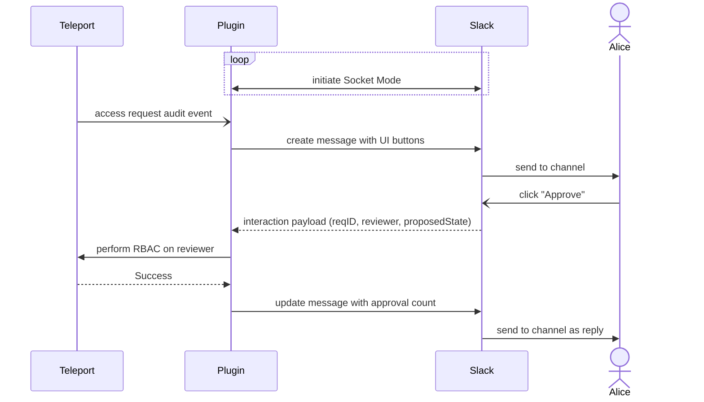

# RFD 250 - Slack Native Access Request Reviews

## Required Approvers

- Engineering: @r0mant && @hugoShaka

## What

Allow native Access Request reviews for the Slack plugin as an opt-in feature.

## Why

This improves user experience by allowing users to submit Access Request reviews
directly within Slack without redirecting to the Teleport Web UI.

For Teleport clusters running in isolated network environments, this simplifies
the mobile flow by eliminating the need to log into the Web UI via VPN access, 
and then submitting a review.

By default, this feature is disabled to maintain the existing security model for current
users.

## Details

### Requirements

In order for native Access Request reviews in Slack to work properly,
the following requirements must be met.

- All Slack users performing native Access Request reviews must have an associated local Teleport user.
We will validate the Slack user submitting the review via a local Teleport user, and if they don't exist, the
review will be rejected. When using an external identity provider, users should
be imported using the User Sync feature from the Teleport Okta integration or the Teleport Entra ID integration.
Teleport users that are SSO-only logins are short-lived and will expire,
requiring a re-login in Teleport to submit reviews in Slack.
- Slack users are associated with a local Teleport user via a Teleport trait holding Slack user ID, eg.
`slack_uid: U123456789`. Trait name can be set in the plugin configuration.
If no such trait is configured in Teleport, we fallback to an exact match for Slack email to Teleport username.
We recommend trait match for stronger identity binding, and the fallback must be enabled manually in configuration.
- Socket Mode must be turned on in the Slack app, which will use a Slack App-level token,
in order for the plugin to receive interaction events from Slack.
- Users must opt-in to the feature at the plugin configuration level, and grant RBAC permissions
for the plugin to submit for other users.

In addition, native reviews for long-term Access Requests (promoting to an Access List)
will not be supported. Long-term access should only be handled in Teleport
via the Web UI for maximum security.

### UX

Users can click on the Approve/Deny button within the Slack notification
message to submit an Access Request review. There will be
no redirection to the Teleport Web UI, and users will see a reply on the original message
for the result of the action.

Users will receive a message reply indicating success if the user has sufficient
review permissions on Teleport and the Access Request is still active.

Users will receive an ephemeral message reply indicating failure in the following scenarios:

1. Insufficient permissions - they do not have proper review permissions on Teleport;
OR there is no local Teleport user tied to the Slack user (this is addressed in the requirements)
1. Already reviewed - they attempt a review for the same Access Request
1. Already resolved - the Access Request is resolved or expired; OR not found

Use case: Alice wants to approve an Access Request in Slack by clicking the "Approve" button



Alice is in a Slack channel and receives an Access Request notification.
She clicks on the "Approve" button and the Teleport Auth server verifies her review permissions.
She receives a reply to the original message indicating she successfully submitted her review.

Use case: Bob wants to approve an Access Request in Slack for which he does not have
review permissions

Bob is also in the same Slack channel as Alice, and receives the same
Access Request notification. He does not have proper Teleport review permissions,
so when he clicks on the "Approve" button, he receives an ephemeral reply
to the original message indicating an insufficient permissions error.

Use case: Carol wants to promote an Access Request in Slack to a Teleport Access List

Carol is in a Slack channel and receives an Access Request notification for long-term access.
She has proper Teleport review permissions and is an owner of an Access List that contains
the requested resource. Carol will receive a Slack message with only the Web UI link, and must
perform the Access List promotion in Teleport.

### Implementation

#### Configuration (self-hosted)

For self-hosted plugins, opt-in to native reviews at the configuration level.

For binaries:
```toml
# toml configuration file
[slack]
token = "xoxb-..."

[review]
# enabled toggles native review feature.
# Default is false.
enabled = true
# app_token is the Slack App-level token to enable Socket Mode interactions.
app_token = "xapp-..."
# slack_user_id_trait is the name of the Teleport trait to resolve Slack user to Teleport user. Holds value of Slack user ID.
# Default is `slack_uid`.
slack_user_id_trait = "slack_uid"
# allow_email_username_match allows exact Slack email to Teleport username match.
# This should only be true if `slack_user_id_trait` is not configured in Teleport.
# We recommend configuring a trait for stronger identity binding.
# Default is false.
allow_email_username_match = false

[role_to_recipients]
"*" = ["admin@email.com", "admin-slack-channel"]
```

For the Helm chart:

```yaml
# yaml configuration file
slack:
    token: "xoxb-..."

review:
    enabled: true
    appToken: "xapp-..."
    slackUserIdTrait: "slack_uid"
    allowEmailUsernameMatch: false

roleToRecipients:
    "*": ["admin@email.com", "admin-slack-channel"]
```

#### Configuration (cloud-hosted)

For cloud-hosted Slack plugins, the existing Web UI enrollment flow will be
extended with a toggle to enable native reviews.
Users will then populate fields with the Slack App-level token and user resolution Teleport trait.

Enabling native reviews is performed at enrollment time; the plugin must be deleted
and recreated to enable/disable the feature.

Based on the configuration, Teleport Cloud will grant the running hosted plugin either
the preset `access-plugin` role for default Web UI reviews,
or a preset `access-plugin-with-review` role with permissions for native reviews.

#### Socket Mode

The plugin will initiate a WebSocket connection to the Slack Socket Mode server to receive
JSON interaction payloads from Slack messages. It calls the `apps.connection.open` endpoint with
the configured App-level token and receives a temporary WebSocket URL from Slack. This URL
will periodically refresh via a "disconnect" message from Slack. When this occurs,
the old connection will be torn down and a new one started to maintain availability.

From the interaction payloads, the plugin will extract the Access Request ID, Slack user ID,
and proposed state of the Access Request (approved/denied) to perform the RBAC checks for review submission.

During plugin restarts, there is a slight risk of missing Socket Mode events or not completing the review submission.
During this short window, users will be met with a warning icon indicating the review did not follow through.
Since this window is brief and the error is visible to the user, we are able to avoid silent failures. The review
will not be submitted, and the user can retry the action.

The Slack server requires us to acknowledge every interaction event we receive, and otherwise may retry
the request. Since the acknowledgment window is short, we opt to acknowledge events prior to any downstream review work.
This runs the same risk during plugin restarts, where we fail before the review submission. However,
this failure mode is preferred over missing the acknowledgement window, where the Slack server may attempt
retries during normal operation when the downstream review work is particularly slow. A lack of a review reply will
indicate to the user that the review was not submitted, and they can retry the action.

The Slack Socket Mode connection is not created if the native review feature is disabled, falling back to the external link
to the Teleport Web UI.

#### RBAC

We perform Slack user to Teleport user resolution by first matching to a Teleport trait holding Slack user ID, eg. `slack_uid`.
If not set in Teleport, we fallback to Slack email to Teleport username match, where we extract Slack email via `users.info` API.
We require a unique match to proceed with the review submission, else return failure.
We perform this user resolution at the plugin-level, and send a request to the Auth server with the
matched Teleport username as the `AccessReview.Author`.
If no Teleport user is found, we return failure early.
This is a hard requirement in order to perform proper role permission checks in Teleport.

We will conduct RBAC checks on the local Teleport user tied to the Slack user in the Auth server.
Slack reviews will be subject to the same RBAC checks performed for
regular Teleport reviews. However, we require a new rule to allow the plugin to
review on behalf of other users.

We will introduce a new RBAC rule
`review_requests.submit_for_users`. When this rule is set, the plugin can only submit
reviews for those users for Access Request reviews.
This is because current RBAC rules, ie. `review_requests.roles`, are role-based and
do not support RBAC checks for reviews submitted by another identity.
In addition, for this path of submitting for other users, this rule will ignore all other
access review conditions set in the `review_requests` spec. This is because when performing
review permission checks, we use the "submitted_for" user's permissions instead of the plugin's permissions.

In practice, access plugins would set `review_requests.submit_for_users: ["*"]` to be able to
submit for all users for Access Request reviews. The preset `access-plugin-with-review` role will set
the wildcard, and be the default for cloud-hosted plugins opting into the feature.

```yaml
# example implementation
kind: role
version: v8
metadata:
    name: access-plugin-with-review
spec:
    allow:
        review_requests:
            # this role can submit for any user
            # listed in submit_for_users; to be used by plugins
            submit_for_users: ["*"]
```

We then modify the Auth server method `SubmitAccessReview()` with new RBAC checks for the above rule.

#### Risks

There is a risk with modifying the existing `SubmitAccessReview()` method with new RBAC checks above.
Currently, there are numerous regression/guard checks to verify the caller of `SubmitAccessReview()` and `AccessReview.Author` match.
We would reject the review submission immediately if there is a mismatch. However, the plugin will
require an RBAC check that allows it to submit for other users, conflicting with the caller-match check.

We will introduce a new field `AccessReview.SubmittedBy`, representing plugin identities submitting for other users.
This field will be enforced by `submit_for_users` rules, and be matched against the caller for plugin reviews.

Then, the auth server will apply traditional review permission checks on `AccessReview.Author`.
This flow will only be triggered if the `submit_for_users` allow rule is applied. This allows
fine-grained control over the plugin's "submit_for" permissions at the role level.

### Proto Specification

```protobuf
syntax = "proto3";

// AccessReview is a review to be applied to an Access Request.
message AccessReview {
  // Author is the teleport username of the review author.
  string Author = 1 [(gogoproto.jsontag) = "author"];

  // ...

  // SubmittedBy is used by teleport plugins to indicate they
  // are submitting the review on behalf of the Author.
  string SubmittedBy = 11 [(gogoproto.jsontag) = "submitted_by,omitempty"];
}
```

```protobuf
syntax = "proto3";

// AccessReviewConditions is a matcher for allow/deny restrictions on
// access reviews.
message AccessReviewConditions {
  // ...

  // SubmitForUsers is used by teleport plugins to indicate
  // they can submit reviews on behalf of other users.
  repeated string SubmitForUsers = 5 [(gogoproto.jsontag) = "submit_for_users,omitempty"];
}
```

```protobuf
syntax = "proto3";

// AccessRequestCreate is emitted when access request has been created or updated
message AccessRequestCreate {
  // ...

  // SubmittedBy is used by teleport plugins to indicate they
  // are submitting the review on behalf of the Author
  // (only used in the access_request.review event variant).
  string SubmittedBy = 19 [(gogoproto.jsontag) = "submitted_by,omitempty"];
}
```

### UI

The Slack notification message will be modified to include Approve/Deny buttons, and threshold counts for approvals/denials.
Because thresholds vary based on different filters, we opt for a simple count metric.

For long-term resource-based requests, we fall back to the Web UI link flow and exclude
the UI buttons.

#### Example message
```
You have a new Role Request:

ID: <request_id>
Cluster: teleport.example.com
User: example-user
Role: editor Login(s): -
Link: https://teleport.example.com/web/requests/<request_id>

Thresholds: Approvals [0] Denials [0]
Status: :hourglass_flowing_sand: PENDING

[Approve] [Deny]
```

#### Example message for long-term access
```
You have a new Resource Request (long-term):

ID: <request_id>
Cluster: teleport.example.com
User: example-user
Role: access Login(s): -
Role: access-standard-acl-preset-<acl_id> Login(s): -
Resource(s): /teleport.example.com/app/grafana
Link: https://teleport.example.com/web/requests/<request_id>

Status: :hourglass_flowing_sand: PENDING
```

### Security

We use a Slack App-level token to enable Slack's Socket Mode. This is loaded in the plugin configuration file and must be secured.
When installing the plugin via Helm chart, a Kubernetes Secret will be created to store the token.

The plugin requests a temporary WebSocket URL from the Slack API to receive interaction payloads from.
This WebSocket connection is pre-authenticated via the App-level token and refreshes periodically,
to ensure incoming Slack payloads are valid and authentic. Slack user ID is tied to interaction payloads, so
incoming requests from Slack cannot be forged with random user IDs.

When resolving Slack user to local Teleport user, we offer two mechanisms: match to a Teleport trait holding Slack user ID,
or fallback to exact match of Slack email to Teleport username.
We recommend configuring a Teleport trait to enforce stronger identity binding. The fallback should only be used if Slack
email is trusted and unmodifiable, and Teleport usernames are configured as emails.

The plugin is fully trusted by the auth server to represent Slack reviewers, since we replace Teleport's MFA-based
authentication flow. This increases the blast radius of plugin credential theft. Attackers with stolen plugin
credentials can forge arbitrary authors in requests to the auth server and potentially bypass Access Request threshold controls.
To prevent credential theft, it is strongly recommended to set up the plugin with short-lived credentials via Machine ID,
and store secrets securely.

When the feature is enabled, we still require additional RBAC rules for the plugin to submit for other users,
so we are not granting standing privileges to the plugin by default. For cloud-hosted plugins, Teleport
will grant the required preset role for native reviews in order to mitigate the escalation vector of users
granting arbitrary roles to the plugin.

By introducing a new RBAC rule and modifying authorization checks to `SubmitAccessReview()`,
we also run a performance risk with the extra evaluation steps for validating reviews. This may
open a potential DoS vector for already authenticated users. The alternative is to introduce a new Auth server method
for plugins to call, which is prone to become out of sync and duplicates logic.

Native reviews for long-term Access Requests (via Access Lists) will not be supported, as long-term access should only be
handled within Teleport for maximum security.

### Backward Compatibility

By default, the feature is disabled, so current users will see the same information
from the Slack plugin. They will use the Web UI link flow, which retains
the same security model as before.

### Observability

Audit events emitted for Access Request reviews from Slack will use a new field `AccessRequestCreate.SubmittedBy`.
This is a better alternative than the existing `AccessRequestCreate.Delegator` field, which can cause
ambiguity with recent Delegated Identities work, and is only used by the Jira plugin. We should consider deprecating this
field in favor of `SubmittedBy` in the future.

### Test Plan

Add unit tests for new RBAC checks. Run manual tests with proper plugin RBAC permissions.

Manual tests:

- [ ] When native review is disabled (default):
	- [ ] Only Web UI link is provided, no Approve/Deny buttons
- [ ] When native review is enabled:
    - [ ] Slack notification will be sent to channel with Approve/Deny buttons
	- [ ] When a Slack user without proper Teleport review permissions clicks the "Approve" button, they receive an error reply message
   	- [ ] When a Slack user with proper Teleport review permissions clicks the "Approve" button, the Access Request gets 1 approval in Teleport
   	- [ ] Slack notification is updated with Access Request’s result, and a reply is sent (original behavior)
   	- [ ] A resolved Access Request message removes Approve/Deny buttons
	- [ ] A long-term Access Request message hides Approve/Deny buttons
- [] When Slack native reviews is enabled, and an Access Request requires multiple approvals:
    - [ ] Slack notification is updated with count of approvals, and remain PENDING
    - [ ] Access Request on Teleport is not fully approved after 1 Slack approval
    - [ ] When a threshold is met, Access Request is approved in Teleport