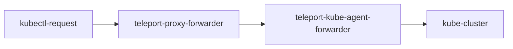

# RFD 0253 - Scoped Kubernetes Access

## Required Approvers

Engineering: @fspmarshall && (@tigrato || @jakealti || @nklaassen)
Security: @rosstimothy || @rob-picard-teleport

## What

This RFD describes a design for supporting scoped access to Kubernetes
clusters.

## Why

In order to continue growing Teleport's scoped access capabilities, we want
to extend the Teleport Kubernetes Service to support scoping.

## Details

There are a few main components required to support scoped kube access.

- Kube-specific configuration and compatibility conversion for scoped roles
supporting `kube_groups`, `kube_users`, `kube_labels`, and `kube_resources`.
- Scope support when listing kube clusters for `tsh kube login`
- Generation of scope-pinned user certificates using `tsh kube credentials`.
- Scoped access checking in the kube proxy forwarder.

The rest of this document explains how each of these components will be
implemented.

### UX

Scoped kube access works in nearly the same way as unscoped kube access.
Assuming you have a kube cluster named `minikube` joined to your Teleport
cluster using a scoped join token assigning the `/kube` scope, the process for
interacting with that cluster would be:

1. Create a scoped role in Teleport with a `kube` configuration block granting
   you access to the cluster.
```yaml
version: v1
kind: scoped_role
metadata:
  name: kube-access
scope: /kube
spec:
  assignable_scopes:
  - /kube
  kube:
    groups:
    - <kube-group>
    users:
    - <kube-user>
    labels:
    - name: "*"
      values:
      - "*"
    resources:
    - kind: "*"
      namespace: "*"
      name: "*"
      api_group: "*"
      verbs: ["*"]
```
2. Assign this role role to your Teleport user by creating a scoped role
   assignment:
```yaml
version: v1
kind: scoped_role_assignment
scope: /kube
spec:
  assignments:
  - role: kube-admin
    scope: /kube
  user: <teleport-user>
```
3. Login to your Teleport cluster with a pinned scoped:
```sh
tsh login --proxy=<proxy-url> --scope=/kube
```
4. Update your kubeconfig in order to connect to the kube cluster:
```sh
tsh kube login minikube
```
5. Use the `kubectl` CLI to interact with the cluster while maintaining scoped
   access rules:
```sh
kubectl get -n my_namespace get pods
tsh kubectl exec -n my_namespace my_pod -- echo "hello scopes"
```

Scopes are not yet supported in the web UI, so this RFD does not propose any
sort of web UX at this time.

### Kube access

Teleport supports kube access today by intercepting all requests to the kube
cluster API and intervening (MitM) in access decisions. This is primarily
handled by the kube proxy forwarder which can run in three modes:

- Kube agent. Forwards requests directly to kube clusters. This is the typical
  way to provide access to kube clusters and allows for more than one kube
  cluster to join a single Teleport cluster. It can run as a standalone process
  configured with a kubeconfig outside of your kube cluster or it can run
  from within the kube cluster you wish to join to Teleport.
- Proxy. Runs within the Teleport Proxy Service. Does not provide direct access
  to a kube cluster but will run RBAC checks to avoid forwarding requests we
  know will be denied. The Teleport and kube cluster names should be included
  in the request URL and are used to route requests to the appropriate trusted
  cluster, kube agent, or legacy kube proxy.
- Legacy. Same as Proxy mode but with support for accepting a kubeconfig which
  can be used to join a kube cluster to a Teleport Cluster. This mode is
  deprecated and can only join a single kube cluster without an intermediate
  kube agent. Clusters joined using this mode will not be supported by scoped
  access.

Because each of these modes ultimately share the same kube forwarder
implementation, the basic auth flow looks largely the same across them:

- Check the provided user cert and pull the cluster name from it
- If the identity is for a trusted remote cluster, skip authZ and forward to
  that cluster. All authZ decisions should be deferred to the cluster providing
  access.
- Authorize the request based on the identity's roles and requested cluster
- Determine target to forward request to
  - Kube agent: look up locally cached credentials matching requested cluster,
    target kube cluster with credentials
  - Proxy: look up kube forwarder providing access to cluster name, target the
    forwarder.
- Generate and attach kube impersonation headers. These are determined using 
  the `kube_users` and `kube_groups` provided by the identity's role set. If
  there is more than one username provided then an explicit selection must be
  made by the user. Either by specifying during cert generation or at request
  time (e.g. `kubectl --as=<user> get namespaces`). When no user is provided,
  the Teleport user is provided instead. Groups are deuplicated but do not
  require selection.
- Forward request to target

Once the request reaches the kube cluster, it is free to further determine
which resources and actions are permitted based on the permissions associated
with the impersonated credentials.

A typical request will flow as:


### Kube-related Resources

There are two Teleport resource types involved with kube access: the
`KubeServer` and `KubeCluster`. The `KubeServer` represents a `KubeCluster`
within a kube agent. It embeds a `KubeCluster` and is used for heartbeating.
The `KubeCluster` represents the kube cluster itself and is typically the
resource interacted with when making access and routing decisions. When
manually registering a kube cluster with the kube service, there is no
standalone `KubeCluster` resource. Auto discovered clusters create a standalone
`KubeCluster` resource that the kube agent will identify using a watcher with
configurable matchers. Any unrecognized, matching `KubeCluster` will be wrapped
in a `KubeServer` and added to the agent's list of servers to heartbeat. A
dynamic `KubeCluster` resource can similarly be created by a user using `tctl`.
These manually created resource will be registered using the same dynamic
mechanism as discovered kube clusters.

### Scoped kube access

#### Features not in scope

Similar to scoped SSH access, scoped kube access will not initially support
remote Teleport clusters, moderated sessions, or session joining.

#### Supporting scopes

Adding scopes to kube access will initially be as simple as possible. The only
resource being scoped is the kube cluster itself (and the kube server embedding
it). Any resources within the kube cluster, especially those that explicitly
join Teleport themselves, will not necessarily share the cluster's scope. This
means that scoped kube access, as defined in this document, pertains to
enforcing scope isolation principles only when interacting with the kube
cluster directly through the cluster API. It will not apply to automatically
discovered Apps within the kube cluster.

Because scoped access decisions are limited to interactions with the kube
cluster API, all capabilities and limitations imposed for kube resources are
fully delegated to the kube cluster's policies as they apply to the
impersonated identity.

A kube server, and the cluster it embeds, will be scoped according to the
`AgentScope` present in the kube server's host certificate. It will include
the scope to be verified in heartbeats in much the same way the SSH service
does today. In order to ensure that accurate scope information is always
available, the scope will be assigned to both the `KubeServer` resource and the
embedded `KubeCluster` at startup.

Scoped roles will be extended to support kube access by adding a `kube` block
to the role spec containing `users`, `groups`, `labels`, and `resources`
fields. This will control which identities are permitted to be used when
generating impersonation headers. User certificate generation will be updated
to support scoped auth contexts, but the underlying certificate generation
function already supports scope pins so no changes are required in
`auth.generateCertificate`.

Scoped RBAC for kube will adhere to our overall scoped access rules which
require all role-based options to be derived from one role permitting access.

The kube forwarder on the proxy service will handle initial authorization for
scoped requests to the kube cluster. Because the kube server's heartbeat will
include the scope it's assigned to, the proxy can perform the same scoped RBAC
checks as the kube service. The kube service will still make the final
authorization decision for each request it receives and generate the
impersonation headers that will be inspected by the kube cluster. The proxy
will implement scope-aware routing similar to scoped SSH access which will
resolve kube cluster name collisions between scopes as long as there is exactly
one kube cluster visible to the user. Where a "visible" kube cluster is in an
equal or descendent scope to the user's scope pin and a scoped assignment would
grant access to that cluster.

All kube requests flow through the [authenticate()](https://github.com/gravitational/teleport/blob/60a7e68e07ab4998a317f5f6debc6b6aa59b0bde/lib/kube/proxy/forwarder.go#L530) and [authorize()](https://github.com/gravitational/teleport/blob/60a7e68e07ab4998a317f5f6debc6b6aa59b0bde/lib/kube/proxy/forwarder.go#L1060)
helpers, which means we can reliably enforce scoped access rules across all
forwarded requests by supporting scoped auth within these two functions. This
will still involve broader changes in the `lib/kube/` package since there are
many direct dependencies on `authz.Context` which will need to be updated to
support `authz.ScopedContext` instead.

#### Scoped User Certificates

Most of the ground work for this is already done. All we need to do is update
the `GenerateUserCerts` RPC and handlers to support scoped identities. This is
specifically for reissuing user certificates with a valid scoped identity. The
underlying certificate generation in `lib/auth/auth.go` already handles scope
pins for the SSH login flow and should not require changes.

#### Unscoped Identities

Just like scoped SSH access, unscoped identities will be granted access to
scoped kube resources provided their unscoped/classic RBAC checks permit
access.

#### Auto Discovery (EKS, AKS, GKE)

The Teleport Discovery Service supports auto discovery of cloud managed kube
clusters. This will use cloud specific mechanisms to generate a connection
config and create a `KubeCluster` resource for each discovered cluster. The
Teleport Kubernetes Service will then dynamically register the `KubeCluster`
resources which is described in the next section. Because the discovery
service does not yet support scopes, any `KubeCluster` resources it creates
will be unscoped. This means a scoped kube service will not be allowed to
register discovered clusters until the discover service supports scopes.

#### Dynamic Cluster Registration

The kube agent can be configured to automatically register new `KubeCluster`
resources that are created in the Teleport cluster. You provide a set of labels
to match against and then create a watch for `KubeCluster` events. The agent
will fetch any clusters it does not already know about and attempt to register
them using their attached connection config.

The first iteration of scoped kube access will not support dynamic cluster
registration and the watcher that powers it will be disabled for scoped agents.
We will also generate an alternate set of rules for the `Kube` system role that
will prevent accessing `KubeCluster`, `KubeServer`, or `KubeWaitingContainer`
resources. This RFD will be amended to support dynamic cluster registration
after the  initial implementation is complete.

#### Failure states

Any new failure states introduced specifically by scopes during certificate
generation or kube access should wrap the `services.ErrScopedIdentity` error.
This is already used in many places to control branching logic when scoped
behavior diverges from unscoped and it also helps signal where scoped access
compatibility could potentially be better.

### CLI UX

The CLI UX when compared to unscoped kube access should be virtually unchanged.
The only noticeable difference is that you need to to authenticate with the
correct scope pinned before attempting to interact with a scoped kube cluster.

### Security

In much the same way that you could run two separate SSH agents on the same
host with different scopes, you can also run two separate kube agents targeting
the same cluster. Scoped access rules should always ensure that you route
through the kube agent who's scope you have access to, but the cluster would
remain accessible in both scopes. This is not recommended, but it is a possible
configuration.

As mentioned briefly above, you can also join other types of resources to
Teleport that happen to run within a scoped kube cluster. These resources could
easily join as unscoped or with orthogonal scopes to the kube cluster and this
would be a valid state. In this scenario, you could feasibly:

- Join a kube cluster assigned to the `/aa` scope to your Teleport cluster.
- Deploy an SSH node to the kube cluster.
- Join the SSH node to your Teleport cluster assigned to the `/bb` scope.
- Authenticate to a kube cluster assigned to the `/aa` scope.
- Run `kubectl exec` against the SSH node's pod using credentials pinned to
  `/aa`.

This is a byproduct of the underlying environment rather than a violation of
scope isolation rules. You could imagine a similar scenario with two SSH agents
assigned to different scopes but deployed to the same VPC subnet. If they are
also running OpenSSH and their firewall rules allow SSH traffic within the
subnet, then you could technically access the SSH node in the orthogonal scope.
This is more relevant for kubernetes due to it being a scoped resource that is
also a potentional platform for other scoped resources.

#### Invariants

- All requests to kube clusters are MitM'd by either the proxy service
  or the kube service (typically both).
- Kube cluster credentials can not be exfiltrated to users. Exposing a
  kubeconfig or valid credentials that can be used directly with the kube
  cluster would break scoped isolation and must not be possible.
- The kube service plays no direct role in discovery or app access and does not
  facilitate access to or addvertise any resource other than the kube cluster
  resources.


#### App Discovery

When we create a scope token with the `kube` role, we automatically add the
`discovery` and `app` roles as well. However, the discovery and app services
do not yet support scopes. A common agent configuration for kube involves
deploying directly to a kube cluster and running the kube and discover services
together. All generated certificates will be correctly scoped, but scope
isolation rules will not be enforced until the services and related APIs are
updated to support scopes.

In order to prevent this from happening, we will temporarily remove the
automatic addition of `discover` and `app` roles from `tsh` and prevent scoped
token creation if they're present. Automatic app discover for a scoped kube
cluster will still be possible by separately deploying an unscoped agent
running the discovery service. Once all services involved properly support
scoping, we will remove this restriction and restore the automatic addition of
`discovery` and `app` roles.

### Proto Specification

The scoped role protos will be updated to include a `kube` configuration block.
```diff
diff --git a/api/proto/teleport/scopes/access/v1/role.proto b/api/proto/teleport/scopes/access/v1/role.proto
index 83b832bc96b..7fe89e54c4e 100644
--- a/api/proto/teleport/scopes/access/v1/role.proto
+++ b/api/proto/teleport/scopes/access/v1/role.proto
@@ -74,6 +74,9 @@ message ScopedRoleSpec {
 
   // Ssh specifies controls that govern SSH access.
   ScopedRoleSSH ssh = 7;
+
+  // The kubernetes specific configuration for a scoped role.
+  ScopedRoleKube kube = 8;
 }
 
 // ScopedRoleDefaults provides fallback values for controls shared across multiple protocols.
@@ -102,6 +105,48 @@ message ScopedRoleSSH {
   string client_idle_timeout = 3;
 }
 
+// The Kubernetes resource identifier.
+message KubeResource {
+	// The kubernetes resource type. Supports wildcards.
+	string kind = 1;
+
+	// The kubernetes resource namespace. Supports wildcards.
+	string namespace = 2;
+
+	// The kubernetes resource name. Supports wildcards.
+	string name = 3;
+
+	// The kubernetes API group of the resource. Supports wildcards.
+	string api_group = 4;
+
+	// The allowed kubernetes verbs that can be used with the resource.
+	repeated string verbs = 5;
+}
+
+// The group of all scoped role fields relevant to kube access. Fields within the kube block
+// encompass selection criteria and preconditions for access, as well as the controls to be applied in
+// cases where access is permitted. A kube block is the primary source of truth for controls to be applied
+// to the kube access it permits, but defaults and global or scope-bound controls may also affect the nature of
+// the resulting access.
+message ScopedRoleKube {
+  // The map of kubernetes cluster labels used for RBAC.
+  repeated teleport.label.v1.Label labels = 1;
+
+  // The list of kubernetes groups this role allows.
+  repeated string groups = 2;
+
+  // An optional list of impersonatable kubernetes users this role allows.
+  repeated string users = 3;
+
+  // The list of kubernetes resources this role allows.
+  repeated KubeResource resources = 4;
+
+  // Overrides the defaults block idle timeout specifically for kube sessions.
+  // Must be a valid Go duration string (e.g. "30m", "1h"). If empty, the defaults block value
+  // (or global default) applies.
+  string client_idle_timeout = 5;
+}
+
 // ScopedRule maps resources to verbs. This is the underlying type used to describe
 // permissions like 'scoped_role:read' or 'scoped_role_assignment:create'.
 message ScopedRule {
```

The `KubernetesClusterV3` proto will also need to be updated to include its
assigned scope:
```diff
diff --git a/api/proto/teleport/legacy/types/types.proto b/api/proto/teleport/legacy/types/types.proto
index 81e09650e51..227b8f9afab 100644
--- a/api/proto/teleport/legacy/types/types.proto
+++ b/api/proto/teleport/legacy/types/types.proto
@@ -5095,6 +5095,8 @@ message KubernetesClusterV3 {
   ];
   // Status is the resource status.
   KubernetesClusterStatus status = 6;
+  // The scope of the kube cluster.
+  string scope = 7;
 }

 // KubernetesClusterSpecV3 is a specification for a Kubernetes cluster.
```
The `KubernetesServerV3` was already updated to include a `scope` field when
scoped heartbeating was implemented for SSH.

### Backward Compatibility

All existing features and flows for unscoped kube access should continue to
work as expected with no change to experience or functionality.

### Test Plan

- [ ] Join a scoped kube cluster to a Teleport cluster using a scoped join
  token.
- [ ] Create a scoped role assignable to the same scope with a `kube`
  configuration block
- [ ] Assign the role to your user by creating a scoped role assignment.
- [ ] Login with pinned scope using `tsh login --scope=/kube --proxy=<proxy-url>`
- [ ] Confirm `tsh kube ls` shows the scoped cluster but no unscoped clusters.
- [ ] Generate a kubeconfig using `tsh kube login <cluster-name>`
- [ ] Run a command on the cluster using `kubectl` or `tsh kubectl`.
  - [ ] `kubectl get version`
  - [ ] `kubectl get namespaces`
  - [ ] `kubectl exec -n namespace <pod-name> -- echo "hello scopes"`
- [ ] Confirm labels and resources are respected during access decisions.
