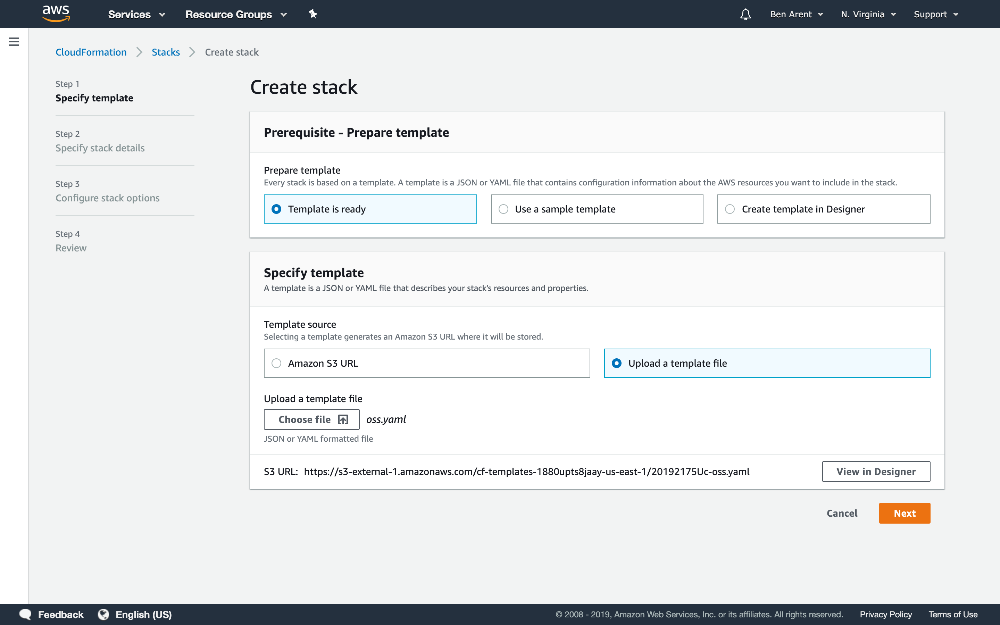
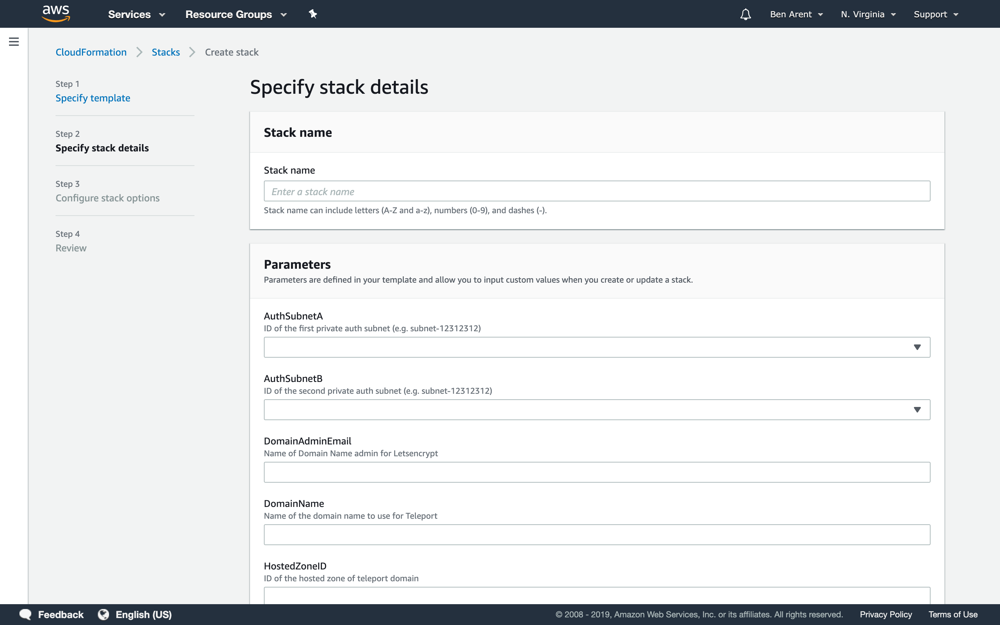

# AWS CloudFormation based provisioning example.

**Prerequisites** 

[AWS CLI](https://aws.amazon.com/cli/) is required to build and launch a CloudFormation stack.

We provide these CloudFormation templates as an example of how to setup HA Teleport in
AWS using our AMIs. The current template will create a Highly available Teleport setup
using DynamoDB and S3 to store logs. This setup will acquire a Let's Encrypt x509 certificate
for you.

If you are using the enterprise template please ensure that you have an enterprise license
available. If you are an enterprise customer you can find the license in your dashboard 
at https://dashboard.gravitational.com/web/ . Once the CloudFormation stack is complete 
you will need to place your enterprise license file onto each Auth server in   
`/var/lib/teleport/license.pem`.

## Launch VPC
In this example Teleport requires a VPC to install into.

### Using Makefile
We provide a Makefile that'll run the AWS CloudFormation commands, below we provide
an example with parameters used to setup a VPC if you don't already one that you 
want to deploy Teleport into. 

```bash
export STACK=teleport-test-cf-vpc
export STACK_PARAMS="\
ParameterKey=DomainName,ParameterValue=DOMAIN-REPLACE \
ParameterKey=HostedZoneID,ParameterValue=HOSTZONE-REPLACE \
ParameterKey=DomainAdminEmail,ParameterValue=DOMAINEMAIL-REPLACE \
ParameterKey=KeyName,ParameterValue=SSHKEYNAME-REPLACE"
make create-stack-vpc
```

### Using CloudFormation UI
Download [vpc.yaml](https://github.com/gravitational/teleport/blob/master/examples/aws/cloudformation/vpc.yaml) and upload it to the CloudFormation UI. 



## Launch Teleport Cluster
The example CloudFormation template requires a VPC, you can modify the oss.yaml to
meet your requirements. 

### Using supplied Makefile

```bash
export STACK=teleport-test-cf-build-servers
export STACK_PARAMS="\
ParameterKey=VPC,ParameterValue=EXISTING_VPC_ID \
ParameterKey=ProxySubnetA,ParameterValue=PUBLIC_SUBNET_ID_1 \
ParameterKey=ProxySubnetB,ParameterValue=PUBLIC_SUBNET_ID_2 \
ParameterKey=AuthSubnetA,ParameterValue=PRIVATE_SUBNET_ID_1 \
ParameterKey=AuthSubnetB,ParameterValue=PRIVATE_SUBNET_ID_2 \
ParameterKey=NodeSubnetA,ParameterValue=PRIVATE_SUBNET_ID_3 \
ParameterKey=NodeSubnetB,ParameterValue=PRIVATE_SUBNET_ID_4  \
ParameterKey=KeyName,ParameterValue=SSH_PUBKEY \
ParameterKey=DomainName,ParameterValue=DOMAIN_NAME \
ParameterKey=DomainAdminEmail,ParameterValue=DOMAINEMAIL-REPLACE \
ParameterKey=HostedZoneID,ParameterValue=HOSTZONEID" 
make create-stack 
```
### Using CloudFormation UI
Once uploaded CloudFormation will ask for a bunch of parameters to configure Teleport.



The setup might take up to 20 minutes as it'll have to request a x509 certificate
from Let's Encrypt to setup your cluster. 
