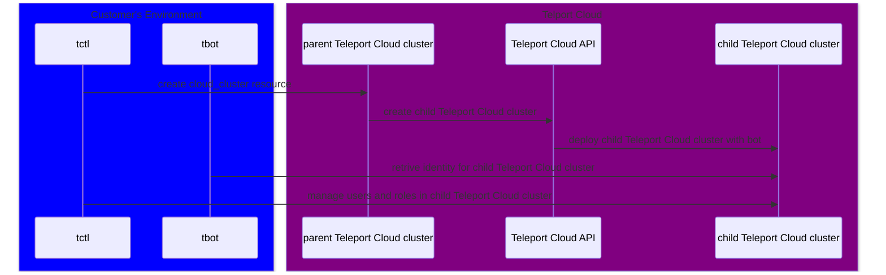

# Example Cloud Cluster Usage

## Overview

This document provides a high level overview with examples for a new Teleport feature. The new feature exposes the ability for
Teleport Cloud customers to provision new Teleport clusters hosted in Teleport Cloud. The API for the new "child" clusters feature is
similar to managing other resources in Teleport. Users create a `cloud_cluster` resource to provision a new Teleport Cloud
cluster and delete a `cloud_cluster` resource to deprovision a Teleport Cloud cluster.

The `cloud_cluster` Teleport resource supports providing configuration for a Teleport bot using
[IAM joining](https://goteleport.com/docs/reference/deployment/join-methods/#aws-iam-role-iam) via tbot.
Teleport Cloud will create the child Teleport Cloud cluster with the provided bot and token with access
to create, read, and update users and roles in the child Teleport Cloud cluster.

The remaining sections of this document provides details for users to learn how to manage new child cloud clusters
using the Teleport API. This information is being provided to customers in preparation for the full feature
release in the coming months.

The examples in this document detail how to create and delete a `cloud_cluster` resource, use `tbot` to
retrieve an identity for the child cloud cluster, and manage users and roles in the child cloud
cluster with `tctl` or writing a Go application that connects to the Teleport API.

This document requires using a Teleport Cloud cluster supporting a simulated implementation of the
upcoming child cloud cluster feature. This simulated implementation does not instruct Teleport
Cloud to create any new Teleport Cloud clusters, but offers examples of how this functionality
may be used in the future by Teleport Users. The simulated implementation offers enough support to design
a process around an expected pattern.

## Child Cloud Cluster Architecture

The child cloud cluster workflow involves a parent Teleport Cloud cluster managing the lifecycle of at
least one child Teleport Cloud cluster. When a Teleport user creates a `cloud_cluster` resource in a Teleport Cloud
cluster then Teleport Cloud will deploy a child Teleport Cloud cluster.

A parent Teleport Cloud cluster is a Teleport cluster with `cloud_cluster` resources submitted, while
a child Teleport Cloud cluster is a Teleport cluster with its lifecycle being managed by the parent cluster.

Teleport Cloud will automatically provision the child Teleport Cloud cluster with a user provided bot and
token that has access to manage users and roles within the child Teleport Cloud cluster.



This documentation covers using a build of Teleport that supports a simulated `cloud_cluster` feature. The
simulated feature does not interact with Teleport Cloud, so the next section will walk a user through
configuring an environment to match the automation of creating a bot in the child Teleport Cloud cluster
that Teleport Cloud will do in the full release of the `cloud_cluster` feature. The rest of the examples
here will align with the full implementation of the `cloud_cluster` feature.

## Environment setup

These examples expect a Teleport Cloud cluster running with a simulated implementation of Teleport's
`cloud_cluster` feature and a Teleport Cloud cluster that may be configured with a bot, token, and role.
These may be two separate Teleport Cloud clusters or the same Teleport Cloud cluster. The Teleport Cloud
cluster(s) should be created prior to using these examples.

This documentation will refer to a Teleport Cloud cluster running the simulated `cloud_cluster` feature
as the parent Teleport Cloud cluster. The Teleport Cloud cluster that will have a bot, token, and role
added will be referred to as the child Teleport Cloud cluster.

> [!IMPORTANT]
> Creating a `cloud_cluster` resource will not automatically create a new Teleport Cloud cluster as
> part of this simulated experience.
>
> An existing Teleport Cloud cluster will be configured in this section to act as both the parent and child Teleport Cloud
> cluster to show example usage of managing `cloud_cluster` Teleport resources and using `tbot`.

The environment setup will walk through:

- ensuring a Teleport provided build of `tctl` supporting `cloud_cluster` is used
- adding a role and enabling a user to manage `cloud_cluster` resources in a parent Teleport Cloud
cluster
- adding a bot, token, and role to a child Teleport Cloud cluster to support using `tbot`

### Custom build of tctl

These steps use a custom build of `tctl` that supports the upcoming `cloud_cluster` resource.

Teleport will provide the customer with a development build of Teleport that includes code to simulate creating a `cloud_cluster` resource. Teleport will also help the customer with a Teleport Cloud cluster running
a Teleport build that supports the simulated `cloud_cluster` resource.

> [!WARNING]
> Users will receive the following error when creating a `cloud_cluster` resource if they are using the standard Teleport client tools (`tctl`) rather than the development build of `tctl`.
>
> ```
> ERROR: unsupported resource: "cloud_clusters" - resources should be expressed as 'type/name', for example 'connector/github'
> ```

### Setup Parent Teleport Cloud cluster

Before interacting with the `cloud_cluster` resource, the parent Teleport Cloud cluster must
have a user with access to the `cloud_cluster` resource.

A new role will be created and assigned to an existing user to allow access to `cloud_cluster`
resources.

#### Create and assign role to manage cloud_cluster resources

1. Teleport user logs into the existing Teleport Cloud cluster.

   ```bash
   tsh login --proxy <parent>.teleport.sh
   ```

1. Teleport user creates a new role, `cloud-cluster-editor`, that gives access to creating and modifying `cloud_cluster` resources.

   ```bash
   tctl --auth-server <parent>.teleport.sh create <(cat <<EOF
   kind: role
   metadata:
     description: Edit cloud clusters
     name: cloud-cluster-editor
   spec:
     allow:
       rules:
       - resources:
         - cloud_cluster
         verbs:
         - list
         - create
         - read
         - update
         - delete
     deny: {}
   version: v7
   EOF
   )
   ```

1. Teleport user assigns the new `cloud-cluster-editor` role to the existing Teleport user used to previously login via `tsh`.

   ```bash
   tctl --auth-server <parent>.teleport.sh users update --set-roles editor,access,auditor,cloud-cluster-editor <username>
   ```

1. Teleport user logs out and back into the parent Teleport Cloud cluster to refresh roles.

   ```bash
   tsh logout --proxy <parent>.teleport.sh --user <username>
   tsh login --proxy <parent>.teleport.sh
   ```

### Setup Child Teleport Cloud cluster

The child Teleport Cloud cluster will have a bot, role, and token added to support `tbot` usage. In the full implementation
of the Teleport `cloud_cluster` resource, Teleport Cloud will automatically add this bot, role, and
token to the created child Teleport Cloud cluster.

The token will soon be used by `tbot` via [IAM joining](https://goteleport.com/docs/reference/deployment/join-methods/#aws-iam-role-iam)
to interact with the child Teleport Cloud cluster.

#### Configure a bot, role, and token for tbot usage

1. Teleport user logs into the child Teleport Cloud cluster.

   ```bash
   tsh login --proxy <child>.teleport.sh
   ```

1. Create a new bot named `example-iam` with a corresponding role and token.

   Be sure to repace the placeholder <aws-account> and <aws-arn> values below. This AWS Account and ARN
   will be used by `tbot` to connect to the child Teleport Cloud cluster.

   ```bash
   tctl --auth-server <child>.teleport.sh create <(cat <<EOF
   kind: token
   version: v2
   metadata:
     name: example-iam
   spec:
     roles: [Bot]
     join_method: iam
     bot_name: example-iam
     allow:
       - aws_account: "<aws-account>"
         aws_arn: "<aws-arn>"
   ---
   kind: bot
   version: v1
   metadata:
     name: example-iam
   spec:
     roles:
       - example-iam
   ---
   kind: role
   metadata:
     name: example-iam
   version: v7
   spec:
     allow:
       rules:
       - resources:
         - user
         verbs:
         - create
         - read
         - list
         - update
       - resources:
         - role
         verbs:
         - create
         - read
         - list
         - update
     deny: {}
   EOF
   )
   ```

## Usage

The following sections provide example usage via `tctl` or through a Go program.

Below are examples for:

- creating a Teleport `cloud_cluster` resource in the parent Teleport Cloud cluster
- using `tbot` to retrieve an identity file for the child Teleport Cloud cluster
- managing roles and users in the child Teleport Cloud cluster
- deleting a Teleport `cloud_cluster` resource

### tctl

#### Create a child cloud cluster in the parent Teleport Cloud cluster

These steps walk through creating a Teleport `cloud_cluster` resource in the parent Teleport Cloud cluster.

1. Teleport user logs into the parent Teleport Cloud cluster.

   ```bash
   tsh login --proxy <parent>.teleport.sh
   ```

1. Teleport user creates a `cloud_cluster` resource named `child`.

   In the full implementation of the `cloud_cluster` resource, Teleport Cloud will use the name
   of the `cloud_cluster` resource as the domain name. For example, the `cloud_cluster`'s name being `child`
   would result in the domain `child.teleport.sh` being used for the child Teleport Cloud cluster.

   ```bash
   tctl --auth-server <parent>.teleport.sh create <(cat <<EOF
   kind: cloud_cluster
   metadata:
     name: child
   spec:
     auth_region: us-west-2
     bot:
       name: example-iam
     token:
       join_method: iam
       allow:
         - aws_account: "AWS_ACCOUNT"
           aws_arn: "AWS_ARN"
   EOF
   )
   ```

   Be sure to replace `AWS_ACCOUNT` and `AWS_ARN` with real values to later be used by `tbot`.

1. Teleport user waits for the `cloud_cluster`'s `status.state` to report `active`.

   ```bash
   tctl --auth-server <parent>.teleport.sh get cloud_cluster/child
   ```

   ```yaml
   kind: cloud_cluster
   metadata:
     name: child
   spec:
     auth_region: us-west-2
     bot:
       name: example-iam
     token:
       join_method: iam
       allow:
         - aws_account: "AWS_ACCOUNT"
           aws_arn: "AWS_ARN"
   status:
     domain: child.teleport.sh
     state: active
   ```

   Running `tctl --auth-server <parent>.teleport.sh get cloud_clusters` will list all `cloud_clusters`, but does not currently display status.

> [!IMPORTANT]
> The `cloud_cluster` named `child` is only an example. As part of this simulated experience, Teleport
> Cloud will not deploy a new Teleport Cloud cluster.
>
> References to `child.teleport.sh` in the remaining sections refer to the Teleport Cloud cluster
> acting as the child Teleport Cloud cluster in the [Environment Setup](#environment-setup) section.

#### Run tbot against child Teleport Cloud cluster

These steps walk through running `tbot` against the child Teleport Cloud cluster to retrieve an identity file.

1. Teleport user logs into the AWS account specified in the `cloud_cluster` resource, such as by running `aws sso login --profile <profile>`.

1. Teleport user creates a `tbot.yaml` configuration file with the following content:

   ```yaml
   version: v2
   oneshot: true
   proxy_server: <child>.teleport.sh:443
   onboarding:
     join_method: iam
     token: example-iam
   storage:
     type: memory
   services:
     - type: identity
       destination:
         type: directory
         path: ./tbot-dir/
   ```

   This will configure `tbot` to retrieve an `identity` file to `./tbot-dir/identity`.

   For more information about using `tbot` and IAM joining, please refer to [AWS IAM role](https://goteleport.com/docs/reference/deployment/join-methods/#aws-iam-role-iam).

1. Teleport user runs `tbot` to retrieve an identity file using IAM joining.

   ```bash
   tbot start -c tbot.yaml
   ```

   On success, this will write a file named `identity` to the `./tbot-dir` directory.

#### Manage roles and users in the child Teleport Cloud cluster

These steps walk through creating a new role and user in the child Teleport Cloud cluster using
the identity retrieved by `tbot`.

1. Teleport user creates a new role named `example` in the child Teleport Cloud cluster using the retrieved `tbot` identity.

   ```bash
   tctl -i ./tbot-dir/identity --auth-server <child>.teleport.sh create <(cat <<EOF
   version: v7
   kind: role
   metadata:
     name: example
   spec:
     allow:
       rules:
       - resources:
         - cloud_cluster
         verbs:
         - read
   EOF
   )
   ```

1. Teleport user creates a new user named `example` in the child Teleport Cloud cluster with the new `example` role.

   ```bash
   tctl -i ./tbot-dir/identity --auth-server <child>.teleport.sh users add --roles example example
   ```

#### Delete a child cloud cluster in the parent Teleport Cloud cluster

These steps walk through deleting a Teleport `cloud_cluster` resource.

1. Teleport user removes the `cloud_cluster` resource named `child` from the parent Teleport Cloud cluster.

   ```bash
   tctl --auth-server <parent>.teleport.sh rm cloud_clusters/child
   ```

In the future, this will instruct Teleport Cloud to delete the child Teleport Cloud cluster with
a 15 day grace period for restoring the child Teleport Cloud cluster with all data intact.

### Go

Users may choose to use Teleport's Go SDK to interact with Teleport cloud clusters instead of using client tools
such as `tctl`. This section provides examples for automating the management of `cloud_cluster`
resources using Teleport's Go SDK.

#### Write Go Program to create and interact with a child cloud cluster

These steps walk through creating a new Go project and writing a Go program to create and
interact with a child Teleport cloud cluster using `tbot`.

The following Go program does the following:

- creates a Teleport API client connected to the parent Teleport Cloud cluster
- creates a `cloud_cluster` Teleport resource in the parent Teleport Cloud cluster
- waits for the `cloud_cluster` resource to report being `active`
- uses `tbot` binary to retrieve an identity file for the child Teleport Cloud cluster
- creates a role and user in the child Teleport Cloud cluster
- deletes the `cloud_cluster` in the parent Teleport Cloud cluster

> [!IMPORTANT]
> If running the Go program after the above `tctl` steps then be sure to remove
> the example role and user by running:
>
> ```bash
> tctl --auth-server <child>.teleport.sh rm users/example
> tctl --auth-server <child>.teleport.sh rm roles/example
> ```

1. Teleport user logs into the parent Teleport Cloud cluster.

   ```bash
   tsh login --proxy <parent>.teleport.sh
   ```

1. Teleport user sets up a new Go project.

   ```bash
   mkdir cloud-cluster-demo
   cd cloud-cluster-demo
   go mod init cloud-cluster-demo
   go get github.com/gravitational/teleport/api/client@aaadf14803f4db81eabbf9200f48aa22c4242e29
   ```

1. Teleport user creates a file named `main.go` replacing references to `<parent>.teleport.sh` and `<child>.teleport.sh`:

   ```go
   package main

   import (
   	"bytes"
   	"context"
   	"encoding/json"
   	"fmt"
   	"log"
   	"os"
   	"os/exec"
   	"path/filepath"
   	"time"

   	"github.com/gravitational/teleport/api/client"
   	cloudclusterapi "github.com/gravitational/teleport/api/client/cloudcluster"
   	"github.com/gravitational/teleport/api/gen/proto/go/teleport/cloudcluster/v1"
   	headerv1 "github.com/gravitational/teleport/api/gen/proto/go/teleport/header/v1"
   	"github.com/gravitational/teleport/api/types"
   )

   // TbotConfig defines a configuration for running tbot
   type TbotConfig struct {
   	// Version is the configuration version
   	Version string `json:"version"`
   	// Oneshot determines if tbot runs as a service
   	Oneshot bool `json:"oneshot"`
   	// ProxyServer is the Teleport Proxy to run tbot against
   	ProxyServer string `json:"proxy_server"`
   	// Onboarding defines how tbot should attempt to join the Teleport cluster
   	Onboarding Onboarding `json:"onboarding"`
   	// Storage instructs tbot where to save its internal certificates
   	Storage Storage `json:"storage"`
   	// Services defines which services for tbot to run
   	Services []Service `json:"services"`
   }

   // Onboarding defines how tbot should attempt to join the Teleport cluster
   type Onboarding struct {
   	// JoinMethod is how to join, such as iam
   	JoinMethod string `json:"join_method"`
   	// Token is which token in the Teleport Cluster to use
   	Token string `json:"token"`
   }

   // Storage instructs tbot where to save its internal certificates
   type Storage struct {
   	// Type is the storage type, such as "memory" for in-memory storage
   	Type string `json:"type"`
   }

   // Services defines which services for tbot to run
   type Service struct {
   	// Type is the service type, such as "identity"
   	Type string `json:"type"`
   	// Destination is used by the identity service to save retrieved identity file and certs
   	Destination Destination `json:"destination"`
   }

   // Destination is used by the identity service to save retrieved identity file and certs
   type Destination struct {
   	// Type is the type of storage, such as "path"
   	Type string `json:"type"`
   	// Path is the filepath to use
   	Path string `json:"path"`
   }

   func main() {
   	ctx := context.Background()

   	/*******************************************
   	* Create a Teleport cloud_cluster resource *
   	*******************************************/

   	// parentClient is a Teleport client connected to the parent cluster, which
   	// assumes the identity used has access for creating, reading, and deleting cloud_cluster
   	// resources.
   	parentClient, err := client.New(ctx, client.Config{
   		Addrs: []string{
   			// This is the parent Teleport Cloud cluster's proxy address, such as:
   			"<parent>.teleport.sh",
   			// Note: port is optional
   		},
   		Credentials: []client.Credentials{
   			// this loads the credential from tsh
   			client.LoadProfile("", ""),
   		},
   	})
   	if err != nil {
   		log.Panicf("failed to create client: %v", err)
   	}
   	defer parentClient.Close()

   	// cc defines a cloud_cluster to create in us-west-2 with a bot named example-iam and
   	// configuration for a token to use IAM joining.
   	// In the future, the created child Teleport Cloud cluster will have a bot, role, and token
   	// each named example-iam. The bot will have access to create, read, and update users and roles.
   	cc := cloudcluster.CloudCluster{
   		Kind: types.KindCloudCluster,
   		Metadata: &headerv1.Metadata{
   			Name: "example",
   		},
   		Spec: &cloudcluster.CloudClusterSpec{
   			AuthRegion: "us-west-2",
   			Bot: &cloudcluster.Bot{
   				Name: "example-iam",
   			},
   			Token: &cloudcluster.Token{
   				JoinMethod: "iam",
   				Allow: []*cloudcluster.Allow{
   					{
   						AwsAccount: "account",
   						AwsArn:     "arn",
   					},
   				},
   			},
   		},
   	}

   	// Create a cloud_cluster resource within the parent Teleport Cloud cluster.
   	if _, err := parentClient.CloudClusterServiceClient().CreateCloudCluster(ctx, &cc); err != nil {
   		log.Panicf("failed to create cloud cluster: %v", err)
   	}

   	// Wait for the created child cloud cluster to reach an active state.
   	// The parent Teleport Cloud cluster running a simulated version will
   	// set the cloud_cluster's `status.state` to active as long as all fields in
   	// the cloud_cluster's `Spec` are provided.
   	// In the future, the parent Teleport Cloud cluster will interact with Teleport Cloud APIs
   	// to actually create a running child Teleport Cloud cluster.
   	// For now, there is no actual child Teleport Cloud cluster being deployed.
   	timeoutctx, cancel := context.WithTimeout(ctx, 10*time.Minute)
   	defer cancel()
   	if err := waitForActiveCloudCluster(timeoutctx, parentClient.CloudClusterServiceClient(), cc.Metadata.Name, 30*time.Second); err != nil {
   		log.Panicf("failed waiting for cloud cluster to be active: %v", err)
   	}

   	/************************************************
   	* Run tbot against child Teleport Cloud cluster *
   	************************************************/

   	// Create a directory that will be used for tbot's configuration
   	// and saving a retrieved identity file to for interacting with the child Teleport Cloud cluster.
   	tbotDir, err := os.MkdirTemp("", "")
   	if err != nil {
   		log.Panicf("error creating directory for tbot: %v", err)
   	}
   	defer os.RemoveAll(tbotDir)

   	// Create the tbot configuration.
   	tbotConfig := TbotConfig{
   		// Version must be v2.
   		Version: "v2",
   		// Oneshot should be true to avoid running tbot as a daemon.
   		Oneshot: true,
   		// ProxyServer should be the Proxy Server including the port 443 for the
   		// Teleport Cloud cluster acting as the child cloud cluster.
   		// In the future, the created cloud_cluster resource will have a
   		// `status.domain` which can be used for the ProxyServer by appending the
   		// port 443.
   		ProxyServer: "child.teleport.sh:443",
   		// Onboarding instructs tbot which token and join method to use.
   		Onboarding: Onboarding{
   			// Only iam join method will be supported in the short term for cloud_clusters.
   			JoinMethod: "iam",
   			// Token must match the same name provided in the cloud_cluster's `Spec.Bot.Name`.
   			// In the future, Teleport Cloud will create the child Teleport Cloud cluster
   			// with a role and token matching the provided bot's name.
   			Token: "example-iam",
   		},
   		// Configure tbot to use in-memory storage.
   		Storage: Storage{
   			Type: "memory",
   		},
   		// Configure which services for tbot to run.
   		Services: []Service{
   			{
   				// The identity service can retrieve an identity file that may
   				// then be used for interacting with the Teleport Cloud cluster.
   				Type: "identity",
   				Destination: Destination{
   					Type: "directory",
   					// A file named identity will be created in the provided path.
   					// This identity file may be provided to tctl or Teleport Clients
   					// for interacting with a Teleport cluster.
   					Path: tbotDir,
   				},
   			},
   		},
   	}

   	// Write the tbot configuration to a `tbot.json` file.
   	tbotConfigContent, err := json.Marshal(tbotConfig)
   	if err != nil {
   		log.Panicf("error marshalling tbot configuration: %v", err)
   	}
   	tbotConfigPath := filepath.Join(tbotDir, "tbot.json")
   	if err := os.WriteFile(tbotConfigPath, tbotConfigContent, 0600); err != nil {
   		log.Panicf("error writing tbot configuration: %v", err)
   	}

   	// Run the tbot binary. Teleport does not expose programmatic access to
   	// tbot, so the binary must be used.
   	// Once tbot start has successfully completed then an identity file
   	// will be populated at the provided path in the tbot configuration.
   	var bufErr bytes.Buffer
   	tbotCmd := exec.Command("tbot", "start", "-c", tbotConfigPath)
   	tbotCmd.Stderr = &bufErr
   	if err := tbotCmd.Run(); err != nil {
   		log.Panicf("error running tbot: %v\n\n%s", err, bufErr.String())
   	}

   	/*************************************************************
   	* Manage roles and users in the child Teleport Cloud cluster *
   	*************************************************************/

   	// Create a new Teleport client to interact with the Teleport Cloud
   	// cluster acting a child Teleport Cloud cluster.
   	// This client will use the identify file retrieved by tbot.
   	childClient, err := client.New(ctx, client.Config{
   		Addrs: []string{
   			// This is the child Teleport Cloud cluster's proxy address, such as:
   			"child.teleport.sh",
   			// Note: port is optional
   			// In the future, the created cloud_cluster resource will have a
   			// `status.domain` which can be used for the address.
   		},
   		Credentials: []client.Credentials{
   			// This uses an identity file instead of using a credential from tsh.
   			client.LoadIdentityFile(filepath.Join(tbotDir, "identity")),
   		},
   	})
   	if err != nil {
   		log.Panicf("failed to create client: %v", err)
   	}
   	defer childClient.Close()

   	// In the future, the created bot in the child Teleport Cloud cluster
   	// will have access to create, read, and update users and roles.
   	// The following section includes examples of creating and deleting
   	// a role and a user.

   	// Create a new role named example in the child Teleport Cloud cluster.
   	newRole := types.RoleV6{
   		Metadata: types.Metadata{
   			Name: "example",
   		},
   		Spec: types.RoleSpecV6{
   			Allow: types.RoleConditions{
   				Rules: []types.Rule{
   					{
   						Resources: []string{
   							"cloud_cluster",
   						},
   						Verbs: []string{
   							"read",
   						},
   					},
   				},
   			},
   		},
   	}
   	if _, err := childClient.CreateRole(ctx, &newRole); err != nil {
   		log.Panicf("error creating role: %v", err)
   	}

   	// Create user named "example" that has the new "example" role assigned.
   	newUser := types.UserV2{
   		Metadata: types.Metadata{
   			Name: "example",
   		},
   		Spec: types.UserSpecV2{
   			Roles: []string{
   				"example",
   			},
   		},
   	}
   	if _, err := childClient.CreateUser(ctx, &newUser); err != nil {
   		log.Panicf("error creating user: %v", err)
   	}

   	/*************************
   	* Delete a cloud cluster *
   	*************************/

   	// Cleanup the previously created cloud_cluster resource in the parent Teleport Cloud cluster.
   	// In the future, this will instruct Teleport Cloud to delete the child Teleport Cloud cluster with
   	// a 15 day grace period for restoring the child Teleport Cloud cluster with all data intact.
   	if err := parentClient.CloudClusterServiceClient().DeleteCloudCluster(ctx, "example"); err != nil {
   		log.Panicf("error deleting cloud cluster: %v", err)
   	}
   }

   func waitForActiveCloudCluster(ctx context.Context, client *cloudclusterapi.Client, cloudClusterName string, pollingInterval time.Duration) error {
   	for {
   		timer := time.NewTimer(pollingInterval)

   		select {
   		case <-timer.C:
   			cc, err := client.GetCloudCluster(ctx, cloudClusterName)
   			if err != nil {
   				return fmt.Errorf("error getting cloud cluster: %w", err)
   			}

   			if cc.Status == nil {
   				continue
   			}

   			if cc.Status.State == "active" {
   				return nil
   			}

   			if cc.Status.State == "error" {
   				return fmt.Errorf("error waiting for cloud cluster to reach active state: %s", cc.Status.Message)
   			}
   		case <-ctx.Done():
   			return ctx.Err()
   		}
   	}
   }
   ```

1. Teleport user logs into the AWS account specified in the `cloud_cluster` resource, such as by running `aws sso login --profile <profile>`.

1. Teleport user runs the Go program.

   ```bash
   go run ./
   ```

> [!IMPORTANT]
> If any errors are encountered by running the Go program then
> Teleport resources may need to be removed before retrying the Go program.
>
> The Teleport resources may be removed by running:
>
> ```bash
> tctl --auth-server <child>.teleport.sh rm users/example
> tctl --auth-server <child>.teleport.sh rm roles/example
> tctl --auth-server <parent>.teleport.sh rm cloud_clusters/example
> ```
