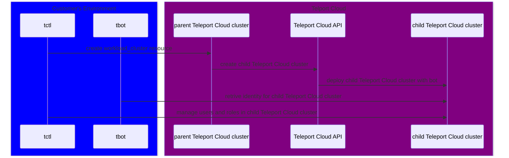

# Example Workload Cluster Usage

## Overview

This document provides a high level overview with examples for a new Teleport feature. The new feature exposes the ability for
Teleport Cloud customers to provision new Teleport clusters hosted in Teleport Cloud. The API for the new "child" clusters feature is
similar to managing other resources in Teleport. Users create a `workload_cluster` resource to provision a new Teleport Cloud
cluster and delete a `workload_cluster` resource to deprovision a Teleport Cloud cluster.

The `workload_cluster` Teleport resource supports providing configuration for a Teleport bot using
[IAM joining](https://goteleport.com/docs/reference/deployment/join-methods/#aws-iam-role-iam) via tbot.
Teleport Cloud will create the child Teleport Cloud cluster with the provided bot and token with access
to create, read, and update users and roles in the child Teleport Cloud cluster.

The remaining sections of this document provides details for users to learn how to manage new child cloud clusters
using the Teleport API.

The examples in this document detail how to create and delete a `workload_cluster` resource, use `tbot` to
retrieve an identity for the child cloud cluster, and manage users and roles in the child cloud
cluster with `tctl` or writing a Go application that connects to the Teleport API.

This document requires using a Teleport Cloud cluster with the WorkloadClusters feature enabled.

## Child Cloud Cluster Architecture

The child cloud cluster workflow involves a parent Teleport Cloud cluster managing the lifecycle of at
least one child Teleport Cloud cluster. When a Teleport user creates a `workload_cluster` resource in a Teleport Cloud
cluster then Teleport Cloud will deploy a child Teleport Cloud cluster.

A parent Teleport Cloud cluster is a Teleport cluster with `workload_cluster` resources submitted, while
a child Teleport Cloud cluster is a Teleport cluster with its lifecycle being managed by the parent cluster.

Teleport Cloud will automatically provision the child Teleport Cloud cluster with a user provided bot and
token that has access to manage users and roles within the child Teleport Cloud cluster.



This documentation covers using a build of Teleport that supports the `workload_cluster` resource.

## Environment setup

### Custom build of tctl

These steps use a custom build of `tctl` that supports the upcoming `workload_cluster` resource.

Teleport will provide the customer with a development build of Teleport that includes code to support creating a `workload_cluster` resource. Teleport will also help the customer with a Teleport Cloud cluster running
a Teleport build that supports the `workload_cluster` resource.

> [!WARNING]
> Users will receive the following error when creating a `workload_cluster` resource if they are using the standard Teleport client tools (`tctl`) rather than the development build of `tctl`.
>
> ```
> ERROR: unsupported resource: "workload_clusters" - resources should be expressed as 'type/name', for example 'connector/github'
> ```

### Setup Parent Teleport Cloud cluster

Before interacting with the `workload_cluster` resource, the parent Teleport Cloud cluster must
have a user with access to the `workload_cluster` resource. The preset `editor` role already
has support for managing `workload_cluster` resources.

If the user doesn't have the `editor` role then a new role will need to be created.

#### Create and assign role to manage workload_cluster resources

A new role will be created and assigned to an existing user to allow access to `workload_cluster`
resources.

> [!NOTE]
> This is only required if the Teleport user doesn't have the `editor` role.

1. Teleport user logs into the existing Teleport Cloud cluster.

   ```bash
   tsh login --proxy <parent>.teleport.sh
   ```

1. Teleport user creates a new role, `workload-cluster-editor`, that gives access to creating and modifying `workload_cluster` resources.

   ```bash
   tctl --auth-server <parent>.teleport.sh create <(cat <<EOF
   kind: role
   metadata:
     description: Edit workload clusters
     name: workload-cluster-editor
   spec:
     allow:
       rules:
       - resources:
         - workload_cluster
         verbs:
         - list
         - create
         - read
         - update
         - delete
     deny: {}
   version: v7
   EOF
   )
   ```

1. Teleport user assigns the new `workload-cluster-editor` role to the existing Teleport user used to previously login via `tsh`.

   ```bash
   tctl --auth-server <parent>.teleport.sh users update --set-roles editor,access,auditor,workload-cluster-editor <username>
   ```

1. Teleport user logs out and back into the parent Teleport Cloud cluster to refresh roles.

   ```bash
   tsh logout --proxy <parent>.teleport.sh --user <username>
   tsh login --proxy <parent>.teleport.sh
   ```

## Usage

The following sections provide example usage via `tctl` or through a Go program.

Below are examples for:

- creating a Teleport `workload_cluster` resource in the parent Teleport Cloud cluster
- using `tbot` to retrieve an identity file for the child Teleport Cloud cluster
- managing roles and users in the child Teleport Cloud cluster
- deleting a Teleport `workload_cluster` resource

### tctl

#### Create a workload cluster in the parent Teleport Cloud cluster

These steps walk through creating a Teleport `workload_cluster` resource in the parent Teleport Cloud cluster.

1. Teleport user logs into the parent Teleport Cloud cluster.

   ```bash
   tsh login --proxy <parent>.teleport.sh
   ```

1. Teleport user creates a `workload_cluster` resource named `child`.

   Teleport Cloud will use the name of the `workload_cluster` resource as the domain name.
   For example, the `workload_cluster`'s name being `child`
   would result in the domain `child.teleport.sh` being used for the child Teleport Cloud cluster.

   ```bash
   tctl --auth-server <parent>.teleport.sh create <(cat <<EOF
   kind: workload_cluster
   version: v1
   metadata:
     name: child
   spec:
     regions:
       - name: us-west-2
     bot:
       name: example-iam
     token:
       join_method: iam
       allow:
         - aws_account: "AWS_ACCOUNT"
           aws_arn: "AWS_ARN"
   EOF
   )
   ```

   Be sure to replace `AWS_ACCOUNT` and `AWS_ARN` with real values to later be used by `tbot`.

1. Teleport user waits for the `workload_cluster`'s `status.state` to report `active`.

   ```bash
   tctl --auth-server <parent>.teleport.sh get workload_cluster/child
   ```

   ```yaml
   kind: workload_cluster
   version: v1
   metadata:
     name: child
   spec:
     regions:
       - name: us-west-2
     bot:
       name: example-iam
     token:
       join_method: iam
       allow:
         - aws_account: "AWS_ACCOUNT"
           aws_arn: "AWS_ARN"
   status:
     domain: child.teleport.sh
     state: active
   ```

   Running `tctl --auth-server <parent>.teleport.sh get workload_clusters` will list all `workload_clusters`, but does not currently display status.

#### Run tbot against child Teleport Cloud cluster

These steps walk through running `tbot` against the child Teleport Cloud cluster to retrieve an identity file.

1. Teleport user logs into the AWS account specified in the `workload_cluster` resource, such as by running `aws sso login --profile <profile>`.

1. Teleport user creates a `tbot.yaml` configuration file with the following content:

   ```yaml
   version: v2
   oneshot: true
   proxy_server: <child>.teleport.sh:443
   onboarding:
     join_method: iam
     token: example-iam
   storage:
     type: memory
   services:
     - type: identity
       destination:
         type: directory
         path: ./tbot-dir/
   ```

   This will configure `tbot` to retrieve an `identity` file to `./tbot-dir/identity`.

   For more information about using `tbot` and IAM joining, please refer to [AWS IAM role](https://goteleport.com/docs/reference/deployment/join-methods/#aws-iam-role-iam).

1. Teleport user runs `tbot` to retrieve an identity file using IAM joining.

   ```bash
   tbot start -c tbot.yaml
   ```

   On success, this will write a file named `identity` to the `./tbot-dir` directory.

#### Manage roles and users in the child Teleport Cloud cluster

These steps walk through creating a new role and user in the child Teleport Cloud cluster using
the identity retrieved by `tbot`.

1. Teleport user creates a new role named `example` in the child Teleport Cloud cluster using the retrieved `tbot` identity.

   ```bash
   tctl -i ./tbot-dir/identity --auth-server <child>.teleport.sh create <(cat <<EOF
   version: v7
   kind: role
   metadata:
     name: example
   spec:
     allow:
       rules:
       - resources:
         - workload_cluster
         verbs:
         - read
   EOF
   )
   ```

1. Teleport user creates a new user named `example` in the child Teleport Cloud cluster with the new `example` role.

   ```bash
   tctl -i ./tbot-dir/identity --auth-server <child>.teleport.sh users add --roles example example
   ```

#### Delete a workload cluster in the parent Teleport Cloud cluster

These steps walk through deleting a Teleport `workload_cluster` resource.

1. Teleport user removes the `workload_cluster` resource named `child` from the parent Teleport Cloud cluster.

   ```bash
   tctl --auth-server <parent>.teleport.sh rm workload_clusters/child
   ```

This will instruct Teleport Cloud to delete the child Teleport Cloud cluster with
a 15 day grace period for restoring the child Teleport Cloud cluster with all data intact.

### Go

Users may choose to use Teleport's Go SDK to interact with workload clusters instead of using client tools
such as `tctl`. This section provides examples for automating the management of `workload_cluster`
resources using Teleport's Go SDK.

#### Write Go Program to create and interact with a workload cluster

These steps walk through creating a new Go project and writing a Go program to create and
interact with a workload cluster using `tbot`.

The following Go program does the following:

- creates a Teleport API client connected to the parent Teleport Cloud cluster
- creates a `workload_cluster` Teleport resource in the parent Teleport Cloud cluster
- waits for the `workload_cluster` resource to report being `active`
- uses `tbot` binary to retrieve an identity file for the child Teleport Cloud cluster
- creates a role and user in the child Teleport Cloud cluster
- creates an invite link for the new user
- deletes the `workload_cluster` in the parent Teleport Cloud cluster

> [!IMPORTANT]
> If running the Go program after the above `tctl` steps then be sure to remove
> the example role and user by running:
>
> ```bash
> tctl --auth-server <child>.teleport.sh rm users/example
> tctl --auth-server <child>.teleport.sh rm roles/example
> ```

1. Teleport user logs into the parent Teleport Cloud cluster.

   ```bash
   tsh login --proxy <parent>.teleport.sh
   ```

1. Teleport user sets up a new Go project.

   ```bash
   mkdir workload-cluster-demo
   cd workload-cluster-demo
   go mod init workload-cluster-demo
   go get github.com/gravitational/teleport/api/client@2ec206647c297b559448773455c5e6cb88097672
   ```

1. Teleport user creates a file named `main.go` replacing references to `<parent>.teleport.sh` and `<child>.teleport.sh`:

   ```go
   package main

   import (
   	"bytes"
   	"context"
   	"encoding/json"
   	"fmt"
   	"log"
   	"os"
   	"os/exec"
   	"path/filepath"
   	"time"

   	"github.com/gravitational/teleport/api/client"
   	"github.com/gravitational/teleport/api/client/proto"
   	headerv1 "github.com/gravitational/teleport/api/gen/proto/go/teleport/header/v1"
   	"github.com/gravitational/teleport/api/gen/proto/go/teleport/workloadcluster/v1"
   	"github.com/gravitational/teleport/api/types"
   )

   // TbotConfig defines a configuration for running tbot
   type TbotConfig struct {
   	// Version is the configuration version
   	Version string `json:"version"`
   	// Oneshot determines if tbot runs as a service
   	Oneshot bool `json:"oneshot"`
   	// ProxyServer is the Teleport Proxy to run tbot against
   	ProxyServer string `json:"proxy_server"`
   	// Onboarding defines how tbot should attempt to join the Teleport cluster
   	Onboarding Onboarding `json:"onboarding"`
   	// Storage instructs tbot where to save its internal certificates
   	Storage Storage `json:"storage"`
   	// Services defines which services for tbot to run
   	Services []Service `json:"services"`
   }

   // Onboarding defines how tbot should attempt to join the Teleport cluster
   type Onboarding struct {
   	// JoinMethod is how to join, such as iam
   	JoinMethod string `json:"join_method"`
   	// Token is which token in the Teleport Cluster to use
   	Token string `json:"token"`
   }

   // Storage instructs tbot where to save its internal certificates
   type Storage struct {
   	// Type is the storage type, such as "memory" for in-memory storage
   	Type string `json:"type"`
   }

   // Services defines which services for tbot to run
   type Service struct {
   	// Type is the service type, such as "identity"
   	Type string `json:"type"`
   	// Destination is used by the identity service to save retrieved identity file and certs
   	Destination Destination `json:"destination"`
   }

   // Destination is used by the identity service to save retrieved identity file and certs
   type Destination struct {
   	// Type is the type of storage, such as "path"
   	Type string `json:"type"`
   	// Path is the filepath to use
   	Path string `json:"path"`
   }

   func main() {
   	ctx := context.Background()

   	/**********************************************
   	* Create a Teleport workload_cluster resource *
   	**********************************************/

   	// parentClient is a Teleport client connected to the parent cluster, which
   	// assumes the identity used has access for creating, reading, and deleting workload_cluster
   	// resources.
   	parentClient, err := client.New(ctx, client.Config{
   		Addrs: []string{
   			// This is the parent Teleport Cloud cluster's proxy address, such as:
   			"<parent>.teleport.sh",
   			// Note: port is optional
   		},
   		Credentials: []client.Credentials{
   			// this loads the credential from tsh
   			client.LoadProfile("", ""),
   		},
   	})
   	if err != nil {
   		log.Panicf("failed to create client: %v", err)
   	}
   	defer parentClient.Close()

   	// wc defines a workload_cluster to create in us-west-2 with a bot named example-iam and
   	// configuration for a token to use IAM joining.
   	// The created child Teleport Cloud cluster will have a bot, role, and token
   	// each named example-iam. The bot will have access to create, read, and update users and roles.
   	wc := &workloadcluster.WorkloadCluster{
   		Kind: types.KindWorkloadCluster,
   		Version: "v1",
   		Metadata: &headerv1.Metadata{
   			Name: "example",
   		},
   		Spec: &workloadcluster.WorkloadClusterSpec{
   			Regions: []*workloadcluster.Region{
   				{
   					Name: "us-west-2",
   				},
   			},
   			Bot: &workloadcluster.Bot{
   				Name: "example-iam",
   			},
   			Token: &workloadcluster.Token{
   				JoinMethod: "iam",
   				Allow: []*workloadcluster.Allow{
   					{
   						AwsAccount: "account",
   						AwsArn:     "arn",
   					},
   				},
   			},
   		},
   	}

   	// Create a workload_cluster resource within the parent Teleport Cloud cluster.
   	if _, err := parentClient.CreateWorkloadCluster(ctx, wc); err != nil {
   		log.Panicf("failed to create workload cluster: %v", err)
   	}

   	// Wait for the created workload cluster to reach an active state.
   	timeoutctx, cancel := context.WithTimeout(ctx, 10*time.Minute)
   	defer cancel()
   	wc, err = waitForActiveWorkloadCluster(timeoutctx, parentClient, wc.Metadata.Name, 30*time.Second)
   	if err != nil {
   		log.Panicf("failed waiting for workload cluster to be active: %v", err)
   	}

   	/************************************************
   	* Run tbot against child Teleport Cloud cluster *
   	************************************************/

   	// Create a directory that will be used for tbot's configuration
   	// and saving a retrieved identity file to for interacting with the child Teleport Cloud cluster.
   	tbotDir, err := os.MkdirTemp("", "")
   	if err != nil {
   		log.Panicf("error creating directory for tbot: %v", err)
   	}
   	defer os.RemoveAll(tbotDir)

   	// Create the tbot configuration.
   	tbotConfig := TbotConfig{
   		// Version must be v2.
   		Version: "v2",
   		// Oneshot should be true to avoid running tbot as a daemon.
   		Oneshot: true,
   		// ProxyServer should be the Proxy Server including the port 443 for the
   		// new child Teleport Cloud cluster.
   		ProxyServer: fmt.Sprintf("%s:443", wc.Status.Domain),
   		// Onboarding instructs tbot which token and join method to use.
   		Onboarding: Onboarding{
   			// Only iam join method will be supported in the short term for workload_clusters.
   			JoinMethod: "iam",
   			// Token must match the same name provided in the workload_cluster's `Spec.Bot.Name`.
   			Token: "example-iam",
   		},
   		// Configure tbot to use in-memory storage.
   		Storage: Storage{
   			Type: "memory",
   		},
   		// Configure which services for tbot to run.
   		Services: []Service{
   			{
   				// The identity service can retrieve an identity file that may
   				// then be used for interacting with the Teleport Cloud cluster.
   				Type: "identity",
   				Destination: Destination{
   					Type: "directory",
   					// A file named identity will be created in the provided path.
   					// This identity file may be provided to tctl or Teleport Clients
   					// for interacting with a Teleport cluster.
   					Path: tbotDir,
   				},
   			},
   		},
   	}

   	// Write the tbot configuration to a `tbot.json` file.
   	tbotConfigContent, err := json.Marshal(tbotConfig)
   	if err != nil {
   		log.Panicf("error marshalling tbot configuration: %v", err)
   	}
   	tbotConfigPath := filepath.Join(tbotDir, "tbot.json")
   	if err := os.WriteFile(tbotConfigPath, tbotConfigContent, 0600); err != nil {
   		log.Panicf("error writing tbot configuration: %v", err)
   	}

   	// Run the tbot binary. Teleport does not expose programmatic access to
   	// tbot, so the binary must be used.
   	// Once tbot start has successfully completed then an identity file
   	// will be populated at the provided path in the tbot configuration.
   	var bufErr bytes.Buffer
   	tbotCmd := exec.Command("tbot", "start", "-c", tbotConfigPath)
   	tbotCmd.Stderr = &bufErr
   	if err := tbotCmd.Run(); err != nil {
   		log.Panicf("error running tbot: %v\n\n%s", err, bufErr.String())
   	}

   	/*************************************************************
   	* Manage roles and users in the child Teleport Cloud cluster *
   	*************************************************************/

   	// Create a new Teleport client to interact with the child Teleport Cloud cluster.
   	// This client will use the identify file retrieved by tbot.
   	childClient, err := client.New(ctx, client.Config{
   		Addrs: []string{
   			// This is the child Teleport Cloud cluster's proxy address:
   			wc.Status.Domain,
   			// Note: port is optional
   		},
   		Credentials: []client.Credentials{
   			// This uses an identity file instead of using a credential from tsh.
   			client.LoadIdentityFile(filepath.Join(tbotDir, "identity")),
   		},
   	})
   	if err != nil {
   		log.Panicf("failed to create client: %v", err)
   	}
   	defer childClient.Close()

   	// The following section includes examples of creating and deleting
   	// a role and a user.

   	// Create a new role named example in the child Teleport Cloud cluster.
   	newRole := types.RoleV6{
   		Metadata: types.Metadata{
   			Name: "example",
   		},
   		Spec: types.RoleSpecV6{
   			Allow: types.RoleConditions{
   				Rules: []types.Rule{
   					{
   						Resources: []string{
   							"workload_cluster",
   						},
   						Verbs: []string{
   							"read",
   						},
   					},
   				},
   			},
   		},
   	}
   	if _, err := childClient.CreateRole(ctx, &newRole); err != nil {
   		log.Panicf("error creating role: %v", err)
   	}

   	// Create user named "example" that has the new "example" role assigned.
   	newUser := types.UserV2{
   		Metadata: types.Metadata{
   			Name: "example",
   		},
   		Spec: types.UserSpecV2{
   			Roles: []string{
   				"example",
   			},
   		},
   	}
   	if _, err := childClient.CreateUser(ctx, &newUser); err != nil {
   		log.Panicf("error creating user: %v", err)
   	}

   	// create an invite URL for user to activate account and setup MFA
   	resetPasswordToken := proto.CreateResetPasswordTokenRequest{
   		Name: newUser.Metadata.Name,
   		TTL:  proto.Duration(2 * time.Hour),
   		Type: "invite",
   	}
   	resetToken, err := childClient.CreateResetPasswordToken(ctx, &resetPasswordToken)
   	if err != nil {
   		log.Panicf("error creating reset token: %v", err)
   	}

   	ttl := resetToken.Expiry().Sub(time.Now().UTC())
   	log.Printf("User %q has been created but requires a password. Share this URL with the user to complete user setup, link is valid for %v:\n%v\n\n", newUser.Metadata.Name, ttl, resetToken.GetURL())

   	/****************************
   	* Delete a workload cluster *
   	****************************/

   	// Cleanup the previously created workload_cluster resource in the parent Teleport Cloud cluster.
   	// This will instruct Teleport Cloud to delete the child Teleport Cloud cluster with
   	// a 15 day grace period for restoring the child Teleport Cloud cluster with all data intact.
   	if err := parentClient.DeleteWorkloadCluster(ctx, wc.Metadata.Name); err != nil {
   		log.Panicf("error deleting cloud cluster: %v", err)
   	}
   }

   func waitForActiveWorkloadCluster(ctx context.Context, client *client.Client, workloadClusterName string, pollingInterval time.Duration) (*workloadcluster.WorkloadCluster, error) {
   	for {
   		timer := time.NewTimer(pollingInterval)

   		select {
   		case <-timer.C:
   			wc, err := client.GetWorkloadCluster(ctx, workloadClusterName)
   			if err != nil {
   				return nil, fmt.Errorf("error getting workload cluster: %w", err)
   			}

   			if wc.Status == nil {
   				continue
   			}

   			if wc.Status.State == "active" {
   				return wc, nil
   			}
   		case <-ctx.Done():
   			return nil, ctx.Err()
   		}
   	}
   }
   ```

1. Teleport user logs into the AWS account specified in the `workload_cluster` resource, such as by running `aws sso login --profile <profile>`.

1. Teleport user runs the Go program.

   ```bash
   go run ./
   ```

> [!IMPORTANT]
> If any errors are encountered by running the Go program then
> Teleport resources may need to be removed before retrying the Go program.
>
> The Teleport resources may be removed by running:
>
> ```bash
> tctl --auth-server <child>.teleport.sh rm users/example
> tctl --auth-server <child>.teleport.sh rm roles/example
> tctl --auth-server <parent>.teleport.sh rm workload_clusters/example
> ```
