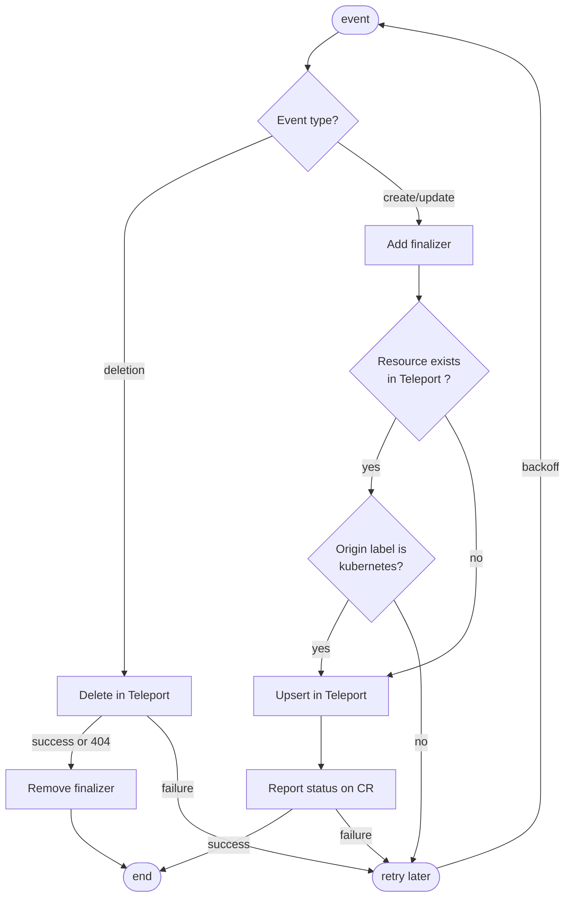

# Teleport Kubernetes Operator

This package implements [an operator for Kubernetes](https://kubernetes.io/docs/concepts/extend-kubernetes/operator/).
The Teleport Kubernetes Operator allows users to manage Teleport resources through
[Kubernetes custom resources](https://kubernetes.io/docs/concepts/extend-kubernetes/api-extension/custom-resources/).

Since v15, the operator now supports running separately from Teleport.
This means the operator can be used against any Teleport instance
(Teleport Cloud or self-hosted).

For more details, read the corresponding [RFD](https://github.com/gravitational/teleport-plugins/blob/master/rfd/0001-kubernetes-manager.md).

## Supported Resources

See the list of supported resources in the documentation: https://goteleport.com/docs/reference/operator-resources/

## Architecture
Teleport Operator is a Kubernetes (K8s) operator based on the `operator-sdk`.

The operator joins the Teleport cluster using MachineID. It runs an in-process
instance of tbot.

When multiple replicas are running, only the leader reconciles Kubernetes resources.

### Startup

When the operator starts it:
- starts a tbot instance and check if it can obtain certificates
- grabs the leader lock, to ensure only one operator is acting upon the modifications

At point, the operator watches Kubernetes CRs and reconciled them with Teleport.
All the teleport resource changes are made using a gRPC client with certificates provided by `tbot`.

### Reconciliation

## Running

### Deploying the operator next to a Teleport cluster deployed with Helm

If you self-host Teleport using the `teleport-cluster` Helm chart, you can deploy
the operator by setting the value `operator.enable: true`. The chart will deploy
the operator and configure Teleport for the operator bot to join.

Please follow [the guide in our documentation](https://goteleport.com/docs/management/dynamic-resources/teleport-operator/).

### Deploying the operator against a remote Teleport cluster

Since v15, the operator can run against a remote Teleport cluster.

Requirements:
- Kubernetes cluster running (the CRs will live there) and logged in with a
  role allowing to edit CRDs and RBAC. `kubectl cluster-info` must succeed.
- Teleport cluster running and `tsh/tctl` logged-in as a user with the `editor`
  role. `tctl status` must succeed.
- A repeatble joining method for the operator bot:
  - The operator bot does not store its state. Plain tokens cannot be used
    except for test (they are not reboot-proof)
  - Cloud-specific join methods are `aws`, `azure`, `gcp`.
  - Both Kubernetes in-cluster and JWKS join methods can be used (`kubernetes`).

TODO(hugoShaka): Link to the user documentation when it will be released.

## Contributing and debugging

See [CONTRIBUTING.md](./CONTRIBUTING.md).
