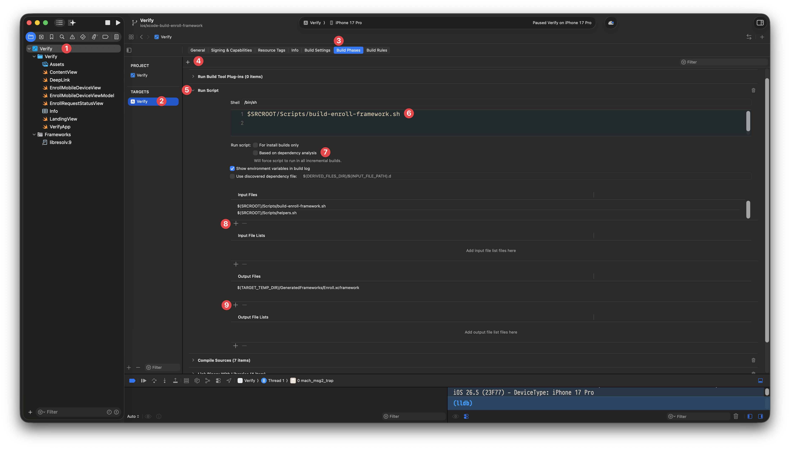
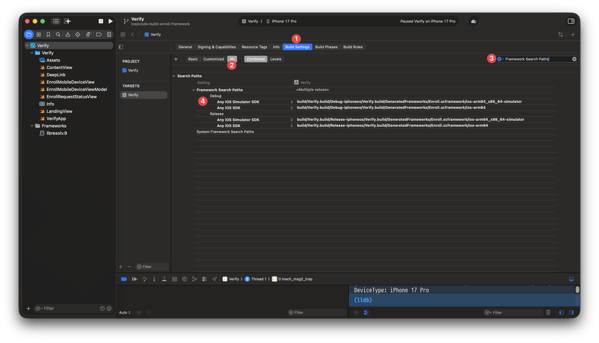
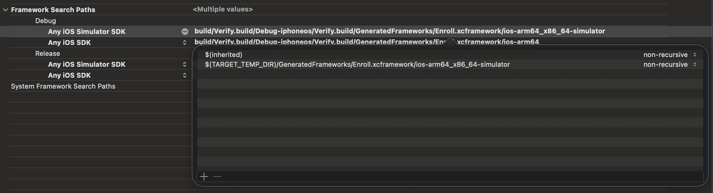
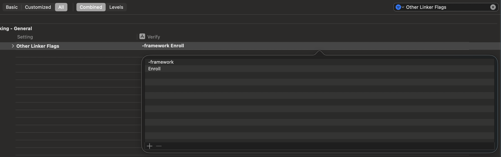

# Teleport Verify

Teleport Verify brings Device Trust to iOS apps. It is a relatively minimal app that focuses on enabling trusted
sessions on iOS devices and little else.

## Adding gomobile Build Artifacts

In order to rely on functionality built in Go, Verify uses `gomobile` to create static libraries that we can import in
Swift. These take the form of `.xcframework` bundles that package together the pieces needed for linking the library in
various contexts.

Building these `.xcframework` files should be done from Xcode Run Script build phases, which are configured in the Xcode
UI. These generated frameworks are build intermediates and should be written to `$(TARGET_TEMP_DIR)`, an Xcode-specific
environment variable which stored build intermediates. These generated frameworks should **not** be committed to the 
repo.

The following is a set of high level instructions on adding a new framework. If this is something we begin to do often,
it may be worth automating.

### 1. Add a Build Script

Create a script under `Scripts/`, following `Scripts/build-enroll-framework.sh` as a template.

The script should:

- source `Scripts/helpers.sh` for useful tools like logging errors to Xcode and discovering the location of the go
  binary.
- build the gomobile package with `gomobile bind -target=ios`
- write the XCFramework to `"$TARGET_TEMP_DIR/GeneratedFrameworks/<Name>.xcframework"`
- use `xcode_error` for Xcode-formatted failures
- print concise progress logs

### 2. Add the Xcode Run Script Phase



In Xcode:

1. Select the root-most Xcode project item in the side bar.
2. Select the Verify target in the inner sidebar.
3. Select the "Build Phases" tab at the top.
4. Click the "+" button just under the tabs and select "New Run Script Phase"
5. Drag the new "Run Script" build phase before "Compile Sources".
6. Set the script body to execute your script, replacing `build-<name>-framework.sh` with the name of your script:

   ```text
   $SRCROOT/Scripts/build-<name>-framework.sh
   ```
7. Uncheck the setting called "Based on dependency analysis". (Note: This is a setting that basically allows Xcode to
   skip this step in incremental builds. The problem is that, without heavy automation, Xcode can't effectively monitor
   all the files that go uses as input. So we instead opt to rebuild the framework every time. If build times get high,
   this would be a prime candidate for improvement).
8. Add the following input files, replacing `build-<name>-framework.sh` with the name of your script:

   ```text
   $(SRCROOT)/Scripts/build-<name>-framework.sh
   $(SRCROOT)/Scripts/helpers.sh
   ```

9. Add the output file generated by your script, replacing `<Name>` with the name of the framework you're building. In
   the example where we are building the `enroll` Go package as an xcframework, the name of the file would be
   `Enroll.xcframework`:

   ```text
   $(TARGET_TEMP_DIR)/GeneratedFrameworks/<Name>.xcframework
   ```

### 3. Link the Framework

`gomobile` will generate two different frameworks inside the actual `.xcframework` bundle: one for use on physical
devices, and one for use in iOS simulators. We must tell Xcode where to _find_ those frameworks manually:



In Xcode:

1. Ensuring that you've still got the Verify target selected, select the "Build Settings" tab.
2. Ensure that you're looking at "All" build settings in the segmented picker next to the "+" button.
3. Type "Framework Search Paths" into the search field.
4. Add the following entries to both the Debug and Release sections, making sure not to overwrite the paths already
   there, replacing `<Name>` with the name of your framework:

   ```text
   Any iOS SDK:
   $(TARGET_TEMP_DIR)/GeneratedFrameworks/<Name>.xcframework/ios-arm64

   Any iOS Simulator SDK:
   $(TARGET_TEMP_DIR)/GeneratedFrameworks/<Name>.xcframework/ios-arm64_x86_64-simulator
   ```
   
   

   The UI for this is abyssmal, and in the future we may move to an easier-to-maintain `xcconfig` approach.
5. Type "Other Linker Flags" into the search field.
6. Add these lines as separate entries, replacing `<Name>` with the name of your framework:

   ```text
   -framework
   <Name>
   ```

   

In your Swift code inside of the `Verify` target, you should now be able to import your framework via the name you've
defined and begin using the symbols in that framework:

```swift
import <Name>
```

