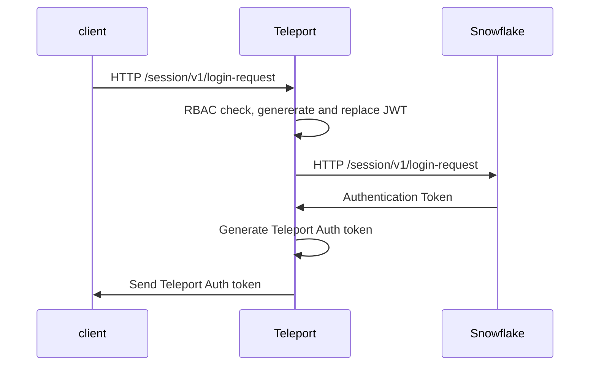
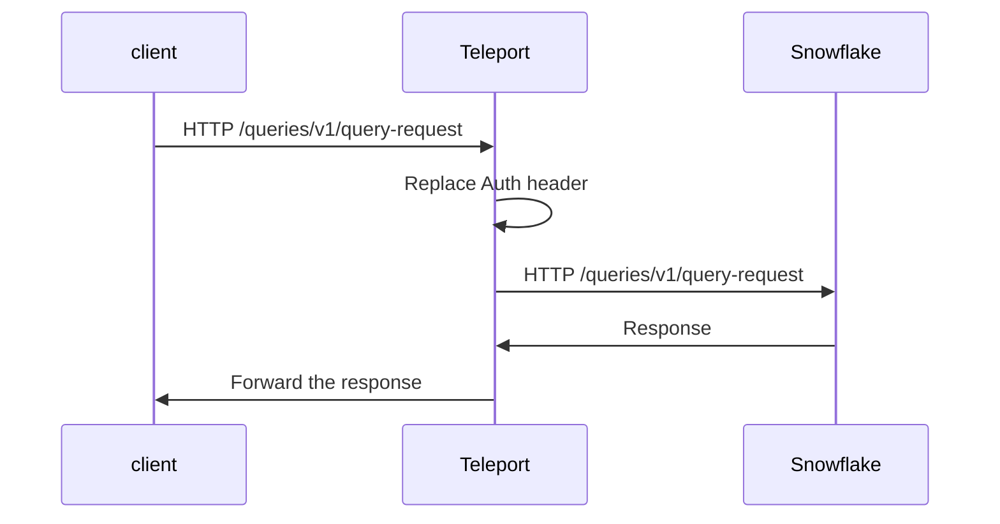

# RFD 75 - Snowflake Database support

## What

[Snowflake](https://www.snowflake.com/) integration in Teleport Database Access. 

## Why

We want to increase the number of databases supported by Teleport. 

## Details

The Snowflake support can be split into 4 parts:

1. Database access support - changes inside Teleport Data Access.
2. CLI support - `snowsql` the official Snowflake client.
3. GUI clients support - DataGrip by JetBrains, DBeaver and similar.
4. WebUI integration https://app.snowflake.com/.

### Snowflake architecture

* Snowflake uses REST API for communication. 
* Payload is a regular JSON. Some responses can also carry payload in [Arrow format](https://arrow.apache.org/). 
* Snowflake uses a slightly modified JWT token flow for authentication (details below).

### Teleport configuration

Like in case of other databases, a user will have to add an entry to the teleport configuration file. Example:

```yaml
db_service:
  enabled: "yes"
  databases:
    - name: "snowflake"
      description: "❄ Snowflake database"
      protocol: "snowflake"
      uri: "im12345.us-east-2.aws.snowflakecomputing.com"
```

The next step would be to add the public part of Teleport's database CA to the Snowflake user account. 
`tctl` could learn to export the required keys in the same way as it does today for different databases 
(`tctl auth sign` command). The exported key must then be added to Snowflake by an administrator. 
The procedure of adding the key to Snowflake is described [here](https://docs.snowflake.com/en/user-guide/key-pair-auth.html#step-4-assign-the-public-key-to-a-snowflake-user).

### Database access support

`tsh db login` should export the user private key currently stored for example in 
`~/.tsh/keys/proxy.example.com/alice` in PCKS8 format (that's the only format supported by `snowsql` and some SDKs).
That key should be used to sign a "Teleport JWT". Client then should send the request with generated JWT to authenticate 
with Snowflake. Teleport can intercept HTTP communication between a client and the Snowflake. The first request send by 
the client should be to the `/session/v1/login-request` endpoint which contains all login information as username, JWT. 
This data can be used to authenticate user in Teleport. JWT token prepared by the client can be then read and replaces by Snowflake JWT
generated by Teleport DB service. Teleport should use Database CA to sign JWT at that point to sign the request instead 
of User CA to be able to authenticate with the key generated by `tctl auth sign` and imported to Snowflake. 
In this way the real token is not accessible by a user and Teleport can still validate if the request 
comes from a trusted source.



On every request Teleport can replace the "Teleport Auth token" with Snowflake Auth token:



With this approach the real session token never leaves the Teleport and any client is not able to bypass Teleport
by extracting the session token.
Snowflake session token needs to be refreshed every X minutes. For that purpose Teleport would have to internally refresh
the token as client doesn't have access to the token (login response contains the time for how long the token is valid).

#### Query logging

Queries can be extracted from requests sent to `/queries/v1/query-request` endpoint, field `data.sqltext` and additional
`data.parameters`, `data.bindings` and `data.bindStage` with query parameters/options.

#### User authentication

Teleport will use the db-username from the client certificate to generate JWT token that includes the database username.
Generated JWT will be then replaced in a request to `/session/v1/login-request`. 

#### Session management

A new type of web session will be created, SnowflakeWebSession. Those session will be used to store the session and
master token returned by `/session/v1/login-request` and `/session/token-request`. On each response from those endpoint
Teleport will extract both token, and replace it with Teleport Web Session ID prefixed with `Teleport:`, example:
Response from snowflake:

```json
{
  "data": {
    "masterToken": "ver:1-hint:8521912329-ETMsDgAAAX+VsGDlABRBRVMvQ0JDL1BLQ1M1UGF...",
    "masterValidityInSeconds": 14400,
    "token": "ver:1-hint:96v0Tt5AVts5HtZThaT24G+HXb/hwCQhuL30azivEPDOg96oe7vMHlqymAcx6o3/dG2b...",
    "validityInSeconds": 3600
  },
  "success": true
}
```

Teleport response returned to client:
```json
{
  "data": {
    "masterToken": "Teleport:2a69645c635316359205cba3c3b52d6a8e9c3ebb3c2032999676ed120b51ff56",
    "masterValidityInSeconds": 14400,
    "token": "Teleport:b712b5421a75f571018569d8623713c20739654b827900dffee086ab55c441d7",
    "validityInSeconds": 3600
  },
  "success": true
}
```

Then on each request token passed in the Authentication header will be mapped to the Snowflake token and replaced before
the request is sent to Snowflake. `Teleport:` prefix is added to web session ID only for easier identification purposes
(some Snowflake clients set this header to a "random" value, for ex. Python SDK can send `None`).

Snowflake web session are implemented on top existing web session tokens in Teleport which allows one token to be read 
by many DB agents in HA configuration.

### CLI support 

`snowsql` is the official Snowflake CLI tool, and it doesn't support TLS terminated proxies as described 
in https://docs.snowflake.com/en/user-guide/snowsql-start.html#using-a-proxy-server, and it uses plain text communication 
when connecting to the Snowflake on a different port that 443. 

`snowsql` requires to use one of the available authentication method. By default, it asks for password unless other 
authentication option is specified. The other alternatives are SSO and JWT/Private key (https://docs.snowflake.com/en/user-guide/snowsql-start.html).
Teleport could use JWT/Private key for authentication. In this flow `tsh` would export user's private in PKCS8 format (at that's the only one supported by `snowsql`),
and `snowsql` could use it to sign the JWT token.

I think there are two ways on how we can support the `snowsql`: 

1. `snowcli` can connect to a custom host **without** TLS on any port different from 443. 
   Because we cannot start `tsh proxy db` on port 443 (all systems require the root account for that) we could 
   start `tsh` proxy on a different port as `tsh` can encrypt the transmission to the Teleport proxy. This approach of course
   has one big drawback; the connection is not end-to-end encrypted as communication between `tsh` and `snowsql` uses plain text.
2. Despite the documentation I was able to use TLS terminated proxy with `tsh`. In this flow `snowsql` sends the traffic 
   to Teleport by using HTTP proxy protocol. Teleport then was able to terminate the TLS connection and read the traffic.
   In order to make it to work I exported the Teleport issued CA as a `CURL_CA_BUNDLE` environment variable (this is undocumented feature).

Below example shows how to start `snowsql` in that mode:

```shell
export https_proxy=localhost:2000
export http_proxy=localhost:2000
export CURL_CA_BUNDLE=/opt/homebrew/etc/ca-certificates/cert.pem # includes the Teleport issued CA
export REQUESTS_CA_BUNDLE=/opt/homebrew/etc/ca-certificates/cert.pem

snowsql --noup -a im56867.us-east-2.aws -u teleport-user --private-key-path ${HOME}/.tsh/keys/example.com/bob.pkcs8 -h me.localhost
```

* environment variable `https_proxy` - sets the address of `tsh proxy db` tunnel address. Traffic will be sent there.
* environment variable `CURL_CA_BUNDLE` - passes Teleport's CA bundle, so we can terminate TLS connection with our certificate.
* `--private-key-path` - sets the path to PCKS8 private key that will be used to sign JWT.
* `-h me.localhost` - is the name of destination server, in our case this name has to match the name on the certificate that we will use for TLS termination.

### UX

Snowflake will integrate with teleport in the same way as other databases. 

* `tsh db connect` - would start `snowsql`.
* `tsh proxy db` - would start proxy for 3rd party GUI clients.

### 3rd party GUI clients

All clients that I was able to find require username and password (DBeaver also supports SSO, but I don't see 
how that would help us). Currently, I don't see any workaround to that except asking user to leave the password empty
(if client supports it) or providing a dummy password.

### Web UI access

Web UI would be a nice thing to have, but Snowflake WebUI doesn't use JWT, so it cannot be easily integrated with
our Application Access. For the initial implementation Web UI will be excluded from the scope.

## Security

* Snowflake access token should not be forwarded to connected clients to minimize the changes of leaking it.
* If we decide to use unencrypted connection between a client and the `tsh` then the traffic can be potentially sniffed
by a malicious actor.

### Notes

* JWT tokens used by Snowflake are not compatible with the tokens generated by our JWT generator implemented in Application Access.
Database Access will be responsible for generating the tokens currently doesn't have permission to generate them.
To make it work we can either add permission for Database Access to access JWT generation and extend its functionality or reimplement 
some logic in Database Access.
* Teleport could in the future automatically rotate Snowflake access keys when Database CA is rotated. Snowflake provides an API
for that.
