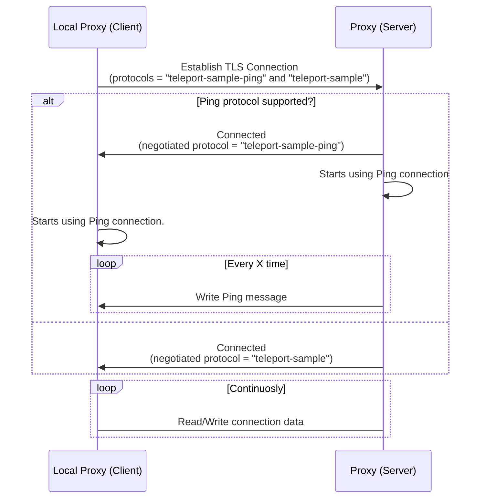

# RFD 80 - TLS routing Ping

## What

Provide to TLS routing protocols a mechanism to prevent idle connections
(without any data being sent or received) without interfering with the
underlying protocol.

## Why

Idle connections are closed after a pre-defined period when deployed with load
balancers. In some of those services (such as [AWS ELB](https://docs.aws.amazon.com/global-accelerator/latest/dg/introduction-how-it-works.html#about-idle-timeout) and [GlobalAccelerator](https://docs.aws.amazon.com/global-accelerator/latest/dg/introduction-how-it-works.html#about-idle-timeout)),
having the TCP Keep-Alive configured is not enough to prevent the connections
from being closed due to inactivity.

Dropping the connections can directly impact user experience when they perform
long-running commands such as database queries.

**NOTE:** The connections are not dropped in those environments for protocols that
already implement a mechanism like this (like [http2](https://httpwg.org/specs/rfc7540.html#PING)). However, not all protocols
supported by Teleport provide such features.

## Details

To avoid having idle connections, we need to send at least one byte before the
idle timeout period elapses. For protocols that that doesn't offer a mechanism
for transmitting data in pre-defined intervals (avoiding the connection from
becoming idle), it is necessary to wrap them into a different protocol.

### Ping protocol

A light protocol enables the connections to send ping packets filtered out on
the receiver. These packets can be sent periodically, preventing the connection
from becoming idle.

The protocol packet is defined by the following:
```
| length | data           |
| uint32 | `length` bytes |
```

The `length` field is an `uint32` encoded in network order (big-endian).

#### Ping message

The ping packet consists of a message where `length = 0`, and there is no `data`
present. These messages are not visible to the reader since they have no
content.

#### Data message

When sending data messages, its content size must be encoded and sent as the
package length. Nothing is sent if the data length is equal to `0` since it is
used to identify ping messages.

### ALPN

Since the ping protocol is a wrapper for other protocols, it is identified as a
suffix `-ping`. So if the client wants to wrap a protocol, for example, MySQL,
it should add this prefix to the already existing MySQL protocol:
`teleport-mysql-ping`.

Ping protocols will take precedence over regular protocols. If the client asks
for it and the proxy server supports, it will be used over the regular one.

Clients and servers must rely on the `NegotiatedProtocol` connection state
property to check if the protocol is supported on both sides and is going to be
used for the connection.

### Client/Server flow



### UX

#### Configuration

Users will be able to configure the ping interval in their cluster
configuration.

```yaml
auth_service:
  # proxy_ping_interval defines in which interval the TLS routing ping message
  # should be sent. This is applicable only when using ping-wrapped connections,
  # regular TLS routing connections are not affected.
  proxy_ping_interval: 30s
```

### Security

#### Length overflow

The connection will be responsible for casting the content length to the
`length` type defined in the protocol packet. Depending on the size of the
content, it can panic due to an overflow. If it happens on the client, the
local proxy will be dropped, but in the Proxy server, it will cause the
application to restart. To avoid this, the connection needs to limit the max
`length` size.

#### Broken connection

There are some scenarios where the connection can be broken, meaning that `Read`
calls might not return the expected content. All of those scenarios will only
affect a single connection. The broken connection may or not affect the
underlying protocols.

##### Malformed message

If the writer sends a message that doesn’t honor the packet or the data is not
the same size defined by the `length` field, it will cause the `Read` calls to
return wrong data, including the ping messages.

##### Incomplete write

Writing all data might require multiple write calls. If one fails, but the
connection keeps going, it will cause bad reads since it expects a larger
message than it was provided. In those scenarios, the best is to close the
connection since there will be a high chance of it being broken.
