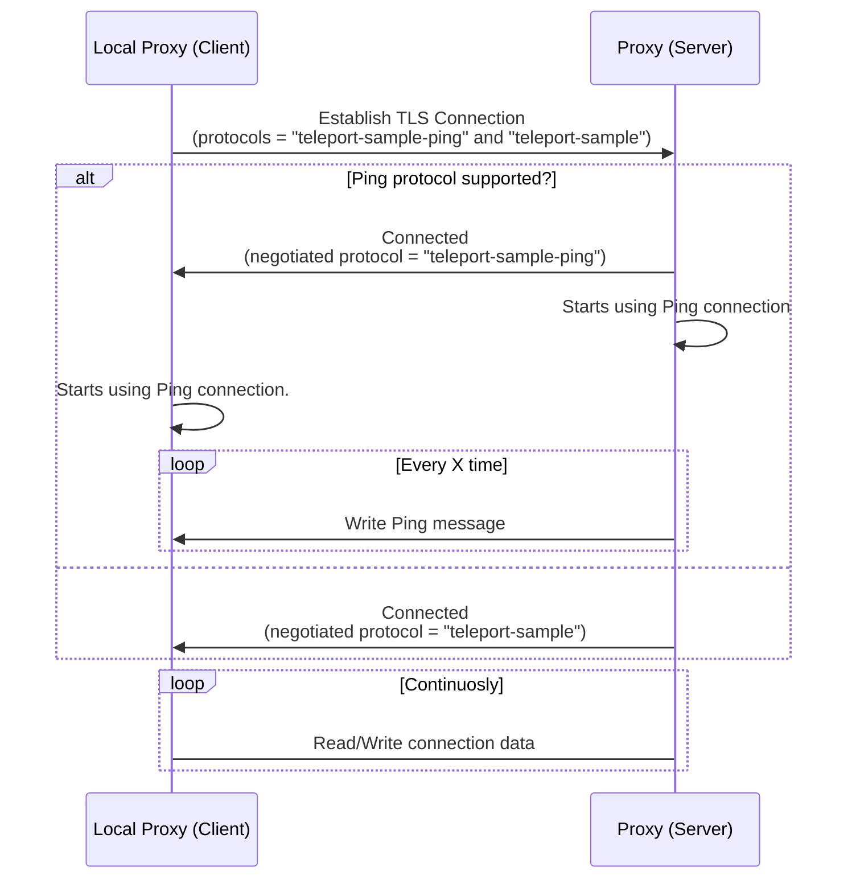

# RFD 80 - TLS routing Ping
## Required approvers

Engineering: @smallinsky && @r0mant
Product: @klizhentas || @xinding33

## What

Provide to TLS routing protocols a mechanism to prevent idle connections
(without any data being sent or received) without interfering with the
underlying protocol.

## Why

Idle connections are closed after a pre-defined period when deployed with load
balancers. In some of those services (such as [AWS ELB](https://docs.aws.amazon.com/global-accelerator/latest/dg/introduction-how-it-works.html#about-idle-timeout) and [GlobalAccelerator](https://docs.aws.amazon.com/global-accelerator/latest/dg/introduction-how-it-works.html#about-idle-timeout)),
having the TCP Keep-Alive configured is not enough to prevent the connections
from being closed due to inactivity.

Dropping the connections can directly impact user experience when they perform
long-running commands such as database queries.

**NOTE:** Even protocols do implement a mechanism like this might need to be wrapped
in the ping protocol. It will depend if the load balancer supports it or not.

## Details

To avoid having idle connections, we need to send at least one byte before the
idle timeout period elapses. For protocols that that doesn't offer a mechanism
for transmitting data in pre-defined intervals (avoiding the connection from
becoming idle), it is necessary to wrap them into a different protocol.

### Ping protocol

A light protocol enables the connections to send ping packets filtered out on
the receiver. These packets can be sent periodically, preventing the connection
from becoming idle.

The protocol packet is defined by the following:
```
| length | data           |
| uint32 | `length` bytes |
```

The `length` field is an `uint32` encoded in network order (big-endian).

#### Ping message

The ping packet consists of a message where `length = 0`, and there is no `data`
present. These messages are not visible to the reader since they have no
content.

#### Data message

When sending data messages, its content size must be encoded and sent as the
package length. Nothing is sent if the data length is equal to `0` since it is
used to identify ping messages.

#### PoC implementation

<details>
<summary>View code</summary>

```go
// pingConn wraps a net.Conn and add ping capabilities to it, including the
// `WritePing` function and `Read` (which excludes ping packets).
//
// When using this connection, the packets written will contain an initial data:
// the packet size. When reading, this information is taken into account, but it
// is not returned to the caller.
//
// Ping messages have a packet size of zero and are produced only when
// `WritePing` is called. On `Read`, any Ping packet is discarded.
type pingConn struct {
	net.Conn

	muRead  sync.Mutex
	muWrite sync.Mutex

	// bytesRead number of bytes already read from the current packet.
	bytesRead int
	// currentSize size of bytes of the current packet.
	currentSize uint32
}

func (c *pingConn) Read(p []byte) (int, error) {
	c.muRead.Lock()
	defer c.muRead.Unlock()

	err := c.discardPingReads()
	if err != nil {
		return 0, err
	}

	// Check if the current size is larger than the provided buffer.
	readSize := c.currentSize
	if c.currentSize > uint32(len(p)) {
		readSize = int32(len(p))
	}

	n, err := c.Conn.Read(p[:readSize])
	c.bytesRead += n

	// Check if it has read everything.
	if uint32(c.bytesRead) >= c.currentSize {
		c.bytesRead = 0
		c.currentSize = 0
	}

	return n, err
}

// WritePing writes the ping packet to the connection.
func (c *pingConn) WritePing() error {
	c.muWrite.Lock()
	defer c.muWrite.Unlock()

	return binary.Write(c.Conn, binary.BigEndian, uint32(0))
}

// discardPingReads reads from the wrapped net.Conn until it encounters a
// non-ping packet.
func (c *pingConn) discardPingReads() error {
	if c.bytesRead > 0 {
		return nil
	}

	for c.currentSize == 0 {
		err := binary.Read(c.Conn, binary.BigEndian, &c.currentSize)
		if err != nil {
			return err
		}
	}

	return nil
}

func (c *pingConn) Write(p []byte) (int, error) {
	c.muWrite.Lock()
	defer c.muWrite.Unlock()

	size := uint32(len(p))
	if size == 0 {
		return 0, nil
	}

	// Write packet size.
	if err := binary.Write(c.Conn, binary.BigEndian, size); err != nil {
		return 0, err
	}

	// Iterate until everything is written.
	var written int
	for written < len(p) {
		n, err := c.Conn.Write(p)
		written += n

		if err != nil {
			return written, err
		}
	}

	return written, nil
}
```
</details>

### ALPN

To keep backward compatibility with `tsh` clients, we will introduce new
protocol names that indicate the ping connection usage. Those protocols will be
identified by the suffix `-ping`. For example, the MySQL protocol with ping will
be `teleport-mysql-ping`.

Ping protocols will take precedence over regular protocols. If the client asks
for it and the proxy server supports, it will be used over the regular one.

Clients and servers must rely on the `NegotiatedProtocol` connection state
property to check if the protocol is supported on both sides and is going to be
used for the connection.

**NOTE:** In future Teleport versions, we can set the ping connection as default
for some protocols, removing the suffix’s necessity.

### Client/Server flow



### UX

#### Configuration

Users will be able to configure the ping interval in their cluster
configuration.

```yaml
auth_service:
  # proxy_ping_interval defines in which interval the TLS routing ping message
  # should be sent. This is applicable only when using ping-wrapped connections,
  # regular TLS routing connections are not affected.
  proxy_ping_interval: 30s
```

### Security

#### Length overflow

The connection will be responsible for casting the content length to the
`length` type defined in the protocol packet. Depending on the size of the
content, it can panic due to an overflow. If it happens on the client, the
local proxy will be dropped, but in the Proxy server, it will cause the
application to restart. To avoid this, the connection needs to limit the max
`length` size.

#### Broken connection

There are some scenarios where the connection can be broken, meaning that `Read`
calls might not return the expected content. All of those scenarios will only
affect a single connection. The broken connection may or not affect the
underlying protocols.

##### Malformed message

If the writer sends a message that doesn’t honor the packet or the data is not
the same size defined by the `length` field, it will cause the `Read` calls to
return wrong data, including the ping messages.

##### Incomplete write

Writing all data might require multiple write calls. If one fails, but the
connection keeps going, it will cause bad reads since it expects a larger
message than it was provided. In those scenarios, the best is to close the
connection since there will be a high chance of it being broken.

## Alternatives

### HTTP2 Protocol

Instead of introducing a custom protocol, we wrap the protocols on HTTP2 and
use the already existent [Ping mechanism](https://httpwg.org/specs/rfc7540.html#PING).
We’ve tried doing a small PoC on this and ended up having some issues and
unsolved questions:

* [HTTP2 Pings are not supported by some load balancers](https://stackoverflow.com/questions/66818645/http2-ping-frames-over-aws-alb-grpc-keepalive-ping);
* The [official package](https://pkg.go.dev/golang.org/x/net/http2) doesn’t
  provide a way to provide a `net.Conn` to be used. Instead, you have to:
    * Create a listener who will provide the server with the connections;
    * "Manually" invoke the protocol methods (using [Framer](https://pkg.go.dev/golang.org/x/net/http2#Framer)), which includes
      writing/reading frames and delegating them to a handler when necessary;
* How would the HTTP2 TLS termination work with ours? Should we use the text
  implementation instead?

#### PoC implementation

<details>
<summary>View code</summary>

```go
package main

import (
	"context"
	"fmt"
	"io"
	"net/http"
	"net/http/httptest"
	"time"
)

// flushWriter uses http.Fluser to perform the writes.
// It implements WriterCloser although the Close won't do anything.
type flushWriter struct {
	w io.Writer
	f http.Flusher
}

func (fw *flushWriter) Write(b []byte) (int, error) {
	n, err := fw.w.Write(b)
	fw.f.Flush()
	return n, err
}

func (fw *flushWriter) Close() error { return nil }

// h2Conn implements Read/Write/Close functions that is going to
// be backed by http connection.
type h2Conn struct {
	r io.Reader
	w io.WriteCloser
}

func (c *h2Conn) Read(b []byte) (int, error) {
	return c.r.Read(b)
}

func (c *h2Conn) Write(b []byte) (int, error) {
	return c.w.Write(b)
}

func (c *h2Conn) Close() error {
	return c.w.Close()
}

func netConnH2Server(rw http.ResponseWriter, req *http.Request) (*h2Conn, error) {
	if !req.ProtoAtLeast(2, 0) {
		return nil, fmt.Errorf("not http2")
	}

	flusher, ok := rw.(http.Flusher)
	if !ok {
		return nil, fmt.Errorf("not supported")
	}

	// Write initial headers.
	rw.WriteHeader(http.StatusOK)
	flusher.Flush()

	return &h2Conn{req.Body, &flushWriter{rw, flusher}}, nil
}

func netConnH2Client(client *http.Client, url string) (*h2Conn, error) {
	// Make synchronous reader.
	reader, writer := io.Pipe()

	req, err := http.NewRequest(http.MethodPost, url, reader)
	if err != nil {
		return nil, err
	}

	resp, err := client.Do(req)
	if err != nil {
		return nil, err
	}

	return &h2Conn{resp.Body, writer}, nil
}

type handler struct {
	ctx         context.Context
	dataWritten []byte
}

func (h *handler) ServeHTTP(rw http.ResponseWriter, req *http.Request) {
	conn, err := netConnH2Server(rw, req)
	panicOnErr(err)

	ticker := time.NewTicker(100 * time.Millisecond)
	defer ticker.Stop()
	for {
		select {
		case <-h.ctx.Done():
			return
		case <-ticker.C:
			_, err := conn.Write(h.dataWritten)
			panicOnErr(err)
		}
	}
}

func main() {
	dataWritten := []byte("hello h2")
	ctx, cancel := context.WithTimeout(context.Background(), 5*time.Second)
	defer cancel()

	// Create http2 server.
	server := httptest.NewUnstartedServer(&handler{ctx, dataWritten})
	server.EnableHTTP2 = true
	server.StartTLS()
	defer server.Close()

	// Start client.
	conn, err := netConnH2Client(server.Client(), server.URL)
	panicOnErr(err)

	buf := make([]byte, len(dataWritten))
	for {
		n, err := conn.Read(buf)
		if err != nil {
			if err == io.EOF{
				return
			}

			panic(err)
		}

		fmt.Println("read:", string(buf[:n]))
	}
}

func panicOnErr(err error) {
	if err != nil {
		panic(err)
	}
}
```
</details>
