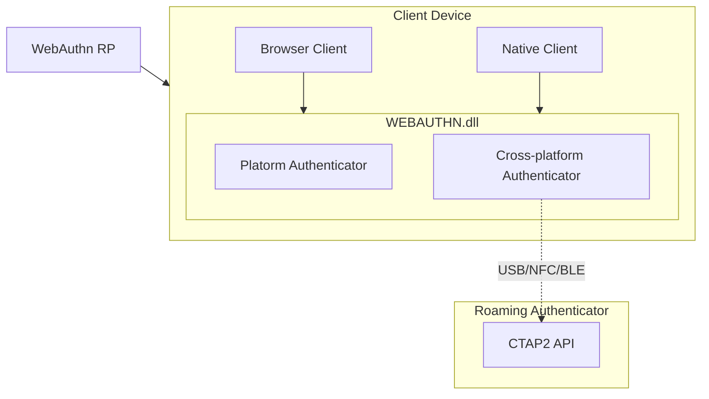
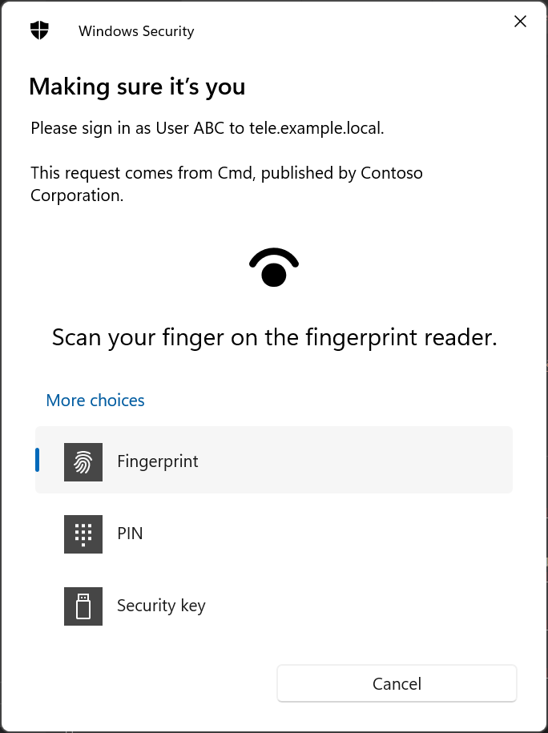

# RFD 0088 - Passwordless for windows CLI

## Required Approvers

* Engineering @rosstimothy && @codingllama
* Security @reed
* Product: (@xinding33 || @klizhentas )

## What

Passwordless features for native windows CLIs, aka Windows Hello and FIDO
support for CLI/`tsh`.

This is a part of the [Passwordless RFD][passwordless rfd].

Passwordless for Windows is available as a preview in Teleport 11.

## Why

Native, non-browser windows clients lack support for Windows Hello or FIDO
devices. This RFD explores how we can achieve that support for `tsh` in a
secure way.

## Details

Windows Hello and FIDO devices support is implemented via win32 API which is
installed on Windows 10 19H1 or later.
More details about API can be found in [API spec](https://github.com/microsoft/webauthn)
or [documentation][webauthn API windows docs].



`Webauthn.dll` is designed to work with Webauthn protocol, that's why
integration with it results moslty in passing parameters from and back to
server.

**Important:** Windows system without `webauthn.dll` (older than Windows 10 19H1)
won't be supported.

If `webauthn.dll` is not found, `tsh` should disable Windows Hello or FIDO
devices support. DLL will be loaded directly from system.
Microsoft provides 4 versions of webauthn API and all should be supported.

Interactions (touch messages and pin inputs) with Windows Hello or FIDO devices
is done via Windows UI.

Windows Hello works with both Microsoft online and offline accounts.

### Registration

The proposed UX is similar to the current experience:

```shell
$ tsh mfa add
> Choose device type [TOTP, WEBAUTHN]: webauthn
> Enter device name: win-hello
> Follow system dialogs or enter a code from a *registered* OTP device:
<system shows webauthn prompt>
> MFA device "win-hello" added.
```

The way to specify if windows hello or FIDO device should be used is via
mfa-mode: `--mfa-mode={auto,platform,cross-platform}`. Auto defaults to platform
in Windows Hello.

`tsh` performs the key registration process, setting all parameters for a
passwordless / resident key via `WebAuthNAuthenticatorMakeCredential` from
`webauthn.dll`.

In case of a registration failure, `tsh` must do its best to delete the
created-but-not-registered credential. Credential removal is only possible
using webauthn API version 4+.

Windows webauthn supports attestation. For FIDO devices it is passed from
device. For Windows hello device it is TPM attestation. Worth mentioning is
fact that for assertion using Windows Hello RSA2048 + SHA256 is used, however
for attestation on TPM prior to 2.0 SHA-1 can be used.

### Authentication

Authentication depends on server settings (otp, webauthn, passwordless).

`tsh` performs the authentication process, setting all parameters for a
passwordless / resident key via `WebAuthNAuthenticatorGetAssertion` from
`webauthn.dll`.

The way to specify if Windows Hello or FIDO device should be used is via
mfa-mode: `tsh --mfa-mode={auto,platform,cross-platform}` - choose whether to
use platform or cross-platform MFA. Auto defaults to platform in Windows Hello.

### Detecting Windows Hello support

Detecting Windows Hello and FIDO devices support is important so `tsh` may
enable/disable related features as appropriate.

Apart from Go build tags, which are a rather coarse detection mechanism, we can

* Verify if `webauthn.dll` is present on system and it's version (support v1-v4)
* Verify device supports for user-verifying platform authenticator via API call
  `WebAuthNIsUserVerifyingPlatformAuthenticatorAvailable`
* If device is not supporting user-verifying platform authenticator, fallback to
  FIDO devices should be possible

### `tsh` support commands

The following support commands are added to `tsh` as hidden subcommands. They
are useful to diagnose and manage certain aspects of Windows Hello support.

The commands are only available on windows builds.

`tsh winhello diag` - prints diagnostics about Windows Hello support (for
example, what API version is `webauthn.dll` etc.

```shell
$ tsh winhello diag  # diag output subject to change
> Windows version: 10
> Signed: yes
> Webauthn.dll version: 3
> Supports platform user-verification: yes
```

### Executable sign

Although Windows allow usage of not-signed executables, it results in poor UX.
There is warning about _using not verified app_. This can be easily fixed by
signing the executable.

### Security

Security considerations are largely unchanged in relation to the
[Passwordless RFD][passwordless rfd].

Windows Hello keys are protected by TPM 2.0 hardware if available. Windows also
supports Windows Hello when TPM is missing via software. Windows Hello keys are
scope by rpid, it means that windows hello keys created via browser on Web UI
will be available in `tsh`.

[Microsoft webauthnAPI documentation][webauthn API windows docs] provides more
information about device requirements etc.

It's important to note that CLI applications with hardware key access are
particularly dangerous, as they are not subject to the security measures
we've come to expect from browsers (in fact, _any_ untrusted application that
interacts with hardware keys should be used with caution).
Those concerns are not exclusive to WebAuthn, but are made more delicate in face
of passwordless credentials.

`tsh` does its best to be well-behaved and mitigates hardware key access
concerns by being open source, providing signed binaries and its own Cloud
solution.

### UX

UX from `tsh` command perspective does not change at all in comparison to
[Passwordless FIDO](https://github.com/gravitational/teleport/blob/master/rfd/0053-passwordless-fido2.md#ux)
and [TouchID](https://github.com/gravitational/teleport/blob/master/rfd/0054-passwordless-macos.md#ux).

The only changes that will be visible to user is that now all interactions
(message to touch device, pin input etc) are provided by Windows modals.

Windows Webauthn API prefers Windows Hello over FIDO devices. If user want to
use only FIDO devices, it must use `--mfa-mode=cross-platform`. `Tsh` must
remember `--mfa-mode` from previous usage.

Example `tsh mfa add` with passwordless / resident key creation, including
initial PIN setup:

```shell
$ tsh mfa add
> Choose device type [TOTP, WEBAUTHN]: webauthn
> Enter device name: pwdless-key
> Allow passwordless logins [YES, NO]: yes
> Follow instructions from system dialogs
> MFA device "pwdless-key" added.
```

Example of a login with multiple hardware keys, PIN, and multiple credentials:

```shell
$ tsh login --proxy=example.com --auth=passwordless
> Follow instructions from system dialogs
> > Profile URL:        https://example.com
>   Logged in as:       llama
>   Cluster:            example.com
>   Roles:              access, editor
>   Logins:             llama
>   Kubernetes:         enabled
>   Valid until:        2021-10-04 23:32:29 -0700 PDT [valid for 12h0m0s]
>   Extensions:         permit-agent-forwarding, permit-port-forwarding, permit-pty
```

Dialog will look similar to following:



The following hidden maintenance commands are added:

* `tsh winhello diag`
<!--
TODO(tobiaszheller): on version 4 of API there is method to run list and delete
credentials, however currently those API is not yet available on newest Windows
11.
-->

Regular users shouldn't need to touch those commands, but they are available for
troubleshooting and credential management.

## Alternatives considered

### Libfido2 C library

Libfido2 c library (which is used on mac/linux for FIDO keys) supports Windows
Hello via `webauthn.dll` and FIDO devices during old implementation. However
starting from version Windows 10 19H1, access to FIDO devices using old
implementation required administrator privlidges and it is recommented to use
`webauthn.dll` for FIDO2 devices. Libfido2 API is limited and you cannot really
specify if you want to use platform or cross-platform attachment.

<!-- Links -->

[passwordless rfd]: https://github.com/gravitational/teleport/blob/master/rfd/0052-passwordless.md
[webauthn API windows docs]: https://docs.microsoft.com/en-us/windows/security/identity-protection/hello-for-business/webauthn-apis
