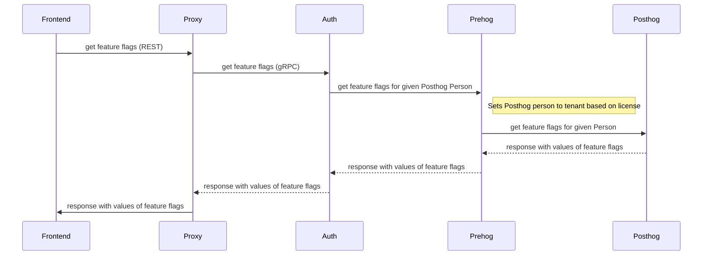

# RFD 91 - A/B Testing setup

## Required Approvers
Engineering:?
* Product: @xinding33

## What

A method of switching between multiple versions of Frontend components or switching some components off based on predefined feature flags.
Feature flag values will be determined at the tenant level.

## Why

The main reason is to provide a possibility to conclude A/B tests on tenants. It should enable better UX and metrics optimization. It should be also possible to run multiple experiments at the same time. 

## Details

The solution is closely related to reporting efforts performed to collect data about core metrics on the tenant level. 
There will be backend and frontend changes required to achieve desired goals.  

### Backend

On the backend level, there will only be one thing provided a method to fetch current flag values. It should provide a simple response that can be expressed as a JavaScript object similar to the one below.

```javascript
{
    flag_1: true,
    flag_2: "B"
}
```

Which consist of flags and their values that are either boolean or string. 

Similar to the rest of the APIs used by teleport web UI this API will be implemented as webapi in the web go package under ``lib/web``. 
Which in turn will use gRPC to send a request to Auth service to ask for feature flags values. Auth service will use [Prehog](https://github.com/gravitational/prehog) (similar to what reporting is doing to collect metric data). Which in turn will communicate with the PostHog instance to get the current values of feature flags for a given tenant. 

So communication will look like so:



The main reason for such a complex communication schema instead of hitting directly a Posthog from FE is because Prehog Service is required to correctly set the Posthog person to a tenant based on the license. 

### Frontend

The solutions chosen here will enable the product team to dynamically switch flags for tenants without the need to redeploy front-end assets. All tenants will have the same version of the frontend bundle that will display differently based on the feature flags provided. To avoid loading more code than necessary components could be lazy-loaded based on provided values of feature flags. 

**Service**

The feature flags will be loaded once on page load and kept in the Teleport context object to be used where needed. 
All the code needed to initialize and interact with feature flags will be kept inside the ``featureFlags`` service under the ``./services/featureFlags`` path.

This service will have to meet the following interface:

```typescript
interface FeatureFlags {
    initialize(): Promise<void>;
    getFeatureFlag(name: string): boolean | string;
}
```

**Variants and Variant components**

To provide easy-to-use feature flags A/B testing there will be helper components provided to enable a declarative way of defining different component Variants. Those components will be ``VariantsSwitch`` and ``Variant``. 

For example for a component ``Header`` if we want to display different aversion based on the feature flag `header_flag``` we could modify the component code to look like so:

```typescript
function Header() {
    return <VariantsSwitch featureFlag="header_flag">
        <Variant case="variant_a" path="./variantA" />
        <Variant case="variant_b" path="./variantB" />
    </VariantsSwitch>
}
```

Where ``path`` is a variant version of the component to be lazy loaded when a variant has a value that is equal to a given `case` (be it string or boolean).

There will be also a possibility to not lazy load components.

```typescript
function Header() {
    return <Variants featureFlag="header_flag">
        <Variant case="variant_a">
            Variant A version of Header component
        </Variant>
        <Variant case="variant_b" path="./variantB" />
    </Variants>
}
```

One of the variants can be marked as the default one, so it will be used when no other variant could be matched. 

```typescript
function Header() {
    return <Variants featureFlag="header_flag">
        <Variant case="variant_a" default>
            Variant A version of Header component
        </Variant>
        <Variant case="variant_b" path="./variantB" />
    </Variants>
}
```

### Existing work

There are already implemented feature flags under ``webapps/packages/teleport/src/features.ts`` and similar inside the enterprise version of Frontend. Those are used mainly to enable or disable different options in the navigation bars of the web application. They serve different purposes. And conditions for enabling and disabling those feature flags are different. There should be an effort to unify the usage of features across the application but that is not the purpose of changes required for A/B testing and will be not done as part of this effort. 


