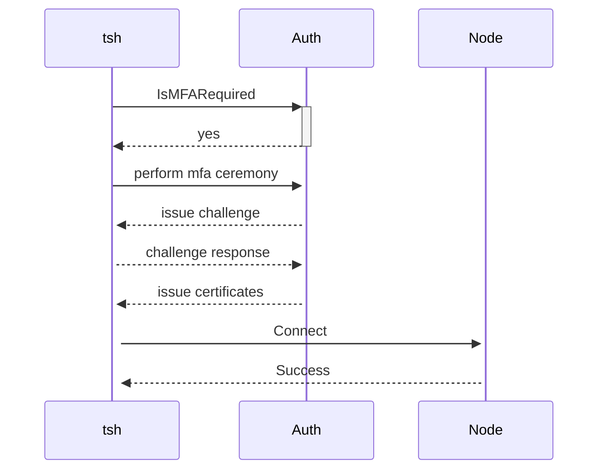
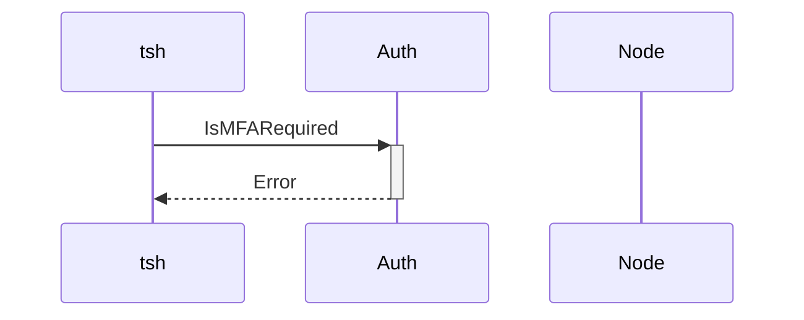
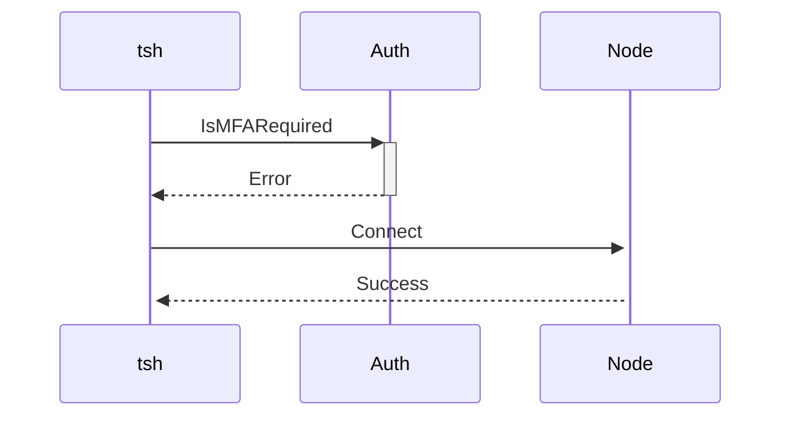
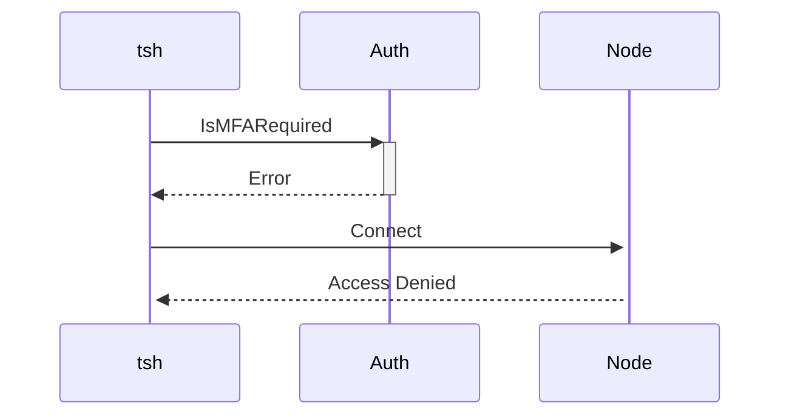

# RFD 0093 - Robust Access to Nodes


# Required Approvers

* Engineering @zmb3 && (fspmarshall || codingllama)

## What

Ensure that users can access nodes via `tsh ssh` when there is intermittent or no connectivity to Auth.

## Why

Connectivity to the Auth server is a single point of failure which can result in not being able to access
a resource. If a user already has already obtained a valid certificate (via `tsh login`) there are certain
scenarios when a connection to Auth should not required to gain access to a node. This would reduce the burden
on cluster admins when performing an Auth upgrade. On top of the potential downtime during the upgrade, any issues 
found as a result of the upgrade require a rollback, which can further extend downtime and lack of connectivity.

## Details

### Auth Connection Required 

The following cluster settings or operations **must** have a connection to Auth server to establish a connection to a node:

#### Label based tsh ssh

```bash
tsh ssh user@"foo=bar"
```

For the above command to work, `tsh` needs to be able to resolve all matching nodes which have the label
`foo=bar`. To determine which nodes match the provided labels `tsh` issues a `proto.AuthService/ListResources`
request to the Auth server which returns the matching node set. Without a connection to Auth node resolution
is just not possible.


#### Sync Recording modes

Both `proxy-sync` and `node-sync` recording modes require a persistent connection to Auth to upload session recordings. As a result, 
even if `tsh ssh` doesn't require a connection to Auth, the session cannot be created without being able to start a connection
for the recordings. This will prevent the connection to the node from being established successfully.

#### Per-Session MFA

When enabled at either the cluster or role level per-session MFA requires completing the MFA ceremony with the 
Auth server. This means that it is not possible to connect to a resource without `tsh` being able to connect to
the Auth server to perform the required MFA ceremony.

**Future Improvements**
There is a scenario in the future that would allow for such behavior to exist. Per 
[RFD80](https://github.com/gravitational/teleport/blob/master/rfd/0080-hardware-key-support.md#per-session-mfa-configuration), setting `require_session_mfa` to `hardware_key_touch` does not require the Auth server for the MFA ceremony. Instead the PIV stored keys only require a PIV-touch to satisfy the per-session MFA requirement.

#### Strict Recording mode

```yaml
kind: role
version: v5
metadata:
  name: ssh-strict
spec:
  options:
    record_session:
      ssh: strict
```

Strict mode, which is only available when using `auth_service.session_recording: node`, will result in the session failing to launch if the node is unable to record the session.


#### Moderated Sessions 

Tracking participants for a moderated session requires persisting the `types.SessionTracker` resource in the backend so that the joining criteria may be evaluated when a user creates or joins a session. In the event that persisting the `types.SessionTracker` fails, the session must be aborted to prevent any unauthorized access. This is true for both proxy and node recording mode. 

#### Web UI

All access via the Web UI requires a connection to Auth. None of the auth connector resources are replicated to the Proxy which means users are unable to login to the Web UI without
connectivity to Auth. Even when already logged in prior to losing connection to Auth, the Proxy doesn't perform any RBAC for users locally. It instead relies on proxying all requests
to the Auth server on behalf of the logged in user for RBAC to be performed. 

#### Strict Locking mode

```yaml
kind: role
version: v5
metadata:
  name: lock-strict
spec:
  options:
    lock: strict
```

Strict mode, which is not the default mode, causes all interactions to be terminated when the locks are not guaranteed to be up to date. When connectivity to Auth is
interrupted and locks aren't able to be replicated, new connections will eventually be aborted out of an abundance of caution. 

### Auth Connection Not Required 

### tsh ssh

Attempting to connect directly to a node via hostname, IP Address, or UUID should not require a connection to Auth for any configurations except those mentioned above.

```bash
tsh ssh foo@bar
tsh ssh foo@127.0.0.1
tsh ssh foo@f409a8b6-1275-4f0f-887e-8185426147f4
```

However, this doesn't work to date for two main reasons:

1) `proto.AuthService/IsMFARequired`
2) `types.SessionTracker`


###### Per-Session MFA
`tsh` determines whether per-session MFA is required **prior** to connecting to a node. Which means that every invocation of `tsh ssh` requires a connection to the Auth server. 

Successful connection attempt when Auth is available:


Failed connection attempt when Auth is unavailable:


However, the decision if the connection should be established is ultimately made by the node, not the Auth server. The node
performs an RBAC check on all inbound connections to determine if among other things per-session MFA is required and the MFA ceremony was 
performed. Thus, `tsh` should **always** attempt to connect to a node even if the `proto.AuthService/IsMFARequired` RPC fails. In the worst
case this makes `tsh ssh` for per-session MFA enabled connections take longer to fail. But that cost comes at the ability to allow all
users that will never have to perform per-session MFA to be able to connect to nodes without needing the Auth server if they already 
have certificates.

Successful connection attempt when Auth isn't available and per-session MFA is **not** required


Failed connection attempt when Auth is unavailable and per-session MFA is required:



Alternative approaches:

1) Attempt to connect to the node first, and if it fails with a `trace.AccessDenied` error then try `proto.AuthService/IsMFARequired` and then perform the MFA ceremony and connect to the node again
    - Results in reduced latency for the happy path which doesn't require per-session MFA by removing the call to `proto.AuthService/IsMFARequired` entirely. However, `proto.AuthService/IsMFARequired` is still required   if the user doesn't have access to the node at all or per-session MFA is required.
    - Results in increased latency when per-session MFA is required since that flow now requires establishing the connection to the target node twice.
2) Perform `proto.AuthService/IsMFARequired` and connecting to the node in parallel and act accordingly
    - Ultimately leads to roughly the same outcome as Option 1. The connection to the node almost always takes longer than the connection to auth. By performing them in parallel you really only get gains in the happy path.

###### Session Trackers
A new session tracker is created for every session. In the event that persisting the session tracker fails the 
session is aborted. 

Instead of immediately aborting the session if the session tracker cannot be persisted, the node could first check if 
moderated sessions are required. In the event that they aren't the session should be allowed to proceed using a local 
session tracker resource. 

While this does allow access to the node, it will prevent the following:
- the session from appearing in the active sessions list
- the session will not be joinable by other users
- the session recording will not be available

## Testing

Tests will be added to verify that in each scenario described in this RFD that access to the node is as expected.

## Security

The changes to `tsh` should not impact security at all. They will still enforce that per-session MFA is performed if
required. Nodes ultimately make the decision if access should be allowed and the changes proposed are client 
side only.

Allowing non-moderated sessions to continue without the session tracker in the backend means does pose some auditing risk. 


## UX

There should be no perceivable change to the UX of `tsh ssh` for a healthy cluster. When there is an Auth outage access
to nodes should be permitted in the allowed configurations listed above. The changes here do result in a slightly longer
failure scenario when there is an Auth outage and per-session MFA is required for `tsh ssh`, however the total time
will be no longer than it would've take to establish the connection to the node if Auth was available.
