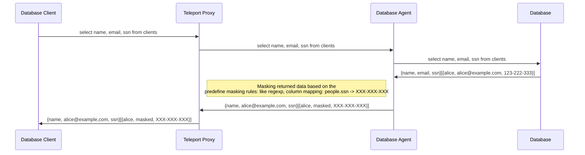
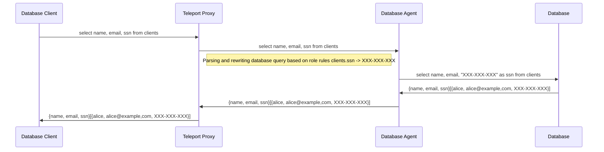
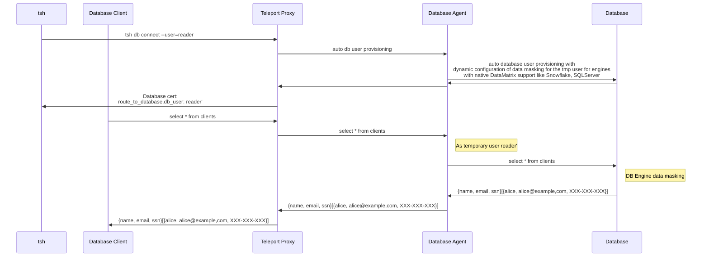
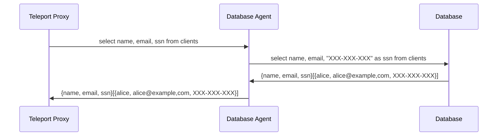

# RFD 91- Data Masking

## Required Approvers
* Engineering: @r0man
* Product: (@klizhentas || @xinding33)
* Security @reed

## What
Add support for Data Masking in Teleport Database Access.


## Why
Data Masking is a high-security demanding feature that allows database administrators to limit the data that is returned to the application by obscuring the values of certain columns in the database. This is useful for masking sensitive data, such as personally identifiable information (PII) or credit card numbers, that is stored in the database.
This feature is also required by GDPR and PCI compliance standards.
There are many custom implementations for data masking, but they are not always easy to configure and reliable. Teleport can provide a more convenient way to configure and manage data masking in a unified way for all supported databases.


## Data Masking Overview

### Static Data Masking
Static data masking relay on the creation/maintenance of a sanitized copy of a database with all sensitive data masked. Masking is done by redirection of a user to a masked database.

### Dynamic Data Masking
Dynamic data masking allows masking data "on-the-fly" without creating a copy of the database. This approach is more flexible and allows to apply of masking rules to the existing database.

Teleport Database Access will focus only on dynamic data masking that is more flexible and easier to configure without creating a copy of the database.

### Native Database Masking Support:

Some database engines provide native support for data masking:

- [SQLServer](https://learn.microsoft.com/en-us/sql/relational-databases/security/dynamic-data-masking?view=sql-server-ver16)
- [Snowflake](https://docs.snowflake.com/en/user-guide/security-column-ddm-use.html)
- [PostgresSQL via Anonymizer plugin](https://www.postgresql.org/about/news/postgresql-anonymizer-10-privacy-by-design-for-postgres-2452/)

### Market Data Masking Solutions:
1) [Cyral](https://cyral.com/) <br/>
Cyral is using dynamic data masking approach. According to Cyral Docs data masking is only supported for Redshift, Denodo  and Snowflake.
> Masking is supported on Redshift and Denodo repositories. An early-access version of masking is available for Snowflake repositories. Contact Cyral support to set up masking in Snowflake.

Data Masking implementation requires to install custom database UDF (user-defined function)
https://cyral-docs-v2.netlify.app/docs/using-cyral/masking#enable-masking-on-your-repository
> database> cyral install mask

Cyral seems to leverage Denodo

Some function example can be found in
[cyralinc/database-functions](https://github.com/cyralinc/database-functions) GitHub repository

Due to license limitation I was unable to test they implementation. 

2) [DataSunrise](https://www.datasunrise.com/data-masking/) <br/>
They support both static and dynamic data masking. In case of dynamic data masking sql query is rewritten to and masking rules are applied.
For instance
```select id, firstname, lastname, phone from people;```
after applying dynamic masking rule that masks phone number will static "masked" value will be transformed to
```select people."id", people."firstname", people."lastname", CAST('masked' as text) as "phone" from people;```

3) [Immuta](https://www.immuta.com/product/secure/orchestration-dynamic-data-masking/) <br/>
According to the Immuta docs they are using database engines built-in data masking functionality.

3) [Imperva](https://www.imperva.com/)  <br/>
According to https://docs.imperva.com/bundle/v13.2-data-masking-user-guide/page/71264.htm they are using static data masking where they create a copy of the database with all sensitive data masked.

4) [Acra](https://docs.cossacklabs.com/acra/security-controls/masking/) <br/>
Acra is using dynamic data masking where query is parsed by Acra server before it is sent to the database. Acra server identified the masking data based on parsed query and apply masking rules to the data before it is returned to the client.
In Acra solution Data Masking is only an additional feature to data encryption functionality where the data is encrypted before is sent to the database and decrypted before it is returned to the client.

###  Dynamic Data Masking Approaches to consider:

#### 1. Masking returned data on the fly in the database agent:
In this approach database agent  applies masking rules to the data returned from the database.


Cons:
- Not reliable end easy to bypass: `select email from clients;`  A malicious user can  query `select encode(email, hex) as name from clients;` and bypass data masking rules applied by the database agent.
- Performance: returned data needs to be processed on the db agent side

Pros:
- Easy to implement.

#### 2. Query rewriting:
In this approach database agent rewrites sql query to apply masking rules to the data returned from the database.




Cons:
- Rewriting query based on table schema and role rules and be challenging.

Pros:
- No performance impact on db agent side.


#### 3. Leveraging data engines masking capability:

In this approach teleport db agent is only responsible for configuration dynamic data masking rule on the database engine with native data masking support and don't need to rewrite/parse sql queries or mask returned data.



Cons:
- Limitation: Native data masking is supported only for Snowflake, SQLServer, Redshift
- Requires native data masking support in the database engine. Right now available only for Snowflake, SQLServer.

Pros:
- Most secure and reliable approach.


### Teleport Data Masking Proposed Solution

Teleport Database Access in order to support data masking with a wide range of database engines like Self-hosted/Cloud-Hosted MySQL, Postgres will implement a data masking approach based on query rewriting on the proxy side where DB agent will be responsible
for parsing SQL queries. Then DB agent will inspect a SQL query and find a sensitive data request based on data masking rules and alters SQL Statements to mask the data.





#### Teleport Database options - Data Masking configuration:
Teleport DB Agent will be responsible for parsing incoming SQL Queries and applying masking rules based on user role `data_masking` configuration:

```yaml
kind: role
spec:
    ...
    database_options:
    data_masking:
      - database: "postgres01"
      - table:    "customers"
        columns:
          - column: email
            hash: md5
          - column: phone
            constant: "XXX-XXX-XXX"
```


#### Wildcard select:
Teleport DB agent doesn't contain any information about the tables scheme apart from masking rules. When a wildcard query is executed:
```sql
select * from table1;
```
information about the `table1` scheme is required to extend the `*` select from all columns query. At first data masking implementation Teleport won't obtain database schema
and will Teleport block "select from all tables queries" if a selected table contains a masking rule. In this case, Teleport will return the database error "Data masking unambiguous query error".


### Security
Data-masking solution based on altering the SQL query in the proxy before it is sent to the database engine is more flexible but less secure than using native db engine data masking functionality.
Solution based on query rewriting in proxy side wll introduce several potential vectors of bypassing data masking:
1) Database user have access to views/procedures that operates/returns data from masked columns
2) User can create a custom procedure/view from masked table `create table clients_bypass as select name, email, ssn from clients;`
3) User tries to create a custom view: `create view v_clients as select * from clients;`

To narrow ability to bypass data masking on the proxy side by execution views/procedures, creation of a custom tables Teleport can introduce Database Access Model based on parsed SQL Query and allow to interact/execute resource that are in user/role allow list:
```yaml
kind: role
spec:
    ...
    database_options:
    allow_access:
      - database: "postgres01"
        tables:
        - "customers"
        - "clients"
        views:
        - "top_customers_view"
        procedures:
        - "calculate_*"
```
