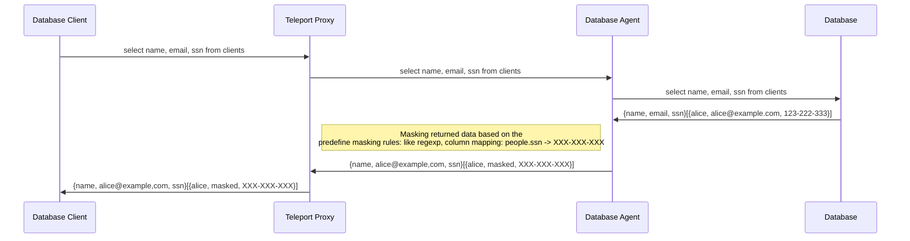
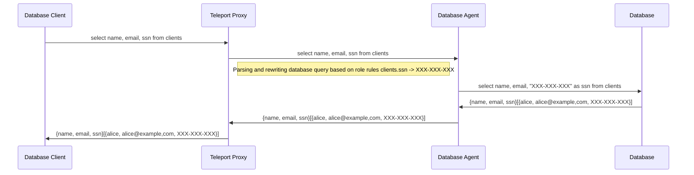
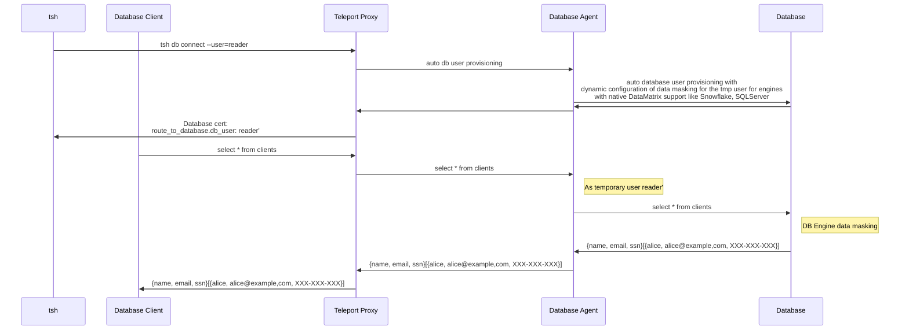
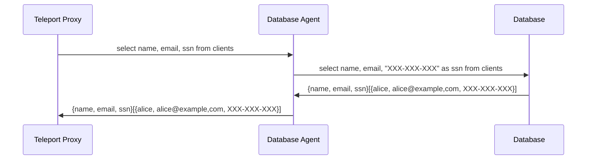

# RFD 91- Data Masking

## Required Approvers
* Engineering: @r0man
* Product: (@klizhentas || @xinding33)
* Security @reed

## What
Add support for Data Masking in Teleport Database Access.


## Why
Data Masking is a high-security demanding feature that allows database administrators to limit the data that is returned to the application by obscuring the values of certain columns in the database. This is useful for masking sensitive data, such as personally identifiable information (PII) or credit card numbers, that is stored in the database.
This feature is also required by GDPR and PCI compliance standards.
There are many custom implementations for data masking, but they are not always easy to configure and reliable. Teleport can provide a more convenient way to configure and manage data masking in a unified way for all supported databases.


## Data Masking Overview

### Static Data Masking
Static data masking relay on the creation/maintenance of a sanitized copy of a database with all sensitive data masked. Masking is done by redirection of a user to a masked database.

### Dynamic Data Masking
Dynamic data masking allows masking data "on-the-fly" without creating a copy of the database. This approach is more flexible and allows to apply of masking rules to the existing database.

Teleport Database Access will focus only on dynamic data masking that is more flexible and easier to configure without creating a copy of the database.

### Native Database Masking Support:

Some database engines provide native support for data masking:

- [SQLServer](https://learn.microsoft.com/en-us/sql/relational-databases/security/dynamic-data-masking?view=sql-server-ver16)
- [Snowflake](https://docs.snowflake.com/en/user-guide/security-column-ddm-use.html)
- [PostgresSQL via Anonymizer plugin](https://www.postgresql.org/about/news/postgresql-anonymizer-10-privacy-by-design-for-postgres-2452/)

### Market Data Masking Solutions:
1) [Cyral](https://cyral.com/) <br/>
    Cyral is using dynamic data masking approach. According to Cyral Docs data masking is only supported for Redshift, Denodo  and Snowflake.
    > Masking is supported on Redshift and Denodo repositories. An early-access version of masking is available for Snowflake repositories. Contact Cyral support to set up masking in Snowflake.

    Data Masking implementation requires to install custom database UDF (User-Defined Function)
    https://cyral-docs-v2.netlify.app/docs/using-cyral/masking#enable-masking-on-your-repository
    > database> cyral install mask

    Some `UDF` function example can be found in
    [cyralinc/database-functions](https://github.com/cyralinc/database-functions) GitHub repository

    Due to license limitation I was unable to test they implementation but based on description the Native Database Data-Masking functionality is used.
    In case of Amazon Redshift they're probably using similar approach described at [amazon-redshift-dynamic-data-mas)](https://github.com/aws-samples/amazon-redshift-dynamic-data-mas) 

2) [DataSunrise](https://www.datasunrise.com/data-masking/) <br/>
DataSunrise product supports both static and dynamic data masking. <br/>
In case of dynamic data masking SQL Query is rewritten and masking rules are applied.
For instance the following query with phone constant 'masked' rule:
```sql
SELECT id, firstname, lastname, phone FROM people;
```
will be transformed by the proxy to the following SQL Query before it is sent the SQL instance:
```sql
SELECT people."id", people."firstname", people."lastname", CAST('masked' AS text) AS "phone" FROM people;
```

4) [Immuta](https://www.immuta.com/product/secure/orchestration-dynamic-data-masking/) <br/>
According to the Immuta docs they are using database engines built-in data masking functionality.

5) [Imperva](https://www.imperva.com/)  <br/>
According to https://docs.imperva.com/bundle/v13.2-data-masking-user-guide/page/71264.htm they are using static data masking where they create a copy of the database with all sensitive data masked.

6) [Acra](https://docs.cossacklabs.com/acra/security-controls/masking/) <br/>
Acra is using dynamic data masking where query is parsed by Acra server before it is sent to the database. Acra server identified the masking data based on parsed query and applies masking rules to the data before data are send to the client.

7) [JumpWire](https://jumpwire.ai/)
Jumpwire doesn't support data masking though it allows to encrypt/decrypt data. For that, the query parsing approach is used on the proxy side. Encryption/Decryption is also done on the proxy side.
If data is already stored in the database. Jumpwire allows to manually trigger a migration job that will process alter and encrypt database data.

###  Data Masking Approaches to consider
#### 1) Static Data Masking
   Static Data Masking requires additional resources, configuration and is less flexible than dynamic data-masking solution we won't consider supporting static-data masking.
    
#### 2) Dynamic Data Masking: Masking returned data on the fly in the database agent:
In this approach Database Agent post process the result of SQL Query and transform the results rows based on masking rules like regular repressions.



Cons:
- Not reliable end easy to bypass: `select email from clients;`  A malicious user can  query `select encode(email, hex) as name from clients;` and bypass data masking rules applied by the database agent.
- Performance: returned data needs to be processed on the db agent side

Pros:
- Easy to implement.


#### 3) Dynamic Data Masking - Query rewriting:
In this approach database agent rewrites SQL QUERY based on the masking rules


Cons:
- Rewriting query based on table schema and role rules and be challenging.

Pros:
- No performance impact on db agent side.


#### 3. Leveraging data engines masking capability:

In this approach teleport db agent is only responsible for configuration dynamic data masking rule on the database engine with native data masking support and don't need to rewrite/parse sql queries or mask returned data.



Cons:
- Limitation: Native data masking is supported only for Snowflake, SQLServer, Redshift
- Requires native data masking support in the database engine. Right now available only for Snowflake, SQLServer.

Pros:
- Most secure and reliable approach.


### Teleport Data Masking Proposed Solution

Teleport Database Access in order to support data masking with a wide range of database engines like Self-hosted/Cloud-Hosted MySQL, Postgres will implement a data masking approach based on query rewriting on the proxy side where DB agent will be responsible
for parsing SQL queries. Then DB agent will inspect a SQL query and find a sensitive data request based on data masking rules and alters SQL Statements to mask the data.





#### Teleport Database options - Data Masking configuration:
Teleport DB Agent will be responsible for parsing incoming SQL Queries and applying masking rules based on user role `data_masking` configuration:

```yaml
kind: role
spec:
    ...
    database_options:
    data_masking:
      - database: "postgres01"
      - table:    "customers"
        columns:
          - column: email
            hash: md5
          - column: phone
            constant: "XXX-XXX-XXX"
```


#### Wildcard select:
Teleport DB agent doesn't contain any information about tables scheme apart from masking rules. When a wildcard query is executed:
```sql
select * from table1;
```
information about the `table1` scheme is required to extend the `*` select from all column query in order to apply masking rules. At first data masking implementation Teleport won't obtain database schema
and will Teleport block "select from all tables queries" if a selected table contains a masking rule. In this case, Teleport will return the database error "Data masking unambiguous query error".


### Security
Data-masking solution based on altering the SQL query in the proxy before it is sent to the database engine is more flexible but less secure than using native db engine data masking functionality.
Solution based on query rewriting in the proxy side will introduce several potential vectors of bypassing data masking:
1) Database user have access to views/functions/procedures that operate/returns data from masked columns
   In order to prevent this a database user should be configured with database privileges that don't allow to use views/functions/procedures that allow bypassing data masking applied on the proxy side.
   For instance, lets consider the following table:
   ```sql
    CREATE TABLE customers(
        id       INT             NOT NULL,
        name     VARCHAR(20)     NOT NULL,
        email    VARCHAR(100)    NOT NULL,
        phone    VARCHAR(100)    NOT NULL,
        age      INT             NOT NULL,
        address  CHAR (25),
        ssn.     VARCHAR (50)    NOT NULL,
        PRIMARY KEY (id)
    );
   ```
   and predefined view `v_customers` and `top_customers` function:
   ```sql
   CREATE FUNCTION top_customers() RETURNS customers
   LANGUAGE SQL
   AS $$
     SELECT * FROM customers WHERE ... ;
   $$;
   
   CREATE VIEW v_customers AS SELECT * FROM customers; 
   ```
   where Teleport DB masking rules for the `customers` table was configured `email`, `phone` and `ssn` columns:
   ```yaml
    database_options:
    data_masking:
      - database: "postgres01"
      - table:    "customers"
        columns:
          - column: email
            hash: md5
          - column: phone
            constant: "XXX-XXX-XXX"
          - column: ssn
            constant: "XXX-XXX-XXX"
    ```

   If a database user has permission to execute the `top_customers` or `v_customers` function the data masking on proxy side can be bypassed by calling `select top_customers()` or `select * from v_customers;`  
   Teleport DB Proxy doesn't have enough information to apply masking rules for the `SELECT top_customers()` and ` SELECT * FROM v_customers` queries.

2) User can create a custom procedure/function/view/table from masked table `CREATE TABLE customers_tmp AS SELECT * CUSTOMERS;`
   or `CREATE VIEW v_customers AS SELECT * FROM customers;`.
   In that case, Teleport DB Agent can detect CREATE SQL statements and recognize if a masked table is referenced. If so Teleport DB Agent can reject the SQL Statement.

3) Bypassing data masking by guessing.
   Data masking solution doesn't limit the number of queries that can be run by a user. A malicious user tries to bypass data masking by guessing sensitive data.
   For instance, lets consider `customers` table that contains a row with `{name: Bruce Wayne, SSN: 111-222-333}` data where data masking rule is configured only on SSN column.
   Eventually, SSN can be obedient by running a binary search on SSN Column:
```sql
select ssn from customers WHERE name='Bruce Wayne';
------------
 XXX-XXX-XXX
```
```sql
SELECT * FROM customers WHERE name='Bruce Wayne' AND SSN BETWEEN '111-111-111' AND '555-555-555';
// ...
SELECT * FROM customers WHERE name='Bruce Wayne' AND SSN BETWEEN '111-111-998' AND '111-111-999';
```


