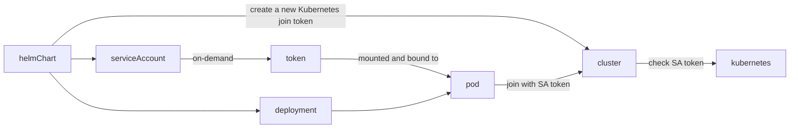
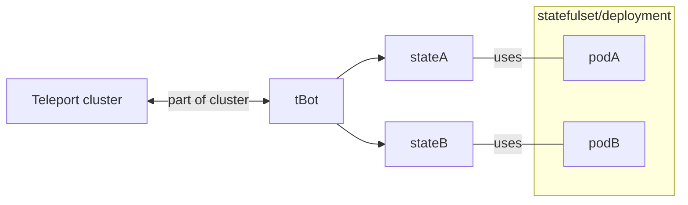
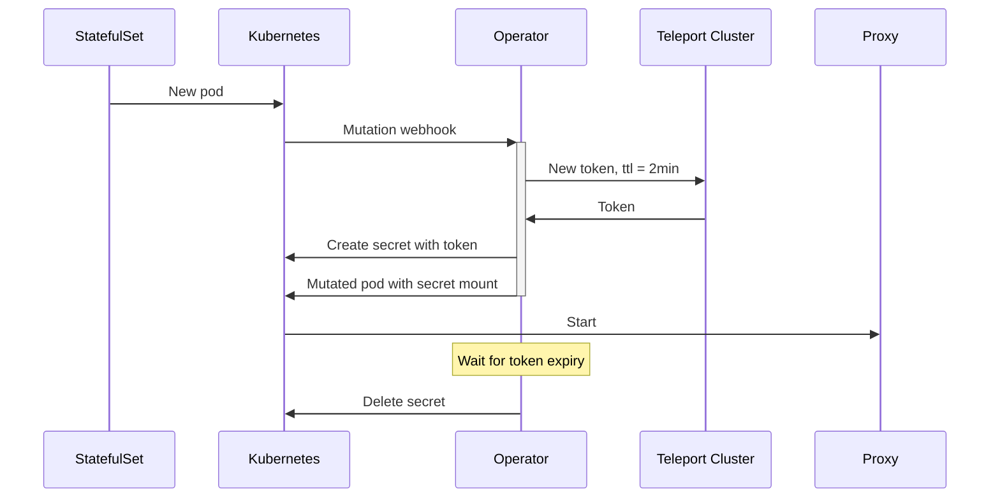
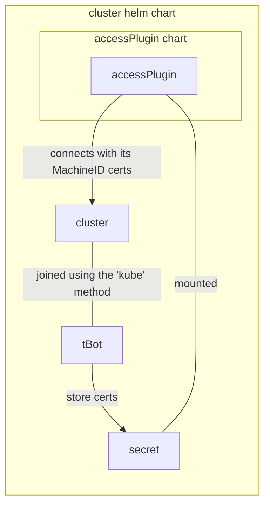

# RFD 0094 - Kubernetes node joining

## Required approvers

* Engineering: @r0mant && @gus
* Product: @klizhentas && @xinding33
* Security: @reedloden

## What

This RFD discusses various methods for Teleport proxies to join a Teleport
cluster in a same-cluster Kubernetes context and covers implementation details
of the chosen approach.

## Why

We want to refactor the `teleport-cluster`  Helm chart to be a reference
delivery method for Teleport. This involves deploying separately Teleport auth
and proxy nodes. Proxy nodes have to register against the Teleport auth nodes
without user interaction and without compromising the cluster security (no
long-lived tokens).  Proxy nodes can be automatically created or deleted (by a
Kubernetes HPA for example).

User Motivation:

- As new Teleport adopter, I want to deploy a working, secure and highly
  available Teleport cluster on Kubernetes, with a single Helm command and as
  few values as possible so that I can start using Teleport as fast as possible.
- As a Teleport power user, I want to easily join my other co-hosted Teleport
  services (app, db, discovery, windows, Machine ID, ...) on Kubernetes so that
  I have less join automation to build and maintain.

## Details

The first section of this RFD explores three different approaches on how to
have proxies automatically join the cluster.

The next sections discuss implementation details and security/ux considerations
of the chosen approach.

### Exploring different approaches

#### Approach 1 - A new join method

In this approach we introduce a new `kube` join method relying on Kubernetes
tokens to establish trust (like the `ec2` and `iam` ones). Teleport tokens
using this method can be long-lived with less security risk because they are
not secret and rely on Kubernetes as a trusted third party.



This approach is basically extending [RFD 0050](./0050-join-methods.md).

This brings the following challenges:
- helmChart has to create a Teleport join token for its service account:
  - this can be done through the Teleport operator and a TeleportToken resource
    (we are due to implement tokens anyway to reach parity between the operator
    and the Terraform provider)
  - this can be done through a bootstrap resource on cluster creation
- Kubernetes only supports (read enabled by default) short-lived renewed token
  after 1.20 (it depends on the Kubernetes distribution, but starting with 1.20
  everyone must support it). For prior versions, users might have to use the legacy
  non-bound tokens produced by Kubernetes.

#### Approach 2 - MachineID-generated certs

In this approach, proxy certificates are delivered by MachineID.



This approach brings the following challenges:
- each proxy requires multiple certs (one with the default teleport node role,
  the other with the proxy role)
- teleport does not support joining from certs (unless we manually build a
  valid state)
- `tbot` has to dynamically discover how many pods want certs and which certs
  they need (we don't have a streaming destination API yet)
- pods should have a way to access their specific state:
    - we can't mount a different secret in each pod
    - it can be done through admission webhooks
    - pods can read secrets (this works OK for Teleport nodes, but cannot be
      generalized with other workloads like access plugin because this requires
      being able to read all certs from the namespace)
    - pods can request a cert to tBot over HTTP
- `tbot` has to validate the identity of the pod requesting the certificate
- `tbot` has to join the cluster initially, which is almost the same problem that
  we're trying to address (almost because we have less constraints due to
  autoscaling). The easiest approach would be to bundle `tbot` with auth nodes and
  use the local admin socket to bootstrap it, like what we're doing with the
  operator

#### Approach 3 - Operator/MachineID-generated short-lived tokens

In this approach, short-lived static tokens are generated by the Teleport
operator and injected in containers using mutation webhooks.



The operator internally relies on MachineID to get its identity, this solution
is basically an automated version of [MachineID token
generation](https://github.com/gravitational/teleport/discussions/15404).

This approach brings the following challenges:
- the operator becomes mandatory, which might not be a possibility for certain
  users (because of new additional RBAC)
- the operator enters the critical path, if it is not available no pod can start
- pods started before the mutation webhook is added will not get their token
- there is a race condition if the proxy pod does not start before expiry, the
  failure mode is a pod stuck in crashloop and the only way out is to delete
  the pod. This is particularly likely to happen on clusters with node
  autoscaling or capacity issues.

### Choosing the approach

The second approach tends to bring more issues than it solves. Even if we added
MachineID support for Teleport nodes, this would not be used by customers with
their Teleport workload.

The third approach adds new components in the critical path and new complex
failure modes.

The first approach seems the more robust, leverages previous work with
ProvisionTokens and provides very solid security guarantees for Kubernetes 1.20+.
MachineID would also benefit from it as `tBot` would be easily deployed in a
Kubernetes cluster hosting a Teleport cluster.

### Implementation details

*Note*: the term `token` is confusing in the context of this RFD as it covers
both Kubernetes-issued tokens and Teleport join tokens of type `kube`. In the
following doc, "Kubernetes token" and "service account token" refer to a
Kubernetes-issued token and "join token" refers to a Teleport join token of
type `kube`.

If this RFD is accepted, the teleport documentation should reflect this nuance
and using the term token alone should be avoided.

The feasibility of this approach has been tested against Multiple Kubernetes
setups, including:
- Kubernetes 1.18 on Minikube
- Kubernetes 1.20 on EKS
- Kubernetes 1.22 on GKE

The proof of concept code can be found
[here](https://github.com/hugoShaka/kube-JWT-playground).

#### User flow

- A teleport cluster is running in Kubernetes.
- An operator (human or automated) wants to deploy a new set of Teleport
  proxies in the same cluster.
- The operator creates a new `kube` join token, allowing the kubernetes service
  account `new-proxies`
- The operator creates a Kubernetes service account `new-proxies`
- The operator creates its new pods (with a Deployment, a StatefulSet, or even
  a DaemonSet) using the `new-proxies` SA
- The Teleport proxies uses the mounted Kubernetes token to join the existing
  Teleport cluster
- The Teleport cluster validates the token against Kubernetes using the
  `TokenReview` API
- The proxies are part of the cluster

#### Kubernetes tokens

All Kubernetes tokens contain the service account name and its groups.

Versions 1.20 and above ([bound
tokens](https://github.com/kubernetes/enhancements/blob/master/keps/sig-auth/1205-bound-service-account-tokens/README.md#boundserviceaccounttokenvolume-1)):
- tokens are signed per pod
- tokens are automatically renewed by the kubelet
- token TTL is configurable in the `PodSpec`
- tokens are revoked when the pod is deleted

Versions prior 1.20:
- tokens are signed per service-account
- tokens are long-lived
- tokens are revoked when the service account is deleted

Tokens are JWTs, Kubernetes JWKS can be manually fetched and JWT validation can
be done offline.  Kubernetes also exposes a
[`TokenReview` API](https://kubernetes.io/docs/reference/kubernetes-api/authentication-resources/token-review-v1/)
to validate tokens. This API performs more checks, like revocation, UUID
checking pod and service account, ... This API is the sanest way to validate
Kubernetes token.

#### Teleport join tokens

The teleport resource would look like:

```yaml
kind: token
version: v2
metadata:
  name: proxy-token
  expires: "3000-01-01T00:00:00Z"
spec:
  roles: ["Proxy"]
  k8s:
    allow:
    - service_account: "my-namespace:my-service-account"
```

The `allow[*].service_account`check should match exactly the `User` field of
the Kubernetes token stripped of the `system:serviceaccounts:` prefix. Checking
if the `system:serviceaccounts` prefix is present ensures no Kubernetes user
tokens can be used to join the Teleport cluster.

Supporting this token kind does not require changes to the
`RegisterUsingTokenRequest` type, the Kubernetes token should be passed through
the `IDToken` field and the Teleport token name should be passed in the `Token`
field. The join logic would be similar to what is done with GitHub joining.

Teleport should validate on token creation if it can access the `TokenReview`
API by reviewing its own Kubernetes token. This will allow to fail fast on
broken or not supported setups.

#### Supporting external cluster joining

The token spec could be extended in a second phase to support trusting other
Kubernetes apiservers than the one where the auth is running. This will imply
adding fields to the ProvisionToken to specify how Teleport should authenticate
to Kubernetes. As a large portion of clusters are hosted by cloud providers,
we will likely need to support the biggest cloud authentication methods.

The token would look like this:

```yaml
kind: token
version: v2
metadata:
  name: proxy-token
  expires: "3000-01-01T00:00:00Z"
spec:
  roles: ["Proxy"]
  k8s:
    allow:
      - service_account: "my-namespace:my-service-account"
    # empty authType defaults to "inCluster" for compatibility
    authType: "inCluster|kubeconfig|gcp|aws|azure|rancher|..."
    kubeconfig:
      certificate-authority-data: base64
      server: http://1.2.3.4
      # either set token or user && client-*
      token: my-secret-token
      user: client-sa-name
      client-certificate-data: base64
      client-key-data: base64
    gcp:
      # optional SA account key/name
      # if they are empty, teleport should try to use ambient credentials (see google.DefaultTokenSource)
      service-account-key: base64
      service-account-name: "foo@sa-project.iam.gserviceaccount.com"
      # mandatory fields to identify the cluster
      project: cluster-project
      location: us-east1
      cluster-name: my-cluster
    aws:
      # optional SA account id/secret
      # if they are empty, Teleport should try to use ambient credentials
      key-id: ASDFGHJK
      key-secret: QWERTYUIOP
      # mandatory
      region: us-east-1
      account-id: 1234567890
      cluster-name: my-cluster
    azure:
    # [...]
    rancher:
    # [...]
```

For cloud providers like GCP or AWS, users will have to make sure the cloud
service-account is mapped to a Kubernetes group bound to a ClusterRole
allowing to use the `TokenReview` API.

As this setup can be complex, Teleport should validate on token creation
it has access to the `TokenReview` API. It can do so by reviewing its
own Kubernetes token.

#### Security considerations

Bound tokens mounted through projected volumes offer a solid level of security
as those tokens are short-lived, automatically renewed and are revoked on the
pod deletion. Those tokens are the pod's identity from a Kubernetes point of
view.

Legacy tokens offer less security guarantees as they are long-lived and not
automatically rotated. Joining using them is still an improvement over static
tokens because the Kubernetes-issued token doesn't need to leave the cluster
by design: human operators and the CI/CD system should never be in contact with
the token. Legacy tokens are mostly a user experience improvement rather than a
security improvement.

The Teleport Helm charts should always favor using bound tokens. Kubernetes
support for bound tokens must be detected at the deploy time and the chart must
adapt its behaviour to maximize security based on Kubernetes capabilities.

To mitigate token stealing or replaying MiTM attack, the joining
Teleport nodes should be configured with the ca_pins, as for regular tokens.

Introducing the feature does not add new critical components that could cause
availability issues. Creating new pods already requires a healthy apiserver.
If the apiserver were to fail, this would not affect already joined proxies.

#### Implications of adding the feature

While joining Teleport proxy nodes is the main motivation of this proposal,
other Teleport nodes would also benefit from this additional join method.

Deploying nodes in the same Kubernetes cluster will become easier. This can be
used to join all kinds of Teleport service (kubernetes, app, db, windows
desktop, discovery), but also to join `tbot` and offer an easier Machine ID
integration in Kubernetes. This would pave the way for a better experience for
users hosting access plugins next to the Teleport control plane.



Joining nodes from outside the Kubernetes cluster would imply generating and
exporting a Kubernetes token from the service account. While this pattern is
feasible, it does not provide much added value compared to generating a static
token from Teleport directly.
