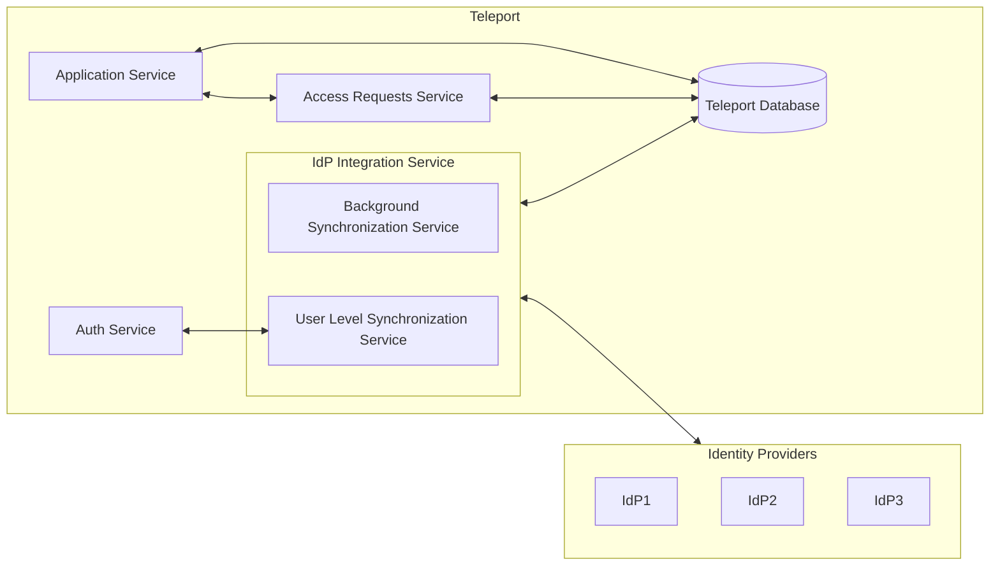
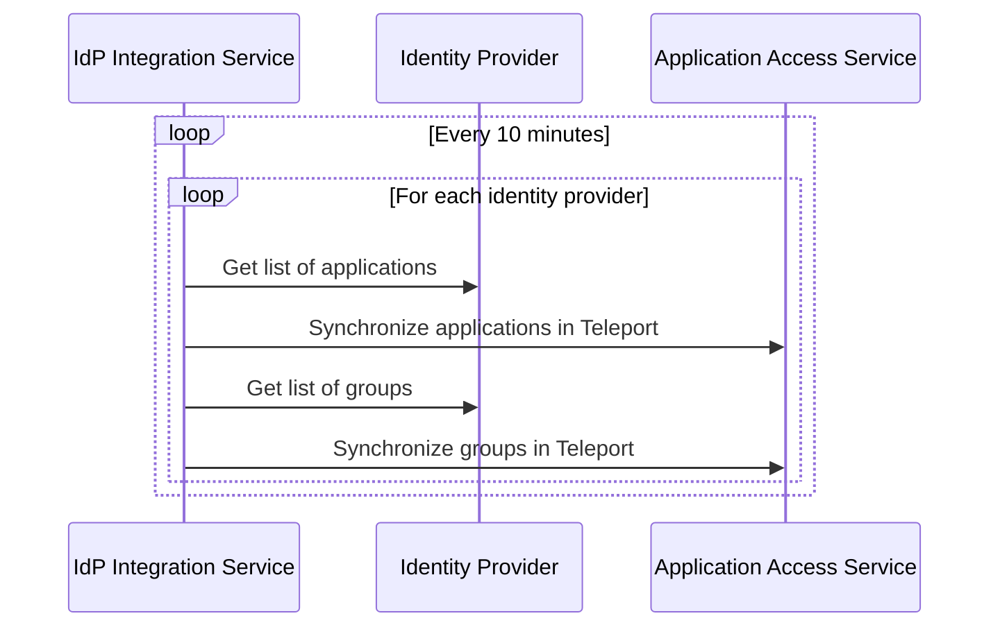
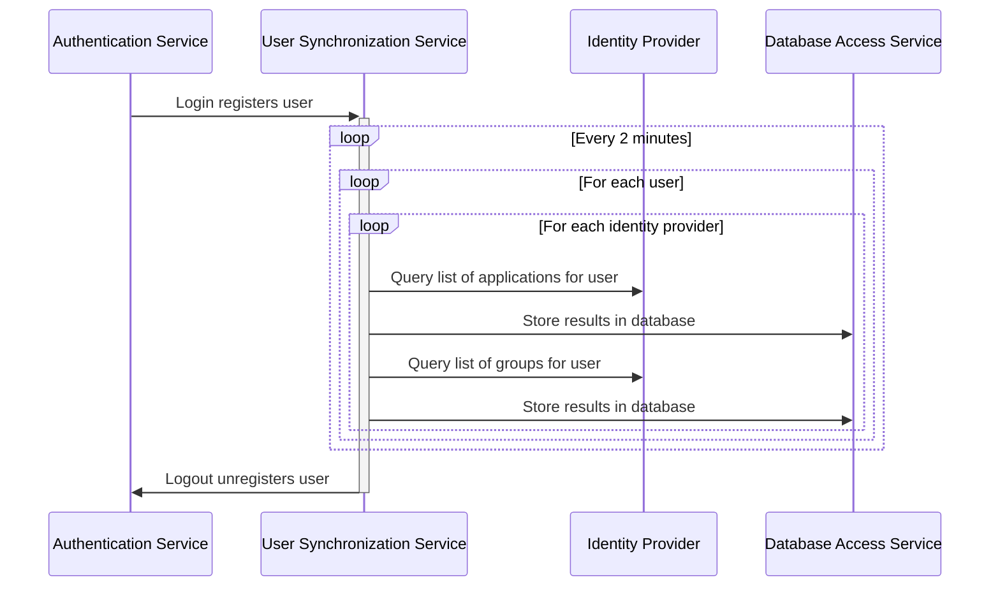

# RFD 95 - Application Access Okta Integration

### Required Approvers

* Engineering @r0mant
* Security @reed
* Product: (@xinding33 || @klizhentas )

## What

Allow teleport users to request access to specific applications and groups and access
applications in Okta.

## Why

Today, Teleport supports [single sign-on with Okta](https://goteleport.com/docs/access-controls/sso/okta/).
Okta is a popular IdP with our customers, so improving the integration between Okta and
Teleport will be useful.

## Details

### UX

#### Application Access UI

* After authenticating into Teleport and accessing the "Applications" item in the menu,
  a list of apps sourced from Okta will appear.
* When users click on an Okta sourced app in the UI, the application will open in a separate tab.
* These applications will *not* be behind Teleport's proxy, and will redirect to the proper Okta
  sourced URL for the application. Users will be taken through Okta's authentication process for
  this process. If users are already logged into Okta, this will be a transparent passthrough to
  the application.
* If users do not have access to an application, the link will be greyed out and an option will
  be available in the drop down menu to the right that allows users to request access to the
  application.

#### External groups section or page 

* A new "external groups" section/page will list available Okta groups.
* If a user does not belong to a group, a user will be able to request access to the group in a
  drop down menu to the right.

#### Access requests

* When a user requests access to an application or group, the existing approval workflow
  will be used to add this access to the user.
* Changes will be reflected in the identity provider backend when this occurs.

### High level architecture

The general architecture can be seen below, which is put into more detail later in this document.



### IdP integration service with Okta provider

An IdP integration service should be introduced that can handle arbitrary identity service
provider integrations for Teleport. This service will serve a number of purposes, among them
being the ability to synchronize applications and groups from an identity provider in the
background. Each provider is expected to implement an interface similar to the following

```go
// IdPIntegrationServiceProvider is an interface that identity providers are expected to
// implement to support integration into the application access service. Multiple instances of
// a provider may exist.
type IdPIntegrationServiceProvider interface {
   // Type returns the type of the provider. This is expected to be globally unique across all
   // identity service providers.
   Type() string

   // Configure will configure this instance with the given name and provider configuration.
   Configure(name string, cfg ProviderConfig) error

   // GetAllApplications will return all applications managed by a provider regardless of whether
   // a user has access to them.
   GetAllApplications() ([]types.Application, error)
   
   // GetAllGroups will return all groups managed by an identity provider regardless of whether
   // a user has access to them.
   GetAllGroups() ([]types.ExternalGroup, error)

   // GetUserApplications will return a list of applications that the user has access to.
   GetUserApplications(user types.User) ([]types.Application, error)

   // GetUserGroups will return a list of groups that the user belongs to.
   GetUserGroups(user types.User) ([]types.ExternalGroup, error)

   // AssignUserToApplication will assign the given user permissions to the given application.
   AssignUserToApplication(user types.User, app types.Application) error

   // AssignUserToGroup will assign the given user to the given external group.
   AssignUserToGroup(user types.User, group types.ExternalGroup) error
}
```

### Provider specific configuration

A new configuration mechanism will be introduced which allows for per provider configuration.
In the application service YAML, this will look like:

```yaml
app_service:
  provider_integrations:
    okta:prod:
      type: okta
      config:
        okta-field1: value1
        okta-field2: value2
    okta:dev:
      type: okta
      config:
        okta-field1: value1
        okta-field2: value2
    authentik:prod: # Not planned for this RFD, just an example
      type: authentik
      config:
        authentik-field1: value1
        authentik-field2: value2
    ...
```

This configuration must be configured statically through a configuration file or command line
options to isolate potentially sensitive values from the main Teleport process. This will
ensure that Teleport Cloud users do not have to provide us with sensitive information. Names
must be unique.

### User specific configuration for identity providers

Identity providers will utilize user traits if there is user specific information that is
required by the identity provider.

```yaml
kind: user
version: v2
metadata:
  name: alice
spec:
  roles: ['devs']
  traits:
    logins: ['admin']
    kubernetes_groups: ['edit']
    okta_user_id: ['name@mydomain.com']
    authentik_user_id: ['name@mydomain.com']
```

It is up to each identity provider to implement the parsing and interpretation of these configs.

### Background synchronization

The background synchronization process, which synchronizes all applications from the identity
provider without access information, is expected to run every 10 minutes, as the list of
applications and groups is not expected to change much. Additionally, the potential to have an
adverse impact on the identity provider by overusing APIs is non-zero, so it's preferred to
minimize the number of calls to identity provider APIs.



Each provider will be iterated through and all applications will be retrieved and inserted into
the Teleport database with a label matching the name of the provider. A new "external groups"
object will be created to house external groups, and users will be able to belong to these
groups.

### User specific provider applications and groups

Another Part of the identity provider integration service will be a user level synchronization
service that runs every 2 minutes.  When a user logs in, if Teleport has been configured for
external provider access, users will be this service, which will determine provider specific 
applications and groups the user has access to. This information will be stored in our database
and synchronized every 2 minutes. All logged in users will have this synchronization process
run while they are logged in, but not while they are logged out.



### Calculating user access to applications and groups

The applications synchronized from external identity providers will be subject to regular
Teleport RBAC rules, but further access is dependent on the external provider. The data stored
from the user synchronization process will be joined to externally synchronized applications
to determine whether a user has access to a particular application. The subsequent list of
applications and joined user specific access data will be subject to the following logic to
determine user access:

```go
// This is pseudo-code
if application.IsExternal() {
   if application.UserHasAccess(currentUser) {
      application.AllowUserToClickLinks = true
   } else {
      application.AllowUserToRequestAccess = true
   }
}

if group.UserIsAMember(currentUser) {
   group.UserIsAMember = true
} else {
   group.AllowUserToRequestAccess = true
}
```

### Requesting access to applications and groups

A user will be able to submit access requests to specific applications and groups through the
API or UI. These requests will submit access requests through Teleport's
[existing access request functionality](https://goteleport.com/docs/access-controls/access-requests/).
The identity integration service will monitor these approval requests and take appropriate
action based on the request and the resource targeted.

### The Okta provider

The first provider we should add to this service will be the Okta provider, which will use an
Okta API token with super admin (TODO: confirm) that will be configured as part of the
application access service. The Okta provider will use the following APIs:

* [List applications](https://developer.okta.com/docs/reference/api/apps/#list-applications) for
  listing all applications known to Okta. These results are paginated and may require multiple
  calls.
* [List groups](https://developer.okta.com/docs/reference/api/groups/#list-groups) for listing
all groups known to Okta. These results are paginated and may require multiple calls.
* [Get assigned app links](https://developer.okta.com/docs/reference/api/users/#get-assigned-app-links)
  for getting the list of applications assigned to a user. This will be diffed against the list
  of all applications to determine which applications a user has access to. These results are
  *not* paginated, so this is guaranteed to be one API call.
* [Get user groups](https://developer.okta.com/docs/reference/api/users/#get-user-s-groups) for
  getting the groups assigned to the user. These results are *not* paginated, so this is
  guaranteed to be one API call.

To configure the Okta provider, the following fields are expected in the application service
configuration for the provider:

```yaml
use_uid_mapping: false # Set to true to use the UID mapping from the user's provider config.
endpoint: https://my-org-endpoint.okta.com
api-token: API-TOKEN-FROM-OKTA # https://developer.okta.com/docs/guides/create-an-api-token/main/
```

#### Mapping between Teleport users and Okta users

If the provider is configured with `use_uid_mapping` to `false`, which is the default, the Okta
provider will attempt to look for users in Okta using the user's Teleport username. If this is
set to true, provider will look for a provider config `okta_user_id ` to determine which user ID
to use for Okta user lookups.

```yaml
kind: user
version: v2
metadata:
  name: alice
spec:
  roles: ['devs']
  traits:
    logins: ['admin']
    kubernetes_groups: ['edit']
  provider_configs:
    okta:prod:
      # Can be any user ID supported by Okta, documented in
      # https://developer.okta.com/docs/reference/api/users/#get-user
      okta_user_id: alice@mydomain.com
```

#### Launching Okta applications

[Application objects from Okta](https://developer.okta.com/docs/reference/api/apps/#application-object) can return one or more `appLinks` which, when launched directly from
Teleport, will forward to the expected application along with Okta authentication. These links
will be used as the application URLs synced from Okta.

**Note**: These links will be redirected to their actual external URLs rather than living behind
Teleport's proxy.

### Backend modifications

A few modifications to existing services, databases, and models will be necessary to support this
functinoality.

#### Applications

Applications will need some new information to support this:

* A new flag to indicate that the application has been externally synchronized. This will allow
  Teleport to distinguish between regular Teleport applications and external applications.
* User specific application metadata for external applications. This will dictate to the UI what
  kind of options to display and whether the URLs are accessible. These will be joined with the
  application objects during query. To start, the only necessary fields for this object are a
  user mapping, a corresponding external identity provider name, and a boolean flag as to
  whether the user has access.

#### External groups

A new notion of external groups will need to be added. This represent external groups known to
an identity provider. Additionally, similar to applications, there must be a notion of user
specific group metadata that contains information as to whether a user is a member of the group.

#### Users

Users will need new provider specific configuration fields. These will necessarily be pretty
free-form.

#### Request access service

The requests for external identity providers will be longer term than Teleport's current notion
of requests. The service will either need to be expanded to support long term requests or
turned into a separate service that supports access requests that cannot be later dropped.

### Security

* It's possible to capture sensitive data in our internal Teleport database. This could be
  undesirable for customers or other users of Teleport. We should take care that the sensitive
  identity provider data (like Okta API tokens) are never communicated to or stored outside of
  the configuration file.
* The mapping of Okta users to the appropriate Teleport user is a concern. If a user has been
  mismapped to an Okta user, it will be possible for that user to request access on behalf of
  that user. Administrators should take care with their Okta identity mappings, or even better,
  ensure that Teleport logins map directly to Okta users.

### Open questions

#### Is the identity provider abstraction overkill?

An assumption was made here that we may want to expand into other identity providers in the
future. Is this assumption reasonable?

#### What is the value of using Teleport to manage requests and access to Okta resources?

I'm a little worried about using Teleport to behave as a self service Okta platform. It seems
slightly out of place to me and I'm worried it increases the complexity of things.

#### Should applications be kept inside of our proxy?

Testing shows that, using Okta app links, Teleport successfully launches these applications, but
the applications redirect to their intended locations as opposed to staying behind the reverse
proxy. Is this behavior okay, or should we work to ensure that application traffic is routed
through the proxy?