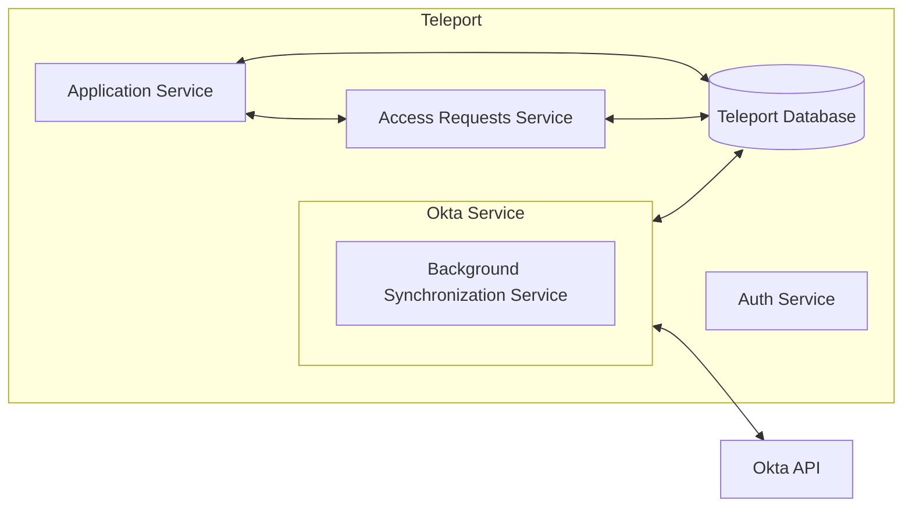
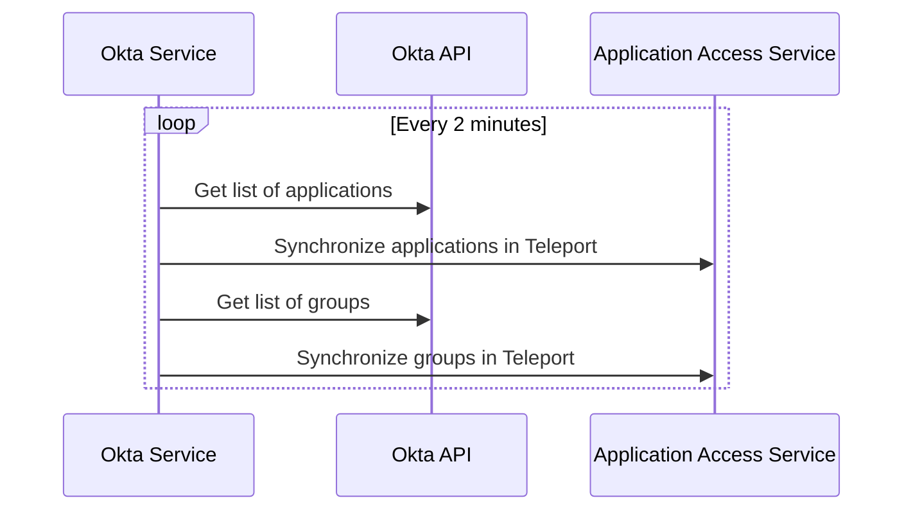

# RFD 95 - Application Access Okta Integration

### Required Approvers

* Engineering @r0mant
* Security @reed
* Product: (@xinding33 || @klizhentas)

## What

Allow Teleport users to request access to specific applications and groups and access
Okta applications from within Teleport.

## Why

Today, Teleport supports [single sign-on with Okta](https://goteleport.com/docs/access-controls/sso/okta/).
Okta is a popular IdP with our customers, so improving the integration between Okta and
Teleport will be useful.

## Details

### Base assumptions

It is assumed that Okta is the source of truth with respect to which users have access to which
applications. If a user has access to an application in Okta, the user will have access to that
application in Teleport regardless of the user's permissions within Teleport.

### UX

#### Application Access UI

* After authenticating into Teleport and accessing the "Applications" item in the menu,
  a list of apps sourced from Okta will appear.
* When users click on an Okta sourced app in the UI, the application will open in a separate tab.
* If users do not have access to an application and are able to request access to it, the link will
  be greyed out and an option will be available in the drop down menu to the right that allows users
  to request access to the application. If the application is not requestable, the application will
  not appear in the list of applications belonging to the user.
* These applications will *not* be behind Teleport's proxy, and will redirect to the proper Okta
  sourced URL for the application. Users will be taken through Okta's authentication process for
  this process. If users are already logged into Okta, this will be a transparent passthrough to
  the application.

#### Teleport CLI

* Okta applications will show up when doing a `tsh apps ls` from the command line, with a type "okta".
* Okta groups will be queryable by doing a new command `tsh okta groups ls`.
* Logging in (`tsh app login <app-name>`) will **not** work for Okta apps.

#### Access requests

* When a user requests access to an application or group, the existing approval workflow
  will be used to add this access to the user.
* Changes will be reflected in Okta when this occurs.

### High level architecture

The general architecture can be seen below, which is put into more detail later in this document.



### Okta service and configuration

An Okta service should be introduced that synchronizes Okta applications, users, and groups with
Teleport equivalents and new objects.  The Okta service should have its own unique top level
configuration. The following config fields will be available in the Teleport config YAML, along
with associated environment variables:

| Name | Environment Variable | Required | Description |
|------|----------------------|----------|-------------|
| `api_url` | `TELEPORT_OKTA_API_URL` | :heavy_check_mark: | The API URL so that Teleport knows which Okta endpoint to hit.

The Okta API token must be configured using an environment variable or command line
argument to prevent the possibility of users accidentally checking in this key.

#### YAML example

```yaml
okta_service:
  enabled: true
  api_url: https://my-okta-endpoint.okta.com
```

#### CLI examples (API token)
```bash
# Command line argument example
teleport start --okta-api-token 12345678

# Environment variable example
TELEPORT_OKTA_API_TOKEN="12345678" teleport start
```

### Okta user traits

Okta will optionally use an `okta_user_id` trait to map Teleport users to Okta users if necessary.

```yaml
kind: user
version: v2
metadata:
  name: alice
spec:
  roles: ['devs']
  traits:
    logins: ['admin']
    kubernetes_groups: ['edit']
    okta_user_id: ['name@mydomain.com']
```

If Okta is used for logging into Teleport or the Teleport user's username is the same as the
e-mail used for Okta, this will be unnecessary.

### Background synchronization

The background synchronization process, which synchronizes all applications from Okta, is expected
to run roughly every 2 minutes. This process wil translate Okta users, groups, and applications
into their Teleport equivalents. One thing to note here is that Okta does not support a watch API,
so this synchronization process is necessarily poll based.



#### Okta to Teleport mappings

Okta groups and applications will be mapped by the background synchronization into new
`OktaGroup` and `OktaApplication` objects.

##### Groups

A new `OktaGroup` will be created for each Okta group. `OktaGroup`s will contain a list of Okta users
that belong to this group. This will be later used for RBAC calculation.

```yaml
kind: okta_group
version: v3
metadata:
  name: Developers
  teleport.dev/origin: okta
spec:
  users:
    - mike@goteleport.com
    - roman@goteleport.com
    - zac@goteleport.com
    ...
  applications:
    - 123456789
    - 234567890
    ...
```

##### Applications

When applications are synchronized with Teleport, they will be created in application access as
HTTP apps that use the `appLinks` from Okta as their URI. If there is more than one `appLink`
associated with an Okta application, it will be split into multiple applications for
each `appLink` with the unique name of each `appLink` used to disambiguate them. The
`teleport.dev/origin` field in the application metadata will be set to `okta`. Additionally, a
field called `okta_application_id` will be present in the metadata that will allow for mapping
the application to an internal `OktaApplication` object that will be created as part of the
synchronization process. The applications will look like the following:

```yaml
kind: app
version: v3
metadata:
  name: Slack
  teleport.dev/origin: okta
  okta_application_id: 123456789
spec:
  uri: https://my-okta-domain.okta.com/appLink
```

The `OktaApplication` that will be created will contain a list of Okta users and groups which are
explicitly assigned these applications. This will allow us to calculate RBAC for individual users
for applications.  These objects will look like the following:

```yaml
kind: okta_application
version: v3
metadata:
  name: 123456789
spec:
  users:
    - mike@goteleport.com
    - roman@goteleport.com
    - zac@goteleport.com
    ...
  groups:
    - Developers
    - Administrators
    ...
```

### Requesting access to applications and groups

A user will be able to submit access requests to specific applications and groups through the
API or UI. These requests will submit access requests through Teleport's
[existing access request functionality](https://goteleport.com/docs/access-controls/access-requests/).
The Okta service will monitor these approval requests and take appropriate
action based on the request and the resource targeted.

#### Group approval

When an approval request has been accepted for a group, the Okta service assign the user to the given
group. When the approval is rescinded, the user will be removed from the group.

#### Application approval

When an approval request has been accepted for an application, the Okta service will assign the user
to the application. When the approval is rescinded, the user will be removed from teh application.

#### What groups and applications can users request?

New fields in role objects will indicate which groups useres in this role can request.

```yaml
kind: role
version: v5
metadata:
  name: example
spec:
  allow:
    okta_apps: ["app1", "app2"]
    okta_groups: ["group1", "group2"]
```

This will not affect things if users already have access to these through the Okta, but if they don't,
they'll be able to request these.

#### Note about Okta administration workflows

For approving temporary access, Teleport will assign users to groups and applications independently of
Okta administration. This could potentially create awkward administrator workflows where users appear
to have access to a group or application and then see it disappear later as approvals are approved and
rescinded. This is something we'll need to make sure to document well so that it doesn't catch users
unaware.

### RBAC calculation

RBAC calculation will utilize the `OktaGroup` and `OktaApplication` objects to determine if a user
has access to an application or group.

`OktaGroup` has a list of associated users and associated applications, so our RBAC calculation will
determine if a user has access to this group and access to particular applications. Similarly,
`OktaApplication` has a list of associated users, so if a user belongs to a list of users associated
with the application, our RBAC calculation will utilize this.

### Okta service with generic identity provider interface

To potentially expand to more identity providers later, we'll create a generic `IdentityProvider`
interface that should be implemented for synchronizing with Okta.

```go
// IdentityProvider is an interface that identity providers are expected to
// implement to support integration into the application access service.
type IdentityProvider interface {
  // GetAllApplications will return all applications managed by a provider. The provider
  // is expected to do any translation work necessary to map the internal
  // concept of applicatiosn into Teleport's application.
  GetAllApplications() ([]types.Application, error)
  
  // GetAllRoles will return all roles managed by an identity provider. The provider
  // is expected to do any translation work necessary to map the internal
  // concept of groups/roles into Teleport's role.
  GetAllRoles() ([]types.Role, error)

  // AssignUserToApplication will assign the given user permissions to the given application. This will be
  // used by access requests.
  AssignUserToApplication(user types.User, app types.Application) error

  // AssignUserToGroup will assign the given user to the given external group.
  // This will be used by access requests.
  AssignUserToGroup(user types.User, group types.ExternalGroup) error
}
```

### APIs used by the Okta service

The Okta provider will use the following APIs:

* [List applications](https://developer.okta.com/docs/reference/api/apps/#list-applications) for
  listing all applications known to Okta. These results are paginated and may require multiple
  calls.
* [List groups](https://developer.okta.com/docs/reference/api/groups/#list-groups) for listing
all groups known to Okta. These results are paginated and may require multiple calls.

### Backend modifications

#### Request access service

The Okta service will need to actively monitor and take action on access requests, which is a
mechanism which does not currently exist today.

#### Application metadata

Application metadata will include a new field for `okta_application_id` for mapping applications
to `OktaApplication` objects.

#### `OktaGroup` and `OktaApplication` objects

As described in the RFD, these two objects will be created as part of the synchronization process.

### Audit events

A number of new audit events will be created as part of this effort:

| Event Name | Description |
|------------|-------------|
| `OKTA_GROUPS_UPDATE` | Emitted when groups synchronized from Okta have changed. |
| `OKTA_APPLICATIONS_UPDATE` | Emitted when applications synchronized from Okta have have changed. |
| `OKTA_SYNC_FAILURE` | Emitted when an Okta synchronization attempt fails. |
| `OKTA_ACCESS_REQUEST_APPROVED` | Emitted when a user request for an Okta resource was approved. |
| `OKTA_ACCESS_REQUEST_DENIED` | Emitted when a user request for an Okta resource was denied. |

### Security

* It's possible to capture sensitive data in our internal Teleport database. This could be
  undesirable for customers or other users of Teleport. We should take care that the sensitive
  identity provider data (like Okta API tokens) are never communicated to or stored outside of
  the configuration file.
* The mapping of Okta users to the appropriate Teleport user is a concern. If a user has been
  mismapped to an Okta user, it will be possible for that user to request access on behalf of
  that user. Administrators should take care with their Okta identity mappings, or even better,
  ensure that Teleport logins map directly to Okta users.

### Implementation plan

#### `OktaGroup` and `OktaApplication` objects

The `OktaGroup` and `OktaApplication` objects should be implemented along with any database and
gRPC modifications that are required.

#### Okta service configuration

Implement the ability to configure the Okta service. Doing this first will make subsequent
testing and verification easier as we'll be able to pass in API URLs and API tokens.
Part of this will include implementing any stubs needed for the Okta service itself.

#### Okta service API communication

The Okta service will be able to communicate with Okta and retrieve lists of
applications and groups and synchronizing them with the Teleport backend.

#### Okta RBAC calculation

The Okta RBAC calculation will be updated to utilize `OktaGroup` and `OktaApplication` objects.

#### Application access synchronization

Okta applications will be synchronized with the application access service so that users will be
able to have access to Okta applications from the Teleport UI and listed in `tsh app ls`.

#### Application request

The application request workflow will be implemented hereApplication access synchronization

Okta applications will be synchronized with the application access service so that users will be
able to have access to Okta applications from the Teleport UI and listed in `tsh app ls`.

#### `OktaApplication` approval request.

The `OktaApplication` approval request workflow will be implemented.

#### `OktaGroup` approval request.

The `OktaGroup` approval request workflow will be implemented.