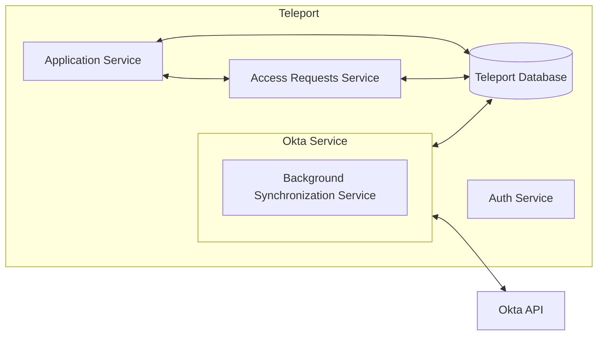
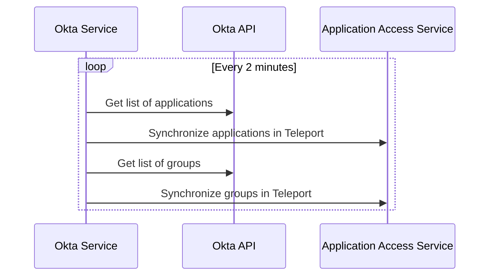

# RFD 95 - Application Access Okta Integration

### Required Approvers

* Engineering @r0mant
* Security @reed
* Product: (@xinding33 || @klizhentas)

## What

Allow teleport users to request access to specific applications and groups and access
applications in Okta.

## Why

Today, Teleport supports [single sign-on with Okta](https://goteleport.com/docs/access-controls/sso/okta/).
Okta is a popular IdP with our customers, so improving the integration between Okta and
Teleport will be useful.

## Details

### UX

#### Application Access UI

* After authenticating into Teleport and accessing the "Applications" item in the menu,
  a list of apps sourced from Okta will appear.
* When users click on an Okta sourced app in the UI, the application will open in a separate tab.
* These applications will *not* be behind Teleport's proxy, and will redirect to the proper Okta
  sourced URL for the application. Users will be taken through Okta's authentication process for
  this process. If users are already logged into Okta, this will be a transparent passthrough to
  the application.
* If users do not have access to an application, the link will be greyed out and an option will
  be available in the drop down menu to the right that allows users to request access to the
  application.

#### Teleport CLI

* Okta applications will show up when doing a `tsh apps ls` from the command line.
* Logging in will **not** work for Okta apps.

#### Access requests

* When a user requests access to an application or group, the existing approval workflow
  will be used to add this access to the user.
* Changes will be reflected in the identity provider backend when this occurs.

### High level architecture

The general architecture can be seen below, which is put into more detail later in this document.



### Okta service with generic identity provider interface

An Okta service should be introduced that synchronizes Okta applications, users, and
groups with Teleport equivalents. To potentially expand this later, we'll create a
generic `IdentityProvider` interface that should be implemented for synchronizing with
Okta.

```go
// IdentityProvider is an interface that identity providers are expected to
// implement to support integration into the application access service.
type IdentityProvider interface {
  // GetAllApplications will return all applications managed by a provider. The provider
  // is expected to do any translation work necessary to map the internal
  // concept of applicatiosn into Teleport's application.
  GetAllApplications() ([]types.Application, error)
  
  // GetAllRoles will return all roles managed by an identity provider. The provider
  // is expected to do any translation work necessary to map the internal
  // concept of groups/roles into Teleport's role.
  GetAllRoles() ([]types.Role, error)

  // AssignUserToApplication will assign the given user permissions to the given application. This will be
  // used by access requests.
  AssignUserToApplication(user types.User, app types.Application) error

  // AssignUserToGroup will assign the given user to the given external group.
  // This will be used by access requests.
  AssignUserToGroup(user types.User, group types.ExternalGroup) error
}
```

### Okta configuration

The Okta service should have its own unique top level configuration. The following config fields will
be available in the Teleport config YAML, along with associated environment variables:

| Name | Environment Variable | Required | Description |
|------|----------------------|----------|-------------|
| `api_url` | `TELEPORT_OKTA_API_URL` | :heavy_check_mark: | The API URL so that Teleport knows which Okta endpoint to hit.
| `role_prefix` | `TELEPORT_OKTA_ROLE_PREFIX` | :x: | A role prefix to prepend to each group role created in Teleport. Defaults to `okta`.
| `role_template` | `TELEPORT_OKTA_ROLE_TEMPLATE` | :x: | A role template for Teleport roles created by the Okta service. Defaults to allowing application read access for applications that belong to a specific Okta group.

The Okta API token must be configured using an environment variable or command line
argument to prevent the possibility of users accidentally checking in this key.

**Note**: The details of the `role_prefix` and `role_template` will be discussed further in [the Okta to Teleport mapping section](#okta-to-teleport-mappings)

#### YAML example

```yaml
okta_service:
  enabled: true
  api_url: https://my-okta-endpoint.okta.com
  role_prefix: okta # This is the default role prefix.
```

#### CLI exmples (API token)
```bash
# Command line argument example
teleport start --okta-api-token 12345678

# Environment variable example
TELEPORT_OKTA_API_TOKEN="12345678" teleport start
```

### Okta user traits

Okta will optionally use an `okta_user_id` trait to map Teleport users to Okta users if necessary.

```yaml
kind: user
version: v2
metadata:
  name: alice
spec:
  roles: ['devs']
  traits:
    logins: ['admin']
    kubernetes_groups: ['edit']
    okta_user_id: ['name@mydomain.com']
```

If Okta is used for logging into Teleport or the Teleport user's username is the same as the
e-mail used for Okta, this will be unnecessary.

### Background synchronization

The background synchronization process, which synchronizes all applications from Okta, is expected
to run roughly every 2 minutes. This process wil translate Okta users, groups, and applications
into their Teleport equivalents.



#### Okta to Teleport mappings

Okta groups and applications will be mapped by the background synchronization into Teleport roles and
applications respectively.

##### Groups

A Teleport role will be created for each Okta group. Each group will be prepended with a configurable
`role_prefix` which defaults to `okta/` and then suffixed with the type and name of the object, delimited by
`/` characters.  For example, if an Okta group called `Developers` was synchronized to Teleport,
it would be called `okta/group/Developers`.

These roles use a configurable `role_template` when created which defaults to allowing users access to
applications that belong to this group. The resulting role for `okta/group/Developers` would look like:

```yaml
kind: role
version: v5
metadata:
  name: okta/group/Developers
spec:
  allow:
    app_labels:
      group: "okta/group/Developers"
```

The corresponding application labels will be populated by application synchronization.

##### Applications

When applications are synchronized with Teleport, they will be created in application access as
HTTP apps that use the `appLinks` from Okta as their URI. If there is more than one `appLink`
associated with an Okta application, it will be split into multiple applications for
each `appLink` with the unique name of each `appLink` used to disambiguate them. The `origin` field
in the application metadata will be set to `okta`.

Applications in Okta can be assigned to groups, and the groups that the application is assigned
to will be used to create labels for the application.

One complicating factor for us is that Okta allows per-application user assignment as well. As a
result, we'll need to create a role for each application with a list of users assigned to it and allow
it to access the application which will have a label based off of the application's unique ID
within Okta. The label and role will look like `okta/app/123456789`. Unfortunately, Okta allows
duplicate application names, so we'll have to use the actual unique identifier here. The role will have
the same role template that are used by groups, but with the application specific label targeted.

Using the same prefixes listed in the previous section for groups, if an application `Slack` is
assigned to `Developers` and `Sales`, the resulting application object would look like:

```yaml
kind: app
version: v3
metadata:
  name: Slack
  origin: okta
  labels:
    okta/group/Developers: ""
    okta/group/Sales: ""
    okta/app/123456789: "" # Application specific label
spec:
  uri: https://my-okta-domain.okta.com/appLink
```

### Requesting access to applications and groups

TODO: This needs more brainstorming -- I'm leaving this bit until later to make sure the
basics are more ironed out.

A user will be able to submit access requests to specific applications and groups through the
API or UI. These requests will submit access requests through Teleport's
[existing access request functionality](https://goteleport.com/docs/access-controls/access-requests/).
The Okta service will monitor these approval requests and take appropriate
action based on the request and the resource targeted.

### APIs used by the Okta service

The Okta provider will use the following APIs:

* [List applications](https://developer.okta.com/docs/reference/api/apps/#list-applications) for
  listing all applications known to Okta. These results are paginated and may require multiple
  calls.
* [List groups](https://developer.okta.com/docs/reference/api/groups/#list-groups) for listing
all groups known to Okta. These results are paginated and may require multiple calls.

### Backend modifications

#### Request access service

The Okta service will need to actively monitor and take action on access requests, which is a
mechanism which does not currently exist today.

### Audit events

A number of new audit events will be created as part of this effort:

| Event Name | Description |
|------------|-------------|
| `OKTA_GROUPS_UPDATE` | Emitted when groups synchronized from Okta have changed. |
| `OKTA_APPLICATIONS_UPDATE` | Emitted when applications synchronized from Okta have have changed. |
| `OKTA_SYNC_FAILURE` | Emitted when an Okta synchronization attempt fails. |
| `OKTA_ACCESS_REQUEST_APPROVED` | Emitted when a user request for an Okta resource was approved. |
| `OKTA_ACCESS_REQUEST_DENIED` | Emitted when a user request for an Okta resource was denied. |

### Security

* It's possible to capture sensitive data in our internal Teleport database. This could be
  undesirable for customers or other users of Teleport. We should take care that the sensitive
  identity provider data (like Okta API tokens) are never communicated to or stored outside of
  the configuration file.
* The mapping of Okta users to the appropriate Teleport user is a concern. If a user has been
  mismapped to an Okta user, it will be possible for that user to request access on behalf of
  that user. Administrators should take care with their Okta identity mappings, or even better,
  ensure that Teleport logins map directly to Okta users.

### Implementation plan

#### Okta service configuration

Implement the ability to configure the Okta service. Doing this first will make subsequent
testing and verification easier as we'll be able to pass in API URLs and API tokens.
Part of this will include implementing any stubs needed for the Okta service itself.

#### Okta service API communication

The Okta service will be able to communicate with Okta and retrieve lists of
applications and groups without doing anything with them yet.

####