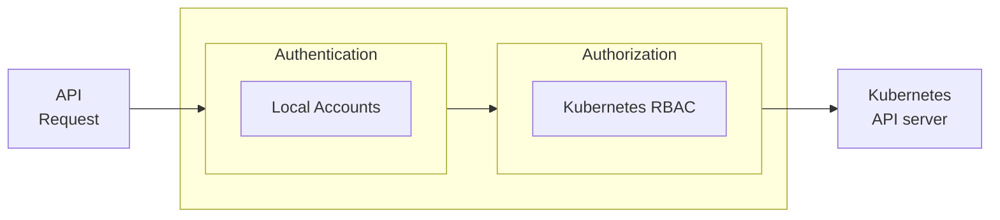
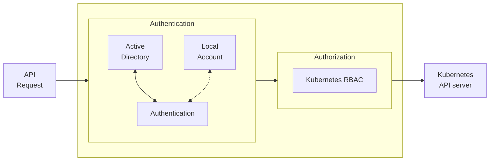
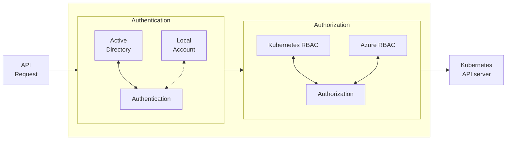

# RFD XX - Kubernetes Cluster Automatic discovery

## Required Approvers

- Engineering: `@r0mant`
- Product: `@klizhentas || @xinding33`

## What

Proposes the implementation for Teleport's Kubernetes service to automatically discover and enroll EKS clusters.

### Related issues

- [#12048](https://github.com/gravitational/teleport/issues/12048)

## Why

Currently, when an operator wants to configure a new Kubernetes cluster in the Teleport, he can opt for these two methods:

- Helm chart: when using this method, he has to install the `helm` binary, configure the Teleport Helm repo, and check all the configurable values (high availability, roles, apps, storage...). After that, he must create a Teleport invitation token using `tctl` and finally do the Helm chart installation with the desired configuration.

- `Kubeconfig`: when using the `kubeconfig` procedure, he has to connect to the cluster with his credentials, generate a new service account for Teleport with the desired RBAC permissions and extract the service account token. With it, he must create a `kubeconfig` file with the cluster CA and API server. If the agent serves more than one cluster, he has to merge multiple `kubeconfig` files into a single [kubeconfig][kubeconfig] file. Finally, he must configure the `kubeconfig` location in Teleport config under `kubernetes_service.kubeconfig_file`.

Both processes described above are error-prone and can be tedious if the number of clusters to add to Teleport is high.

This document describes the changes required for Teleport to identify the clusters based on regions and desired tags. If the filtering criteria matches, the cluster is added automatically to Teleport. Once the Kubernetes cluster is deleted or no longer satisfies the discovery conditions, Teleport will automatically remove it from its lists.

## Scope

This RFD focuses on AWS EKS and Azure AKS clusters. Similar ideas will be explored in the future for GCP's GKE.

## AWS EKS discovery

The following subsections will describe the details required for implementing EKS auto-discovery.

### Discovery

The discovery agent can auto-discover EKS-managed clusters in the AWS account it has credentials for by matching resource tags. For now, the discovery of connected clusters is out of the scope of this RFD.

By default, auto-discovery is disabled and can be enabled by providing one or multiple resource matcher to the Discovery agent configuration.

The agent requires access to [`eks:ListClusters`][listclusters] and [`eks:DescribeCluster`][descclusters] APIs to perform the cluster discovery and cluster details extraction.

#### Configuration

The Teleport configuration for automatic AWS EKS discovery will have the following structure:

```yaml
discovery_service:
  enabled: yes
  aws:
  - regions: ["us-west-1"]
    types: ["eks"]
    tags:
      "env": "prod"

  - regions: ["us-east-1", "us-east-2"]
    types: ["eks"]
    tags:
      "*": "*"
```

#### IAM Permissions

The necessary IAM permissions required for calling the two endpoints are:

```json
{
    "Version": "2012-10-17",
    "Statement": [
        {
            "Effect": "Allow",
            "Action": [
                "eks:DescribeCluster",
                "eks:ListClusters"
            ],
            "Resource": "*" // resource access can be limited
        }
    ]
}         
```

Besides the mentioned calls, the agent also calls `sts:GetCallerIdentity`, but this operation does not require any permissions.

#### Watch resources

Initially, the agent will check for available EKS clusters by calling the [`eks:ListClusters`][listclusters] API at regular intervals. This endpoint only returns the list of EKS cluster names the user has access to but not its details, so the agent accesses them by calling [`eks:DescribeCluster`][descclusters ] per cluster. These details include fields such as the API endpoint, the CA certificate, and tags.

Once it has access to the details, the agent checks if the tags satisfy the discovery matcher. If the result is positive, it evaluates if the EKS cluster is a new addition or, if previously discovered, if it contains any updated fields. If under any of these cases, the watcher will register the cluster or update the existing resource. If a previously discovered resource no longer matches the discovery criteria or was deleted, the agent will unregister it by stopping the heartbeat and deleting it from the Teleport cluster.

The register process consists in creating/revalidating the credentials to access the cluster API and the setup of the Teleport heartbeat mechanism.

The EKS cluster is defined in Teleport by its name, static labels will incorporate the EKS tags, the service labels, and a forced label identifying that the cluster was auto-discovered. Service's dynamic labels are imported to the cluster.

The Teleport representation is the following:

```yaml
kind: kube_cluster
version: v3
name: "{CLUSTER_NAME}"
id: "{id}"
description: ''
labels:
  teleport.dev/origin: cloud
  "{eks_cluster_tag_key_1}": "{eks_cluster_tag_val_1}"
  "{eks_cluster_tag_key_2}": "{eks_cluster_tag_val_2}"
  "{kubernetes_service_static_label_key_1}": "{kubernetes_service_static_label_val_1}"
spec:
  dynamic_labels:
    "{kubernetes_service_dynamic_label_key_1}": "{kubernetes_service_dynamic_label_val_1}"
```

For security reasons, the agent does not create a new service account that provides a static token, such as the one used by the Kubeconfig method. Instead, the credentials used are valid for short periods and must be rotated when they are close to expiration. API access credentials are generated for a specific cluster and return the expiration time. This expiration time is defined in the IAM role definition, and when they expire, the agent cannot forward more requests to the Kubernetes clusters.

If the process fails because the agent does not have the necessary permissions, Teleports logs the error and retries on the next discovery cycle.

With this method, Teleport does not install any agents on the cluster but requires the Kubernetes API to be accessible to the Teleport discovery agent. This means clusters with private API endpoints must be accessible from the machine where the discovery agent is running.

## Authentication & Authorization

This section defines the EKS token generation (authentication) and the authorization required for Teleport to work with the cluster.

### Authentication

Access to the Kubernetes API is granted by a token generated by pre-signing a `sts:GetCallerIdentity` request with an extra `x-k8s-aws-id` header whose value is the name of the EKS cluster. Fortunately, the [AWS IAM authenticator][awsiamauthenticator] project handles the generation of short-lived pre-signed access token.

For each Kubernetes API request, this token is sent as an `Authorization` header, and access is granted by the [AWS IAM authenticator][awsiamauthenticator] project which is installed by default in each EKS control plane. This component is responsible for the transformation between IAM roles/users into Kubernetes RBAC roles or users. The [AWS IAM authenticator][awsiamauthenticator] component receives the authorization request and searches its database for any correspondence between the IAM user or role and the Kubernetes role. If a match is found, it impersonates the Kubernetes RBAC role, otherwise, it impersonates the `system:anonymous` group that does not have access to cluster resources.

### Authorization

AWS IAM does not allow setting access permissions to any Kubernetes cluster. This means that it is not possible through the AWS API to guarantee access to one or several Kubernetes clusters. This is achieved by the [AWS IAM authenticator][awsiamauthenticator] project, which transforms the IAM roles/users into Kubernetes roles or users.

As mentioned before, the [AWS IAM authenticator][awsiamauthenticator] has a database with mappings between IAM and Kubernetes RBAC. This database is a simple `configmap` whose name is `aws-auth`, and it's stored in the `kube-system` namespace. This `configmap` cannot be edited unless the editor has write permissions to Configmaps at the `kube-system` namespace, which can only happen if he previously had access to the cluster.

By default, the cluster creator and every member that shares his IAM role or federated user have immediate access to the cluster as `system:masters`. This rule is enforced by [AWS IAM authenticator][awsiamauthenticator] and cannot be seen or edited by manipulating `configmap/aws-auth` since it is hidden.

If Teleport discovery shares the same IAM role as the cluster's creator, it immediately has full access to the cluster and no further action is necessary. This creates a limitation because EKS clusters must be created by users with the same IAM role as Teleport. If an EKS cluster is created by a different IAM role/federated user, Teleport does not have access to the cluster! For security purposes, it is not recommended running Teleport with the user's role.

If the Teleport agent is running with a different IAM role, it is required that its IAM role is mapped into a Kubernetes RBAC role. This can be configured by appending an extra entry into `configmap/aws-auth`.

The `configmap` has the following format:

```yaml
apiVersion: v1
data:
  mapRoles: |
    - groups:
      - {kube group}
      rolearn: {IAM role}
      username: {user name}
      ...
  mapUsers: |
    - groups:
      - {kube group}
      userARN: {IAM user}
      username: {user name}
    ...
```

The appended entry must have the following format:

```yaml
apiVersion: v1
data:
  mapRoles: |
    - groups:
      - system:teleport
      rolearn: arn:aws:iam::222222222222:role/teleport-role
      username: system:teleport
```

Where `system:teleport` RBAC group defines the minimum required permissions, defined by:

```yaml
apiVersion: rbac.authorization.k8s.io/v1
kind: ClusterRole
metadata:
  name: teleport-role
rules:
- apiGroups:
  - ""
  resources:
  - users
  - groups
  - serviceaccounts
  verbs:
  - impersonate
- apiGroups:
  - ""
  resources:
  - pods
  verbs:
  - get
- apiGroups:
  - "authorization.k8s.io"
  resources:
  - selfsubjectaccessreviews
  - selfsubjectrulesreviews
  verbs:
  - create
```

Without this entry in `configmap/aws-auth`, Teleport does not have access to the cluster. Thus, it is also impossible for Teleport to escalate its privileges to grant access to the cluster from a no-access situation.

### Cluster enroll process

In this section, we describe the additional possibilities for granting the discovery agent the necessary permissions besides running the agent with the same IAM role as the cluster creator.

#### Option 1: The hard way

This process requires that the resources and mapping actions are manually created for each cluster to discover.

The first resource to be created is the `ClusterRole`. It grants the minimum RBAC permissions to get pods and impersonate groups, users, and service accounts.

```yaml
apiVersion: rbac.authorization.k8s.io/v1
kind: ClusterRole
metadata:
  name: teleport-role
rules:
- apiGroups:
  - ""
  resources:
  - users
  - groups
  - serviceaccounts
  verbs:
  - impersonate
- apiGroups:
  - ""
  resources:
  - pods
  verbs:
  - get
- apiGroups:
  - "authorization.k8s.io"
  resources:
  - selfsubjectaccessreviews
  - selfsubjectrulesreviews
  verbs:
  - create
```

The second step is to create the cluster role binding that maps the cluster role into the `system:teleport` Kubernetes group.

```yaml
kind: ClusterRoleBinding
apiVersion: rbac.authorization.k8s.io/v1
metadata:
  name: teleport-role-binding
roleRef:
  apiGroup: rbac.authorization.k8s.io
  kind: ClusterRole
  name: teleport-role
subjects:
- kind: Group
  name: system:teleport
  apiGroup: rbac.authorization.k8s.io
```

At this point, `system:teleport` has the minimum permissions and the only piece left is to assign this group to Teleport IAM role. The mapping between IAM role and `system:teleport` is created by appending into the `configmap/aws-auth` the following content:

```yaml
apiVersion: v1
data:
  mapRoles: |
    - groups:
      - system:teleport
      rolearn: arn:aws:iam::222222222222:role/teleport-role
      username: system:teleport
...
```

`eksctl` has a simpler way to manage IAM Role mappings:

```bash
$  eksctl create iamidentitymapping --cluster  <clusterName> --region=<region> \
      --arn arn:aws:iam::222222222222:role/teleport-role --group system:teleport --username system:teleport
```

The cluster is now ready to be discovered in the next cycle.

This process is the securest option since it does not require any extra tooling like Lambda functions with high access level, neither it starts with `system:masters` and demotes itself.

Although it is the securest way, for a large number discoverable clusters, it might be hard to enroll them since it requires execution per cluster. `teleport kube configure` can simplify the process and reduce effort for existing resources. For new resources, the creator must change the creation script/guide to configure the RBAC and map it to the Teleport IAM role (`kubectl apply` followed by `eksctl create iamidentitymapping`) or execute `teleport kube configure` after the cluster creation.

#### Option 2: Run Teleport initially as `system:masters` instead of `system:teleport`

Another possibility is for Teleport to start, temporarily, with `system:masters` role, and before enrolling the cluster, it creates the `system:teleport` RBAC group and reconfigures the `configmap/aws-auth` to grant `system:teleport` instead of `system:masters`. After the change, Teleport can't use `system:masters` anymore.

The `eksctl` project added a config field `iamidentitymappings` directly in the [cluster config](https://github.com/weaveworks/eksctl/pull/5464). It allows `eksctl` to create mappings between IAM and Kubernetes RBAC permissions during the cluster creation process. Terraform plugin [terraform-aws-eks
](https://github.com/terraform-aws-modules/terraform-aws-eks) also provides similar functionality.

To configure Teleport access as `system:masters` using `eksctl`, the following `iamIdentityMappings` section must be present in the `eksctl` config:

```yaml
apiVersion: eksctl.io/v1alpha5
kind: ClusterConfig

metadata:
  name: cluster
  region: us-east-1

iamIdentityMappings:
  - arn: arn:aws:iam::222222222222:role/teleport-role
    groups:
      - system:masters
    username: system:teleport
    noDuplicateARNs: true 

nodeGroups:
  - name: ng-1
    instanceType: m5.large
    desiredCapacity: 1
```

With `system:masters` group access, Teleport Discovery Agent can install the RBAC and reduce its permissions by demoting itself to `system:teleport` before enrolling the cluster. This process avoids any manual action for new clusters because Teleport installs, configures, and demotes itself to the minimum required permissions. For existing clusters, `teleport kube configure` configures the IAM role mapping into `system:teleport`.

#### Option 3: Using Lambda with cluster creator role to create Teleport's Role

Another option is to use AWS Lambda functions to manage Teleport access to the cluster.

This approach delegates the responsibility of managing the Teleport access to the Cluster into a Lambda function. The function receives the cluster name and AWS region from Teleport and generates an IAM Auth token to access the cluster. After that, it creates the RBAC Role and Role Binding and assigns the Teleport IAM role to the `system:teleport` RBAC group.

To be able to access the cluster, the Lambda function has to run with the same IAM role as the creator, or the `aws-auth` configmap must contain the mapping between Lamda IAM role into `system:masters`.

Teleport calls the Lambda once it discovers a new cluster. To invoke the Lambda function, the Teleport IAM Role requires `lambda:InvokeFunction`.

If AWS changes the cluster authentication method or Kubernetes introduces breaking changes to its APIs, the code in the Lambda function has to be updated.

### Limitations

Teleport will only provide access to API and will not enroll databases or applications like Prometheus or Grafana that configurable in a situation where Teleport Agent is present in the cluster.

The IAM mapping between Teleport IAM Role and Kubernetes roles is a complex and tedious process that must happen per cluster. Without it, Teleport cannot enroll clusters. The AWS EKS team has a feature request to add an external API that allows configuring access to the cluster without manually editing the `configmap` ([aws/containers-roadmap#185](https://github.com/aws/containers-roadmap/issues/185)).


## Azure AKS discovery

The following subsections will describe the details required for implementing AKS auto-discovery.

### Discovery

The discovery agent can auto-discover AKS-managed clusters, similarly to the process described in the AWS discovery section using the endpoint [`Microsoft.ContainerService/managedClusters`][listclustersaks].

The agent will call the endpoint at regular intervals and manage the differences between iterations.

#### Configuration

The Teleport configuration for automatic Azure AKS discovery will have the following structure:

```yaml
discovery_service:
  enabled: yes
  azure:
    - subscriptions: ["sub1", "sub2"]
      resource_groups: ["group1", "group2"]
      regions: ["eastus", "centralus"]
      types: ["aks"]
      tags:
        "a": "b"

    - subscriptions: ["sub1", "sub2"]
      resource_groups: ["*"]
      regions: ["westus"]
      types: ["aks"]
      tags:
        "c": "d"
```

#### Role Permissions

The minimal required permissions for listing AKS-managed clusters are defined bellow:

```json

    "permissions": [
      {
        "actions": [
          "Microsoft.ContainerService/managedClusters/read"
        ],
        "dataActions": [],
        "notActions": [],
        "notDataActions": []
      }
    ]      
```

Azure built-in "Reader" role already has these permissions assigned, but it is encouraged to use the minimal version provided above.

#### Watch resources

The watch mechanism is similar to the one described earlier but the endpoint that is called at regular intervals is [`Microsoft.ContainerService/managedClusters`][listclustersaks].

## Authentication & Authorization

This section defines the AKS credentials generation (authentication) and the authorization required for Teleport to setup the cluster.

Azure AKS clusters have three different configuration options to manage access to the cluster.

- **Kubernetes Local Accounts** (*default*)

Under this mode, access to the cluster happens via Kubernetes local accounts. During the cluster provisioning process, these accounts are created, and the access credentials are available via

- `ListClusterUserCredentials`: returns credentials for cluster user.
- `ListClusterAdminCredentials`: returns credentials for cluster admin.
- `ListClusterMonitoringUserCredentials`: returns credentials with monitoring access.

Credentials returned are used to authenticate directly into the Kubernetes API and are the same for any user that calls any of the `ListCluster*Credentials` methods. The credentials returned are non-auditable.

The diagram below represents the authentication and authorization flow when a cluster starts with local accounts.



- **Active Directory with Kubernetes RBAC**

When deploying an AKS cluster with this configuration mode, Azure allows the user's identity or directory group membership to be the authentication principal. The process happens via an OpenID Connect layer that validates the user credentials and returns the user principals (`user_id` and `group_ids`) used by Kubernetes RBAC for authorization. 

By default, even with Active Directory enabled, administrator local accounts exist. `ListClusterAdminCredentials` returns non-auditable admin credentials that allow anyone with access to the endpoint to be a cluster admin. Calls to `ListClusterUserCredentials` and `ListClusterMonitoringUserCredentials` do not return any credentials, instead it returns a kubeconfig with an exec authentication method. 

The diagram below represents the authentication and authorization flow when a cluster has AD enabled.



The local accounts line is dashed because administrators can disable them by editing the cluster. To happen, they must create an AD group and assign that group admin privileges.

To create an Azure AD group:

```bash
az ad group create --display-name AKSAdminGroup --mail-nickname AKSAdminGroup
```

To add members to the admin group execute the following command:

```bash
az ad group member add \
     --group AKSAdminGroup \
     --member-id {memberID}
```

Create or update the cluster while specifying the admin group for the cluster:

```bash
az aks create/update -g {resourceGroup} -n {clusterName} \
    --enable-aad \
    --aad-admin-group-object-ids {adminGroupID} \
    --disable-local-accounts # optional (disable local accounts)
```

The last command creates the following `ClusterRoleBinding` in the Kubernetes cluster:

```yaml
apiVersion: rbac.authorization.k8s.io/v1
kind: ClusterRoleBinding
metadata:
  name: aks-cluster-admin-binding-aad
roleRef:
  apiGroup: rbac.authorization.k8s.io
  kind: ClusterRole
  name: cluster-admin
subjects:
- apiGroup: rbac.authorization.k8s.io
  kind: Group
  name:  {adminGroupID} 
```

If fine-grained policy/access is required, operators can define them by creating new Azure groups and mapping them into Kubernetes RBAC policies. These objects must exist in the cluster to grant access, otherwise user's actions are denied.

- **Active Directory with Azure RBAC** (*recommended*)

When deploying an AKS cluster with this mode, Azure extends the authorization to be configured at Azure Group level permissions. It enables authorization control to happen centrally and is applicable to multiple clusters. 

As in the previous case, by default, local accounts are created and accessible and, for security reasons, should be disabled.

The following diagram represents the authentication and authorization flow when a cluster has active directory enabled and Azure RBAC.



To create a cluster with the AD, Azure RBAC, and no local accounts run the following command:

```bash
az aks create/update -g {resourceGroup} -n {clusterName} \
    --enable-aad \
    --enable-azure-rbac \
    --aad-admin-group-object-ids {adminGroupID} \
    --disable-local-accounts # optional (disable local accounts)
```

To specify a Kubernetes Policy for a user/group create the following Azure RBAC role definition:

```json
{
    "Name": "Read Pods",
    "Description": "Read Pods.",
    "Actions": [

],
    "NotActions": [],
    "DataActions": [
      "Microsoft.ContainerService/managedClusters/pods/read",
    ],
    "NotDataActions": [],
    "assignableScopes": [
        "/subscriptions/{subscription_id}" // allows access to any cluster within the subscription.
        // "/subscriptions/{subscription_id}/resourceGroups/{resource_group}/providers/Microsoft.ContainerService/managedClusters/" // limits access to a certain resource group
        // "/subscriptions/{subscription_id}/resourceGroups/{resource_group}/providers/Microsoft.ContainerService/managedClusters/{cluster_name}" // limits access to a certain cluster
    ]
}
```

```bash
az role definition create --role-definition @config.json
```

To assign the role into a service principal execute the following command:

```bash
az role assignment create \
    --assignee {assignee_id} \ # can be app id or any user id.
    --role "Read Pods" \
    --scope "/subscriptions/{subscription_id}" # the scope can be limited
```

### Authentication

Azure has several options to authenticate against an AKS cluster depending on the Kubernetes cluster version and whether the Azure Active Directory integration is enabled or not.

For Kubernetes clusters after version `v1.22` with Active directory integration enabled, Azure forces the authentication to happen via a short-lived token. In this case, Teleport grants its access to the Kubernetes API by a Bearer token generated by calling [`AAD/Token`][aadtoken] endpoint with the cluster's `TenantID` and a fixed `Scope` with a value equal to [`6dae42f8-4368-4678-94ff-3960e28e3630`](https://github.com/Azure/kubelogin#exec-plugin-format).

For clusters without Active directory integration, Teleport will extract credentials by calling [`aks:ListClusterUserCredentials`][listclusterusercredentials] endpoint. This endpoint returns a `kubeconfig` that, after parsing, contains the user credentials to access the cluster API. It is possible to call this endpoint from clusters with AD enabled, but it returns a `kubeconfig` with the exec call.

### Teleport Authorization

#### Phase 1: Active Directory and Azure RBAC enabled

If the Azure AKS cluster has Azure AD and Azure RBAC enabled, the Azure Role definition grants access to the Kubernetes cluster. 
It means that when both features are enabled, Azure users, groups, or service principals inherit Kubernetes Cluster access from their Role without requiring the specification of Kubernetes RBAC policies. Azure RBAC allows specification of [rules](https://docs.microsoft.com/en-us/azure/role-based-access-control/resource-provider-operations#microsoftcontainerservice) that work as Kubernetes RBAC policies.

AKS provides several built-in Azure RBAC roles, but we recommend that users create a custom role with the minimal permissions that Teleport Kubernetes Agent requires.

```json
{
    "Name": "AKS Teleport Discovery Permissions",
    "Description": "Required permissions for Teleport auto-discovery.",
    "Actions": [

],
    "NotActions": [],
    "DataActions": [
      "Microsoft.ContainerService/managedClusters/groups/impersonate/action",
      "Microsoft.ContainerService/managedClusters/users/impersonate/action",
      "Microsoft.ContainerService/managedClusters/serviceaccounts/impersonate/action",
      "Microsoft.ContainerService/managedClusters/pods/read",
      "Microsoft.ContainerService/managedClusters/authorization.k8s.io/selfsubjectaccessreviews/write",
      "Microsoft.ContainerService/managedClusters/authorization.k8s.io/selfsubjectrulesreviews/write",
    ],
    "NotDataActions": [],
    "assignableScopes": [
        "/subscriptions/{subscription_id}"
    ]
}
```

The next command creates the Azure RBAC role:

```bash
az role definition create --role-definition @config.json
```

The following command assigns the role to a service principal:

```bash
az role assignment create \
    --assignee {assignee_id} \ # can be app id or any user id.
    --role "AKS Teleport Discovery Permissions" \
    --scope "/subscriptions/{subscription_id}" # the scope can be limited
```

At this point, the assignee has access to AD-enabled AKS clusters within the specified subscription.

#### Phase 2: Kubernetes Local Accounts

For clusters without AD enabled, Teleport will use the credentials provided by [`aks:ListClusterUserCredentials`][listclusterusercredentials]. The call returns a `kubeconfig` file populated with Cluster CA and authentication details.

Access to this API requires the following role permissions:

```json

    "permissions": [
      {
        "actions": [
          "Microsoft.ContainerService/managedClusters/read",
          "Microsoft.ContainerService/managedClusters/listClusterUserCredential/action",
        ],
        "dataActions": [],
        "notActions": [],
        "notDataActions": []
      }
    ]      
```


#### Phase 3: Active Directory enabled without Azure RBAC

For clusters with AD enabled but without Azure RBAC integration, operators must manually create the RBAC policies and bind them into the user/app principal. A detailed guide is available [here](https://docs.microsoft.com/en-us/azure/aks/azure-ad-integration-cli#create-kubernetes-rbac-binding).

To simplify the process, Teleport can create RBAC policies using less secure APIs, but the process depends on whether the cluster has local accounts enabled.

The first step, which is independent of local account existences, is to check if the Teleport already has access to the cluster. The access may exist because the operators have manually created the role or because the Teleport has configured it in the past. If authorized, the agent enrolls the cluster.

Otherwise, if the agent doesn't have access, it can take the following actions.

##### Enabled Local Accounts

If local accounts option is enabled, Azure created admin credentials during the cluster provision. If the agent has access to [`aks:ListClusterAdminCredentials`][listclusteradmincredentials] then it could use them to create the Teleport RBAC `ClusterRole` and create a `ClusterRoleBinding` that binds the cluster role into Teleport's `group_id`.

The agent will create the following objects with the available cluster admin credentials:

```yaml
apiVersion: rbac.authorization.k8s.io/v1
kind: ClusterRole
metadata:
  name: teleport-role
rules:
- apiGroups:
  - ""
  resources:
  - users
  - groups
  - serviceaccounts
  verbs:
  - impersonate
- apiGroups:
  - ""
  resources:
  - pods
  verbs:
  - get
- apiGroups:
  - "authorization.k8s.io"
  resources:
  - selfsubjectaccessreviews
  - selfsubjectrulesreviews
  verbs:
  - create
```


```yaml
kind: ClusterRoleBinding
apiVersion: rbac.authorization.k8s.io/v1
metadata:
  name: teleport-role-binding
roleRef:
  apiGroup: rbac.authorization.k8s.io
  kind: ClusterRole
  name: teleport-role
subjects:
- kind: Group
  name: {teleportGroupID} # we can find it by querying Azure auth provider.
  apiGroup: rbac.authorization.k8s.io
```

If operation was successful, Teleport has the minimum required permissions to access and enroll the cluster.

Access to this API requires the following role permissions:

```json

    "permissions": [
      {
        "actions": [
          "Microsoft.ContainerService/managedClusters/read",
          "Microsoft.ContainerService/managedClusters/listClusterAdminCredential/action",
        ],
        "dataActions": [],
        "notActions": [],
        "notDataActions": []
      }
    ]      
```


If access to [`aks:ListClusterAdminCredentials`][listclusteradmincredentials] is unauthorized by an RBAC policy, the Disabled Local accounts method can be used as a fallback.

##### Disabled Local accounts

Teleport, under these conditions, has no way to grant access to the cluster because [`aks:ListClusterAdminCredentials`][listclusteradmincredentials] and [`aks:ListClusterUserCredentials`][listclusterusercredentials] both return `exec` kubeconfigs and the agent's role mapping does not exist yet.

Since direct access is unavailable, Teleport can delegate in Azure the responsibility of creating the `ClusterRole` and `ClusterRoleBinding`. This operation can happen if the agent has access to the `aks:Command` API. It allows you to run indiscriminate commands on the cluster and, as such, would allow the creation of `ClusterRole` and `ClusterRoleBinding`.

Once the agent creates the command request, AKS provisions a new POD with admin permissions and executes the specified command. The pod already has `kustomize`, `helm`, and `kubectl` binaries installed. If the target cluster does not have a node, then the pod won't start until a node exists.

As an example:

```bash
az aks command invoke \
  --resource-group myResourceGroup \
  --name myAKSCluster \
  --command "cat <<EOF | kubectl apply -f -
apiVersion: rbac.authorization.k8s.io/v1
kind: ClusterRole
metadata:
  name: teleport-role
rules:
- apiGroups:
  - ""
  resources:
  - users
  - groups
  - serviceaccounts
  verbs:
  - impersonate
- apiGroups:
  - ""
  resources:
  - pods
  verbs:
  - get
- apiGroups:
  - authorization.k8s.io
  resources:
  - selfsubjectaccessreviews
  - selfsubjectrulesreviews
  verbs:
  - create
---
kind: ClusterRoleBinding
apiVersion: rbac.authorization.k8s.io/v1
metadata:
  name: teleport-role-binding
roleRef:
  apiGroup: rbac.authorization.k8s.io
  kind: ClusterRole
  name: teleport-role
subjects:
- kind: Group
  name: {teleportGroupID} # we can find it by querying Azure auth provider.
  apiGroup: rbac.authorization.k8s.io
EOF" 
```

The usage of this API should only happen in the last resource because the command scope cannot be limited and virtually anything is liable to be executed.

Access to this API requires the following role permissions:

```json

    "permissions": [
      {
        "actions": [
          "Microsoft.ContainerService/managedClusters/read",
          "Microsoft.ContainerService/managedClusters/runcommand/action",
          "Microsoft.ContainerService/managedclusters/commandResults/read"
        ],
        "dataActions": [],
        "notActions": [],
        "notDataActions": []
      }
    ]      
```

If Teleport cannot create access, it will log an error and will not enroll the cluster.

### Limitations

In cases where Active Directory or Azure RBAC options are disabled and the Teleport RBAC permissions (if AD is enabled) don't exist, the agent uses insecure APIs to create access. It requires the usage of APIs that expose long lived admin credentials or methods that allow to run commands in the cluster as an administrator and where command scope limits do not exist.

To extract the full potential of AKS auto-discovery, we recommend that AD and AZ RBAC are enabled. 

## UX

### `teleport kube configure`

Teleport will provide a simple CLI program to simplify the cluster permissions management. It is responsible for creating the required RBAC permissions and assigning them to Teleport Role ARN by editing the `configmap/aws-auth`.

`teleport kube configure` must run as `system:masters` permissions for every cluster it is expected to discover and will have the following behavior:

```shell
$ teleport kube configure
Choose the desired cloud provider: (AWS, GCP, AZ)
> AWS

Teleport Discovery Agent IAM role ARN:
> arn:aws:iam::222222222222:role/teleport-role

[1] Connecting to the AWS environment...
[2] Checking your user permissions....
[2] Validating Teleport IAM Role....
[3] Discovering EKS clusters based on tags provided....
[4] Installing RBAC for cluster %cluster[0].name%
[5] Mapping `system:teleport` RBAC Group to Teleport Agent IAM Role for cluster %cluster[0].name%
...
[%n+4%] Installing RBAC for cluster %cluster[n].name%  
[%n+5%] Mapping `system:teleport` RBAC Group to Teleport Agent IAM Role for cluster %cluster[n].name%
```

Where `n` is the number of clusters discovered based on rules provided. 

The `kube configure` command also accepts the cloud and IAM role via flags: `--cloud` and `--iam-arn` in which case it will not ask the user for any data and will immediately start connecting to AWS.

After the command finishes, the discovery agent can enroll the affected clusters. 

This command will not run as a daemon and is solely used to setup the requirements for discovery service to work for active EKS clusters.

## Security

### AWS

From a security perspective, the `eks:DescribeCluster` and `eks:ListClusters` methods do not give direct access to the cluster and only allow the callee to grab the endpoint and CA certificate.

The credentials that grant access into the cluster are generated by [AWS IAM authenticator][awsiamauthenticator] and are short-lived. The TTL is defined by the IAM role's creator in AWS IAM console. After the expiration date, the token can no longer be used to access the cluster and is invalid.

In order to Teleport to be able to connect to the cluster, its role must be present in `aws-auth` configmap with the desired group permissions. As described above, the permissions required for Teleport to operate in this mode do not give him the possibility to create or delete resources, that it can only happen via impersonation.

### Azure

Access to AKS clusters is not immediately granted by [`Microsoft.ContainerService/managedClusters`][listclustersaks], and depending on the cluster version and integration type, access details are pulled from different sources.

If AD is enabled, the authentication details are short-lived and must be revalidated each time their TTL is about to expire. The call to [`AAD/Token`][aadtoken] returns the expiration time of the credentials. After their expiration time reaches, the token no longer grants access to the cluster. Each cluster has a different authentication token.

In clusters without AD or Azure RBAC enabled, the access requires either permanent local Kubernetes accounts whose credentials are long-lived, the usage of insecure APIs like `aks:Command` or extracting the admin credentials from [`aks:ListClusterAdminCredentials`][listclusteradmincredentials]. 
The only method to revoke access to the certificate key pair and the automatic token returned by `aks:ListCluster*Credentials` is to rotate cluster CA authority. On the other hand, `aks:Command` allows the execution of arbitrary commands in the cluster with the administrator role. It is a security concern because any attacker that escalates privileges to the agent's role can execute destructive commands without limits because `aks:Command` does not allow you to validate the commands executed.

From a security perspective, it is highly recommended use Azure Active Directory and Azure RBAC enabled for any cluster.

### UX

`teleport kube configure` should run against EKS clusters with `system:masters` permissions to create RBAC permissions and edit the `configmap/aws-auth` in the `kube-system` namespace. It is a security concern, but it is encouraged to run the command locally to prevent the leak of credentials that grant control of EKS clusters.

## Requirements

Requirements section describes required actions to be able to introduce dynamic registration of new clusters in Teleport cluster.

### Introduce `KubernetesServerV3` and deprecate `ServerV2` usage for Kubernetes Servers

This RFD proposes the deprecation of `ServerV2` objects for representing Kubernetes Servers in Teleport API. Currently, [`ServerV2`][serverv2] has a field `KubernetesClusters` which holds the list of Kubernetes clusters proxied by the Kubernetes Service.

To remove usage of `ServerV2` for servers other than the SSH server, we must introduce the `KubernetesServerV3`, which holds the information about the cluster proxied as well as the server status. Each Kubernetes cluster is represented by a different `KubernetesServerV3` object.

```protobuf
// KubernetesServerV3 represents a Kubernetes server.
message KubernetesServerV3 {
    option (gogoproto.goproto_stringer) = false;
    option (gogoproto.stringer) = false;
    // Kind is the Kubernetes server resource kind. Always "kube_server".
    string Kind = 1 [ (gogoproto.jsontag) = "kind" ];
    // SubKind is an optional resource subkind.
    string SubKind = 2 [ (gogoproto.jsontag) = "sub_kind,omitempty" ];
    // Version is the resource version.
    string Version = 3 [ (gogoproto.jsontag) = "version" ];
    // Metadata is the Kubernetes server metadata.
    Metadata Metadata = 4 [ (gogoproto.nullable) = false, (gogoproto.jsontag) = "metadata" ];
    // Spec is the Kubernetes server spec.
    KubernetesServerSpecV3 Spec = 5 [ (gogoproto.nullable) = false, (gogoproto.jsontag) = "spec" ];
}

// KubernetesServerSpecV3 is the Kubernetes server spec.
message KubernetesServerSpecV3 {
    // Version is the Teleport version that the server is running.
    string Version = 1 [ (gogoproto.jsontag) = "version" ];
    // Hostname is the Kubernetes server hostname.
    string Hostname = 2 [ (gogoproto.jsontag) = "hostname" ];
    // HostID is the Kubernetes server host uuid.
    string HostID = 3 [ (gogoproto.jsontag) = "host_id" ];
    // Rotation contains the Kubernetes server CA rotation information.
    Rotation Rotation = 4
        [ (gogoproto.nullable) = false, (gogoproto.jsontag) = "rotation,omitempty" ];
    // Cluster is a Kubernetes Cluster proxied by this Kubernetes server.
    KubernetesClusterV3 Cluster = 5 [ (gogoproto.jsontag) = "cluster" ];
    // ProxyIDs is a list of proxy IDs this server is expected to be connected to.
    repeated string ProxyIDs = 6 [ (gogoproto.jsontag) = "proxy_ids,omitempty" ];
}

```

`KubernetesServerV3` message will be added as a new field to the [`PaginatedResource`][paginatedresource] message, and the current `KubeService` field will be deprecated.

With `KubernetesServerV3`, Teleport can create a different Kubernetes Server for each Kubernetes cluster available, and it's possible to create and stop Heartbeats independently without interrupting access to other Kubernetes clusters served by the same Kubernetes service.

## Future work

Understand how to simplify the cluster enroll process, in particular how to simplify the Kubernetes permissions mapping from a IAM role.
Expand the discovery service and `teleport kube configure` to support GCP and AZ clouds.

## Links

[kubeconfig]: https://goteleport.com/docs/kubernetes-access/guides/standalone-teleport/#step-12-generate-a-kubeconfig
[listclusters]: https://docs.aws.amazon.com/eks/latest/APIReference/API_ListClusters.html
[descclusters]: https://docs.aws.amazon.com/eks/latest/APIReference/API_DescribeCluster.html
[awsiamauthenticator]: https://github.com/kubernetes-sigs/aws-iam-authenticator
[telepportiamrole]: https://goteleport.com/docs/setup/guides/joining-nodes-aws-iam/
[iamroleatch]: https://docs.aws.amazon.com/eks/latest/userguide/add-user-role.html
[iameksctl]: https://eksctl.io/usage/iam-identity-mappings/
[helmlib]: https://github.com/helm/helm/tree/main/pkg
[serverv2]: https://github.com/gravitational/teleport/blob/7d5b73eda3caf13717a647264032ef983f997c39/api/types/types.proto#L468
[paginatedresource]:https://github.com/gravitational/teleport/blob/d3e33465380de070dd3ec8347c9967c1b1257582/api/client/proto/authservice.proto#L1539
[blockpodaccess]: https://aws.github.io/aws-eks-best-practices/security/docs/iam/
[listclustersaks]:https://docs.microsoft.com/en-us/azure/templates/microsoft.containerservice/managedclusters?pivots=deployment-language-bicep
[aadtoken]:https://docs.microsoft.com/en-us/azure/databricks/dev-tools/api/latest/aad/app-aad-token
[listclusterusercredentials]:https://docs.microsoft.com/en-us/rest/api/aks/managed-clusters/list-cluster-user-credentials?tabs=HTTP
[listclusteradmincredentials]:https://docs.microsoft.com/en-us/rest/api/aks/managed-clusters/list-cluster-admin-credentials?tabs=HTTP

1. https://goteleport.com/docs/kubernetes-access/guides/standalone-teleport/#step-12-generate-a-kubeconfig
2. https://docs.aws.amazon.com/eks/latest/APIReference/API_ListClusters.html
3. https://docs.aws.amazon.com/eks/latest/APIReference/API_DescribeCluster.html
4. https://github.com/kubernetes-sigs/aws-iam-authenticator
5. https://goteleport.com/docs/setup/guides/joining-nodes-aws-iam/
6. https://docs.aws.amazon.com/eks/latest/userguide/add-user-role.html
7. https://eksctl.io/usage/iam-identity-mappings/
8. https://github.com/helm/helm/tree/main/pkg
9. https://aws.github.io/aws-eks-best-practices/security/docs/iam/#restrict-access-to-the-instance-profile-assigned-to-the-worker-node
10. https://github.com/gravitational/teleport/blob/7d5b73eda3caf13717a647264032ef983f997c39/api/types/types.proto#L468
11. https://github.com/gravitational/teleport/blob/d3e33465380de070dd3ec8347c9967c1b1257582/api/client/proto/authservice.proto#L1539
---

## Alternative enroll method: Helm chart

Teleport has a join method, IAM join, that allows Teleport agents and Proxies to join a Teleport cluster without sharing any secrets when running in AWS.

The IAM join method is available to any Teleport agent running anywhere with access to IAM credentials, such as an EC2 instance that is part of an EKS cluster. This method allows any resource that fulfills the defined criteria to join automatically into the Teleport cluster.

To use this method, each agent requires access to `sts:GetCallerIdentity` to use the IAM method. 

It is required to create the following IAM token spec to configure the IAM joining token method.

```yaml

kind: token
version: v2
metadata:
  # the token name is not a secret because instances must prove that they are
  # running in your AWS account to use this token
  name: kube-iam-token
  # set a long expiry time, the default for tokens is only 30 minutes
  expires: "3000-01-01T00:00:00Z"
spec:
  # use the minimal set of roles required
  roles: [Kube,[App]]

  # set the join method allowed for this token
  join_method: iam

  allow:
  # specify the AWS account which nodes may join from
  - aws_account: "111111111111"
  # multiple allow rules are supported
  - aws_account: "222222222222"
  # aws_arn is optional and allows you to restrict the IAM role of joining nodes
  - aws_account: "333333333333"
    aws_arn: "arn:aws:sts::333333333333:assumed-role/teleport-node-role/i-*"
```

Once Teleport has discovered a cluster and granted access to its API, it installs the Helm Agent chart via [Helm library][helmlib]. The Teleport Helm chart has to be updated to support IAM joining token.

Teleport discovery has to define the correct values for the Helm chart installation and execute them into the cluster. After that, the deployment is ready.

### Helm Limitations

- If helm chart values are updated, the helm installation code also requires an update.
- Requires one or more teleport agents to run in the cluster
- Requires constant upgrades of Teleport Agent